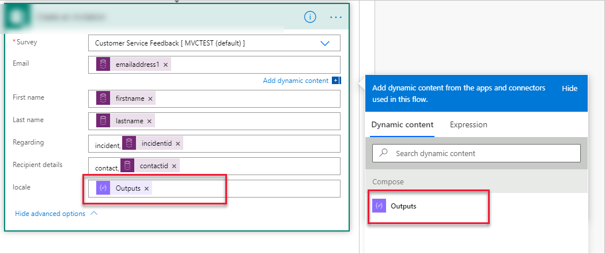

بالنسبة إلى أي مؤسسة تطلب التعليقات، يكون تسليم المحتوى والمراسلات التي تُجرى مع العملاء بلغتهم المفضلة أمرًا بالغ الأهمية. Dynamics 365 Customer Voice يوفر خيار إنشاء استبيانات بلغات متعددة. إذا قمت بإنشاء استبيان بلغات متعددة، فسيتم عرض الإصدار الصحيح للمستجيب تلقائياً استنادًا إلى إعداد اللغة في المستعرض الخاص به. سيكون لكل استبيان لغة افتراضية، استنادًا إلى اللغة الافتراضية لبيئة Microsoft 365 التي تم إعداد Dynamics 365 Customer Voice فيها.

تعد إضافة المزيد من اللغات عملية بسيطة. يمكنك الوصول إلى الوظائف من قائمة **التخصيص** من الجانب الأيمن من الاستبيان، ثم حدد خيار **اللغات**. بعد ذلك، يجب أن يقوم منشئ الاستبيان بترجمة وتحديث كل لغة إضافية تمت إضافتها. باستخدام زر **إضافة لغة**، يمكن إضافة 23 لغة إلى الاستبيان كحدٍ أقصى. بعد إضافة جميع اللغات التي تريدها، حدد أيقونة "القلم" الموجودة بجانب اللغة، ومن ثمَّ ستظهر شاشة جديدة باللغة الافتراضية. توفر هذه الشاشة عمودًا يمكنك إضافة الترجمة الخاصة باللغة الجديدة التي يتم تحريرها إليه. يعد الأسلوب السريع هو تحرير اللغات في ملف Microsoft Excel، والذي يمكن تحميله بعد ذلك. يمكن تنزيل قالب Excel وتضمين جميع الأسئلة التي تمت إضافتها باللغة الافتراضية، باستخدام عمود لكل اللغات التي تتم إضافتها إلى الاستبيان.

> [!div class="mx-imgBorder"]
> [](../media/languages-ssm.png#lightbox)

ومع إضافة لغات إضافية، إذا حدث تطابق بين تلك اللغات واللغة التي تم تعيينها في مستعرض المستجيب، فستكون اللغة التي يتم عرضها له. يمكنك أيضًا استخدام متغير لتحديد الإصدار الذي سيتم عرضه للمستجيب عند إرسال استبيان أو إنشاء دعوة باستخدام أحد الإجراءات من موصل Dynamics 365 Customer Voice الموجود في Power Automate. ويعتبر المتغير واحدًا من ثلاثة إعدادات افتراضية تضاف في كل مرة يتم فيها إنشاء استبيان جديد، ويمكن حذفه إذا لم يكن مطلوبًا. لاستخدامه، تأكد من أن المتغير لا يزال في مكانه، وإذا لم يكن كذلك، فيمكن إضافته مرة أخرى باستخدام اسم المتغير **إعدادات محلية**.

> [!div class="mx-imgBorder"]
> [](../media/locale-ssm.png#lightbox)

لاستخدام متغير الإعدادات المحلية بنجاح، يجب إعداد أسلوب لتحديد اللغة المفضلة لكل عميل. وأحد الأساليب هو إضافة عمود اختيار **لغة** جديدة إلى سجل جهة الاتصال في نفس بيئة Microsoft Dataverse التي تم فيها إنشاء المشاريع والاستبيانات. عند اكتمال عمود الاختيار، لاحظ القيمة التي تم تعيينها إلى كل لغة مضافة. على سبيل المثال، قد تكون اللغة الأولي التي تمت إضافتها هي الفرنسية، وقد تكون القيمة المحددة لهذه التسمية هي **916,780,000**، مع وجود لغات إضافية بزيادة القيمة بمقدار 1 في كل مرة. احفظ القيم في المفكرة ولكن أزِل الفواصل. وبعد ذلك، يمكن استخدام هذا العمود لتحديد اللغة المفضلة لأحد الأفراد.

يمكنك استخدام أساليب متعددة عند هيكلة التدفق في Power Automate، ولكن في هذا المثال لاستخدام متغير الإعدادات المحلية، افترض أنه تم إقفال الحالة، والتي ستقوم بتشغيل التدفق لتشغيلها. من المهم استخدام خطوة الإجراء **الحصول على سجل** من موصل Microsoft Dataverse للحصول على جهة الاتصال المرتبطة بالحالة. وبعد ذلك، يلزم توفير خطوة الإجراء **إنشاء** بحيث يمكن ترجمة الإعدادات المحلية من اللغة الموجودة في سجل جهة الاتصال.

> [!div class="mx-imgBorder"]
> [](../media/flow-ss.png#lightbox)

استخدم اسم العمود المخصص الذي تمت إضافته مسبقًا لإضافة تعبير مطلوب مع القيمة لكل لغة تمت إضافتها إلى العمود الاختيار. يوضح المثال التالي كيفية تنسيق التعبير. يلزم توفير عبارة **إذا** لكل لغة من الممكن أن تحصل عليها جهة الاتصال من عمود الاختيار. وبعد انتهاء القيمة، يجب استخدام كود اللغة الصحيح. للتأكد من استخدام الكود الصحيح، قم بتنزيل ملف الترجمات بتنسيق Excel من قسم **اللغات**  في الاستبيان الموجود في Dynamics 365 Customer Voice؛ يكون كود اللغات الإضافية أعلى كل عمود.

```powerappsfl
if(equals(outputs('Get_Contact')?['body/custom_column'],916780000),'fr', if(equals(outputs('Get_Contact')?['body/custom_column’],916780001),'de', 'en-gb')))
```

تشمل خطوة **إنشاء** مُخرَجًا، وأحد الأكواد المحلية التي يتم تعيينها في التعبير. بعد ذلك، تتم إضافة معلمة **مخرجات** إلى عمود **إعدادات محلية** من منطقة المحتوى الديناميكي ويتم تضمينها إما في خطوة **إنشاء دعوة** أو خطوة **إرسال استبيان** في التدفق. بعد تشغيل التدفق وإرسال رابط الاستبيان إلى المستلم عن طريق البريد الإلكتروني أو أي آلية أخرى، فإن تحديد الرابط سينتقل به إلى الاستبيان المعروض بلغته المفضلة.

> [!div class="mx-imgBorder"]
> [](../media/output-ssm.png#lightbox)
