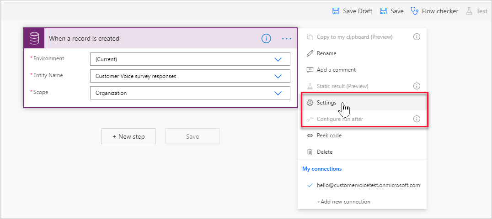
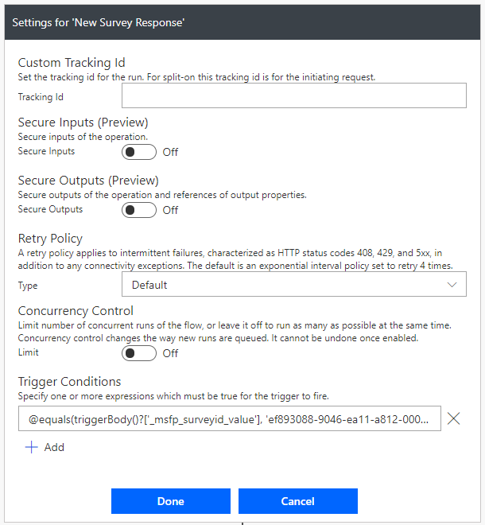
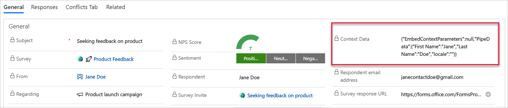
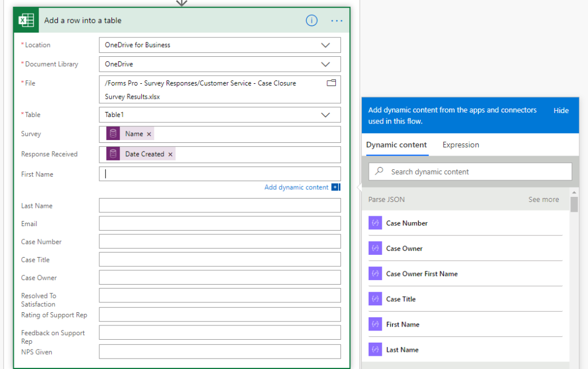

في هذه الوحدة النمطية، تم استخدام المتغيرات في دعوات الاستبيان للمساعدة في إنشاء تجربة مخصصة للمستلم. تعد القدرة على عرض اسم أو بيانات مرتبطة بطلب التعليقات جزءًا مهمًا من تقديم خدمة عملاء استثنائية مع منح العملاء شعورًا بالتقدير والاحترام. قد تتساءل بعد ذلك، ماذا سيحدث لتلك المتغيرات بعد تلقي الاستجابة. يتم تمريرها بالفعل إلى الاستجابة ويمكن استرجاعها واستخدامها للعمل على البيانات على النحو المطلوب.

يجب مراعاة أنه يمكن إضافة أنواع مختلفة من المتغيرات إلى الاستطلاع. كما ذكر سابقًا، يمكن استخدام المتغيرات لعرض البيانات. يمكن أيضًا استخدام متغير كمتغير مخفي لربط الاستجابات من استبيانات متعددة معًا أو لاستخدامه كحالة تشغيل لتحديد وقت تشغيل التدفق في Power Automate.

عند تلقي استجابة، يمكن تشغيل التدفق باستخدام موصل Microsoft Dataverse الموجود في جدول **استجابات استبيان Customer Voice**. يمكنك الوصول إلى منطقة **الإعدادات** الموجودة على المشغل للتأكد من تشغيل هذا التدفق فقط لاستبيان محدد، إذا لزم الأمر.

> [!div class="mx-imgBorder"]
> [](../media/settings-ssm.png#lightbox)

باستخدام تعبير مشابه للتعبير الموجود في المثال التالي، يمكنك تحديث قسم **شروط المشغل** بحيث يتم تشغيل التدفق فقط إذا كانت الاستجابة مخصصة لاستبيان ما تتضمن معرف معين.

```powerappsfl
@equals(triggerBody()?['_msfp_surveyid_value'], 'SURVEY ID')
```

> [!div class="mx-imgBorder"]
> [](../media/trigger-conditions-ss.png#lightbox)

بعد استيفاء شروط المشغل، سيستمر تشغيل التدفق مع الانتقال إلى الخطوة التالية. الإجراء الأول المطلوب في التدفق يتمثل في الحصول على تفاصيل استجابة الاستبيان. باستخدام موصل Microsoft Forms، يمكنك استخدام الاجراء **الحصول على تفاصيل الاستجابة** للحصول على التفاصيل. بالنسبة لمعرف الاستجابة، يجب توفير التعبير التالي لتحليل قيمة معرف استجابة المصدر من سلسلة إلى قيمة عدد صحيح.

`int(triggerBody()?['msfp_sourceresponseidentifier'])`

بعد ذلك، يجب الوصول إلى المتغيرات التي عادت في استجابة الاستبيان. يتم تخزين كل المتغيرات التي تم استخدامها في دعوة الاستبيان داخل استجابة الاستبيان في عمود **بيانات السياق** الموجود في السجل داخل Microsoft Dataverse. بالنسبة للمؤسسات التي لديها تراخيص لـ Microsoft Power Apps، يمكن إنشاء تطبيق يستند إلى النموذج، مما يمنح المستخدمين وصولاً مباشرًا إلى سجلات استجابة الاستبيان. يمكن تخصيص نموذج **استجابة الاستبيان** لعرض عمود **بيانات السياق** بوضوح. يمكن للمستخدمين بعد ذلك الاطلاع على اسم المتغير، متبوعًا بالقيمة التي تم تمريرها في دعوة الاستبيان. يوضح المثال التالي أن **الاسم الأول** هو جين و **الاسم الأخير** هو دو. يمكن نسخ المعلومات الموجودة في منطقة **بيانات السياق** ولصقها لاستخدامها في التدفق.

> [!div class="mx-imgBorder"]
> [](../media/context-data-ssm.png#lightbox)

بالنسبة للمؤسسات التي لا تملك ترخيص Power Apps، فإن الوصول إلى بيانات السياق ما يزال ممكنًا من خلال Power Automate كجزء من عملية التدفق ذاتها. ابحث عن خطوة **الإنشاء** وأضفها مباشرة بعد خطوة **الحصول على تفاصيل الاستجابة**. بعد ذلك، ضمن علامة تبويب **المحتوي الديناميكي**، ابحث عن عمود **بيانات السياق** من خطوة التشغيل الأولية وأضف ذلك عمود في مدخلات خطوة **الإنشاء**. هذا الجزء مطلوب مرة واحدة فقط حتى يمكن الوصول إلى عمود **بيانات السياق** مع إمكانية استخدامه في الخطوات التالية من مرحلة التدفق. في حالة اكتمال الاستبيان كاختبار، فسيتم تشغيل التدفق وسيكون ناجحًا بشكل مثالي. من خلال تحديد التشغيل الناجح لعرض التدفق، يجب أن تتضمن خطوة **الإنشاء** ملف سياق البيانات بصيغة جسون في الإخراج.

من الآن فصاعدًا، لا يهم ما إذا كانت المؤسسة لديها ترخيص Power Apps أم لا. تابع تعديل التدفق وأضف خطوة **تحليل JSON**. قم بإضافة بيانات السياق إلى قيمة المحتوى، ثم حدد **إنشاء من العينة** في الجزء السفلي من خطوة الإجراء. قم بلصق قيم بيانات السياق التي تم نسخها إما من خطوة **الإنشاء** (في الحالة بدون الوصول إلى Power Apps) أو من سجل استجابة الاستبيان في تطبيق Power Apps الذي يستند إلى الطراز (مع إمكانية الوصول إلى Power Apps).

بالنسبة لبقية التدفق، يمكن الوصول إلى المتغيرات والقيم ذات الصلة كمحتوى ديناميكي من خطوة **تحليل JSON**. توفر هذه الميزة إمكانات ممتازة من حيث العمل على البيانات. استخدم القيم لإنشاء سجلات جديدة أو تحديث سجلات أو إرسال إخطارات. يمكن التحقق من قيم أسئلة محددة ويمكن تنفيذ الإجراءات بناءً على متطلبات المؤسسة. تعد المتغيرات مهمة لتخصيص الاستبيان ولإجراءات المتابعة استنادًا إلى النتائج التي يرسلها المستجيبون.

> [!div class="mx-imgBorder"]
> [](../media/dynamic-content-ss.png#lightbox)
