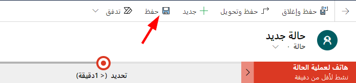
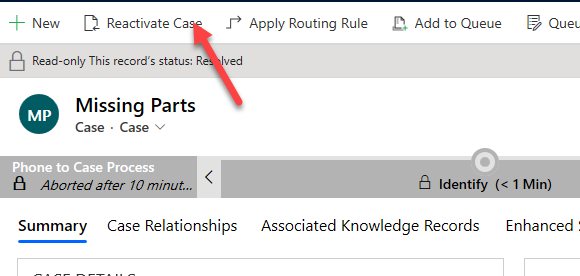
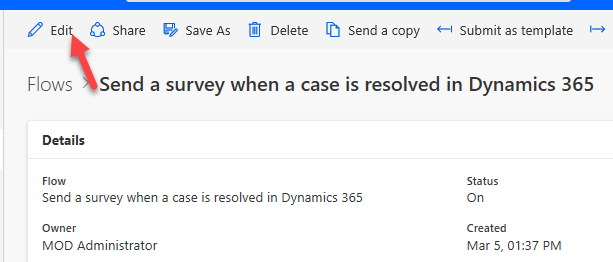

## التمرين الأول: إرسال استطلاع

خلال هذا التمرين، ستستخدم Microsoft Power Automate لإرسال استطلاع Dynamics 365 Customer Voice.

### المهمة الأولى: تحديد قالب Power Automate

خلال هذه المهمة، ستستخدم Power Automate لإرسال الاستطلاع الذي قمت بإنشائه في العمل باستخدام وحدة مشاريع Dynamics 365 Customer Voice.

1.  انتقل إلى [Customer Voice](https://customervoice.microsoft.com/) وسجّل الدخول باستخدام بيانات الاعتماد الخاصة بك.

2.  حدد البيئة التي تم فيها تثبيت Dynamics 365 Customer Engagement. من المفترض أن يكون إنشاء استطلاع Dynamics 365 Customer Voice قد تم في نفس البيئة.

3.  حدد موقع مشروع دعم تعليقات العميل الذي قمت بإنشائه من قبل، ثم حدد له اسماً.

    

4.  حدد **استطلاع الدعم المميز** الذي قمت بإنشائه من قبل، ثم حدد علامة التبويب **إرسال**.

    

5.  حدد **أتمتة**.

    

6.  حدد **إرسال استطلاع عندما يتم حل حالة في Dynamics 365**.

    

7.  إذا كانت هذه المرة الاولي التي تقوم فيها بإنشاء تدفق، فاتبع الخطوات التالية.
    إذا لم تطالَب بتحديد منطقة، فانتقل إلى الخطوة التالية.

     أ.  إذا طُلب منك ذلك، فحدد **البلد/المنطقة**، ثم حدد **البدء**.

    

    ب.  إذا طُلب منك تسجيل الدخول إلى بيئة Microsoft Forms الخاصة بك، فحدد **تسجيل الدخول** ‎أو **تحديث**.

    جـ.  حدد **قبول**.
    

    د.  حدد **متابعة**.

8.  إذا ظهرت لك الشاشة التالية (في حالة تسجيلك الدخول للمرة الأولى)، فحدد **التجربة الآن**.

    

9.  حدد البيئة التي تم فيها تثبيت Dynamics 365 Customer Engagement، ثم حدد **إنشاء**.

    

    سيفتح التدفق في علامة تبويب جديدة.

    

10. لا تنتقل خارج هذه الصفحة.

### المهمة الثانية: فحص التدفق وتحريره

خلال هذه المهمة، ستفحص التدفق الذي تم إنشاؤه بواسطة القالب وتضيف عامل تصفية إلى المشغل. سيضمن عامل التصفية تشغيل التدفق فقط عندما يتغير العمود **سبب الحالة** بدلاً من التشغيل عند كل تغيير يطرأ على سجل الحالة.

1.  من المفترض أن تكون بالفعل في وضع التحرير للتدفق الذي تم إنشاؤه في المهمة الأولى.
    إذا لم يكن الأمر كذلك، وكنت تعرض شاشة **التفاصيل** الخاصة بالتدفق، فحدد **تحرير**.

    

2.  من المفترض أن يتم فتح التدفق في وضع التحرير. قم بتوسيع المشغل عن طريق تحديد العنوان.

    

3.  حدد **عرض الخيارات المتقدمة**.

    

4.  حدد **كود الحالة** لـ **عامل تصفية السمات**. سيحرص هذا الاجراء على تشغيل التدفق فقط عند تغيير حالة الحالة.

    

5.  حدد **إخفاء الخيارات المتقدمة**.

    

6.  قم بِطي المشغل عن طريق تحديد العنوان مجدداً.

7.  قم بتوسيع الشرط.

    

8.  حدد **توسيع الشرط**.

    

    يتحقق الشرط الأول مما إذا كانت قيمة **سبب الحالة** تساوي **5** (تم الحل).

    

9. لن تتخذ إجراءات إلا إذا تم حل الحالة. قم بتوسيع الحالة داخل فرع **‎إذا كانت الإجابة بنعم**.

    

10. حدد **توسيع الشرط**.

    

    يتحقق هذا الشرط مما إذا كان نوع العميل الخاص بالحالة عبارة عن حساب.

    

11. قم بتقييم فرعي التدفق (أنت لا تقوم بإجراء تغييرات، فقط اعرض ما تم إنشاؤه).

    إذا كان نوع حالة العميل عبارة عن حساب:

    - سيحصل التدفق علي سجل الحساب.
    - إضافة إجراء **إرسال الاستطلاع**.
    - استخدم المعلومات من الإجراءات السابقة لملء أعمدة إرسال الاستطلاع.
    - حدد قالب الاستطلاع والبريد الكتروني الصحيحين.

    إذا كان نوع حالة العميل ليست عبارة عن حساب:

    - سيحصل التدفق علي سجل جهة الاتصال.
    - إضافة إجراء **إرسال الاستطلاع**.
    - استخدم المعلومات من الإجراءات السابقة لملء أعمدة إرسال الاستطلاع.
    - حدد قالب الاستطلاع والبريد الكتروني الصحيحين.

   

12. قم بطي جميع الإجراءات ثم حدد **حفظ**.

    

13. لا تنتقل خارج هذه الصفحة.

### المهمة 3: اختبار التدفق

خلال هذه المهمة، ستقوم باختبار التدفق ورؤية وما الذي سيرسله إلى العميل.

1.  ابدأ علامة تبويب مستعرض جديدة وانتقل إلى تطبيق مركز المبيعات في Dynamics 365 الخاص بك.

    

2.  حدد **الحالات**.

    

3.  حدد **+ جديد**.

    

4.  أدخل **الأجزاء المفقودة** لـ **عنوان الحالة**، وحدد العمود **العميل** ثم حدد **+ سجل جديد**.

    

5.  حدد **جهات الاتصال**.

    

6.  أدخل الاسم الأول واسم العائلة والبريد الإلكتروني لمستخدم مؤسستك.

    

7.  حدد **حفظ وإغلاق** لحفظ النموذج.

8.  حدد **حفظ** لحفظ سجل الحالة.

    

9.  حدد **حل الحالة**.

    

10. أدخل **الاستبدال المرسل** لـ **الحل**، حدد **15 دقيقة** لـ **الوقت القابل للفوترة**، ثم حدد **حل**.

    

11. اذهب إلى Power Automate وحدد زر الرجوع.

    

12. يجب أن يكون لديك تشغيل تدفق واحد على الأقل، ويجب أن يكون قد نجح. حدد لفتح التشغيل.

    

    يجب أن يأخذ التدفق الخاص بك المسار **If no** ويعمل بنجاح.

    

13. ابدأ علامة تبويب / نافذة متصفح جديدة.

14. انتقل إلى [Outlook](https://outlook.com) وسجّل الدخول باستخدام بيانات الاعتماد الخاصة بك.

    يجب أن تتلقى بريداً إلكترونياً مشابهاً للصورة التالية.

    

15. حدد **بدء الاستبيان**.

    يجب فتح الاستطلاع.

    

16. أغلق نافذة أو علامة تبويب متصفح الاستطلاع.

17. ارجع إلى الحالة وحدد **إعادة تنشيط الحالة**.

    

18. حدد **إعادة تنشيط** للتأكيد.

## تمرين 2: إنشاء دعوه استطلاع وإرسالها

يستخدم التدفق الحالي قالب البريد الإلكتروني الذي حددته لإرسال الاستطلاع. خلال هذا التمرين، ستضيف المزيد من المتغيرات إلى الاستطلاع، وستنشئ دعوة، ثم ترسلها في رسالة بريد إلكتروني.

### المهمة 1: استبدال إجراء إرسال الاستطلاع

خلال هذه المهمة، ستحذف إجراء **إرسال الاستطلاع** المرفق مع القالب Power Automate واستبداله بإجراء **إنشاء دعوة**.

1.  ارجع إلى التدفق في Power Automate الذي تم إنشاؤه في المهمة 1.

2.  حدد **تحرير**.

    

3.  قم بتوسيع الشروط وحدد زر علامة الطي (**...**)للإجراء **إرسال الاستطلاع** الموجود في فرع **If no**.

    

4.  حدد **حذف**.

    

5.  حدد **موافق**.

6.  تعد تسمية إجراءات التدفق الخاصة بك فكرة سديدة. حدد زر علامة الطي (**...**) لـ **الحصول على السجل 2** ثم حدد **إعادة تسمية**.

    

7.  أعد تسمية الإجراء **الحصول على جهة اتصال**.

    

8.  حدد **إضافة إجراء**.

    

9.  ابحث عن **دعوة** وحدد **إنشاء دعوة**.

10. أعد تسمية الدعوة **إنشاء دعوة جهة اتصال**.

    

11. حدد **استطلاع حل الحالة** لـ **الاستطلاع** وحدد عمود **البريد الإلكتروني**.

    

12. ابحث عن **البريد الإلكتروني** وحدد **البريد الإلكتروني** من إجراء **الحصول على جهة اتصال**.

    

13. حدد **عرض الخيارات المتقدمة**.

    

14. حدد عمود **الاسم الأول** وحدد **الاسم الأول** من جزء **المحتوى الديناميكي**.

    

15. حدد عمود **اسم العائلة** وحدد **اسم العائلة** من جزء **المحتوى الديناميكي**.

    

16. اكتب **حادث** في العمود **بخصوص** وحدد **حالة** من جزء **المحتوى الديناميكي**.

    

17. اكتب **جهة اتصال** في عمود **تفاصيل المستلم** وحدد **جهة اتصال** من جزء **المحتوى الديناميكي**.

    

    يجب أن تبدو الدعوة الآن مثل الصورة التالية.

    

18. احفظ تقدمك عن طريق تحديد الزر **حفظ**.

    

19. لا تنتقل خارج هذه الصفحة.

### المهمة 2: إرسال بريد إلكتروني

خلال هذه المهمة، ستنشئ إجراء **إرسال بريد إلكتروني** لإرسال دعوة الاستطلاع.

1. ارجع إلى المسار **If no** وحدد **إضافة إجراء**.

    

2.  ابحث عن **إرسال بريد إلكتروني** وحدد **إرسال بريد إلكتروني (v2)**. إذا كانت هذه هي المرة الأولى التي تستخدم فيها هذا الإجراء، فقد تحتاج إلى المصادقة. إذا كان هذا الاتصال لا يعمل، فتحقق من ترخيص المستخدم الخاص بك.

    

3.  أعد تسمية الإجراء **إرسال دعوة جهة الاتصال**.

    

4.  حدد العمود **إلى** وحدد **البريد الإلكتروني** من جزء **المحتوى الديناميكي**.

    

5.  اكتب **تم الحل:** وحدد **عنوان الحالة** من جزء **المحتوى الديناميكي**.
    
    

6.  اكتب **مرحباً** في عمود **النص الأساسي** وحدد **الاسم الأول** من جزء **المحتوى الديناميكي**.

7.  أضف **فاصلة** بعد الاسم الأول واضغط على مفتاح **الإدخال** مرتين.

8.  اكتب **لقد قمنا مؤخراً بحل الحالة التالية من أجلك:** ثم اضغط على مفتاح **الإدخال**.

9.  اكتب **رقم الحالة:** وحدد **رقم الحالة** من جزء **المحتوى الديناميكي**. اضغط على مفتاح **الإدخال**.

10. اكتب **عنوان الحالة:** وحدد **عنوان الحالة** من جزء **المحتوى الديناميكي**.
    اضغط على مفتاح **الإدخال** مرتين.

11. أدخل **لتقديم أفضل خدمة لك، يرجى قضاء بضع دقائق لإعلامنا كيف نحن.** اضغط على مفتاح **الإدخال** مرتين.

12. قم بالتبديل إلى **عرض الكود** بتحديد الزر **\</\>**.

    

13. أدخل **\<a href=""\>استطلاع التعليقات الكامل\</a\>** ثم ضع المؤشر بين علامتي الاقتباس المزدوجة.

    

14. حدد **رابط الدعوة** من جزء **المحتوى الديناميكي**.

    

15. اكتب **\<br\> \<br\>** ثم اضغط على مفتاح **الإدخال**.

16. اكتب **شكراً لعملك \<br\>\<br\>**.

    يجب أن يبدو بريدك الإلكتروني الآن مثل الصورة التالية.

    

17. حدد **حفظ**.

### المهمة 3: اختبر دعوة إرسال الاستطلاع

خلال هذه المهمة، ستختبر تدفق دعوة إرسال الاستطلاع.

1.  انتقل إلى تطبيق Dynamics 365 **مركز المبيعات**.

2.  حدد **الحالات** وحدد لفتح الحالة التي قمت بإنشائها.

    

3.  حدد **حل الحالة**.

    

4.  أدخل **الأجزاء البديلة المرسلة** لـ **الحل**، حدد **30 دقيقة** لـ **قابلة للفوترة الوقت**، وحدد **حل**.

    

    يجب أن تحصل على بريد إلكتروني من التدفق.

5.  حدد لفتح البريد الإلكتروني.

    

6.  يجب أن يبدو البريد الإلكتروني لدعوة الاستطلاع كما يلي. حدد رابط الاستطلاع.

    

    يجب تحميل الاستطلاع.

    

7.  أغلق نافذة أو علامة تبويب متصفح الاستطلاع.

