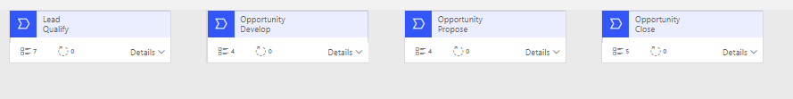
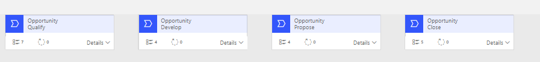

يتمتع Dynamics 365 Sales بالوظائف الكاملة الفورية الجاهزة يمنحك التطبيق كل ما تحتاجه لبناء وتتبع العلاقات مع العملاء ولإدارة عملية المبيعات من البداية إلى الطلب. كل عمل فريد من نوعه في البيانات التي يتتبعونها والعمليات التي يتبعونها. تتمثل الخطوة الأولى لتصميم الوظيفة لتناسب احتياجاتك في تكوين Dynamics 365 Sales. تشرح هذه الوحدة كيفية البدء في تخصيص التطبيق من خلال تتبع المزيد من البيانات، وتغيير العمليات التجارية أو إضافتها، وتصميم النماذج وطرق العرض لتلبية متطلباتك المحددة. قبل أن تبدأ في التخصيص، يجب أن يكون لديك فهم جيد للوظائف الجاهزة حتى لا تعيد إنشاء شيء يمتلكه التطبيق بالفعل.

## تطبيق مركز العمليات أو التطبيق المخصص

سيتم شحن Dynamics 365 Sales مع تطبيق مركز العمليات تم تكوين هذا التطبيق للأشخاص لاستخدام جميع ميزات المبيعات الرئيسية. التنقل في التطبيق ومحتوياته قابلة للتخصيص. نظراً لأن Microsoft تقوم بتحديث Dynamics 365 Sales، فإن هذا التطبيق يعكس هذه التغييرات تلقائياً، ما لم تقم بإجراء تعديلات تمنع حدوث هذا التحديث. على سبيل المثال، إذا أضافت Microsoft جدولاً جديداً إلى التنقل في التطبيق، فسيراه المستخدمون تلقائياً بعد الترقية. وينطبق الشيء نفسه على نماذج الجدول وطرق العرض. بشكل افتراضي، إذا لم تقم بتغيير النماذج وطرق العرض الخاصة بك، فسترى جميع التغييرات التي تجريها Microsoft في الترقية.
ومع ذلك، إذا قمت بإنشاء النماذج أو طرق العرض الخاصة بك ثم قمت بتغيير تطبيق مركز المبيعات للرجوع إليها، فلن تتم ترقيتها تلقائياً.

هناك قرار شائع آخر يجب اتخاذه بشأن التطبيقات وهو ما إذا كان يجب عليك استخدام تطبيق مركز المبيعات أو إنشاء تطبيق مخصص يتضمن مجموعة فرعية من الأصول نفسها. تذكر أنه باستخدام التطبيق، يمكنك إنشاء ما يراه المستخدمون ويتفاعلون معه وكيف تحدد تجربة المستخدم. يمنحك التطبيق المخصص تحكماً كاملاً في المحتويات ولكنه لا يتمتع بميزة الترقية تلقائياً عندما ترسل Microsoft تحديثاً.
إذا كان تطبيقك المخصص يشير إلى نفس النماذج وطرق العرض مثل مركز المبيعات، فسيظل يعكس تلقائياً التغييرات التي أرسلتها Microsoft في الترقية، حتى إذا كان التطبيق مخصصاً.

لم يتم اقتراح اختيار واحد صحيح. من المهم أن تقوم بتقييم حاجتك إلى التحكم والتخصيص وفقاً للنهج الذي تقرر اتخاذه.

## ‏‏أدوار الأمان

توفر أدوار الأمان المضمنة مثالاً لمجموعة من الأدوار للمبيعات، مثل مندوب المبيعات ومدير المبيعات. يمكنك استخدام هذه الأدوار وتعديلها. غالباً ما تقوم الفرق بنسخ هذه الأدوار وتخصيصها وفقاً لاحتياجاتهم الخاصة.
على سبيل المثال، يمكنك مشاركة البيانات مع جميع موظفي المبيعات في مكتب أو قسم، أو قد تطلب من جميع موظفي المبيعات عرض بياناتهم الخاصة فقط.
راجع كيفية تطابق متطلباتك المحددة مع الأدوار المضمنة ثم حدد التخصيص المطلوب.

يعد تخصيص أدوار الأمان أيضاً طريقة أخرى يمكنك من خلالها تخصيص ما يمكن للمستخدمين الوصول إليه في التطبيق.

## الجداول والنماذج وطرق العرض

النماذج هي طرق أساسية للأشخاص لاستخدام التطبيق لإنشاء البيانات وقراءتها وتحريرها والتفاعل معها بأي طريقة أخرى. يأتي التطبيق بعدة أشكال لكل جدول. يمكنك تحرير نماذج النظام هذه وإنشاء نموذج خاص بك أيضاً. إذا قمت بتحرير النماذج وطرق العرض الموجودة، فعندما تقوم Microsoft بتغيير التطبيق، تحدث معظم هذه التغييرات تلقائياً عند ترقية Dynamic 365 Sales. إذا أنشأت نموذجاً خاصاً بك أو أنشأت نسخة من هذه النماذج وطرق العرض، فأنت مسؤول عن إجراء التغييرات بعد كل إصدار.

التخصيص الأكثر شيوعاً للنماذج وطرق العرض هو إزالة الأعمدة التي لا تحتاج إليها. تأتي النماذج الافتراضية محملة بالكامل لتزويدك بتطبيق مبيعات عام جيد؛ ومع ذلك، لا يستخدم معظم الأشخاص عادةً كافة الأعمدة.
على سبيل المثال، في الحساب، إذا كنت لا تشحن إلى عملائك، فإن إزالة قسم الشحن الذي يتضمن طريقة الشحن وشروط الشحن أمر منطقي. ستساعد إزالة الأعمدة غير المستخدمة على تقليل الفوضى، ومن ثم يمكن للمستخدمين التركيز على البيانات التي يحتاجون إلى توفيرها.

تعد مراجعة طرق العرض للأعمدة الأساسية مفيدة، كما هو الحال في إنشاء طرق عرض تقوم بتصفية الاحتياجات المشتركة. يمكن أن تساعد طرق العرض الجيدة المستخدمين في العثور بسرعة على البيانات التي يبحثون عنها.

> [!NOTE]
> تختلف إزالة الأعمدة من النماذج وطرق العرض عن إزالتها من التطبيق. تحدث عواقب قليلة نسبياً من إزالة أعمدة النظام من النماذج وطرق العرض.

## عمليات سير إجراءات العمل

يعد تدفق إجراءات العمل أداة للمساعدة في توجيه المستخدمين خلال عملية تجارية في الصفوف. إنها تمكّنك من منح المستخدم حق الوصول لإكمال خطوات معينة قبل اكتمال العملية. يتضمن Dynamics 365 Sales بعض عمليات سير إجراءات العمل، أو يمكنك إنشاء العملية الخاصة بك. يعد تكوين مراحل العملية وخطواتها بحيث تعمل مع العمليات التجارية لشركتك أمراً ضرورياً لتكون قابلة للاستخدام، ما لم تكن الشركة تتبنى العمليات المضمنة.

تعتبر عملية مبيعات العميل المتوقع للفرصة واحدة من تدفقات عمليات الأعمال المضمنة. يوضح تدفق إجراءات العمل هذا الحصول على مقدمة من خلال مرحلة إغلاق الفرصة. يمكن استخدام تدفق إجراءات العمل هذا من قبل أي شركة متوسطة تقريباً تمر بمراحل المبيعات.

> [!div class="mx-imgBorder"]
> 

إن عملية مبيعات الفرصة هي تدفق عمليات أعمال آخر تم تضمينه في Dynamics 365 Sales. يتضمن تدفق العمليات التجارية هذا المراحل والخطوات التي سيتم تشغيلها عبر عمليه الفرصة.

> [!div class="mx-imgBorder"]
> 

بخلاف تخصيص المراحل والخطوات، يمكنك أيضاً إضافة فروع شرطية للتعامل مع اختلافات العملية. يمكنك أيضاً إضافة أتمتة مع مهام سير العمل أو تدفقات Microsoft التي يتم تشغيلها من مراحل أو خطوات في العملية.

من خلال تخصيص Dynamics 365 Sales، فإنك تقوم بتغييره من تطبيق قياسي لدى كل شخص إلى تطبيق مخصص لمتطلباتك المحددة.
