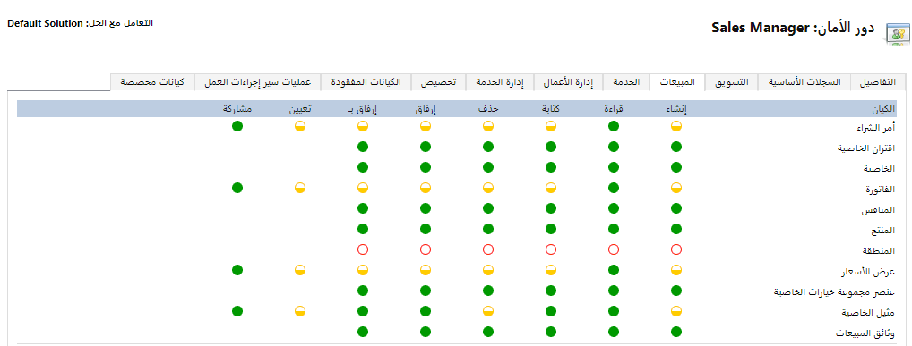
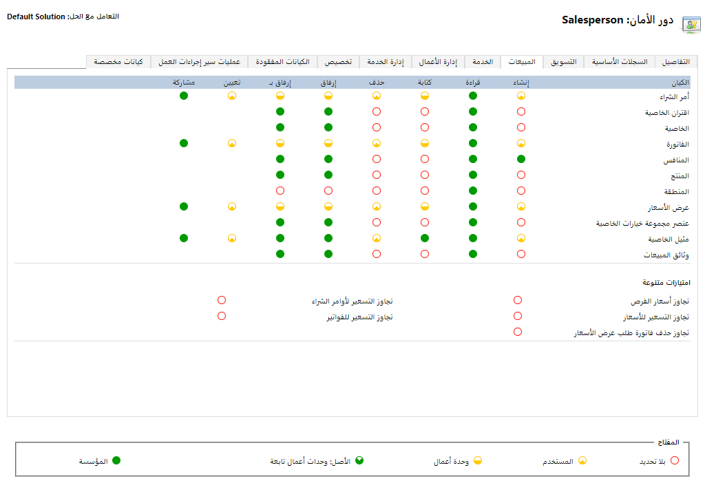

لذلك، ستحتاج إلى دور أمان ذات امتيازات صحيحة ومستويات وصول خاصة بالمستخدمين بحيث يمكنهم التعامل مع هذه الجداول. اعتمادًا على الوظيفة التي تود أن يحصل عليها المستخدمون، أنت بحاجة إلى تعيين الأذونات الصحيحة لهم خلال أدوار الأمان.

أدوار الأمان في Dynamics 365 Sales هي مصفوفة من امتيازات الأمان (على مستوى الصف) ومستويات الوصول (مستندة إلى المهام) للجداول المختلفة.
تتوفر علامات تبويب مختلفة حسب الوظيفة الموجودة في مصفوفة الأمان.
يمكن للأشخاص الحصول على أكثر من دور أمان. تعتبر هذه الأدوار تراكمية، لذلك ستعتمد جميع الأذونات على كافة الأدوار التي تم تعيينها للمستخدم.

بالإضافة إلى الأمان المستند إلى الدور الذي تمت إدارته كما هو موضح في الأقسام التالية، يمكنك إنشاء نماذج تستند إلى الدور. باستخدام النماذج، يمكنك إنشاء تجربة مستخدم مختلفة استنادًا إلى دور شخص. لذلك، إذا كان لديك نموذجًا مخصصًا للزملاء في قسم أستراليا، فقد ترغب في نموذج مختلف قليلاً للزملاء في قسم أوروبا. تحتاج إلى نموذج احتياطي معين لكل جدول بحيث يتوفر نموذج لأي مستخدم لديه أي نوع من الوصول. إذا كان للمستخدم حق الوصول إلى أكثر من نموذج واحد للجدول، فسوف يشاهد مُحدِّد النموذج الذي يسمح له بالانتقال من نموذج إلى آخر.
لا تتحكم النماذج التي تستند إلى الدور في وصول المستخدم إلى البيانات ولكن تخصص التجربة للدور.

تحتوي علامة تبويب **مبيعات** على أكثر الصفوف القابلة للتطبيق لتطبيق Sales. كما أن علامتي التبويب **إدارة العمل** و **حالات سير إجراءات العمل** تشكل أهمية كبيرة للمبيعات. تتضمن علامات التبويب هذه الأذونات التي تمكن الوظائف التي يستخدمها الأشخاص الذين يستخدمون تطبيق المبيعات.

> [!div class="mx-imgBorder"]
> 

يحتوي كل دور أمان على امتيازات ومستويات وصول مرتبطة به. يتم تضمين أدوار الأمان في الامتيازات التي يتم تعيينها مسبقًا لكل ما تحتاج إلى استخدامه لتطبيق Sales. يتضمن تطبيق Sales أدوارًا مثل مدير المبيعات والبائع. تمنح هذه الأدوار أذونات افتراضية لهذا الشخص استنادًا إلى دورة المعين.

دور أمان البائع يمنح البائع كافة الأذونات التي يحتاج إليها البائع لإدخال كافة المعلومات اليومية، مثل إضافة أو تحرير العملاء المتوقعين والفرص والفواتير.

في العادة، لا يلزم تغيير الامتيازات الافتراضية لأدوار مدير المبيعات والبائع إلا إذا كان لديك مؤسسة مبيعات فريدة. يسمح دور البائع لهذا المستخدم بإنشاء جداول معينة وحذفها، مثل الفواتير والأوامر. وعلى النقيض، يمكن للمستخدم الذي يتمتع بدور مدير المبيعات إنشاء هذه الجداول أو حذفها لأي شخص في وحدة العمل الخاصة بها. على سبيل المثال، يستطيع مدير المبيعات كتابة أمر لبائع آخر أو حذف أحد الأوامر، ولكن لا يمكن للبائع حذف أمر أو كتابته لبائع آخر. ويعتبر هذا المثال مجرد واحدة من الطرق العديدة التي يتم بها إعداد الامتيازات المضمنة.

إذا حدثت حالات تريد فيها إضافة أو حذف الامتيازات التي ليست في أحد الأدوار المضمنة، يمكنك إنشاء أدوار مخصصة وتغيير الامتيازات لهذا الجدول. على سبيل المثال، إذا كنت ترغب في السماح للبائعين بتعيين حسابات إلى أي شخص داخل المؤسسة وليس لأنفسهم فقط، فيمكنك تخصيص الدور لمطابقة هذه الحاجة.

> [!div class="mx-imgBorder"]
> 

## الامتيازات

الامتيازات هي أدوار الأمان التي تحدد الإجراء الذي يمكن للمستخدم تنفيذه في النظام، مثل: 

- ‏إنشاء
- قراءة
- الكتابة
- حذف
- إلحاق
- إلحاق بـ
- ‏‏تعيين
- مشاركة

كما هو موضح في لقطات الشاشة السابقة ، تقوم الدوائر بتحديد الامتيازات التي يملكها المستخدمون لهذا الجدول. وتعني الدائرة الفارغة عدم وجود امتيازات معينة. على سبيل المثال، إذا لم يتمكن المستخدم من الوصول لإنشاء فاتورة، فستكون الدائرة الموجودة بجوار **فاتورة** ضمن عمود **إنشاء** فارغة.

## مستويات الوصول

تُظهر مستويات الوصول المستوى الذي يمكن للمستخدم التفاعل فيه مع الصفوف داخل جدول محدد. جزء الدائرة المعبأ يوضح المستويات. المستويات هي "‏‫لا شيء‬" و"المستخدم" و"وحدة العمل" و"وحدة العمل الأصلية والتابعة" و"المؤسسة". انقر فوق الدائرة لتغيير المستوى. ستؤدي كل نقرة إلى تغيير التعبئة أو اللون. انقر فوق الدائرة حتى تظهر المستوى الذي تريده.

> [!NOTE]
> تحتوي العديد من الأذونات ضمن قسم **امتيازات متنوعة** على خيار "مؤسسة" أو "لا شيء" فقط. ولا تنطبق المستويات الأخرى على هذه الامتيازات.

- **مستخدم (أساسي)** - هذا المستوى يتيح الوصول إلى الصفوف التي يملكها المستخدم أو إلى أي شيء تمت مشاركته مع المستخدم أو الفريق الذي ينتمي إليه المستخدم.
استخدم هذا الإعداد إذا كنت تريد أن يصل المستخدم إلى الصفوف الخاصة به فقط.
لن ترغب في السماح للبائعين بحذف حسابات البائعين الآخرين أو العملاء المتوقعين.

- **وحدة أعمال** - هذا المستوى يسمح بالوصول إلى بيانات المستخدمين الآخرين في وحدة العمل. يجب إعداد وحدة العمل داخل Dynamics 365 ويمكن أن تكون عبارة عن تدرج هرمي لأحد الأقسام. سيتمكن مديرو المبيعات من عرض جميع صفوف المرؤوسين.

- **الأصل: وحدات عمل تابعة (عميقة)** - هذا المستوى يوفر إمكانية الوصول إلى كافة وحدات الأعمال التي ينتمي إليها المستخدم وإلى أي وحدات عمل تابعة لوحدة العمل الخاصة به.

- **مؤسسة (عمومية)** - المستخدم الذي لديه هذا المستوى يحق له الوصول إلى كافة الصفوف في المؤسسة. إذا كان لديك بائعًا يمكنه إضافة منتجات من أي مستويات المؤسسة، فإنك ترغب في حصوله على حق الوصول إلى كافة المنتجات المؤسسية، وليس فقط تلك المتاحة لوحدة العمل الخاصة به.

يمكنك أيضًا إنشاء أدوار أمان مخصصة عن طريق نسخ أحد أدوار الأمان المضمنة وتغيير الامتيازات الضرورية ومستويات الوصول.
إنشاء تخصيص استنادًا إلى احتياجات مهمة محددة. إذا كانت لديك جداول مخصصة في نظامك، بشكلٍ افتراضي، فسيحصل مسؤولو النظام ومخصصو النظام فقط على حق الوصول . لذلك، ستحتاج إلى دور أمان ذات امتيازات الصحيحة ومستويات وصول خاصة بالمستخدمين بحيث يمكنهم التعامل مع هذه الجداول.
