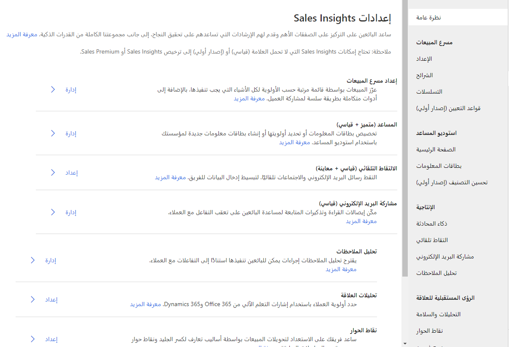

هل تثق بأن البائعون لدبك يتمتعون بعلاقات جيدة مع عملائهم؟ قد تفاجئك إجابات العملاء على هذا السؤال. بينما تعتقد أن علاقاتك جيدة، قد يراها عملاؤك بشكل مختلف. تؤثر العديد من العوامل على العلاقة مع العميل، مثل توقيت التواصل، وسرعة ردودك، وحتى سرعة ردودهم عليك. يستخدم Dynamics 365 Sales Insights الذكاء الاصطناعي لمساعدتك في بناء علاقات جيدة مع العملاء والحفاظ عليها.

يتضمن Sales Insights جزأين:

-   **ميزات Sales Insights** - تشمل بطاقات المساعد الأساسية والالتقاط التلقائي ومشاركة البريد الإلكتروني. تتوفر هذه الميزات بدون تكلفة إضافية مع ترخيص Dynamics 365 Sales.

-   **ميزات Sales Insights الممتازة** - قم بتضمين المساعد (إمكانات كاملة) مع الاستوديو، وتحليل الملاحظات، وتحليلات العلاقة، ومن يعرف من، والعميل المتوقع ونقاط الفرصة التنبؤية.

تتوفر ميزات Sales Insights الأساسية مجاناً في التطبيق بينما تتطلب الميزات المميزة ترخيص Sales Insights حتى تتمكن من استخدامها في مؤسستك. بناءً على الميزات المتاحة لهم بناءً على الترخيص الخاص بهم، يمكن للمسؤولين تمكين وضبط بعض ميزات Sales Insights كما يتطلبه العمل في مؤسستهم.

لاستخدام الميزات الممتازة، يجب عليك شراء ترخيص Dynamics 365 Sales Insights أو بدء إصدار تجريبي. بغض النظر عما إذا كنت تستخدم الميزات المجانية أو المتقدمة، ستستمر في الانتقال إلى نفس المكان في التطبيق لتكوينه. لتكوين بعض ميزات Sales Insights، قد تحتاج إلى أن تكون أحد مسؤولي Dynamics 365 Sales.

## قبل البدء

تستخدم Sales Insights عمليات تكامل مع العديد من التطبيقات الأخرى للعديد من ميزاتها. على سبيل المثال، يمكن استخدام بيانات LinkedIn في تحليلات العلاقة، إذا تم تثبيت الحل في Dynamics 365 وتم تكوينه بشكل صحيح.

قبل تكوين Sales Insights، نوصي بإعداد وتكوين الميزات التالية:

-   **البريد الإلكتروني** - تأكد من تكوين بريد server Exchange وتم تمكين سجلات صندوق البريد لكل مستخدم سيستفيد من ميزات مثل الالتقاط التلقائي ومشاركة البريد الإلكتروني وتحليلات العلاقة.

-   **LinkedIn** - إذا كنت تريد استخدام بيانات LinkedIn لتحليلات العلاقة، فتحقق من تثبيت حل LinkedIn في Dynamics 365 Sales وتم تمكين إعادة الكتابة من LinkedIn Sales navigator.

-   **SharePoint وOneDrive ‏for Business** - للاستفادة من خيارات المرفقات المشتركة مع مشاركة البريد الإلكتروني، ستحتاج إلى تمكين SharePoint وتكامل OneDrive ‏for Business في مؤسستك.

## تمكين Sales Insights المتقدمة:

عندما تقوم بنشر Dynamics 365 Sales، ستتوفر ميزات الرؤى الأساسية في مؤسستك. قد لا يتم تكوين بعض الميزات بشكل كامل، لكنها ستظهر في التطبيق. لن تكون ميزات Sales Insights الممتازة متاحة افتراضياً. قم بتمكين هذه الميزات بقبول الشروط والأحكام الخاصة بمؤسستك.

يمكنك الوصول إلى جميع ميزات Sales Insights من تطبيق مركز المبيعات عن طريق تغيير المنطقة إلى **إعدادات Sales Insights**. سترى خياراً لـ **تجربة Sales Insights** من قسم **الحصول على إمكانات الذكاء الاصطناعي المتقدمة باستخدام Sales Insights**. يستغرق التثبيت عدة دقائق حتى يكتمل، ثم تظهر الحالة في شريط الحالة.

بعد اكتمال التثبيت، تكون جاهزاً لتكوين ميزات Sales Insights المتقدمة.

تنقسم شاشة تكوين Sales Insights إلى خمسة أقسام:

-   **مسرع المبيعات** - يوفر الوصول إلى وظائف الإعداد المتعلقة بمسرع المبيعات الذي يساعد البائعين على التركيز على الأمور الأكثر أهمية من خلال جزء واحد من الزجاج لجميع أعمالهم المهمة.  

-   **المساعد المزود باستديو** - يوفر الوصول إلى استوديو المساعد الجديد، حيث يمكنك إنشاء بطاقات جديدة وتعديل بطاقات موجودة، بالإضافة إلى التحكم في الوصول إلى بطاقة المساعد وتعديل تصنيفات التحسين.

-   **معلومات عن الإنتاجية** - توفر وصولاً سريعاً إلى الميزات المتعلقة بالإنتاجية في Sales Insights مثل الالتقاط التلقائي ومشاركة البريد الإلكتروني وتحليل الملاحظات.

-   **معلومات الاتصال** - توفر وصولاً سريعاً إلى العلاقات والميزات المتعلقة بالاتصال في Sales Insights مثل تحليلات العلاقة ونقاط الحديث ومن يعرف من.

-   **النماذج التنبؤية** - توفر وصولاً سريعاً إلى ميزات تسجيل النتائج التنبؤية المتوفرة في Sales Insights مثل نقاط العميل المحتمل وتسجيل الفرص.
