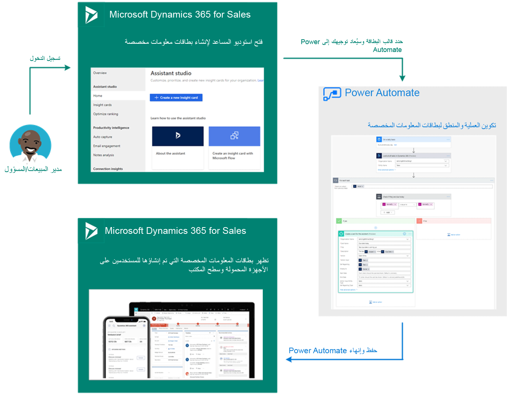

يوفر المساعد بطاقات معلومات قابلة للتنفيذ للمستخدمين في Dynamics 365 Sales. قد تتراوح بطاقات الإحصاءات هذه بين تذكيرك باجتماع قادم، أو تقديم معلومات الرحلة، أو تقديم توصيات بشأن المنتجات أو الخطوات التالية. لقد تطور المساعد منذ تقديمه لأول مرة للتأكد من أنه يزود البائعين بأفضل المعلومات وأكثرها صلة للمساعدة في كسب الصفقات والحفاظ على العملاء. كانت إحدى الميزات التي أرادها العملاء هي الحصول على مزيد من التحكم في البطاقات، بما في ذلك القدرة على إنشاء بطاقات معلومات لمؤسستهم.

لمساعدة العملاء في هذا الطلب، تم إعادة تصميم تجربة الإدارة المساعدة. لا يزال بإمكانك أداء المهام التي كانت متاحة مجانًا سابقًا، مثل تشغيل البطاقات وإيقافها وتعيين عتبات لبطاقات معينة. بالإضافة إلى ذلك، مع الإمكانات المتقدمة، يمكنك التحكم الكامل بشكل أكبر في الميزة بأكملها مع القدرة على إنشاء بطاقات رؤى مخصصة وتحسين تصنيف البطاقة لمؤسسة Dynamics 365 Sales الخاصة بك. عند تمكين الميزات المتقدمة، ستقوم أيضًا بتمكين استوديو المساعد.

يوفر استوديو المساعد الميزات التالية للمسؤولين:

1.  **إنشاء بطاقات إحصاءات مخصصة** - باستخدام Power Automate وموصل لـ Sales Insights، يمكنك إنشاء بطاقات مخصصة يتم تشغيلها بناءً على الاحتياجات المحددة لمؤسستك.

1.  **بطاقات العرض السريع من خلال علامات التبويب** - تسمح لك علامات التبويب بعرض بطاقات الإحصاءات الأكثر شيوعًا والمستخدمة مؤخرًا وذات الأولوية العالية والتي أنشأتها مؤسستك بسرعة.

1.  **جدول بتفاصيل البطاقة** - يعرض البطاقات المتوفرة في مؤسستك. على البطاقات، يمكنك تنفيذ إجراءات مثل تحرير الإعدادات والتعطيل وتعيين أدوار الأمان وتحديد الأولويات.

1.  **بطاقات البحث** - تتيح لك هذه الميزة البحث عن البطاقات التي تريد عرضها أو إدارتها.

## إنشاء بطاقات إحصاءات مخصصة

تؤدي كل مؤسسة مهامها اليومية بشكل مختلف. بينما قد تؤدي شركتك المهام بطريقة معينة، قد تتعامل المؤسسات الأخرى مع مهام مماثلة بطريقة أخرى. لهذا السبب، يمكن للمسؤولين أو مديري المبيعات إنشاء إجراءات مقترحة أكثر صلة بمؤسستك من خلال ميزة الإدارة المساعدة. باستخدام الأحداث والشروط، يمكنك تخصيص الحالات التي يتم فيها إنشاء اقتراحات وإرسال المعلومات إلى سير عمل البائع. هذه الطريقة تساعد البائعين على إتمام الصفقات بشكل أسرع. يوضح الرسم التالي تدفقًا عالي المستوى لإنشاء بطاقة المعلومات.

يمكنك إنشاء بطاقات معلومات جديدة من صفحة **استوديو المساعد** عن طريق تحديد الزر **إنشاء بطاقة معلومات جديدة**. بناءً على احتياجاتك الخاصة، يمكنك إنشاء بطاقات المعلومات من التدفقات Power Automate الفارغة، أو يمكنك استخدام أحد القوالب العديدة الموجودة. نوصي باستخدام نموذج مبدئيًا حتى تفهم كيفية تدفق القطع المختلفة معًا أثناء العملية. على سبيل المثال، قد يكون لديك مهمة أو عنصر آخر مع اقتراب موعد استحقاقها. في هذه الحالة، يمكنك تحديد نموذج **لتاريخ الاستحقاق القادم، وإظهار بطاقة معلومات مساعدة**.

كما هو الحال مع جميع تدفقات Power Automate، سيتم التحقق من اتصالاتك للتأكد من أنها اتصالات صالحة بالمصادر التي ترفق بها، مثل Microsoft Dataverse وDynamics 365 Sales Insights. لن تتمكن من المتابعة حتى تقوم بتسجيل الدخول باستخدام بيانات اعتماد صالحة.

عندما تكون في المصمم، لاحظ أنه سيتم عرض تدفق تم تكوينه مسبقًا. على سبيل المثال، لقد قمت مسبقًا بإنشاء بطاقة معلومات لمهمة اقترب موعد استحقاقها. سيكون للتدفق ثلاث خطوات محددة مسبقًا، وقد تشبه المثال التالي:

1.  **إنشاء جدول** - يحدد متى تريد عرض البطاقة، مثل الجري كل يوم في وقت محدد. يمكن تحديد خيارات إضافية في قسم المعلمات لتمثيل عناصر مثل المناطق الزمنية.

    

1.  **تحديد العملية** - يحدد السجلات التي تريد استخدامها لملء البطاقات، مثل جميع المهام المجدولة للانتهاء بين الوقت الحالي اليوم وغدًا.

    

1.  **تحديد عنصر التحكم** - يخبر التطبيق بما يجب فعله لكل عنصر يحدده، مثل إنشاء بطاقة معلومات لكل مهمة محددة.

    ستحدد بطاقة المعلومات المعلمات التالية:

       -   **اسم المؤسسة** - المؤسسة التي تريد تشغيل البطاقة فيها.

       -   **اسم البطاقة** - اسم البطاقة التي تريد إنشاءها.

       -   **الوصف** - ملخص المعلومات الأساسية التي سيتم عرضها على البطاقة.

       -   **الإجراء** -الارتباطات التي تساعدك على إكمال أي نوع من الإجراءات التي توصي بها البطاقة.

       -   **معلمة الإجراء** - معرف الإجراء الذي تم إنشاؤه.

    

اختياريًا، يمكنك تكوين الخيارات المتقدمة للحالة.
حدد  **إظهار الخيارات المتقدمة**  ثم قم بتحديث **العنوان**، و **تاريخ البدء**، و **تاريخ الانتهاء**، و **العرض إلى**، و **السبب**، و **‏‫بخصوص معرف الكائن**‬، 
 **نوع معرف جدول معلمة الإجراء**، و **معلمات بخصوص نوع الكائن**.

عند تحديد مربع نص، يظهر جزء المحتوى الديناميكي. يمكنك تحديد وإضافة الحقول ذات الصلة. تتغير متغيرات وقيم حقول المحتوى الديناميكية هذه التي يتم عرضها بواسطة هذه الحقول وفقًا للمعلومات التي يتم تمريرها.

راجع [إنشاء بطاقات المعلومات المخصصة](/dynamics365/ai/sales/create-insight-cards-flow/?azure-portal=true) لمزيد من المعلومات.
