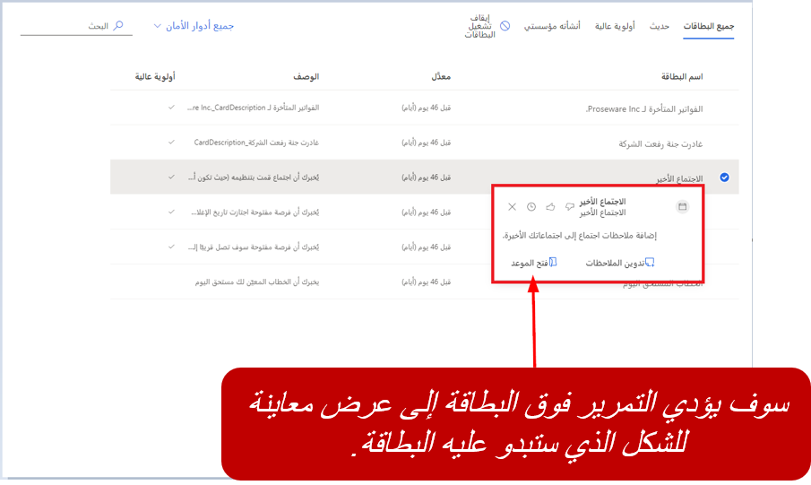

إضافة إلى مساعدتك على إنشاء بطاقات معلومات جديدة، يتيح لك استوديو المساعد أيضًا تعديل الإعدادات المتعلقة بالبطاقات الحالية. وبالنسبة إلى بطاقات معلومات العميل التي يتم إنشاؤها من الاستوديو، يمكنك تعديل المهمة المرتبطة بالبطاقة. بالنسبة إلى البطاقات المتوفرة الجاهزة، يمكن إجراء تغييرات عامة مثل:

-   تشغيل البطاقات أو إيقاف تشغيلها 

-   التحكم في الوصول إلى البطاقات عن طريق تعيين أدوار إزالة الأمان

-   تعيين أولوية البطاقة

-   تحرير تدفق البطاقة (يتوفر فقط للبطاقات المخصصة)

## تشغيل البطاقات أو إيقاف تشغيلها

وبشكل متكرر، يكون لدى المستخدمين احتياجات مختلفة لأنهم يرتبطون بالبطاقات. قد يتطلب بعض المستخدمين الوصول إلى بطاقات معينة، بينما لن يطلب آخرون ذلك. يُمكن تشغيل البطاقات أو إيقاف تشغيلها حسب الحاجة، أو يُمكنك تعيين البطاقات إلى أدوار أمان محددة لتوفير طبقة أخرى من التحكم.

يُمكنك تشغيل البطاقات أو إيقاف تشغيلها عن طريق فتح البطاقة واستخدام مفتاح التبديل. عند إيقاف تشغيل البطاقة، يتم تعطيل البطاقة لكل دور أمان تم تعيينه إلى البطاقة، ولكن لا يعطل الخصائص الأخرى المرتبطة بالبطاقة. على سبيل المثال، يمكن تعطيل البطاقات المخصصة التي قمت بإنشائها باستخدام Power Automate، ولكن لا يمكنك حذف تدفق Power Automate. حتى بعد تعطيل البطاقة، يظل التدفق نشطًا لأن بطاقات المعلومات المخصصة الأخرى قد تستخدم التدفق.

يمكنك تشغيل بطاقات متعددة أو إيقاف تشغيلها في وقت واحد من خلال تحديد جميع البطاقات التي ترغب في العمل بها ثم تحديد مفتاح التبديل **تشغيل البطاقات أو إيقاف تشغيلها** وفقًا لمتطلباتك.

توجد طريقة أخرى للتحكم في كيفية عرض البطاقات عن طريق تشغيل البطاقات أو إيقاف تشغيلها استنادًا إلى أدوار أمان معينة. من خلال شاشة **إدارة بطاقة المعلومات**، يمكنك تصفية البطاقات حسب الدور. اختر البطاقات التي تريد إيقاف تشغيلها للدور المحدد ثم حدد **إزالة لاسم الدور**. ولن تظهر البطاقات للدور الذي قمت بتحديده.

عند إنشاء بطاقة، يجب تحديد أدوار الأمان للأشخاص الذين ترغب في عرض البطاقة لهم. بشكلٍ افتراضي، سيتم تعيين أي بطاقات مخصصة تقوم بإنشائها إلى أدوار الأمان الخاصة بالبائع ومدير المبيعات. يمكنك تحرير البطاقة إما لتعيين أدوار أمان أو إزالتها. عند فتح بطاقة من شاشة **إدارة بطاقات المعلومات**، ستظهر لك علامة تبويب **إعدادات العرض** ، حيث يُمكنك تحديد الأدوار التي يجب أن يكون لها حق الوصول إلى البطاقة أو عدم الوصول إليها.

أحيانًا، قد تحدث سيناريوهات عندما يكون لبعض البطاقات أولوية أعلى من البطاقات الأخرى. على سبيل المثال، قد ترغب في أن تكون لبطاقات التذكير بالاجتماعات أولوية أعلى من البطاقات الأخرى. عند تعيين البطاقة كأولوية، يتم عرض البطاقة للمستخدم في الجزء العلوي. عندما تعرض قائمة ببطاقات المعلومات، فإن علامة الاختيار المطابقة للبطاقة في العمود **أولوية عالية** تحدد أنه تم تعيين البطاقة كأولوية. يُمكنك أيضًا تحديد بطاقات ذات أولوية عالية من علامة التبويب **أولوية عالية**.

## تحسين تصنيف بطاقات المعلومات

بمجرد أن تقوم المؤسسة بتحديد المزيد من البطاقات وتمكينها، سيتم عرضها كلها في الموضع نفسه، بشكلٍ عام. للأسف، عند حدوث هذا الموقف، قد يفقد المستخدمون بطاقات مهمة أو بحاجة إلى المتابعة. لضمان عدم حدوث هذا الموقف، يقوم "المساعد" بتضمين خيار **تحسين التصنيف**. يتيح لك هذا الخيار تحسين تصنيف البطاقات الأكثر أهمية من الآخرين وترقية هذه البطاقات لعرضها في أعلى القائمة.

يمكنك تحديد أربع قواعد كحدٍ أقصى في قسم التصنيف. ويمكن أن تستند القواعد إلى الحسابات والعملاء المتوقعين وجهات الاتصال والفرص. يتم منح البطاقات أولوية بالترتيب الذي تحدده. على سبيل المثال، افترض أنك قمت بإنشاء قاعدتين:

-   **القاعدة الأولى** - إعطاء أولوية للبطاقات التي تتضمن إيرادات سنوية تتجاوز 100,000 دولار أمريكي.

-   **القاعدة الثانية** - إعطاء أولوية للبطاقات التي تتضمن إيرادات تقديرية تتجاوز 10,000 دولار أمريكي.

سيقوم "المساعد" بتحليل البطاقات وعرض البطاقات التي تتضمن إيرادات سنوية تتجاوز 100,000 دور أمريكي أولاً، ومتبوعة بالبطاقات التي تتضمن إيرادات تقديرية تتجاوز 10,000 دولار أمريكي، ثم سيعرض البطاقات التي لم ترتب حسب الأولوية في الآخر.

عند تحديد القواعد، يُمكنك استخدام إحدى الخصائص الأربعة الآتية عند تحرير القاعدة:

-   **اسم الحقل** - يُحدد إذا ما كان يجب تطبيق القاعدة على البطاقات المرتبطة بالحساب أو جهة الاتصال أو العميل المتوقع أو جدول الفرص. ويمكن ربط كل قاعدة بجدول واحد.

-   **نوع السمة** - يحدد السمة التي سيتم التحقق منها لمعرفة ما إذا كانت القاعدة منطبقة.

-   **الشرط** - يحدد أنه يتم عرض بطاقة عند تحقق الشرط المعين.

-   **القيمة** القيمة تحدد وحدة القياس لأحد الشروط التي يتم التحقق من صحتها لنوع السمة.

بالرجوع إلى المثال السابق، إذا كنت تريد تكوين هذا السيناريو ، فإنك تحتاج إلى تحديد تصنيفين فرديين، كما هو موضح في الرسم الآتي.

وتوضح القاعدة الأولى أن أي بطاقات مرتبطة بحساب يتضمن إيرادات سنوية تزيد عن 100,000 دور أمريكي هي أهم الأولويات. وسيتم عرض هذه البطاقات قبل البطاقات الأخرى. وبعد ذلك، سيتم عرض أي بطاقات مرتبطة بفرصة تتضمن إيرادات تقديرية تزيد عن 10,000 دولار أمريكي.

ستحتاج أيضًا إلى تحديد المربع الموجود بجوار كل قاعدة لتحديد أنه نشط. وسيتم اعتبار أي قاعدة غير محددة أنها معطلة. بعد الانتهاء من تصنيفات التحسين، حدد **حفظ** لحفظ القاعدة.
