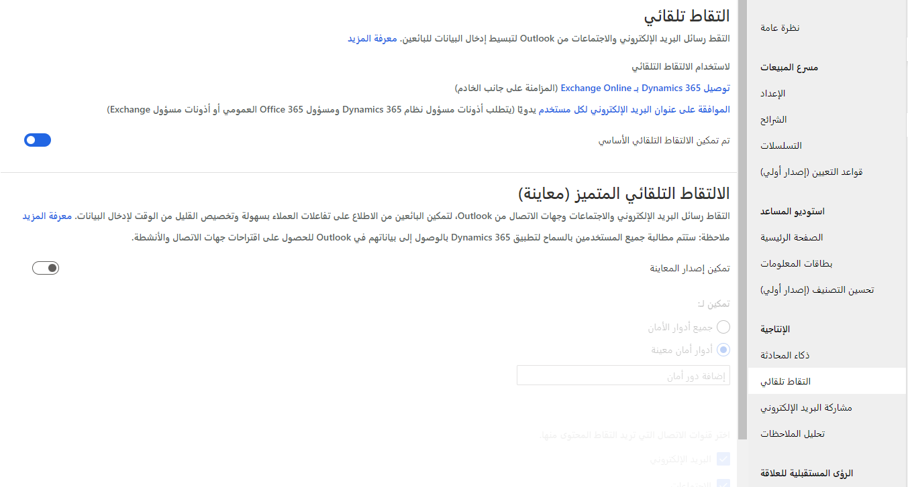

تم تصميم ميزات الذكاء الإنتاجي في Sales Insights لمساعدة موظفي المبيعات على تعزيز الإنتاجية العامة. على سبيل المثال، يمكنك إدخال ملاحظة سريعة في التطبيق لتذكيرك بالاتصال على بيكي يوم الجمعة. ستقوم ميزات مثل "تحليل الملاحظات" بتحليل محتويات الملاحظة ويمكنها إنشاء نشاط مكالمة هاتفية تلقائياً وفقا لمحتويات الملاحظة.

يتألف الذكاء الإنتاجي في Sales Insights من ثلاث ميزات:

-   **مشاركة البريد الإلكتروني** - تعقب المراسلة بالبريد الإلكتروني بين البائعين وعملائهم.

-   **التقاط تلقائي** - مراقبة أنشطة البريد الإلكتروني واقتراح العوامل التي تستند إلى اقترانات السجل المحتملة (مثل المرسل) من محتويات البريد الإلكتروني.

-   **تحليل الملاحظات** - توفير اقتراحات لإنشاء الأنشطة تلقائياً استنادًا إلى النص الذي تم إدخاله في ملاحظة.

### إعداد مشاركة البريد الإلكتروني وتكوينها.

تساعد ميزة مشاركة البريد الإلكتروني في Sales Insights المستخدمين على زيادة الإنتاجية من خلال تعقب التواصل مع العملاء، مثل الوقت الذي يقومون فيه بفتح مراسلة عبر البريد الإلكتروني وإعادة توجيهها. يمكن أيضًا لمشاركة البريد الإلكتروني توفير اقتراحات تسليم وكذلك تشغيل رسائل تذكير. عند الاستعداد لتكوين ‏‫مشاركة البريد الإلكتروني‬، تجب معرفة أنها تستخدم بعض ميزات الإخطار الخاصة بالمساعد. للتأكد من عمل ‏‫مشاركة البريد الإلكتروني‬ بالشكل المتوقع، نوصي بتمكين المساعد في مؤسسك أيضًا.

### قبل البدء

وكما هو الحال مع العديد من ميزات Sales Insights، تعتمد مشاركة البريد الإلكتروني على تقنيات أخرى لدعم وظائفها. وتوفر ميزتين أساسيتين:

-   **تعقب البريد الإلكتروني**- يوفر إمكانية تعقب وتقديم معلومات رسائل التذكير المتعلقة برسائل البريد الإلكتروني التي تقوم بإرسالها إلى عملائك.

-   **تعقب المرفقات** - يوفر القدرة على معرفة وقت قيام الأشخاص بالفتح والتعامل مع المرفقات في بريد إلكتروني متعقب.

للاستفادة الكاملة من هذه الميزات، قد تحتاج إلى تمكين وظائف إضافية في مؤسستك.

### تعقب المرفقات

عندما يقوم المستخدمون بإرسال رسائل بريد إلكتروني متعقبة، يمكنهم أيضًا اختيار المرفقات المتعقبة المضمنة. وستقوم هذه الطريقة بإخطار المستخدمين عندما يقوم شخص بفتح البريد الإلكتروني وعندما يتم فتح المرفقات الفردية أيضًا. يتم تخزين جميع المرفقات المتعقبة في مجلد Microsoft OneDrive ‏for Business.
سيحتاج Dynamics 365 Sales إلى تمكين OneDrive ‏for Business.
قبل أن تستطيع تمكين OneDrive ‏for Business، ستحتاج أولاً إلى تمكين تكامل SharePoint المستند إلى خادم وتمكين قدرات إدارة مستندات SharePoint لجدول أنشطة البريد الإلكتروني. بعد تمكين تكامل SharePoint، يمكنك تمكين OneDrive ‏for Business في Dynamics 365.

-   لمزيد من المعلومات حول تمكين تكامل SharePoint، انتقل إلى [تمكين SharePoint إدارة المستندات للجداول المحددة](/power-platform/admin/enable-sharepoint-document-management-specific-entities/?azure-portal=true).

-   لمزيد من المعلومات حول تمكين OneDrive‏ for business‏، راجع [تمكين OneDrive ‏for Business](/power-platform/admin/enable-onedrive-for-business/?azure-portal=true).

### توصيات التسليم

عند محاولة إرسال بريد إلكتروني لعميل خارج ساعات العمل لديه، ستراجع "‏‫مشاركة البريد الإلكتروني‬" مَن ستقوم بإرسال البريد الإلكتروني إليه وتوفر توصيات لوقت التسليم استنادًا إلى المنطقة الزمنية للمستلم. على سبيل المثال، إذا كنت تحاول إرسال بريد إلكتروني إلى عميل في أثناء نهاية الأسبوع، فسوف تقوم "مشاركة البريد الإلكتروني" بتنبيهك أنه من المحتمل أن يكون خارج ساعات العمل وستوفر لك وقتًا بديلاً اختياريًا. وتستفيد هذه الوظيفة من خرائط Bing. وللتأكد من عملها بشكلٍ صحيح، يجب تمكين خرائط Bing في Dynamics 365 Sales من مربع حوار **إعدادات النظام**.

لمزيد من المعلومات حول هذا الموضوع، راجع [مربع حوار "إعدادات النظام - علامة تبويب "عام"](/power-platform/admin/system-settings-dialog-box-general-tab?azure-portal=true).

### تكوين ‏‫مشاركة البريد الإلكتروني‬

بعد الانتهاء من المتطلبات الأساسية استنادًا إلى الميزات، ستحتاج إلى الاستفادة من هذه الميزات. يمكنك تمكين ‏‫مشاركة البريد الإلكتروني‬ من منطقة إعدادات Sales Insights في تطبيق مركز المبيعات. عند إدخال ميزة ‏‫مشاركة البريد الإلكتروني‬ للمرة الأولى، ستُطالَب بمنح الأذونات. يجب إجراء هذه العملية مرة واحدة فقط. بعد أن يتم منح الأذونات، سيتم تخطي هذه الخطوة في المستقبل.

ويتكون تمكين ‏‫مشاركة البريد الإلكتروني‬ من زر التبديل **تشغيل مشاركة البريد الإلكتروني**.

### تكوين الالتقاط التلقائي وتمكينه 

تعمل ميزة الالتقاط التلقائي في Sales Insights على تمكين Dynamics 365 من الوصول إلى البريد الإلكتروني في Microsoft Exchange للعثور على الرسائل المتعلقة بعمل مندوب المبيعات في Dynamics 365 وعرضها. وتتيح هذه الميزة لموظفي المبيعات القدرة على رؤية رسائل البريد الإلكتروني ذات الصلة مع جميع الأنشطة الأخرى المرتبطة بسجل معين في Dynamics 365.

### المتطلبات الأساسية

نظرًا إلى أن ميزة الالتقاط التلقائي تراقب مراسلة البريد الإلكتروني الخاص بالمستخدم، ستحتاج مؤسستك أولاً إلى الوفاء بالمتطلبات الأساسية التالية قبل تمكين الالتقاط التلقائي واستخدامه.

-   يجب أن تكون مؤسستك تستخدم Microsoft Exchange على الإنترنت كخادم البريد الإلكتروني الخاص بك.

-   يجب أن يستخدم المستخدمون عميل ويب لـ Dynamics 365 Sales (البرامج الأخرى غير مدعومة).

-   لكل مستخدم يطلب الوصول إلى هذه الميزة، يجب اعتماد عنوان البريد الإلكتروني، ويجب تمكين صندوق البريد أيضًا. يمكنك العثور على معلومات إضافية حول هذه العملية من خلال الانتقال إلى: [الموافقة على البريد الإلكتروني](/power-platform/admin/connect-exchange-online?azure-portal=true#approve-email).

-   لتعقب رسائل البريد الإلكتروني الواردة التي تقوم بالالتقاط التلقائي المقترح، يجب إعداد مزامنة على جانب الخادم. يمكنك العثور على مزيد من المعلومات حول هذه العملية بالانتقال إلى: [إعداد مزامنة على جانب الخادم للبريد الإلكتروني والمواعيد وجهات الاتصال والمهام](/power-platform/admin/set-up-server-side-synchronization-of-email-appointments-contacts-and-tasks?azure-portal=true).

### تمكين التقاط تلقائي

بعد قبول بيان الخصوصية الخاص بـ Sales Insights، يجب تمكين الالتقاط التلقائي بشكلٍ افتراضي. يمكنك التحقق من تمكينه بالانتقال إلى منطقة إعدادات Sales Insights وتحديد **الالتقاط التلقائي**. إذا لم يكن ممكنًا، فحدد زر التبديل لتمكين الالتقاط التلقائي.

### تحليل الملاحظات

تعد ميزة تحليل الملاحظات في Sales Insights طريقة ممتازة لاستخدام الاقتراحات التلقائية الذكية عند قيام المستخدمين بإدخال ملاحظات حول الاجتماعات أو المناقشات الأخيرة مع العميل في Dynamics 365 Sales. ستوفر ميزة "تحليل الملاحظات" اقتراحات لإنشاء سجلات استنادًا إلى البيانات التي تم إدخالها في الملاحظة.

ولا يحتوي "تحليل الملاحظات" على أي ميزات أخرى للمتطلبات الأساسية التي يجب تمكينها أولاً. يمكنك تمكين ‏‫مشاركة البريد الإلكتروني‬ من منطقة الإعدادات في Sales Insights في تطبيق مركز المبيعات.

