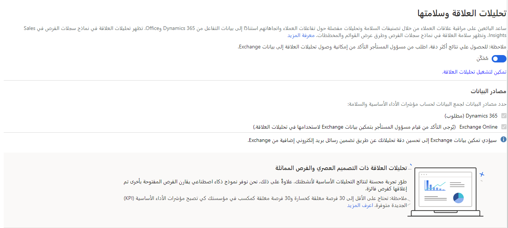
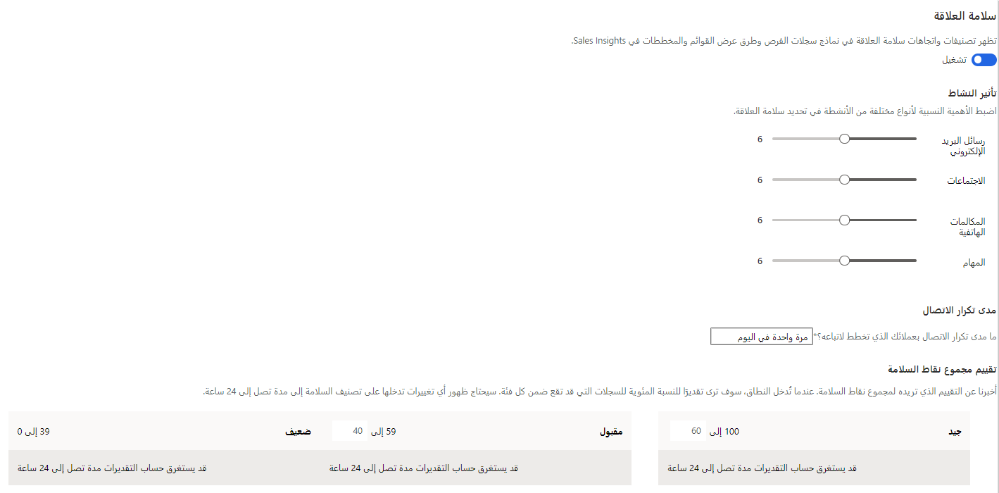

بفضل ميزات معلومات الاتصال في Sales Insights، تستطيع مؤسستك إنشاء علاقات قوية وطويلة المدى مع العملاء. تُساعد هذه الميزات البائعين على معرفة ما إذا كانت هناك علاقة ليست قويه بأي عميل. إضافة إلى ذلك، توفر هذه الميزات اقتراحات بشأن بادئات المحادثات من أجل عملاء محددين بناءً على اتصالات سابقة. تستطيع أداة معلومات الاتصال مساعدتك بداية من البيع وحتى النهاية.

هناك ثلاث ميزات تم تصنيفها تحت عنوان **معلومات الاتصال** كما يلي:

-   **تحليلات العلاقة** - مراقبة الأنشطة بينك وبين العملاء لتقديم نقاط سلامة العلاقة ككل. يُمكن بدء الإجراءات رُغم تغير النقاط كي تظل على علم بطبيعة العلاقة.

-   **نقاط الحوار** - تُحدد الموضوعات ذات الصلة مثل الرياضة أو الترفيه أو الأمور العائلية من خلال اتصالات العملاء السابقة وتوفيرها على أنها بادئات محادثة محتملة.

-   **من الذي يعرف من** - تُحدد الآخرين في مؤسستك الذين قد يكون لهم علاقة مع عميل محتمل أو جهة اتصال ويوفر لك مقدمة مناسبة.

### تكوين تحليلات العلاقة

توفر تحليلات علاقة Sales Insights تمثيلًا رسوميًا لكل من مؤشرات الأداء الأساسية وسجل نشاط أي جهة اتصال أو فرصه أو عميل متوقع أو حساب لمستخدمي التطبيق. قبل توفير تحليلات العلاقة للمستخدمين، سوف تحتاج إلى تكوينها من منطقه إعدادات Sales Insights لتطبيق مركز المبيعات.

بعد تمكين تحليلات العلاقة، سوف تحتاج إلى تحديد مصادر البيانات التي يجب أن تستخدمها الميزة لجمع البيانات المستخدمة لتتبع مؤشرات الأداء الرئيسية (KPIs) والسلامة الكلية.

وهناك ثلاثة مصادر بيانات يُمكنك استخدامها:

-   **Dynamics 365** - يستوعب جميع البيانات القديمة القادمة من Dynamics 365 Sales. يُعد هذا الخيار مطلوبًا ويعمل على نحوٍ افتراضي عند تمكين تحليلات العلاقة.

-   **LinkedIn** - سوف يتم استيعاب البيانات القادمة من LinkedIn من أجل مؤشر الأداء الرئيسي وحساب السلامة. (هذا الخيار متوفر فقط عند تثبيت LinkedIn في Dynamics 365 Sales).

-   **بيانات Exchange** - يستوعب بيانات 30 يومًا من Exchange من أجل مؤشر الأداء الرئيسي وحساب السلامة.‬ يستوعب موصّل Exchange بيانات ثلاثة أيام كل يوم حتى اكتمال 30 يومًا للبيانات.

### طريقة حساب نقاط سلامة العلاقة

تبحث تحليلات العلاقة في أنواع الأنشطة الرئيسية عند تقييم السلامة العامة للعلاقة مع العميل. أنواع الأنشطة هي رسائل البريد الإلكتروني، والمواعيد، والمكالمات الهاتفية والمهام. ولا تنظر تحليلات العلاقة فقط إلى حجم الأنشطة لكل نوع، بل تهتم أيضًا ببيانات أخرى مثل الوقت الإجمالي المستغرق في أحد الأنشطة. وتُقيّم هذه البيانات من أجل الفريق وفريق العميل.

يُحدد الجدول التالي كيفية الاطلاع على هذه البيانات مع مزيد من التفاصيل.

| البيانات                     | بدأها أو أكملها فريقك                                                                                                                                                                      | بدأها أو أكملها فريق العميل                                                                                                                     |
|--------------------------|----------------------------------------------------------------------------------------------------------------------------------------------------------------------------------------------------------|-------------------------------------------------------------------------------------------------------------------------------------------------------------------|
| رسائل البريد الإلكتروني                   | إجمالي العدد، وإجمالي الوقت المنقضي، والجدول الزمني (رقم كل أسبوع) وعدد الردود                                                                                                                           | إجمالي العدد، وإجمالي الوقت المنقضي، والجدول الزمني (رقم كل أسبوع ، وعدد الردود، ونتائج التفاعل مع رسائل البريد الإلكتروني المتبعة (فتح، وطرق عرض المرفقات، وطرق عرض الروابط) |
| المواعيد             | إجمالي العدد، وإجمالي الوقت الذي استغرقه الفريق (في حالة وجود عدة أعضاء في الفريق)، تُضرب المدة في عدد أعضاء الفريق الموجودين في الموعد الحالي، والجدول الزمني (رقم كل أسبوع) | إجمالي العدد، وإجمالي الوقت المستغرق (غير مضروب في عدد جهات اتصال العميل التي كانت موجودة)، والجدول الزمني (رقم كل أسبوع)                                 |
| المكالمات الهاتفية              | إجمالي العدد، وإجمالي الوقت المنقضي، والجدول الزمني (رقم كل أسبوع)                                                                                                                                              | إجمالي العدد، وإجمالي الوقت المنقضي، والجدول الزمني (رقم كل أسبوع)                                                                                                       |
| الإجمالي (جميع الأنشطة) | إجمالي الوقت المنقضي                                                                                                                                                                                         | إجمالي الوقت المنقضي                                                                                                                                                  |

ستضع العديد من المؤسسات تأكيدات مختلفة على أنواع الاتصال المختلفة حسب كيفيه أداء الأعمال بشكل عام. للتأكد من أن تحليلات العلاقة تحسب النتائج بناءً على كيفيه القيام بالأعمال، يُمكنك تعديل أهمية أنواع الأنشطة المختلفة عند المساهمة في نقاط سلامة العلاقة. مثال، إذا كان معظم عمليات التواصل مع العملاء عبر بالبريد الإلكتروني والمكالمات الهاتفية، فقد ترغب في إعطاء النشاط أهمية أعلى قليلًا من أنواع هذه الأنشطة وإعطاء أهمية أقل للأنشطة الأخرى مثل المهام والاجتماعات. سوف تضمن هذه الطريقة تعامل أساليب التواصل الأكثر أهميه لمؤسستك كما هو الحال عند حساب نقاط التحليلات.

### مدى تكرار التواصل

من المؤثرات الرئيسية الأخرى في السلامة العامة للعلاقات تحديد التكرار المتوقع للتواصل مع العملاء. للمشروعات دورات مبيعات متفاوتة ومستويات مختلفة متوقعة من عمليات التواصل مع العملاء. بتحديد تكرار تواصل متوقع أطول، فإنه يقلل توقع عمليات التواصل الأكثر تكرارًا في نقاط السلامة العامة. يُزيد تكرار التواصل المتوقع الأقصر من توقع المزيد من عمليات التواصل المتكررة الحديثة في نقاط السلامة. عند تحديد إعدادات تحليل العلاقة، قد تحتاج إلى تجربة الإعدادات الفردية إلى العثور على أفضل الإعدادات للمؤسسة.

### تكوين نقاط الحوار

توفر نقاط الحوار في Sales Insights آلية لتحديد بادئات المحادثة المحتملة تلقائياً من محادثات البريد الإلكتروني.
قد تتضمن بادئات المحادثة موضوعات متعلقة بالرياضة والعطلات والعائلة والترفيه. تُعرَض هذه الرؤى للمستخدمين مباشرة من صفحه جهة الاتصال.

تستطيع تمكين نقاط الحوار من منطقه إعدادات Sales Insights في تطبيق مركز المبيعات. عند تشغيل نقاط الحوار لمؤسستك، تستطيع تمكين أي من فئات نقاط الحوار أو جميعها: الصحة والعائلة والرياضة والترفيه.

### تكوين من يعرف من

مع ميزة "من يعرف من"، يستطيع المستخدمون تحديد الزملاء، بسرعة داخل مؤسستهم، الذين يمكنهم تقديم الزملاء إلى العملاء المحتملين أو جهات الاتصال.
ميزة "من يعرف من" متوفرة الآن فقط في منطقة أمريكا الشمالية (NAM).

تستطيع تمكين ميزة "من يعرف من" من منطقه إعدادات Sales Insights في تطبيق مركز المبيعات. بعد تشغيل الميزة، يُمكنك أيضًا تحديد قالب بريد إلكتروني حسب متطلبات مؤسستك.

