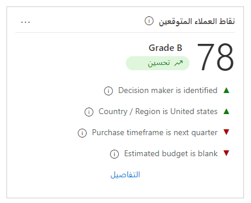

تستخدم إمكانات تسجيل نقاط العميل المتوقع الفرصة التنبؤية في Dynamics 365 Sales Insights نماذج التعلم الآلي لحساب النقاط لجميع العملاء المتوقعين والفرص المتاحة. تساعد هذه النقاط موظفي المبيعات على تحديد الأولويات وتحقيق معدلات فوز أعلى. عندما تقوم مؤسسة بتكوين ميزات تسجيل النقاط التنبؤية، يستخدم التطبيق حقول جاهزة مرتبطة بالعملاء المتوقعين والفرص لإنشاء نموذج يحتوي على نقاط.

## تكوين نقاط العميل المتوقع التنبؤية 

قبل استخدام نماذج النقاط التنبؤية، يجب التأكد من تمكين ميزات Sales Insights المتقدمة في بيئتك عن طريق إضافة ترخيص Sales Insights. بعد تمكين الميزات المتقدمة، يمكنك إنشاء نماذج النقاط من خلال الانتقال إلى منطقة إعدادات Sales Insights الموجودة في تطبيق مركز المبيعات.  

عندما يكون لديك عدد كافٍ من العملاء المتوقعين المؤهلين وغير المؤهلين، فإن التطبيق سيمكنك من إنشاء نموذج نقاط. قد يستغرق الإنشاء الأولي للنموذج بعض الوقت. سيتم عرض مستوى التقدم على الشاشة أثناء عملية التكوين. ما يزال بإمكانك استخدام التطبيق أثناء تنفيذ عملية التكوين.

بعد اكتمال إنشاء النموذج، يجب عليك التحقق من تطابق نقاط الدقة التنبؤية مع متطلباتك التنظيمية. إذا لم تكن راضياً عن نقاط الدقة التنبؤية، يمكنك تجاهل النموذج الحالي وإعادة التدريب لإنشاء نموذج محدث. نوصي بالتدرب على النموذج بعد تحديث البيانات في مؤسستك للحصول على نقاط دقة تنبؤية أفضل.

> [!div class="mx-imgBorder"]
> 

عند إنشاء النموذج، سيتم تعريف نطاق النقاط لكل درجة. يحتوي نموذج نقاط العميل المتوقع على الدرجات التالية:

-   **الدرجة أ (أخضر)** - أعلى احتمالية للتحول إلى فرصة.

-   **الدرجة ب (أرجواني)** - ثاني أعلى احتمالية للتحول إلى فرصة.

-   **الدرجة جـ (أصفر)** - ثاني أقل احتمالية للتحول إلى فرصة.

-   **الدرجة د (أحمر)** - أقل احتمالية للتحول إلى فرصة.

سيكون لكل درجة حد أدنى وأقصى من النقاط. نظراً لأن كل مؤسسة قد تقوم بتقييم درجة العملاء المتوقعين بشكلٍ مختلف، يمكنك تعديل قيم تسجيل النقاط المقترنة بكل درجة. ضمن النطاق الذي تريد تعديله، أدخل الحد الأدنى لقيمة النطاق في نقاط العميل المتوقع. عند تغيير نطاق نقاط العميل المتوقع لإحدى الدرجات، فإن الحد الأقصى لقيمة نطاق الدرجات السابق يتغير تلقائياً وفقاً لقيمة الدرجة الأدنى التي تم تغييرها. على سبيل المثال، عند تغيير الحد الأدنى لنقاط قيمة النطاق للدرجة أ إلى 51، فإن الحد الأقصى لنطاق نقاط العميل المتوقع للدرجة ب يتغير إلى 50.

عندما تشعر بالارتياح تجاه نتائج نموذجك، يمكنك حفظ النموذج واستخدامه. يتم الآن تكوين نقاط العميل المتوقع التنبؤية وأصبحت جاهزة للاستخدام في مؤسستك. سيتم تحديث نقاط العميل المتوقع كل 24 ساعة حيث يتم تعديل المعلومات الموجودة لدى العميل المتوقع. إذا لم تقم بإعادة إنشاء نموذج من قبل، فسيستغرق تطبيق النموذج الجديد 24 ساعة.

## نقاط الفرصة التنبؤية

تكاد تكون عملية إنشاء نماذج تسجيل الفرص التنبؤية مماثلة لعملية إنشاء نماذج نقاط العميل المتوقع التنبؤية. تستخدم نقاط العميل المتوقع التنبؤية التفاصيل من السجلات السابقة لإنشاء نموذج تسجيل النقاط وحسابه. تتطلب Sales Insights فرصاً غير مؤهلة ومؤهلة لإنشاء نموذج تسجيل النقاط.

عندما يكون لديك ما يكفي من الفرص المؤهلة وغير المؤهلة، سيسمح لك التطبيق بإنشاء نموذج نقاط. قد يستغرق الإنشاء الأولي للنموذج بعض الوقت. سيتم عرض مستوى التقدم على الشاشة أثناء عملية التكوين. ما يزال بإمكانك استخدام التطبيق أثناء تنفيذ عملية التكوين.

بعد اكتمال إنشاء النموذج، يجب عليك التحقق من تطابق نقاط الدقة التنبؤية مع متطلباتك التنظيمية. إذا لم تكن راضياً عن نقاط الدقة التنبؤية، يمكنك تجاهل النموذج الحالي وإعادة التدريب لإنشاء نموذج محدث. نوصي بالتدرب على النموذج بعد تحديث البيانات في مؤسستك للحصول على نقاط دقة تنبؤية أفضل.

عند إنشاء النموذج، سيتم تعريف نطاق النقاط لكل درجة. يحتوي نموذج نقاط الفرص على الدرجات التالية:

-   **الدرجة أ (أخضر)** - أعلى احتمالية للتحول إلى فرصة.

-   **الدرجة ب (أرجواني)** - ثاني أعلى احتمالية للتحول إلى فرصة.

-   **الدرجة جـ (أصفر)** - ثاني أقل احتمالية للتحول إلى فرصة.

-   **الدرجة د (أحمر)** - أقل احتمالية للتحول إلى فرصة.

سيكون لكل درجة حد أدنى وأقصى من النقاط. نظراً لأن كل مؤسسة قد تقوم بتقييم درجة فرصها بشكل مختلف قليلاً، يمكنك تعديل قيم النقاط المقترنة بكل درجة. ضمن النطاق الذي تريد تعديله، أدخل الحد الأدنى لقيمة النطاق في نقاط الفرصة. عند تغيير نطاق نقاط الفرصة لإحدى الدرجات، فإن الحد الأقصى لقيمة نطاق الدرجات السابق يتغير تلقائياً وفقاً لقيمة الدرجة الأدنى التي تم تغييرها. على سبيل المثال، عند تغيير الحد الأدنى لنقاط قيمة النطاق للدرجة أ إلى 51، فإن الحد الأقصى لنطاق نقاط الفرصة للدرجة ب يتغير إلى 50.

عندما تشعر بالارتياح تجاه نتائج نموذجك، يمكنك حفظ النموذج واستخدامه. يتم الآن تكوين نقاط الفرصة التنبؤية وأصبحت جاهزة للاستخدام في مؤسستك. سيتم تحديث نقاط الفرصة كل 24 ساعة حيث يتم تعديل المعلومات الموجودة في الفرصة. إذا لم تقم بإعادة إنشاء نموذج من قبل، فسيستغرق تطبيق النموذج الجديد 24 ساعة.
