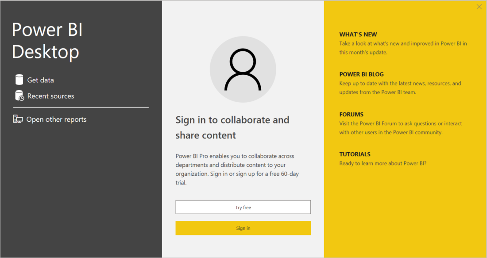
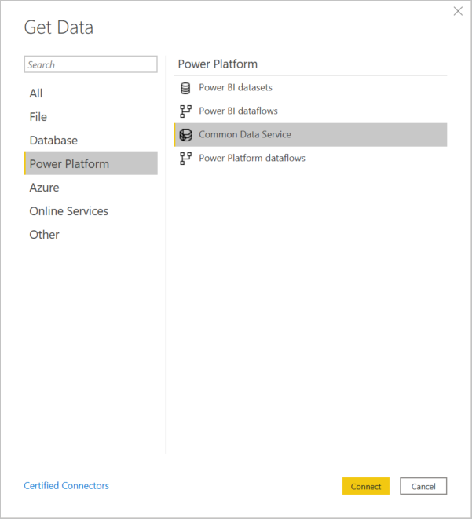
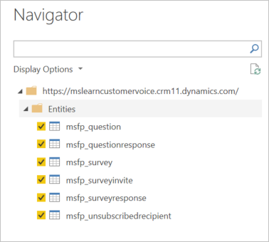
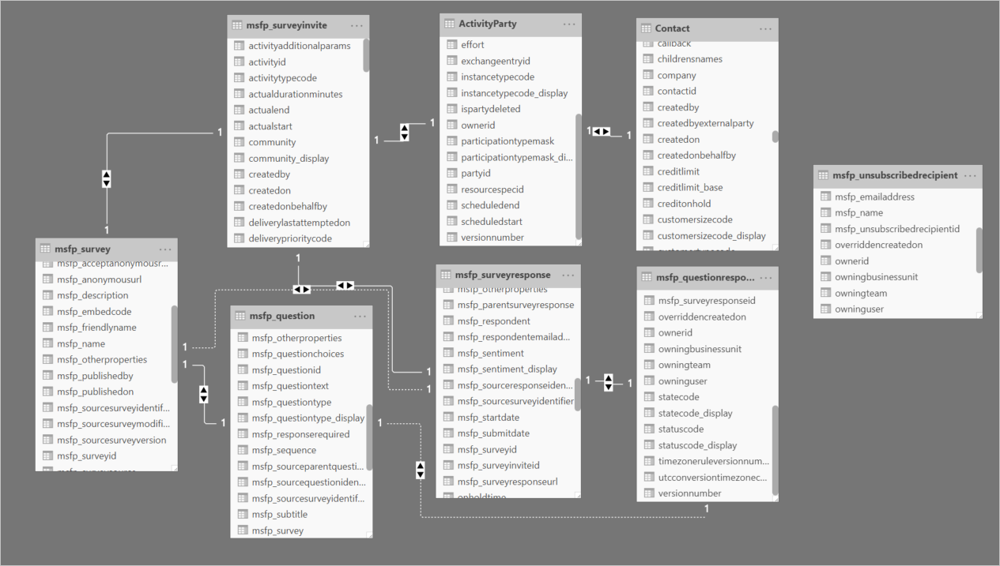

مع تثبيت Microsoft Power BIDesktop، من الممكن الاتصال بجميع أنواع مصادر البيانات. ويتم توسيع الخيارات باستمرار بواسطة فريق Microsoft Power BI.

تتوفر الفئات التالية، مع مجموعة كبيرة من اتصالات البيانات داخل كل فئة:

-   ملف

-   قاعدة البيانات

-   Microsoft Power Platform

-   Azure

-   خدمات عبر الإنترنت

-   غير ذلك

للبدء، ستُطالَب بتسجيل الدخول. استخدم اسم المستخدم وكلمة المرور الخاصة بـ Microsoft 365، مع افتراض أنك تملك ترخيص Power BI.

> [!div class="mx-imgBorder"]
> 

بعد تسجيل الدخول، حدد زر **الحصول على بيانات**، الذي سيطالبك بتحديد إحدى فئات البيانات. سيتم استخدام فئة Microsoft Power Platform عند الاتصال ببيانات Dynamics 365 Customer Voice. يتم توفير أربعة خيارات: مجموعات بيانات Power BI وتدفقات بيانات Power BI وتدفقات بيانات Microsoft Dataverse وMicrosoft Power Platform. نظرًا إلى تخزين بيانات Dynamics 365 Customer Voice في Dataverse، يجب تحديد هذا الخيار. عند تحديد هذا الخيار، ستظهر مطالبات لتسجيل الدخول إلى بيئة Dataverse التي تريدها.

> [!div class="mx-imgBorder"]
> 

عند الاتصال بالبيئة، يمكنك تحديد جداول Dynamics 365 Customer Voice.  تعد الجداول التي تتضمن البادئة **msfp‎** جزءًا من Dynamics 365 Customer Voice، ومن ثمَّ يمكن التحقق من جميع الجداول من القائمة. يجب تحديد جدولين آخرين أيضًا: جدول activityparty وجدول Contact. بعد إجراء التحديد، سيتم تحميل البيانات.

> [!div class="mx-imgBorder"]
> 

يجب التحقق من صحة الارتباطات بين الجداول في نموذج البيانات. قد يتم التحقق من بعض الارتباطات تلقائياً لجداول Dynamics 365 Customer Voice. ومع ذلك، فإن هذه الارتباطات ستحتاج إلى مراجعتها وإضافتها إلى جداول activityparty وContact. يوضح الجدول التالي الجداول التي يجب ربطها والأعمدة من خلالها.

|     ارتباط من جدول        |     ارتباط من عمود    |     ارتباط إلى جدول            |     رابط إلى العمود            |
|----------------------------|------------------------|------------------------------|------------------------------|
|     msfp_survey            |     msfp_surveyid      |     msfp_question            |     msfp_survey              |
|     msfp_survey            |     msfp_surveyid      |     msfp_surveyinvite        |     msfp_surveyid            |
|     msfp_survey            |     msfp_surveyid      |     msfp_surveyresponse      |     msfp_surveyid            |
|     msfp_surveyinvite      |     activityid         |     activityparty            |     activityid               |
|     activityparty          |     partyid            |     جهة الاتصال                  |     contactid                |
|     msfp_surveyinvite      |     activityid         |     msfp_surveyresponse      |     msfp_surveyinviteid      |
|     msfp_surveyresponse    |     activityid         |     msfp_questionresponse    |     msfp_surveyresponseid    |
|     msfp_question          |     msfp_questionid    |     msfp_questionresponse    |     msfp_questionid          |

> [!div class="mx-imgBorder"]
> 

> [!VIDEO https://www.microsoft.com/videoplayer/embed/RE4AIax]
