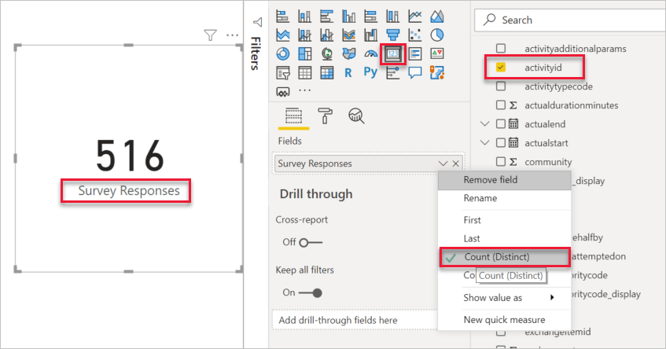
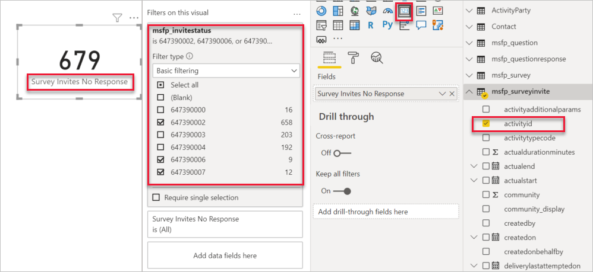
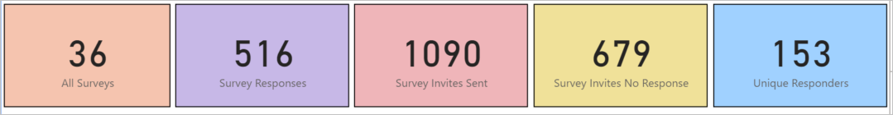
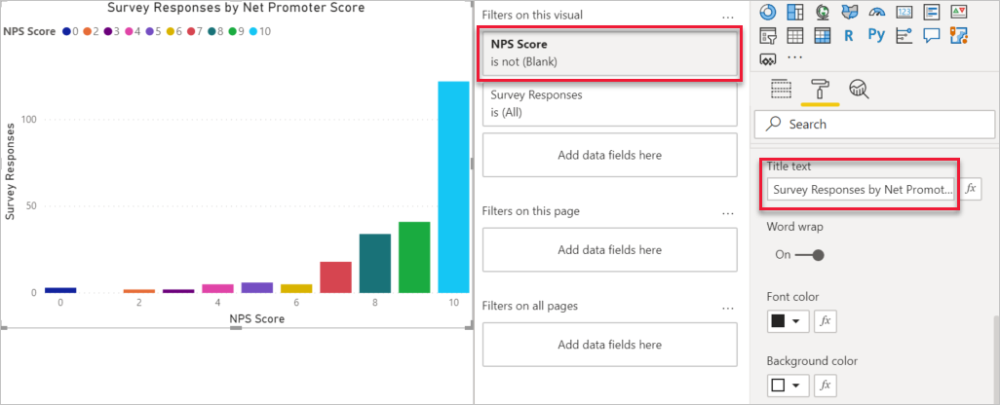
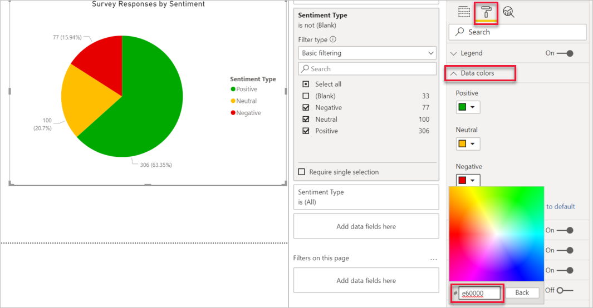
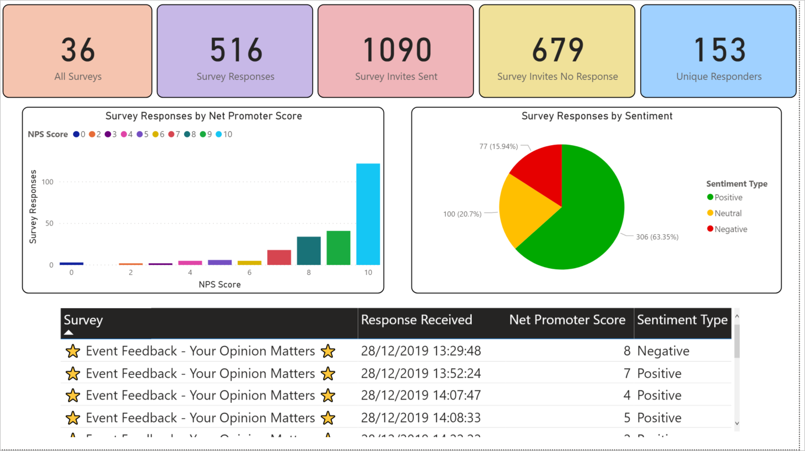

في السابق، لقد تعلمت كيفية الاتصال بـ Microsoft Dataverse باستخدام أداة Power BI Desktop بحيث يمكن الوصول إلى جداول Dynamics 365 Customer Voice. وتعلمت أيضاً كيفية ربط الجداول ببعضها البعض باستخدام الأعمدة الصحيحة. بعد اكتمال هذه العمليات، يمكنك إنشاء تقارير في Power BI لعرض بيانات Dynamics 365 Customer Voice وتحليلها.

ويمكن أن يتكون التقرير من، على سبيل المثال لا الحصر، العناصر الآتية:

-   مربعات النص

-   الأزرار

-   الأشكال

-   الصور

-   المخططات (على سبيل المثال، شريط، عمود، سطر، مساحة، دائري، انحداري، مبعثر، تحرير وسرد)

-   مقسمات طريقة العرض

-   الجداول‏‎

-   مصفوفة

-   خرائط

-   مؤشرات الأداء الأساسية

-   مرئيات الأسئلة والأجوبة

سيتم الاحتفاظ بمثال التقرير Power BI في هذا القسم بشكلٍ بسيط، بصفحة واحدة وبعض المرئيات. بعد بدء التقرير، يمكن إنشاؤه وفقاً لمتطلبات المؤسسة وتصور كاتب التقرير ومجموعة المهارات.

عند إضافة بطاقة من قسم الرسوم المرئية، سيتم عرض الرقم الذي يوفر نظرة عامة سريعة على إجمالي عدد استجابات الاستبيان. استخدم عمود **activityid** من جدول الـ msfp_surveyresponse مثل العمود الموجود في البطاقة، ثم قم بالتعديل من خيار **أول** إلى خيار **العدد (المميز)**. سيتم تغيير الرقم الذي يتم عرضه لإعطاء العدد الإجمالي لاستجابات الاستبيان الخاصة بمصدر بيانات التقرير. ويتم تغيير اسم عرض العمود أيضاً، لذلك بدلاً من عرض **activityid**، سيقوم النظام بعرض **استجابات الاستبيان** كنص بدلاً من ذلك.

> [!div class="mx-imgBorder"]
> 

ويمكن إضافة بطاقات إضافية، ما يوفر نظرة عامة سريعة على أهم المقاييس التي ربما تريد المؤسسة مراجعتها. بعد إضافة عمود إلى بطاقة، يمكنك تصفية السجلات باستخدام عمود ثانوي، حسب الحاجة. على سبيل المثال، يظهر الشكل التالي أن عمود **activityid** من جدول msfp_surveyinvite تمت تصفيته باستخدام msfp_invitestatus من الجدول نفسه. يتم استخدام دعوات الاستبيان ذات حالة دعوة **تم الإرسال** و **قراءة** و **تم البدء** فقط في التصفية، حيث يتم إظهار **عدم الاستجابة لدعوات الاستبيان**. 

> [!div class="mx-imgBorder"]
> 

باستخدام خيارات التنسيق المتوفرة في البطاقة، يمكنك تغيير لون الخلفية وإضافة حدٍّ وتعيين طول كل بطاقة وعرضها بحيث يمكن تحقيق مظهر موحد ومتناسق.

> [!div class="mx-imgBorder"]
> 

يمكن إضافة مخطط لإظهار تنظيم تصنيف Net Promoter Score (NPS) المحددة في استجابات الاستبيان. باستخدام المخطط الشريطي المرئي، قم بتعيين المحور ومفتاح الرموز باستخدام عمود **msfp_npsscore** وقيمة **activityid** لحساب عدد استجابات الاستبيان الموجودة لكل نقطة (من 0 إلى 10). استخدم خيارات التنسيق لتغيير نص العنوان، إذا لزم الأمر، لتوفير وصف أفضل للمخطط. قم بتصفية المخطط بحيث يتم استخدام استجابات الاستبيان التي تتضمن عمود **درجة NPS** ليس فارغاً فقط. 

> [!div class="mx-imgBorder"]
> 

بالإضافة إلى عرض NPS، قد تكون معلومات التوجه من استجابات الاستبيان ذات فائدة أيضاً. يمكنك إضافة **msfp_sentiment_display** إلى مفتاح الرموز وخيارات التفاصيل في المخطط الدائري المرئي. يتم استخدام عدد عمود **activityid** في صورة قيمة. قد لا تكون الألوان المستخدمة لكل قيمة مرغوبة، لذا يمكنك تغييرها باستخدام منطقة التنسيق لاستخدام الألوان التي قد تكون أكثر منطقية للأشخاص الذين يشاهدون الرسم المرئي. خيار **ألوان البيانات** يوفر لك القدرة على تعيين لون مخصص معين لكل قيمة بيانات. يوضح الشكل التالي اللون الأحمر الأكثر منطقية لأنواع التوجه السلبية واللون الأصفر للمحايدة واللون الأخضر للإيجابية. 

> [!div class="mx-imgBorder"]
> 

احفظ التقرير النهائي وشاركه مع الآخرين في مؤسسة بواسطة النشر إلى مساحة عمل داخل Power BI. 

> [!div class="mx-imgBorder"]
> 

