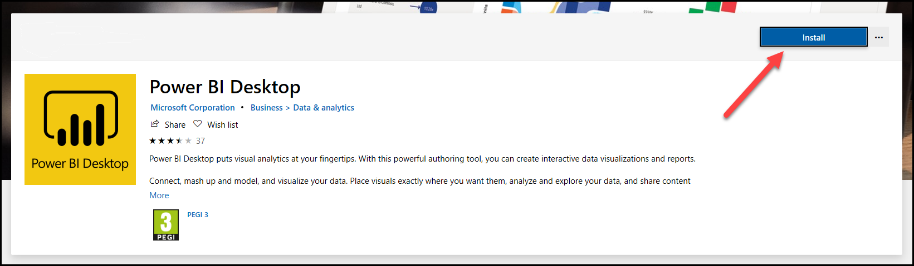
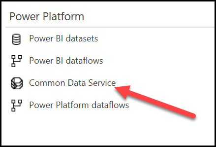

في هذا التمرين، ستستخدم Microsoft Power BI للاتصال بالبيانات Dynamics 365 Customer Voice، والتي ستمنحك التحضير اللازم لإنشاء تقاريرك الخاصة.

### المهمة 1: تثبيت Power BI Desktop

في هذه المهمة، ستقوم بتثبيت العميل Power BI Desktop.

1.  انتقل إلى صفحة [Power BI التنزيلات](https://powerbi.microsoft.com/downloads/?azure-portal=true).

1.  من قسم **Microsoft Power BI من قسم** حدد **تنزيل**.

    > [!div class="mx-imgBorder"]
    > 

1.  سيتم فتح نافذة جديدة، مع مربع حوار يوضح أن الموقع يحاول فتح متجر Microsoft. حدد **فتح** للسماح بهذا الإجراء. 

    > [!NOTE]
    > تأكد من إيقاف تشغيل أدوات حظر النوافذ المنبثقة في متصفحك حتى لا يتم حظر هذا الحوار.

    > [!div class="mx-imgBorder"]
    > 

1.  يجب أن يفتح متجر Microsoft Store ويوجهك إلى التطبيق Power BI Desktop. حدد **تثبيت**.

    > [!div class="mx-imgBorder"]
    > 

1.  سيتم الآن تنزيل التطبيق Power BI Desktop على محطة العمل الخاصة بك. انتظر حتى يكتمل هذا التنزيل.

    > [!div class="mx-imgBorder"]
    > 

1.  بعد تثبيت المنتج، حدد الزر **تشغيل**.

    > [!div class="mx-imgBorder"]
    > 

### المهمة 2: الوصول إلى مركز الإدارة Microsoft Power Platform

في هذه المهمة، ستصل إلى مركز الإدارة Microsoft Power Platform للعثور على عنوان URL للخادم لبيئتك Microsoft Dataverse.

1.  انتقل إلى [Microsoft Power Platform مركز الإدارة](https://admin.powerplatform.microsoft.com/?azure-portal=true).

1.  سيتم إدراج البيئة Dataverse للمثيل Dynamics 365 Customer Voice في مركز الإدارة. حدد الاسم **البيئة** الذي تريد استخدامه.

    > [!div class="mx-imgBorder"]
    > 

1.  سيتم عرض عنوان URL الخاص بالبيئة. انقر بزر الماوس الأيمن فوق عنوان URL الخاص بالبيئة.

    > [!div class="mx-imgBorder"]
    > 

1.  حدد **نسخ الرابط**. افتح المفكرة أو أداة تحرير أخرى والصق الرابط. سوف تستخدم هذا الارتباط في المهمة التالية.

    > [!div class="mx-imgBorder"]
    > 

### المهمة 3: الاتصال ببيانات Dynamics 365 Customer Voice

في هذه المهمة، ستقوم بالاتصال بالبيانات Dynamics 365 Customer Voice في بيئتك Dataverse وإضافة جداول الجداول إلى تقرير.

1.  إذا لم يعد لديك Power BI Desktop فافتحه.

1.  حدد **الحصول على البيانات** من شاشة الترحيب.

    > [!div class="mx-imgBorder"]
    > 

1.  حدد **Microsoft Power Platform** من قائمة خيارات فئة البيانات.

    > [!div class="mx-imgBorder"]
    > 

1.  حدد **Microsoft Dataverse** من قائمة الخيارات Microsoft Power Platform.

    > [!div class="mx-imgBorder"]
    > 

1.  حدد **اتصال**.

1.  استخدم الارتباط الذي قمت بالوصول إليه في المهمة 2 والصقه في عمود **عنوان URL للخادم**.

    > [!div class="mx-imgBorder"]
    > 

1.  حدد **موافق**.

1.  إذا قمت بتسجيل الدخول بالفعل، فستتجاوز الخطوة التالية ولن يُطلب منك اسم المستخدم وكلمة المرور. إذا لم تكن قد قمت بتسجيل الدخول، حدد **الزر تسجيل الدخول**.

    > [!div class="mx-imgBorder"]
    > 

1.  سيُطلب منك تسجيل الدخول. ادخل اسم المستخدم، ثم حدد **التالي**.

    > [!div class="mx-imgBorder"]
    > 

1. ادخل كلمه المرور الخاصة بك ثم حدد **تسجيل الدخول**.

    > [!div class="mx-imgBorder"]
    > 

1. تظهر الشاشة التالية أنك قمت بتسجيل الدخول حالياً. حدد **اتصال** للمتابعة

    > [!div class="mx-imgBorder"]
    > 

1. في مربع البحث **Navigator** أدخل **msfp**، والذي سيؤدي إلى تصفية جداول الجدول وعرض جداول Dynamics 365 Customer Voice فقط.

    > [!div class="mx-imgBorder"]
    > 

1. حدد المربعات بجانب الجداول التالية: **msfp_question**، **msfp_questionresponse**، **msfp_survey**، **msfp_surveyinvite**، and **msfp_surveyresponse**.

    > [!div class="mx-imgBorder"]
    > 

1. في مربع البحث **Navigator** أدخل الكلمة **جهة اتصال** ثم حدد المربع المجاور لجدول **جهة الاتصال**.

    > [!div class="mx-imgBorder"]
    > 

1. في مربع البحث **Navigator** أدخل **activityparty**. حدد المربع المجاور لجدول **ActivityParty**.

    > [!div class="mx-imgBorder"]
    > 

1. حدد الزر **تحميل**.

1. انتظر حتى يتم تحميل الجداول.

    > [!div class="mx-imgBorder"]
    > 

1. ضمن قسم **أعمدة** في تقرير Power BI يجب أن تشاهد الآن جميع جداول الجدول التي تم تحديدها في الخطوات السابقة.

    > [!div class="mx-imgBorder"]
    > 

### المهمة 4: ربط جداول الجداول في تقرير Power BI

في هذه المهمة، ستقوم بربط جداول الجداول التي تم تحديدها في المهمة 3 عن طريق إنشاء علاقات فيما بينها.

1.  حدد رمز الطراز من القائمة الموجودة على الجانب الأيسر من Power BI.

    > [!div class="mx-imgBorder"]
    > 

1.  باستخدام شريط التمرير في الجزء السفلي من الشاشة، قم بالتمرير إلى اليمين حتى تجد جدول **msfp_survey table**.

    > [!div class="mx-imgBorder"]
    > 

1.  باستخدام الماوس، حدد مع الاستمرار أعلى جدول msfp_survey ثم اسحبه إلى اليسار بحيث يصبح الآن الجدول الأول في العرض.

    > [!div class="mx-imgBorder"]
    > 

1.  حرك جميع الجداول حولها حتى يبدو التخطيط كما هو موضح في الشكل التالي. سيؤدي هذا الإجراء إلى تسهيل الخطوة التالية عند ربط الجداول ببعضها البعض.

    > [!div class="mx-imgBorder"]
    > 

1.  في جدول msfp_survey، قم بالتمرير لأسفل حتى تجد العمود **msfp_surveyid**. ثم، في جدول msfp_question، قم بالتمرير لأسفل حتى تجد العمود **msfp_survey**. حدد العمود **msfp_surveyid** واسحبه إلى العمود **msfp_survey** في الجدول الآخر. ثم حرر الماوس.

    > [!div class="mx-imgBorder"]
    > 

1.  سيكون خط الاتصال مرئياً الآن بين الجدولين. سيؤدي تحريك الماوس فوق الخط إلى تمييز العمودين المستخدمين للاتصال.

    > [!div class="mx-imgBorder"]
    > 

1.  باستخدام العمود **msfp_surveyid**، قم بتوصيل جدول msfp_survey بجدول msfp_surveyinvite في العمود **msfp_surveyid**.

1.  باستخدام العمود **msfp_survey ID** قم بتوصيل جدول msfp_survey بجدول msfp_surveyresponse في العمود **msfp_surveyid**.

1.  باستخدام العمود **activityid** قم بتوصيل جدول msfp_surveyinvite بجدول activityparty في العمود **activityid**.

1. باستخدام العمود **partyid** قم بتوصيل جدول activityparty بجدول جهات الاتصال في العمود **contactid**.

1. باستخدام العمود **activityid**، قم بتوصيل جدول msfp_surveyinvite بجدول msfp_surveyresponse في العمود **msfp_surveyinviteid**.

1. باستخدام العمود **activityid** قم بتوصيل جدول msfp_surveyresponse بجدول msfp_questionresponse في العمود **msfp_surveyresponseid** .

1. باستخدام العمود **msfp_questionid** ، قم بتوصيل جدول msfp_question بجدول msfp_questionresponse في العمود **msfp_questionid**.

   يجب أن يبدو النموذج الآن مشابهاً للصورة التالية.

    > [!div class="mx-imgBorder"]
    > 

1. حدد أيقونة الإبلاغ من شريط التنقل الأيمن.

    > [!div class="mx-imgBorder"]
    > 

تم الآن ربط جداولك بشكل صحيح، وأنت مستعد لبدء إنشاء تقرير Power BI.

> [!div class="mx-imgBorder"]
> 

