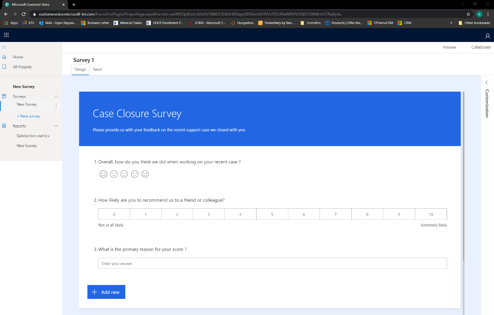

قبل إنشاء استبيان، ضع في اعتبارك التخطيط له مسبقًا للتأكد من فعاليته قدر الإمكان. إذا كان الاستبيان طويلاً للغاية، فقد لا يكمل المستجيبون ذلك بسبب نقص الوقت أو الإحباط. إذا كان الاستبيان قصيرًا للغاية، فقد لا يمكن تجميع الرؤى الفعالة أو القيِّمة من الإجابات التي يتم الحصول عليها.

فكر في الغرض والنتيجة المطلوبة من الاستبيان، ثم ضع في اعتبارك الأسئلة الآتية:

-   هل يعد الاستبيان نقطة منطقية في رحلة العميل أو بعد *لحظة الثقة*؟

-   ما نوع المعلومات التي تحتاج إليها لتحقيق الغرض من الاستبيان؟ اطلب المعلومات التي تحتاج إليها فقط. بمعنى آخر، لا تطلب بيانات شخصية إذا كنت تطلب تعليقات حول إقفال حالة.

-   هل سيستغرق إكمال الاستبيان أكثر من خمس دقائق؟ يعاني الأشخاص من ضيق الوقت. وستؤدي مطالبتهم بإكمال استبيان يستغرق وقتًا طويلاً إلى توقفهم عن الاستجابة لأي استبيانات مستقبلية قد تقوم بدعوتهم لإكمالها.

-   هل يمكن تقديم سحب جوائز للشخص الذي يقوم بالإجابة عن الاستبيان؟ قد لا يكون هذا الأسلوب مناسبًا لكافة الاستبيانات، ولكن قد يكون حافزًا جيدًا إذا كنت تقوم بتجميع تعليقات العملاء في استبيان كبير مرة واحدة أو مرتين سنويًا.

بعد تحديد الإجابات عن الأسئلة والتأكد من غرض الاستبيان، يمكنك إنشاؤه. سيساعدك عنوان الاستبيان على توضيح سببه وسيكون واضحًا لجميع المستجيبين. كما يشتمل الاستبيان على اسم مستعار. بالإضافة إلى ذلك، سيتم استخدام الاسم المستعار كمعرف إذا كنت تستخدم Microsoft Power Automate وموصل Dynamics 365 Customer Voice. لذلك، تأكد من أن الاسم المستعار مناسب داخليًا لأولئك الذين ينشئون الاستبيانات وأنه منطقي لأي شخص يكمل الاستبيان.

يمكن استخدام أنواع الأسئلة التالية في الاستبيان.

|     نوع السؤال    |     الوصف                                                                                                                                                                                                                                                                                    |
|----------------------|----------------------------------------------------------------------------------------------------------------------------------------------------------------------------------------------------------------------------------------------------------------------------------------------------|
|     الاختيار           |     يمكنك إضافة خيارات والسماح بتحديد إجابات متعددة وعرضها كقائمة منسدلة، إذا لزم الأمر.                                                                                                                                                                                                  |
|     النص             |     يمكن أن تكون إجابة السؤال قصيرة أو طويلة ويتم وضع علامة عليها لمعرفة التوجه العام للاستبيان. يمكن تطبيق القيود لفرض رقم أو عنوان بريد الكتروني أو في حالة إدخال تعبير عادي مخصص.                                                                          |
|     التقييم           |     يمكن الحصول على التقييمات باستخدام الأرقام أو النجوم من 1 إلى 10 أو الوجوه الضاحكة من 2 إلى 5 في المقياس.                                                                                                                                                                                       |
|     التاريخ‬             |     يتم الحصول على عمود **التاريخ** بتنسيق يوم/ شهر/ سنة استنادًا إلى الموقع الافتراضي لبيئة Dynamics 365 Customer Voice. لا يمكن تعديل التنسيق.                                                                                                                                     |
|     التصنيف          |     تتم إضافة الخيارات إلى السؤال، وسيقوم المستجيبون بترتيب الخيارات وفق ترتيب محدد بناءً على صياغة السؤال. على سبيل المثال: رتب الخيارات الآتية حسب ما تفضله مؤسستك.                                                                         |
|     Likert           |     يشبه مقياس Likert المصفوفة. يتم توفير سلسلة من العبارات، ويجب أن يحدد المستجيب أحد الخيارات التي تتناسب مع أو تستوفي العبارة.                                                                                                                          |
|     Net Promoter Score (NPS)              |     Net Promoter Score هو تصنيف بتدرج من صفر إلى 10، والذي يسأل المستجيب ما إذا كان من المستحسن أن يقوموا بالتوصية بمنتج أو خدمة أو مؤسسة لصديق أو زميل.                                                                                                                   |
|     تحميل الملف      |     يتم إنشاء مجلد جديد في حساب OneDrive for Businessالخاص بالمستخدم. سيتمكن المستجيبون من تحميل الملفات إلى ذلك المجلد. لا يتوفر هذا الخيار عند مشاركة الاستبيان خارجيًا ويتم إيقاف الإعداد **تقتصر المشاركة على موظفي مؤسستي فقط**.    |

> [!div class="mx-imgBorder"]
> 

يمكن أن يشتمل الاستبيان على 100 سؤال كحد أقصى. أسئلة Likert والاختيارات والتصنيف، بالإضافة إلى الخيارات/العبارات الخاصة بها، والعدد الإجمال لأسئلة الاستبيان هو 100 سؤال كحد أقصى. ولذلك، إذا قمت بإدراج سؤال Likert مع 10 عبارات، فسيقلل من عدد الأسئلة المتبقية إلى 90. يُظهر الشكل السابق استبيانًا بسيطًا مع سؤال تصنيف (ابتسامة) وسؤال Net Promoter Score وسؤال عمود النص. بالنسبة إلى الاستبيانات الطويلة، يمكن إضافة قسم جديد بعد سؤال أو إنشاء ترقيم صفحات بين مجموعات الأسئلة. يمكن أن يكون هذا النهج طريقة لتقسيم الاستبيان بشكلٍ واضح والذي يتضمن أسئلة حول موضوعات مختلفة.

> [!VIDEO https://www.microsoft.com/videoplayer/embed/RE4ALuP]
