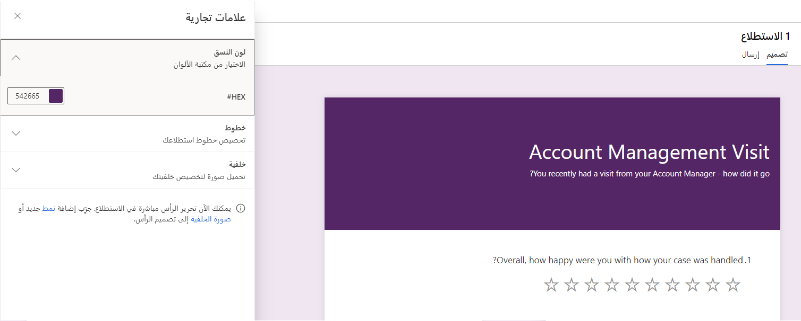
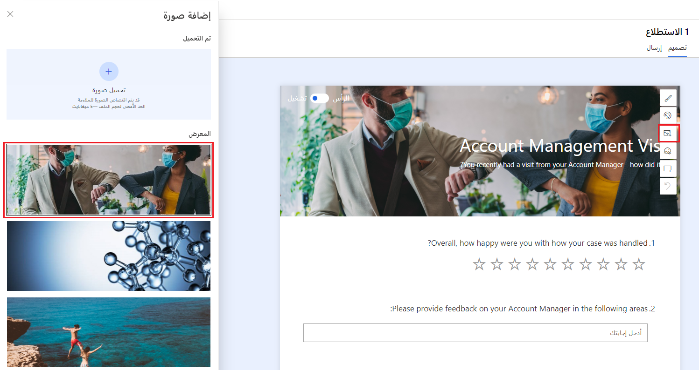

تمتلك كل مؤسسة مجموعة تضم العلامة التجارية وإرشادات التنسيق الخاصة بها. في العادة، يتوفر في الشركة قسم تسويق مسؤول عن تحديد الخطوط والشعارات ونظام الألوان التي سيتم استخدامها لكل صنف اتصال بين الشركة وعملاءها. يشكل الاتساق عنصرًا أساسيًا عند تقديم أي نوع من المحتوى إلى العالم الخارجي، ما يؤكد وضوح مصدر أي ضمانات ويوفر إمكانية التعرف على العلامة التجارية في كل مرة.  

مع Dynamics 365 Customer Voice، توجد عدة طرق يمكن من خلالها تخصيص استطلاع ليتضمن مجموعة من إرشادات العلامة التجارية. ويمكن تنفيذ ذلك باستخدام العناصر الآتية: 

-   صورة خلفية الاستطلاع 

-   لون الاستطلاع

-   رأس استطلاع مخصص

-   نمط الخط ولونه وحجمه 

-   رسالة شكر ونص تذييل مخصصين 

> [!div class="mx-imgBorder"]
> 

## إعداد العلامات التجارية

تعد أسرع طريقة لتحويل استطلاع وإضافة بعض العلامات التجارية هي ضبط العلامات التجارية من قائمة **تخصيص**. الخيار الأول هو تعيين لون النسق. هناك 16 لونًا قياسيًا متاحًا للاختيار منها، لكن قد يكون لون النسق أكثر تحديدًا ويتم اختياره باستخدام ما يعرف بعدد سداسي عشري. يحدد هذا العدد السداسي العشري لونًا معينًا وعادةً ما يكون شيئًا يمكن أن يوفره قسم التسويق في المؤسسة. يتم استخدام اللون بدرجة أفتح قليلاً في خلفية الاستطلاع وفي رأس الاستطلاع كمطابقة العدد السداسي العشري التامة. 

يمكن تعيين الخطوط بشكلٍ عام من قائمة العلامات التجارية عن طريق التحديد من قائمة الخطوط المحددة مسبقًا لرأس الاستطلاع ونصه. وهذا يعني أنه من خلال الإعداد في مكان واحد، سيؤدي ذلك إلى تصفية الاستطلاع بأكمله. إذا كان يلزم تعديل حجم الخط في أسئلة معينة، فيمكن تمييز النص وسيظهر عنصر تحكم صغير مع أدوات لتغيير الحجم واللون واستخدام خط غامق أو مائل أو وضع شُرط سُفلية.

يمكن أيضًا تحميل صورة من قائمة العلامات التجارية ليتم استخدامها كخلفية للاستطلاع. قد يؤدي تحميل صورة إلى تغيير لون العلامة التجارية المحدد سابقًا وضبطه على لون مكمل آخر. يمكن ضبط اللون مرة أخرى عند الاقتضاء. من الجيد أن نفهم أنه رغم عرض الصورة من سطح المكتب، إلا أنها لن تظهر عند المراجعة على جهاز محمول. 

## رأس استطلاع مخصص

يعرف القسم العلوي من الاستطلاع بالرأس. يؤدي المرور بالماوس فوق هذا القسم (دون النقر فوقه) إلى عرض عناصر التحكم. يوفر هذا القدرة على ضبط الرأس وبدلاً من مجرد استخدام لون النسق، يستطيع منشئو الاستطلاع استخدام شعارات المؤسسة وصورها حسب الرغبة لتوفير تجربة مخصصة تتوافق مع إرشادات العلامة التجارية.  

> [!div class="mx-imgBorder"]
> 

تكون عناصر تحكم القائمة التي يتم عرضها كما يأتي:

-   **نمط** - تحديد هذا الخيار يفتح لوحة جانبية توفر خيارات النمط. ويتراوح ذلك من "احترافي" أو "مألوف" إلى "مَرِح" أو "مُريح". يمكن للمستخدمين تحديد النمط الأكثر ملائمة للغرض من الاستطلاع والجمهور المستهدف.

-   **لون النسق** - يُظهر هذا الخيار نفس لوحة الألوان والخيارات المتوفرة عند الوصول من لون النسق في منطقة العلامة التجارية.

-   **صورة** - يمكن لمنشئ الاستطلاع الاختيار من بين سلسلة من الصور المتوفرة أو تحميل الصور الخاصة ليتم استخدامها في رأس الاستطلاع. 

-   **نقطة بؤرية** - إذا تم تحميل الصورة، فإن خيار النقطة البؤرية يوفر القدرة على سحب الصورة لتعيينها في أفضل مكان لضمان رؤية أفضل.

-   **شعار** - يؤدي تحديد هذا الخيار إلى فتح "مستكشف الملفات" في محطة عمل منشئ الاستطلاع، ما يوفر القدرة على التصفح والعثور على ملف شعار لمؤسسته. وبمجرد إضافته، يؤدي التمرير بالماوس فوق الشعار إلى إظهار قائمة إضافية لتحديد موضع الشعار داخل رأس الاستطلاع.

-   **تراجع** - يوفر هذا الخيار طريقة سريعة للتراجع عن التغييرات الأخيرة التي تم إجراؤها.

وفي النهاية، يمكن تشغيل الرأس بأكمله أو إيقاف تشغيله عن طريق النقر فوق تشغيل/إيقاف تشغيل الرأس من أعلى اليمين في أثناء التمرير بالماوس فوق رأس الصفحة. قد يكون إيقاف تشغيله مفيدًا إذا كان يجب استخدام الاستطلاع لتضمينه في موقع ويب. ومع إزالة الرأس، فإنه يتناسب تمامًا كما لو كان جزءًا من موقع الويب، لذا قد يكون من المفيد استخدام هذا الخيار في بعض الحالات التي تقتضي فيها المتطلبات تنفيذ ذلك. 

## رسالة شكر ونص تذييل مخصصين 

بشكلٍ افتراضي، عندما يقوم المستجيب بإرسال إجابته عن أحد الاستطلاعات، سيتم عرض رسالة شكر مفادها، *نشكرك على مشاركة تعليقاتك*. يمكن تعديل هذا النص وضبطه لإظهار شيء مختلف ويتضمن الارتباطات التشعبية وعرض الخط المعدل باستخدام الطرق الموضحة في القسم أعلاه. يمكن إضافة رسائل شكر متعددة ومن ثمَّ يمكن استخدام المنطق لتحديد وقت عرض الرسالة. على سبيل المثال، إذا كانت ستتم الإجابة عن سؤال معين بواسطة بعض الأشخاص فقط بناءً على قواعد التفريع، فيمكن عرض رسالة الشكر للأشخاص الذين يجيبون عن هذا السؤال فقط. يمكن أيضًا عرض رسائل الشكر استنادًا إلى المتغيرات التي تم استخدامها داخل الاستطلاع. إذا كان المتغير يحتوي على "يساوي" أو "لا يساوي"، فيمكن عرض الرسالة. وهذا ما يوفر قدرًا أكبر من المرونة لإعداد استطلاعات شخصية ومخصصة قدر الإمكان.  

ويمكن كذلك تغيير نص التذييل إذا لزم الأمر. وبشكلٍ افتراضي، يقوم بعرض *سيتم إرسال التعليقات التي ترسلها إلى منشئ هذا الاستطلاع*. قم بتحديث هذا النص لعرض معلومات حول المؤسسة، بما في ذلك الارتباط التشعبي وصولاً إلى الشروط والأحكام أو أي نوع من بيانات الخصوصية أو السياسة عبر الإنترنت.  

شاهد الفيديو التالي لمعرفة المزيد والاطلاع على عرض توضيحي لرؤوس الاستطلاعات وتذييلاتها.

> [!VIDEO https://www.microsoft.com/videoplayer/embed/RWRAEf]
