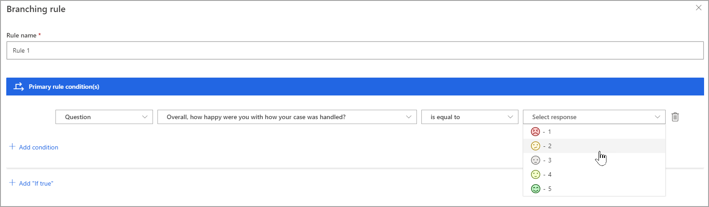
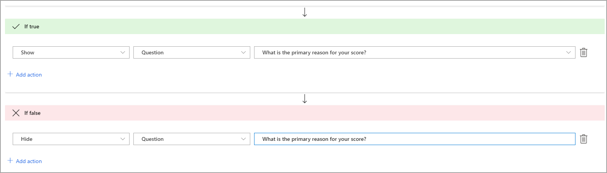

يمكن إنشاء استطلاع في Dynamics 365 Customer Voice بغرض الإجابة عن جميع الأسئلة بواسطة مستجيب. قد يكون هذا الأسلوب مقبولاً للعديد من الاستطلاعات لإحدى المؤسسات، لكن قد تتطلب بعض الحالات توجيه المستجيب في اتجاه معيّن. باستخدام قاعدة واحدة أو أكثر من قواعد التفرع، يمكن تخصيص سير الاستطلاع لتوجيه الفرد إلى أسئلة معيّنة، أو إخفاء سؤال، أو حتى إعادة توجيه الشخص إلى نهاية الاستطلاع مباشرةً، استناداً إلى ردوده على الأسئلة السابقة. تتم إضافة قواعد التفرع إلى أي استطلاع من قائمة **تخصيصات التصميم**.

الخطوة الأولى هي إدخال اسم لقاعدة التفرع. استخدم اسماً منطقياً يكون مفهوماً لأي شخص قد يحتاج إلى التعاون في العمل على الاستطلاع. تأكّد من أن الاسم ليس مبهماً؛ واستخدم كلمات أساسية واضحة وموجزة ووصفية. بعد ذلك، سوف تعرّف الشروط. ويبدأ الشرط بمتغيّر في الاستطلاع أو أحد الأسئلة من الاستطلاع، ويتبعه بعد ذلك عامل تشغيل ثم رد. على سبيل المثال، إذا كان السؤال الأول هو سؤال للتقييم يستخدم وجوهاً ضاحكة للرد، يمكنك تعيين شرط له يتم تشغيله إذا كان الرد أقل من اثنَين. يمكن إضافة شروط متعددة إلى إحدى القواعد إذا لزم الأمر. لإضافة شروط أخرى إلى القاعدة، يمكنك تعيين المنطق على أحد خيارَين: **AND** أو **OR**.

> [!div class="mx-imgBorder"]
> 

عند متابعة إنشاء قاعدة التفرع، يمكن تحديد إجراء إذا تم استيفاء الشرط، أو كان صحيحاً، ويمكن تحديد إجراء إذا لم يتم استيفاء الشرط أو لم يكن صحيحاً. يُعد الإجراء اختيارياً إذا لم يكن الشرط صحيحاً، لكن إذا كان صحيحاً يجب إضافته لإنشاء قاعدة التفرع. يحتوي الإجراء على الإجراء نفسه، وهدف، وقيمة. على سبيل المثال، يمكن أن يكون الإجراء عرض عنصر، ويمكن أن يكون الهدف سؤالاً، وأن تكون القيمة سؤالاً معيّناً. في الشرط السابق، يمكن أن تستخدم إجراء لعرض سؤال مخفي يسأل عن سبب انخفاض التقييم.

> [!div class="mx-imgBorder"]
> 

يعرض الشكل التالي خيارات أخرى لإجراءات قاعدة التفرع.

|     النوع      |     التفاصيل           |     الاستخدام                                                                                                                                                                                                        |
|---------------|-----------------------|------------------------------------------------------------------------------------------------------------------------------------------------------------------------------------------------------------------|
|     الإجراء    |     عرض              |     يُستخدم فقط مع سؤال                                                                                                                                                                                    |
|     الإجراء    |     إخفاء              |     يُستخدم فقط مع سؤال                                                                                                                                                                                    |
|     الإجراء    |     الانتقال إلى       |     يُستخدم مع خيارات متعددة للهدف                                                                                                                                                                            |
|     الهدف    |     السؤال          |     يمكن عرضه أو إخفاؤه أو استخدامه للانتقال إلى سؤال معيّن استناداً إلى رد تم إدخاله لسؤال محدد في الشرط.                                                                 |
|     الهدف    |     إنهاء الاستطلاع     |     ينقل المستجيب إلى نهاية الاستطلاع مباشرةً، ويخفي جميع الأسئلة الأخرى، استناداً إلى الرد الذي تم إدخاله لسؤال محدد في الشرط.                                                   |
|     الهدف    |     استطلاع متسلسل    |     عند تحديد هذا الخيار، سيتم عرض جميع الاستطلاعات الأخرى في بيئة معيّنة كقائمة من القيم. يمكن توجيه المستجيب إلى الاستطلاع المتسلسل عند إرسال الاستطلاع الذي يحتوي على قاعدة التفرع.    |
|     الهدف    |     عنوان URL               |     يمكن إدخال عنوان URL لاستخدامه كإعادة توجيه عند إكمال الاستطلاع. سيتم نقل المستجيب بعد ذلك إلى عنوان URL بعد تحديد الزر **إرسال** في الاستطلاع الذي يحتوي على قاعدة التفرع.     |

تتوفّر الخيارات نفسها لإجراءَي "صحيح" و"خطأ". إذا تم استخدام قاعدة لعرض سؤال، من أفضل الممارسات أن يكون السؤال مخفياً بشكل افتراضي ثم استخدام قاعدة تفرع من أجل **إظهار** السؤال في حالة استيفاء الشرط و **إخفاء** السؤال في حالة عدم استيفاء الشرط. على الرغم من أنه قد يتم إخفاء السؤال افتراضياً، إذا قام المستجيب بتغيير إجابته خلال عملية إكمال الاستطلاع بدون أن يكون شرط الإجراء خطأ، لن يكون السؤال مخفياً بعد ذلك. بعد إضافة قاعدة التفرع، تصبح نشطة على الفور. قم بمعاينة الاستطلاع للتفاعل معه والتأكد من عمل قاعدة التفرع بالشكل المطلوب. قد يتم إدخال عدد كبير جداً من قواعد التفرع أو القواعد التي يمكن أن تتعارض معاً، لذا نوصي بالتفكير في القواعد وتخطيطها بعناية. من خلال تنفيذ القواعد، يمكن أن يصبح الاستطلاع أكثر ديناميكية بتدفق واضح للحصول على أكثر البيانات قيمة من أي مستجيبين يكملونه.
