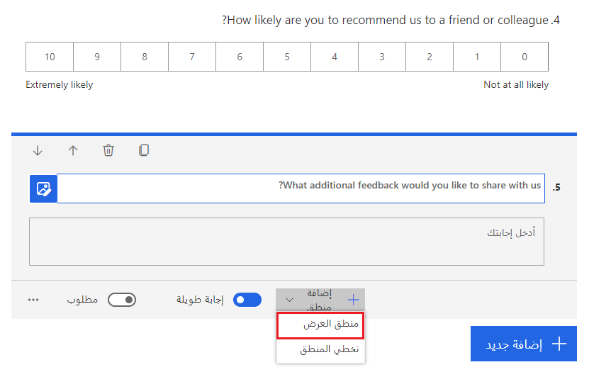
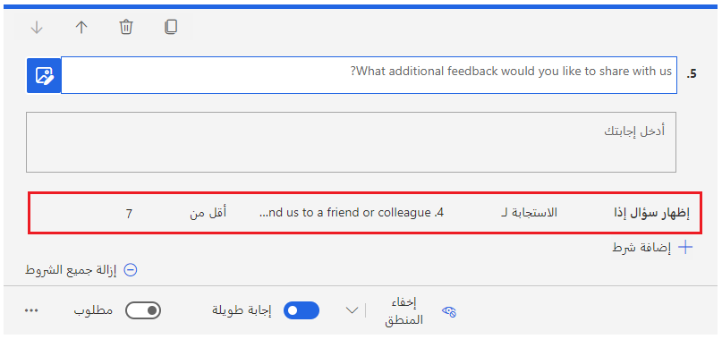
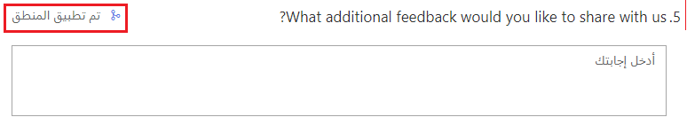
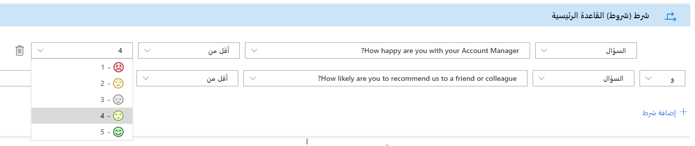
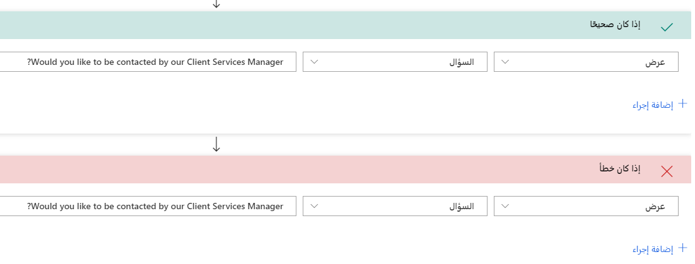

عند التفكير في الأسئلة المراد إضافتها إلى استطلاع، قد يكون هناك بعض الأسئلة التي يجب طرحها فقط بناءً على الردود المقدمة في استطلاع آخر. على سبيل المثال، يمكن أن تراقب المؤسسة Net Promoter Score الخاصة بها وتسأل عن مدى احتمالية أن يوصي العميل بها لصديق أو زميل. إذا كانت الإجابة المقدمة أقل من 7، ما يعني أنهم منتقدون، فربما يكون السؤال التالي المعقول هو السؤال عما إذا كانوا يرغبون في تقديم أي تعليقات أخرى. يمكن تحقيق ذلك عن طريق إضافة منطق العرض مباشرة إلى سؤال المتابعة. 

> [!div class="mx-imgBorder"]
> 

يمكن استخدام منطق العرض لإظهار السؤال إذا كانت الإجابة عن سؤال Net Promoter Score أعلاه أقل من 7. يمكن تحقيق ذلك أيضًا باستخدام منطق التخطي والانتقال إلى سؤال آخر، أو إلى نهاية الاستطلاع إذا كانت الإجابة أكبر من 6. سيؤدي كلا الأسلوبين إلى توفير النتيجة نفسها. يمكن إضافة شروط متعددة إلى السؤال، ويمكن تضمين كل من منطق التخطي والعرض. يجب التفكير في المنطق البسيط، وإذا تمت إضافة قواعد منطقية متعددة، فيجب التخطيط لها حتى لا تتعارض مع بعضها. 

> [!div class="mx-imgBorder"]
> 

وبمجرد إضافة الشروط، سيكون للسؤال مؤشرًا يوضح أنه تم تطبيق المنطق عليه. إن القدرة على التحكم في المسار الذي يسلكه الأشخاص خلال الاستطلاع عن طريق إضافة منطق بسيط يعد أمرًا سريعًا وبسيطًا، وغالبًا ما يكون هو الأسلوب الوحيد المطلوب. إذا كانت هناك حاجة إلى منطق إضافي لإنشاء روابط بين الاستطلاعات المختلفة والتحكم في أسئلة متعددة من قاعدة واحدة، فيلزم توفير منطق متقدم. 

> [!div class="mx-imgBorder"]
> 

انتقل إلى قائمة "تخصيص"، حيث يمكن تحديد المنطق المتقدم. إذا تم تطبيق أي منطق بسيط بالفعل، فسيتم استيراده في منطقة المنطق المتقدم وسيتم تضمينه في هذه المنطقة. وتمت إضافة أي تغييرات مستقبلية على المنطق في الأصل لأن المنطق البسيط يجب أن يتم من هذه المنطقة للمتابعة. لإنشاء منطق متقدم، يجب تسمية القاعدة أولاً. استخدم اسمًا منطقيًا يكون مفهومًا لأي شخص قد يحتاج إلى التعاون في العمل على الاستطلاع. وتأكّد من أن الاسم ليس مبهمًا؛ واستخدم كلمات أساسية واضحة وموجزة ووصفية. ويُتبع ذلك بالشروط التي يجب تحديدها. ويبدأ الشرط بأحد الأسئلة من الاستطلاع، ويتبعه بعد ذلك عامل تشغيل ثم رد. على سبيل المثال، إذا كان السؤال الأول هو سؤال للتقييم يستخدم وجوهًا ضاحكة للرد، فيمكنك تعيين شرط له يتم تشغيله إذا كان الرد أقل من أربعة. يمكن إضافة شروط متعددة إلى القاعدة إذا لزم الأمر. ولإضافة شروط أخرى إلى القاعدة، يمكنك تعيين المنطق على أحد خيارَين: AND أو OR.  

> [!div class="mx-imgBorder"]
> 

عند متابعة إنشاء قاعدة، يمكن أن يكون هناك إجراء يتم تحديده إذا كان الشرط صحيحًا، ويتم تحديد الإجراء إذا كان الشرط خاطئًا. يُعد الإجراء اختياريًا إذا لم يكن الشرط صحيحاً، لكن إذا كان صحيحًا يجب إضافته لإنشاء قاعدة التفرع. ويحتوي الإجراء على الإجراء نفسه، وهدف، وقيمة. على سبيل المثال، يمكن أن يكون الإجراء عرض عنصر، ويمكن أن يكون الهدف سؤالاً، وأن تكون القيمة سؤالاً معيّناً. وفي الشرط السابق، يمكن أن تستخدم إجراء لعرض سؤال مخفي يسأل عن سبب انخفاض التقييم.  

> [!div class="mx-imgBorder"]
> 

وتتكون الخيارات الأخرى لإجراءات قاعدة التفرع من: 

|     النوع       |     التفاصيل            |     الاستخدام                                                                                                                                                                                                           |
|----------------|------------------------|---------------------------------------------------------------------------------------------------------------------------------------------------------------------------------------------------------------------|
|     الإجراء     |     عرض               |     يُستخدم فقط مع سؤال                                                                                                                                                                                       |
|     الإجراء     |     إخفاء               |     يُستخدم فقط مع سؤال                                                                                                                                                                                       |
|     الإجراء     |     الانتقال إلى        |     يُستخدم مع خيارات متعددة للهدف                                                                                                                                                                               |
|     الهدف     |     السؤال           |     ويمكن عرضه أو إخفاؤه أو استخدامه للانتقال إلى سؤال معيّن استناداً إلى رد تم إدخاله لسؤال محدد في الشرط.                                                                    |
|     الهدف     |     القسم            |     ويمكن عرضه أو إخفاؤه أو استخدامه للانتقال إلى قسم معيّن استنادًا إلى رد تم إدخاله لسؤال محدد في الشرط.                                                                     |
|     الهدف     |     إنهاء الاستطلاع      |     ينقل المشارك إلى نهاية الاستطلاع مباشرةً، ويخفي جميع الأسئلة الأخرى، استنادًا إلى الرد الذي تم إدخاله لسؤال محدد في الشرط.                                                      |
|     الهدف     |     استطلاع متسلسل     |     عند تحديد هذا الخيار، سيتم عرض جميع الاستطلاعات الأخرى في بيئة معيّنة في صورة قائمة من القيم. يمكن توجيه المشارك إلى الاستطلاع المتسلسل عند إرسال الاستطلاع الذي يحتوي على قاعدة التفرع.     |
|     الهدف     |     عنوان URL                |     ويمكن إدخال عنوان URL لاستخدامه كإعادة توجيه عند إكمال الاستطلاع. وبعد ذلك، سيتم نقل المشارك إلى عنوان URL بمجرد تحديد زر "إرسال" في الاستطلاع الذي يحتوي على قاعدة التفرع.          |

تتوفّر الخيارات نفسها للإجراءين "صحيح" و"خطأ". إذا تم استخدام قاعدة لعرض سؤال، فمن أفضل الممارسات أن يكون السؤال مخفيًا بشكل افتراضي، ثم استخدام قاعدة تفرع من أجل إظهار السؤال في حالة استيفاء الشرط وإخفاء السؤال في حالة عدم استيفاء الشرط. ورغم أنه قد يتم إخفاء السؤال افتراضياً، إذا قام المستجيب بتغيير إجابته خلال عملية إكمال الاستطلاع بدون أن يكون شرط الإجراء خطأ، لن يكون السؤال مخفيًا بعد ذلك. وقم بمعاينة الاستطلاع للتفاعل معه والتأكد من عمل قاعدة التفرع بالشكل المطلوب. من خلال تنفيذ القواعد، يمكن أن يصبح الاستطلاع أكثر ديناميكية بتدفقٍ واضح للحصول على أكثر البيانات قيمة من أي مشاركين يكملونه.
