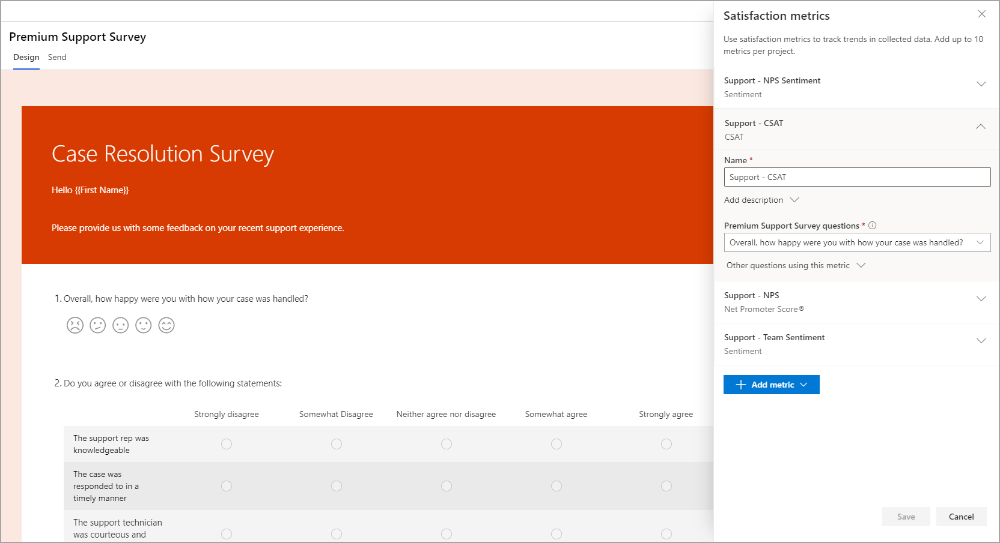
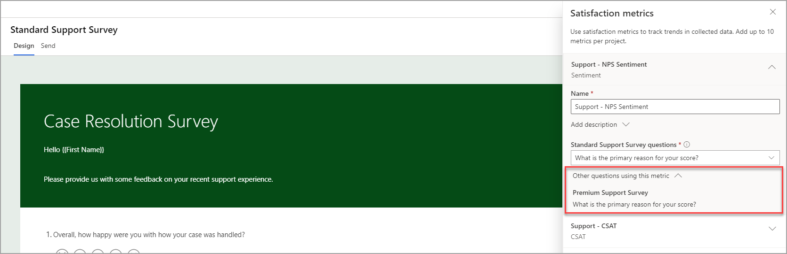

عند إنشاء مشروع جديد، تتم إضافة العديد من الأصناف إلى قسم **التقارير** تلقائياً. يتم إنشاء التقرير الذي يحتوي على استجابات الاستبيان لكل استبيان موجود داخل المشروع. يتم أيضًا إنشاء تقرير **مقاييس الرضا**. لن يتم عرض أي شيء في هذا التقرير حتى تتم إضافة مقاييس الرضا.

توجد مقاييس الرضا على ثلاثة مستويات مختلفة:

- **استجابة الاستبيان** - تحتوي كل استجابة استبيان فردية على مقاييس الرضا لهذا المستجيب المحدد.

- **الاستبيان** - تمت إضافة مقاييس الرضا إلى كل استبيان، ويمكنك مراجعة هذه المقاييس الإجمالية من تقرير **مقاييس الرضا** عن طريق إضافة عامل تصفية كاتب من استبيان إلى آخر.

- **المشروع** - سيعرض التقرير الافتراضي **مقاييس الرضا** نتائج جميع استجابات الاستبيان لجميع الاستبيانات الموجودة داخل المشروع.

## أنواع مقاييس الرضا.

يمكن إضافة ما يصل إلى 10 مقاييس إلى المشروع، مما يمنح المؤسسة القدرة على تعقب مستويات الرضا بعدة طرق.
يمكن تطبيق ثلاثة أنواع من المقاييس على أسئلة مختلفة، كما هو موضح في الشكل التالي.

|     نوع المقياس    |     التفاصيل                                                                                                                                                                                                                                                                                           |
|--------------------|-------------------------------------------------------------------------------------------------------------------------------------------------------------------------------------------------------------------------------------------------------------------------------------------------------|
|     Net Promoter Score (NPS)            |     يمكن إضافة سؤال صافي درجة المروج إلى الاستبيان لتعقب مستوى الرضا العام لأحد المستجيبين باستخدام مقياس من صفر إلى 10. يُعرف الشخص الذي يستجيب بالرقم 0 إلى 6 باسم "المنتقد"، أما الشخص الذي يستجيب بالرقم 7 أو 8 يُعرب باسم "السلبي"، بينما المستجيب بالرقم 9 أو 10 يُعرف باسم "المروج".     |
|     التوجه      |     يتم حساب التوجه استنادًا إلى توجه الاستجابة التي يتم توفيرها لسؤال يستند إلى نص. يستند هذا المقياس إلى تحليل الكلمات المستخدمة وينتهي بنتيجة قد تكون إما "إيجابية" أو "سلبية" أو "محايدة".                                                                                    |
|     رضا العميل (CSAT)‬‬‬‬           |     يمثل رضا العميل (CSAT) مؤشرًا على مدى رضا العميل عن الاستجابة لسؤال التصنيف. يمكن أن يشير هذا المقياس إلى مدى رضا العميل عن منتج أو خدمة أو تجربة.                                                           |

يمكن الوصول إلى مقاييس الرضا وتحريرها من قائمة "التخصيص" في الاستبيان. في حالة استخدام مشروع تم إنشاؤه من أحد القوالب، فقد يتضمن ذلك مقياسًا واحدًا أو أكثر للرضا تم تعيينه بالفعل لرد على الأسئلة. يمكن لواضع الاستبيان تعيين مقياس ما لسؤال، مع التأكد من اتباع توافق السؤال لكل نوع مقياس كما هو الحال في الجدول الموجود أعلاه. يمكن تحديث مقاييس الرضا وإعادة تعيينها بعد أن يتم تجميع استجابات الاستبيان، ولكن سيتم حسابها فقط للاستجابات الجديدة التي تمضي قدمًا، ولن يتم تطبيقها بأثر رجعي على أي من الاستجابات السابقة.

يمكن تغيير اسم كل مقياس لتوضيح ما يتعقبه المقياس. ويعتبر هذا الأمر مهمًا بالنسبة للمشاريع التي لها مقاييس متعددة من نفس النوع. لإضافة المزيد من الشرح، يمكن أيضًا إضافة وصف لكل مقياس.

إذا كنت تنسخ استبيانًا، فسيتم نسخ مقاييس الرضا إلى جانب جميع الأسئلة والعلامات التجارية والمتغيرات وقواعد التفريع. ومع ذلك، يتعين عليك مراجعة المقاييس الموجودة في الاستبيان الجديد الذي يتم إنشاؤه إلى جانب تحديد الأسئلة الصحيحة لاستخدامها. ستكون أسماء المقاييس مماثلة لما يظهر في الاستبيان الأصلي، كما هو الحال بالنسبة للمشروع عمومًا. سيؤدي تغيير الأسماء في الاستبيان الجديد إلى تغيير أسماء جميع الاستبيانات التي تستخدمها. من الممكن أيضًا الاطلاع على الأسئلة الأخرى التي تستخدم نفس المقياس الذي يتم سحبه من الاستبيانات الأخرى.

عند تلقي استجابات الاستبيان، يمكن مراجعة مقاييس الرضا من منطقة **التقارير** الموجودة في المشروع. يتم عرض كل الاستبيانات افتراضيًا، ولكن يمكنك تصفية طريقة العرض هذه من خلال التبديل من استبيان إلى آخر في القائمة المنسدلة. سيتم أيضًا عرض مقاييس الرضا على لوحة معلومات الصفحة الرئيسية في Dynamics 365 Customer Voice. يتم تخزين مقاييس الرضا لاستجابة محددة في القيمة **مقياس الرضا** داخل بيئة Microsoft Dataverse المرتبطة. يتم تخزين البيانات بصيغة JSON، حيث يمكن الوصول إليها بعد ذلك باستخدام Power Automate، مع القيم المستخدمة لإنشاء الإجراءات حسب الحاجة. ستتم مناقشة استخدام Power Automate بالتفصيل في وحدة نمطية أخرى لمسار التعليم هذا.

