في هذا التمرين، ستعتمد على الممارسة في التعامل مع وحدة مشروعات Dynamics 365 Customer Voice وإضافة استبيان جديد إلى المشروع. ستقوم بإنشاء استبيان سيتم إرساله إلى العملاء بعد حل الحالة.

> [!NOTE]
> يُمكنك إكمال هذا التمرين باستخدام Dynamics 365 Sales الممكّن في بيئتك أو دونه. ومع ذلك، إذا كنت ترغب في استكمال التمرين في الوحدة النمطية التالية، فسيلزمك استكمال هذه الخطوات في بيئة تم تمكين Dynamics 365 Sales بها.

## المهمة 1: إنشاء استبيان جديد

لإنشاء استبيان جديد، اتبع الخطوات التالية:

1.  انتقل إلى [Dynamics 365 Customer Voice](https://customervoice.microsoft.com) وسجّل الدخول باستخدام بيانات الاعتماد الخاصة بك.

2.  حدد **جميع المشروعات** من قائمة التنقل.

    

3.  من قائمة المشروعات، حدد المشروع من القائمة التي قمت بإنشائها في التعامل مع وحدة مشروعات Dynamics 365 Customer Voice في هذا المسار التعليمي.

    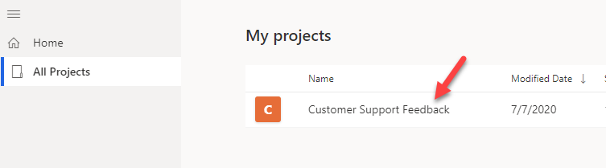

4.  سيتم فتح المشروع، وسيتم عرض الاستبيان الافتراضي الموجود لهذا المشروع. حدد **استبيان جديد**.

    

5.  بعد إنشاء الاستبيان، حدد علامة الحذف (**...**) المجاورة للاستبيان الجديد ثم حدد **إعادة تسمية**.

    

6.  أدخِل **استبيان الدعم المتميز** على أنه الاسم الجديد، ثم حدد **إعادة تسمية**.

    

7.  حدد العنوان **استطلاع جديد**.

    

8.  أدخل **استبيان دقة الحالة** على أنه **العنوان**.

9.  حدد **+ إضافة جديد**.

    

10. حدد زر **المزيد**.

    

11. من المفترض أن تشاهد جميع أنواع أسئلة الاستبيان المتوفرة لك.
    حدد **تقييم**.

    

12. أدخل **بشكل عام، ما مدى رضاك عن الطريقة التي تمت بها معالجة حالتك؟** للسؤال، ثم حدد **ابتسامة** لـ **الرمز**.

    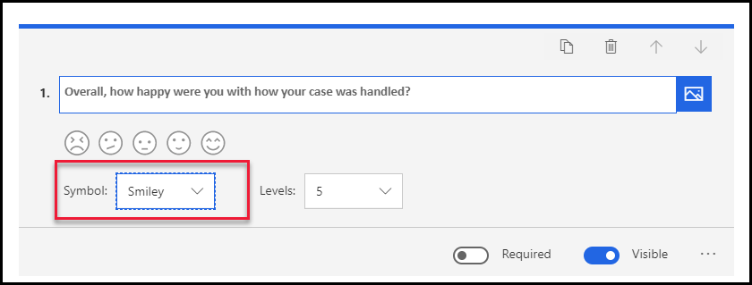

13. حدد **+ إضافة جديد** مرة أخرى.

14. حدد الزر **المزيد** ثم حدد **مقياس Likert**.

    

15. أدخل **هل تتفق مع العبارات الآتية أم لا تتفق معها:** للسؤال، ثم قم بتغيير **الخيار 1** إلى **لا أوافق بشدة**.

    

16. استبدل **الخيار 2** بـ **لا أوافق إلى حد ما**، و **الخيار 3** بـ **لا أوافق ولا أعترض**، و **الخيار 4** بـ **أوافق إلى حد ما**، و **الخيار 5** بـ **أوافق بشدة**. من المفترض أن تبدو خياراتك الآن مثل الصورة الآتية.

    

17. حدد **العبارة 1** وأدخل **كان مندوب الدعم على دراية**.

18. حدد **العبارة 2** وأدخل **تمت الاستجابة للحالة في الوقت المناسب**.

19. حدد **+ إضافة عبارة**.

    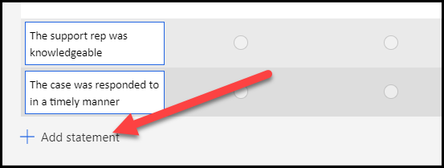

20. أدخل **كان فني الدعم مهذبًا ومساعدًا**.

21. حدد **+ إضافة عبارة**.

22. أدخل **لم أكن مضطرًا إلى الانتظار أكثر من 5 دقائق لتلقي مكالمات الاستجابة**.

23. حدد **+ إضافة عبارة** مرة أخرى.

24. أدخل **تتميز شركة Contoso Inc. بخدمة عملاء ممتازة**. من المفترض أن تبدو عباراتك الآن مثل الصورة الآتية.

    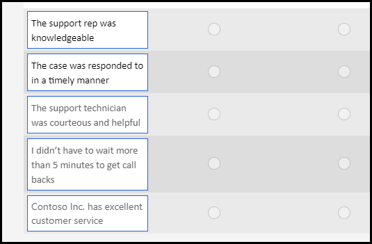

25. حدد **+ إضافة جديد**.

26. حدد **نص**.

27. أدخل **الرجاء إخبارنا عن تجربتك مع فريق الدعم لدينا** للسؤال، وحدد **إجابة مطولة**.

    

28. حدد **+ إضافة جديد** مرة أخرى.

29. حدد الزر **المزيد** ثم حدد **Net Promoter Score**.

    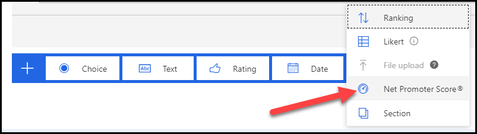

30. أدخل **ما مدى رضاك عن عملية معالجة الحالة التي قمنا بها؟** للسؤال.

31. غيّر أقل تصنيف إلى **غير راضيٍ على الإطلاق** وأعلى تصنيف لـ **راضٍ جدًا**.

    

32. حدد **معاينة**.

    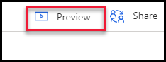

33. راجع الاستبيان الخاص بك ثم حدد الزر **رجوع**. يمكنك الآن إغلاق محرر النماذج.

## تمرين 2: تحرير استبيان موجود

في هذا التمرين، ستقوم بتحسين الاستبيان عن طريق تغيير السمة، وإضافة تشعّب، وتخصيصه.

### المهمة 1: تغيير السمة

في هذه المهمة، ستقوم بتغيير سمة الاستبيان الخاص بك.

1.  إذا لم يعد الاستبيان مفتوحًا لديك، فحدد موقع **مشروع تعليقات دعم العملاء** الذي قمت بإنشائه ثم حدد اسمه.

    

2.  حدد **استبيان الدعم المتميز** من القائمة.

    

3.  حدد **تخصيص** من الجانب الأيمن للاستبيان.

    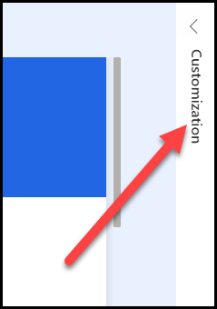

4.  حدد **العلامة التجارية** من قائمة **التخصيص**.

    

5.  حدد **لون النسق**.

    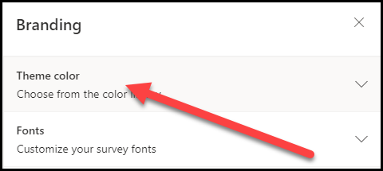

6. حدد اللون **الأزرق** ثم حدد **البرتقالي الداكن**.

    

7.  أغلق جزء العلامة التجارية عن طريق تحديد الرمز **X** في الركن العلوي الأيمن من الجزء.

    من المفترض أن يبدو الاستبيان الخاص بك الآن مثل الصورة الآتية.

    

### المهمة 2: إضافة تشعّب

في هذه المهمة، ستضيف سؤالاً نصيًا جديدًا ثم تضيف تشعّبًا من شأنه إظهار أو إخفاء السؤال النصي بناءً على Net Promoter Score ‏(NPS).

1.  قم بالتمرير لأسفل الشاشة، ثم حدد **+ إضافة جديد**.

2.  حدد **نص**.

3.  أدخل **ما السبب الأساسي لنقاطك؟** ثم أوقف تشغيل التبديل الخاص بالخيار **مرئي**.

    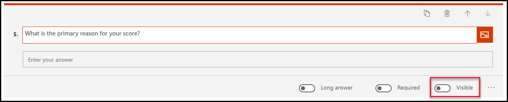

4.  حدد قائمة **التخصيص** من الجانب الأيمن من الاستبيان، ثم حدد **تشعّب** من الخيارات.

    

5.  حدِّد **تخصيص**.

    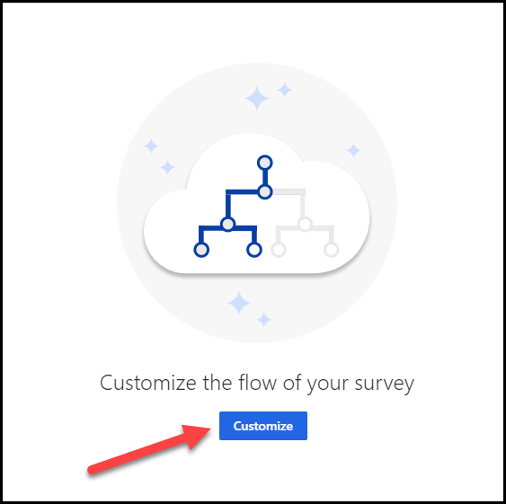

6.  أدخل **إظهار/إخفاء تعليق النقاط** لـ **اسم القاعدة** ثم حدد **إضافة شرط**.

    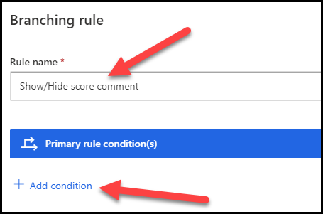

7.  حدد **مدي رضاك عن عملية معالجة الحالة التي قمنا بها؟** للسؤال، ثم حدد **أقل من** للشرط، وادخل **7** للقيمة.

8.  حدد **+ إضافة "إذا كان صحيحًا"**.

    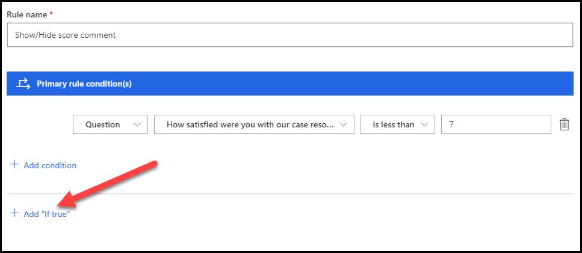

9.  حدد **إضافة إجراء**.

    

10. حدد **عرض** لـ **الإجراء**، و **سؤال** لـ **الهدف**، و **ما السبب الأساسي لنقاطك؟** لـ **القيمة**.

    

11. حدد **+ إضافة "إذا كان خاطئًا"**.

12. حدد **إضافة إجراء**.

    

13. حدد **إخفاء** لـ **الإجراء**، و **سؤال** لـ **الهدف**، و **ما السبب الأساسي لنقاطك؟** لـ **القيمة**.

14. حدد **حفظ**.

    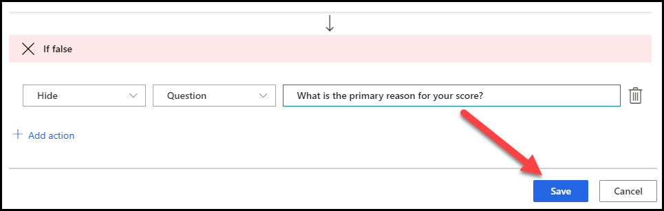

15. حدد **X** في الزاوية العلوية اليمنى لإغلاق شاشة **قواعد التشعّب**.

    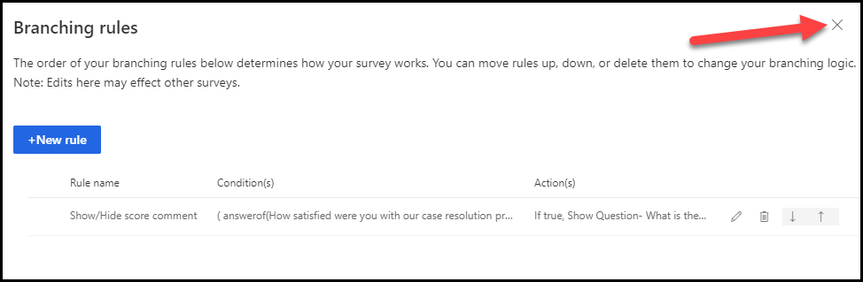

### المهمة 3: تخصيص الاستبيان

في هذه المهمة، سوف تضيف الاسم الأول للمستخدم إلى الاستبيان.

1.  قم بالتمرير إلى أعلى وحدد عنوان الاستبيان.

    

2.  حدد عمود الوصف.

    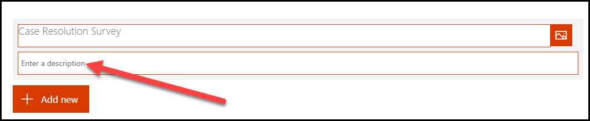

3.  أدخل **مرحبًا**، ثم حدد **المتغيرات**.

    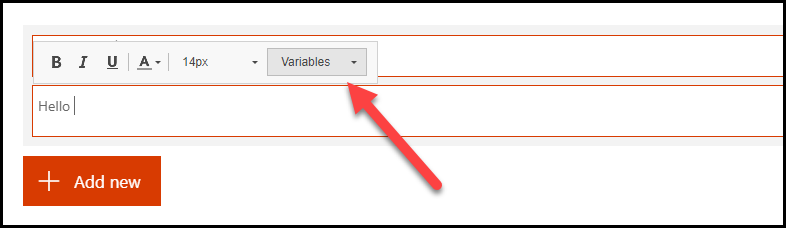

4.  حدد **الاسم الأول**.

    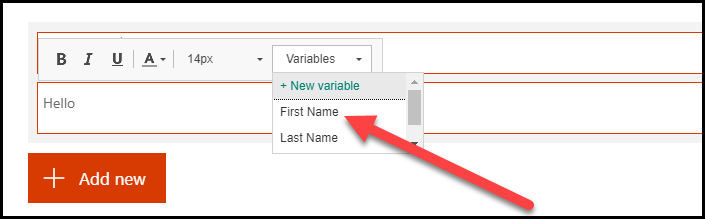

5.  اضغط على مفتاح **الإدخال**، ثم اكتب **يرجى تزويدنا ببعض التعليقات حول تجربة الدعم الأخيرة**.

    من المفترض أن يبدو وصفك الآن مثل الصورة الآتية.

    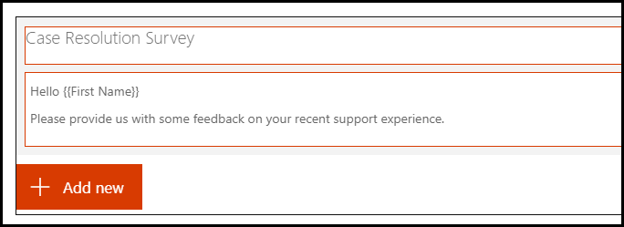

### المهمة 4: اختبار الاستبيان

في هذه المهمة، ستقوم باختبار الاستبيان عن طريق إرساله لنفسك في رسالة بريد إلكتروني.

1.  حدد علامة التبويب **إرسال** من الجانب العلوي للاستبيان.

    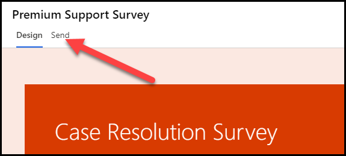

2.  حدد قائمة **التخصيص**، ثم حدد **إعدادات التوزيع**.

    

3.  من شاشة **إعدادات التوزيع**، حدد **إعدادات المستجيب**.

    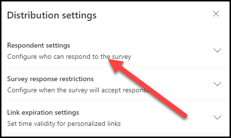

4.  تأكد من إيقاف تشغيل الإعداد **‏‫يمكن فقط للأشخاص في مؤسستي الاستجابة** والإعداد **الاستجابات مجهولة الهوية**.

    

5.  حدد **البريد الإلكتروني** من الخيارات الموجودة في علامة التبويب **إرسال**.

    

6.  قم بتقديم **عنوان البريد الإلكتروني** لمؤسستك إلى **المستلمين**، ثم حدد **إرسال**. لن يكون الاسم الأول واسم العائلة للمستخدم متاحَين للاستبيان الخاص بك إلا إذا كانت واحدة على الأقل من العبارات الآتية صحيحة بالنسبة إلى البريد الإلكتروني الذي قدمته.

    1. إنه جهة اتصال في Outlook.

    1. إنه مرتبط بسجل في بيئة Dynamics لديك.

    1. إنه شخص ما يشكل جزءًا من المؤسسة نفسها.

       

    سيتم إرسال الاستبيان.

    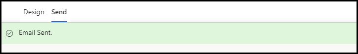

7.  انتقل إلى بريدك الإلكتروني وابحث عن رسالة البريد الإلكتروني الخاصة بالاستبيان وافتحها. راجع البريد غير الهام، إذا لم تجد رسالة البريد الإلكتروني في صندوق الوارد.

8.  حدد **بدء الاستبيان**.

    

    من المفترض أن يتم تحميل الاستبيان، وأن يظهر اسمك في الوصف.

    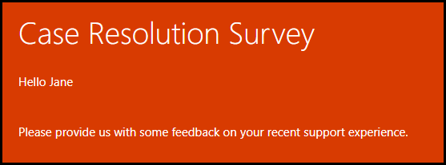

9.  قدم تصنيفًا وأجب عن أسئلة مقياس Likert.

    

10. قدم تعليقًا وحدد **7** تعبيرًا عن الرضا. من المفترض أن يظل السؤال الأخير مخفيًا.

    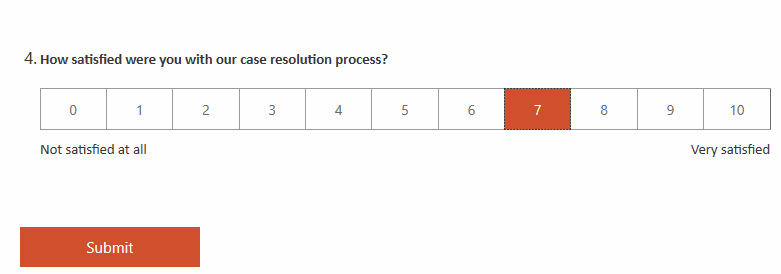

11. غير تصنيف الرضا إلى **6**. من المفترض أن يظهر السؤال الأخير الآن.

    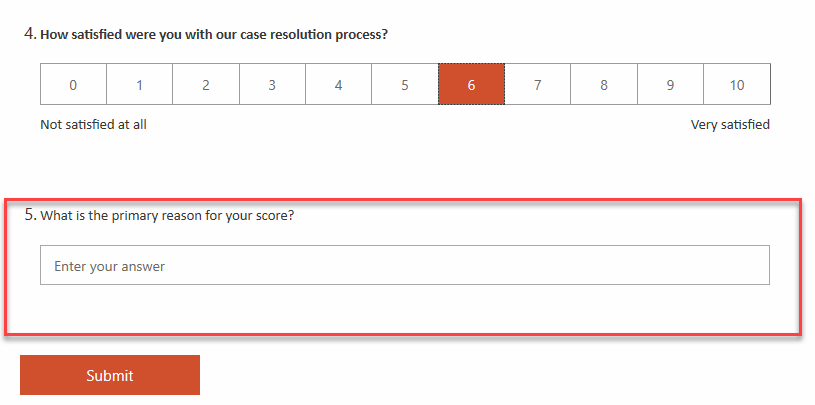

12. غير التصنيف إلى **8**. من المفترض أن يختفي السؤال الأخير مرة أخرى.

13. حدد **إرسال**.

    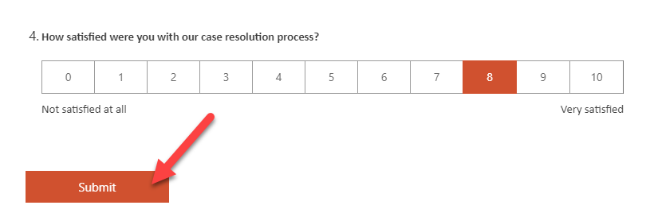

14. انتظر حتى يكتمل إرسال الاستبيان.

    
