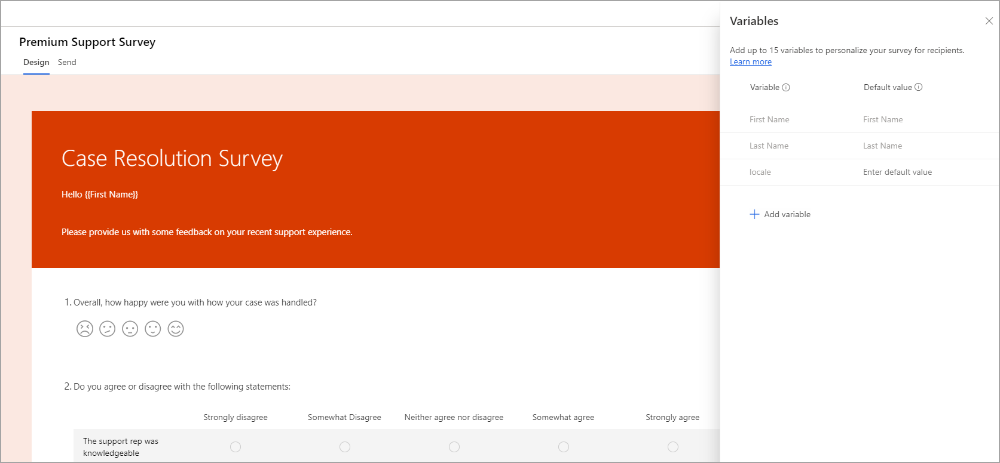
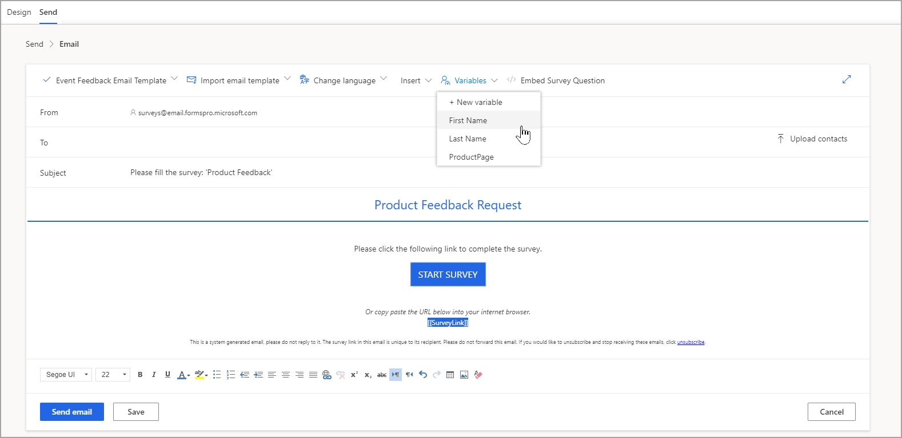

جزء مهم في العلاقة بين أي مؤسسة وعملائها هو خلق تجربة شخصية. تُظهر التجربة الشخصية للعملاء أن احتياجاتهم معترف بها ومفهومة وأن رضاهم عن خدمة أو منتج مهم. يمكن أن يكون جمع الملاحظات باستخدام Dynamics 365 Customer Voice بسيطاً مثل إرسال ارتباط إلى نموذج عام. ومع ذلك، باستخدام المتغيرات، يمكنك توفير إمكانية تحويل تجربة منفصلة إلى لقاء مخصص وفريد تماماً لكل شخص يستجيب لاستطلاعاتك.

تتكون المتغيرات من بيانات فريدة مرتبطة بالمستجيب بطريقة ما. وقد تكون أبسط المتغيرات معلومات مثل الاسم الأول أو الاسم الأخير الخاص بالمستجيب. يمكنك فقط استخدام المتغيرات عندما يتم إرسال استطلاع مباشرة إلى شخص محدد، وليس عند مشاركة رابط على وسائل التواصل الاجتماعي أو على موقع ويب حيث يمكن لأي شخص غير معروف إكمال الاستطلاع.
يتم تمرير المتغيرات التي يتم استخدامها في الاستطلاع إلى دعوة الاستطلاع برابط فريد. وبعد ذلك، تتم إعادتها من خلال استجابة الاستطلاع ذات الصلة وربطها معاً. يمكنك تخزين ما يصل إلى 15 متغيراً في الاستطلاع.

يمكنك استخدام المتغيرات في السيناريوهات التالية:

-   دعوات البريد الإلكتروني داخل قوالب

-   ترجمات الاستبيان

-   أسئلة الاستبيان

-   تضمين الاستبيانات في مواقع ويب

-   المتغيرات المخفية المطلوب استخدامها لإعداد التقارير والتحليل

## إضافة المتغيرات

يمكنك الوصول إلى قسم **المتغيرات** من قائمة **تخصيص** في الجانب الأيمن من الاستطلاع. عند إنشاء استطلاع جديد، تتم إضافة بعض المتغيرات تلقائياً. تتم إضافة متغيرات **First Name** و **Last Name** ولا يمكن حذفها من الاستطلاع. يوجد متغير آخر للإعدادات المحلية للاستطلاع، الذي يمكنك حذفه إذا لم تكن مطلوبة. عند إنشاء استطلاع Dynamics 365 Customer Voice، سيستخدم اللغة الافتراضية للبيئة الخاصة به. ومع ذلك، يمكنك إنشاء إصدارات أخرى من الاستطلاع عن طريق إضافة المزيد من اللغات. يوفر استخدام متغير الإعدادات المحلية طريقة مقترنة بـ Microsoft Power Automate لتعيين لغة الاستبيان الذي تقوم بإرساله إلى مستجيب.

> [!div class="mx-imgBorder"]
> 

يمكنك إضافة المزيد من المتغيرات باستخدام خيار **إضافة متغير**. تأكد من إعطاء المتغير اسماً وقيمة افتراضية. سيكون الاسم مرئياً في أي موضع يمكن إضافة المتغير إليه (قالب بريد إلكتروني، داخل الاستطلاع أو في Power Automate). سيتم استخدام القيمة الافتراضية كبديل إذا كانت البيانات غير موجودة في مصدر البيانات الخاص بك. على سبيل المثال، ضع في اعتبارك سيناريو تستخدم فيه قوائم Microsoft أو بيئة Microsoft Dynamics 365 Customer Service‏ لتخزين معلومات حول الحالات المغلقة أمام عملائك. في هذا الموقف، يمكنك إضافة متغير لعنوان الحالة ورقم الحالة وطريقة للإشارة إلى مصدر الحالة. إذا كان عمود مصدر الحالة فارغاً، فسوف يعني استخدام القيمة الافتراضية **غير معروف** أن أي حالة بها هذه المعلومات مفقودة ستظل لها قيمة مملوءة في الاستطلاع أو قالب البريد الإلكتروني حيث قمت باستخدام متغير مصدر الحالة.

## استخدام المتغيرات

يمكنك استخدام المتغيرات المضافة في أماكن مختلفة لسحب البيانات من مصدر البيانات. إذا كان القصد هو عدم استخدام Power Automate، فإن المتغيرات الوحيدة التي يمكن استخدامها بنجاح هي **الاسم الأول** و **الاسم الأخير**. وستتم مناقشة هذا المفهوم لاحقاً في مسار التعليم الخاص بـ Dynamics 365 Customer Voice، ولكن يجب الحصول على الأعمدة بهدف ملء المتغيرات من مكان ما، ويستطيع Dynamics 365 Customer Voice وحده التعرف على المتغيرين **الاسم الأول** و **الاسم الأخير**. سيؤدي تحديد الوصف الأساسي للاستطلاع إلى عرض قائمة منسدلة بجميع المتغيرات المتوفرة في الاستطلاع. عند تحديد العنوان الرئيسي، ستكون المتغيرات غائبة لأنه لا يمكن استخدامها في تلك المنطقة المحددة من الاستطلاع. يمكنك إضافة المتغيرات إلى الأسئلة في نص السؤال الرئيسي أو في شريط ترجمة السؤال.

لتخصيص قالب بريد إلكتروني، حدد من قائمة المتغيرات. بعد ذلك، يتم تمرير هذه المتغيرات عندما تقوم بإرسال دعوة للاستطلاع عبر البريد الإلكتروني. بينما يمكنك استخدام جميع المتغيرات المتوفرة لديك، ضع المنطق السابق في اعتبارك، في حالة استخدام متغيرات أخرى غير **الاسم الأول** و **الاسم الأخير**، يجب استخدام Power Automate أيضاً. في الصورة التالية، تمت إضافة متغير **الاسم الأول** إلى قالب بريد إلكتروني.
عند تحديد المستلمين، سيتم استخدام الاسم الأول لكل مستلم في مكان **{{First Name}}**. ستتلقى جين دو بريداً إلكترونياً يبدأ بعبارة *مرحباً جين*، بينما سيتلقى جون دو بريداً إلكترونياً يبدأ بعبارة *مرحباً جون*.

> [!div class="mx-imgBorder"]
> 
