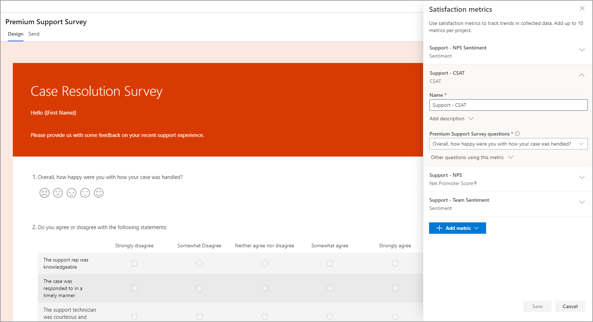
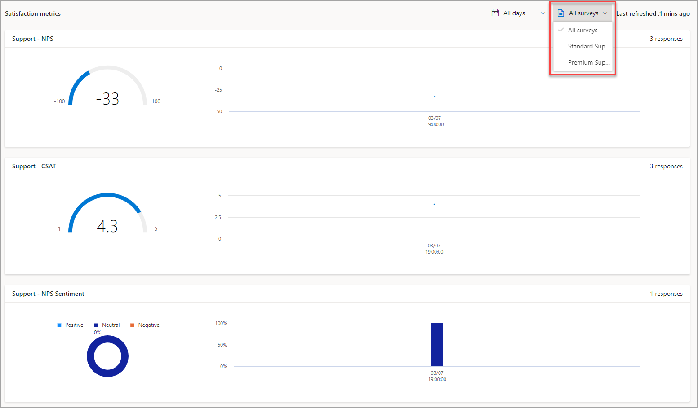

عند إنشاء مشروع جديد، ستتم إضافة عدة عناصر إلى قسم **التقارير** تلقائياً. بعد ذلك، سيتم إنشاء تقرير يحتوي على ردود الاستطلاع لكل استطلاع موجود داخل المشروع. سيتم أيضاً إنشاء تقرير **مقاييس الرضا**.
لن يتم عرض أي شيء في هذا التقرير حتى تتم إضافة مقاييس الرضا.

توجد مقاييس الرضا على ثلاثة مستويات مختلفة:

- **استجابة الاستطلاع** - تحتوي كل استجابة استطلاع فردية على مقاييس الرضا لهذا المستجيب المحدد.

- **الاستطلاع** - يحتوي كل استطلاع على مقاييس الرضا المضافة إليه.
يمكنك مراجعة هذه المقاييس الإجمالية من تقرير **مقاييس الرضا** عن طريق إضافة عامل تصفية والتبديل من استطلاع واحد إلى آخر.

- **المشروع** - سيعرض التقرير الافتراضي **مقاييس الرضا** نتائج جميع استجابات الاستطلاع لجميع الاستطلاعات الموجودة داخل المشروع.

## أنواع مقاييس الرضا

يمكنك إضافة ما يصل إلى 10 مقاييس إلى المشروع، مما سيساعد مؤسستك على تعقب مستويات الرضا بعدة طرق. يمكنك تطبيق ثلاثة أنواع من المقاييس على أسئلة مختلفة، كما هو موضح في الجدول التالي.

|     نوع المقياس    |     التفاصيل                                                                                                                                                                                                                                                                                           |
|--------------------|-------------------------------------------------------------------------------------------------------------------------------------------------------------------------------------------------------------------------------------------------------------------------------------------------------|
|     NPS            |     أضف سؤال Net Promoter Score ‏(NPS) إلى استطلاع لتعقب الرضا العام للمستجيب باستخدام مقياس من صفر إلى 10. يُعرف الشخص الذي يستجيب بالرقم 0 إلى 6 باسم "المنتقد"، أما الشخص الذي يستجيب بالرقم 7 أو 8 يُعرف باسم "السلبي"، بينما المستجيب بالرقم 9 أو 10 يُعرف باسم "المروج".     |
|     التوجه      |     يتم حساب التوجه استناداً إلى توجه الاستجابة التي يتم توفيرها لسؤال يستند إلى نص. يستند هذا المقياس إلى تحليل الكلمات المستخدمة وسينتهي بنتيجة قد تكون إما "إيجابية" أو "سلبية" أو "محايدة".                                                                                    |
|     رضا العميل (CSAT)‬           |     رضا العملاء (CSAT) هو مؤشر على مدى رضا العميل بناءً على رد قدموه على سؤال تقييمات. يمكن أن يشير هذا المقياس إلى مستوى رضا العميل عن منتج أو خدمة أو تجربة.                                                           |

يمكنك الوصول إلى مقاييس الرضا وتعديلها من قائمة **التخصيص** في الاستطلاع. إذا كنت تستخدم مشروعاً تم إنشاؤه من قالب، فقد يتضمن هذا التقييم واحداً أو أكثر من مقاييس الرضا التي تم تعيينها بالفعل للأسئلة.
يمكن لمنشئ الاستطلاع تعيين مقياس لسؤال ما، مع التأكد من اتباع توافق السؤال لكل نوع مقياس وفقاً للجدول السابق. يمكنك تحديث وإعادة تعيين مقاييس الرضا بعد أن تقوم بجمع ردود الاستطلاع.
ومن الآن فصاعداً، سيتم حساب المقاييس للردود الجديدة فقط ولن يتم تطبيقها بأثر رجعي على الردود السابقة.

بالإضافة إلى ذلك، يمكنك تغيير اسم كل مقياس لتوضيح ما يتتبعه المقياس بشكل أفضل. هذا النهج مهم للمشاريع ذات المقاييس المتعددة من نفس النوع. لإضافة المزيد من الشرح، يمكنك إضافة وصف لكل مقياس أيضاً.

> [!div class="mx-imgBorder"]
> 

إذا كنت تنسخ استطلاعاً، فسيتم نسخ مقاييس الرضا إلى جانب جميع الأسئلة والعلامات التجارية والمتغيرات وقواعد التفريع. ومع ذلك، يتعين عليك مراجعة المقاييس الموجودة في الاستطلاع الجديد الذي يتم إنشاؤه ثم تحديد الأسئلة الصحيحة لاستخدامها. ستكون أسماء المقاييس مماثلة لما يظهر في الاستطلاع الأصلي، كما هو الحال بالنسبة للمشروع عموماً. سيؤدي تغيير الأسماء في الاستطلاع الجديد إلى تغيير أسماء جميع الاستطلاعات التي تستخدمها. من الممكن أيضاً الاطلاع على الأسئلة الأخرى التي تستخدم نفس المقياس الذي يتم سحبه من الاستطلاعات الأخرى.

> [!div class="mx-imgBorder"]
> 

عند تلقي استجابات الاستطلاع، يمكنك مراجعة مقاييس الرضا من منطقة **التقارير** الموجودة في المشروع. يتم عرض كل الاستطلاعات افتراضياً، ولكن يمكنك تصفية طريقة العرض هذه من خلال التبديل من استطلاع إلى آخر في القائمة المنسدلة. سيتم أيضاً عرض مقاييس الرضا على لوحة معلومات الصفحة الرئيسية في Dynamics 365 Customer Voice. يتم تخزين مقاييس الرضا لاستجابة محددة في قيمة **مقياس الرضا** داخل بيئة Microsoft Dataverse المرتبطة. يتم تخزين البيانات بتنسيق JSON، الذي يمكن الوصول إليه باستخدام Power Automate، مع القيم المستخدمة لإنشاء الإجراءات حسب الحاجة. ستتم مناقشة استخدام Power Automate بالتفصيل في وحدة أخرى لمسار التعليم هذا.

> [!div class="mx-imgBorder"]
> 
