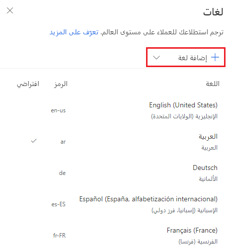
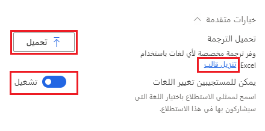
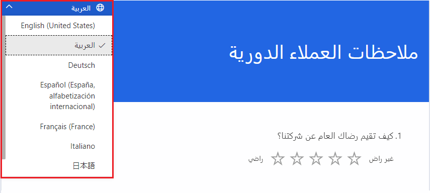

يعد طلب التعليقات من العملاء جانباً مهماً للمؤسسات للتعلم والنمو والاستمرار في تحسين خدمة العملاء. يمكن توفير استطلاعات شخصية باستخدام Dynamics 365 Customer Voice. هناك جانب آخر يجب مراعاته وهو المؤسسات التي لديها عملاء يتحدثون لغات مختلفة. قد تكون هذه الشركة عالمية، أو يمكن أن يكون مقرها في بلد واحد ولكن مع عملاء يتحدثون لغة غير اللغة الافتراضية التي يتم إنشاء الاستطلاعات بها.

يوفر Dynamics 365 Customer Voice الدعم لترجمة الاستطلاعات إلى لغات أخرى. عند إنشاء الاستطلاعات، تكون موجودة بلغة الجذر وهي اللغة المرتبطة ببيئة Dynamics 365. بعد إنشاء الاستطلاع، يمكنك إضافة المزيد من اللغات حسب الضرورة. تعد إضافة اللغات عملية مباشرة، مع توفر أكثر من 40 لغة بشكل جاهز. علاوة على ذلك، يمكنك إضافة لغات مخصصة عن طريق تحديد رمز اسم العرض الذي يجب استخدامه. يمكنك إضافة ما يصل إلى 86 لغة إلى الاستطلاع. يمكنك الوصول إلى قائمة **اللغات** من قائمة **التخصيص** على الجانب الأيمن من الاستطلاع.
ابحث عن اللغة المطلوبة وحددها، ثم حدد **إضافة لغة** بحيث يدرجها الاستطلاع في قائمة اللغات.

> [!div class="mx-imgBorder"]
> 

يجب أن تتم ترجمة أسئلة الاستطلاع من قبل شخص يجيد اللغة؛ لم تتم ترجمتها بواسطة Dynamics 365 Customer Voice تلقائياً.
يتضمن Customer Voice ترجمات لعناصر مثل النص الموجود في الأزرار **التالي**، و **السابق**، و **إرسال**. يمكنك ترجمة اللغات واحدة تلو الأخرى عن طريق تحديد اسم اللغة ثم إدخال النص المترجم الجديد. عند تحديد كل سؤال في الاستطلاع، سيتم عرض اللغة الجذر.
ونتيجة لذلك، فإن معرفة النص الذي سيحتاج إلى الترجمة أسهل، ومن ثم يمكنك لصق النص الجديد. ومع ذلك، من أجل السرعة والكفاءة، يحتوي قسم **خيارات متقدمة** على رابط لتنزيل قالب ترجمة. 

يحتوي هذا القالب على لغة الجذر مع محتوى الاستطلاع بالكامل وعمود لكل لغة محددة تريد إضافتها إلى الاستطلاع. تحتوي رؤوس الأعمدة على رمز، يُعرف باسم رمز **اللغة المحلية** أو **اللغة**، للإشارة إلى كل واحدة. تتضمن أمثلة هذا الرمز *de* للألمانية، و *fr-FR* للفرنسية، و *en-US* للإنجليزية الأمريكية. بعد الانتهاء من النموذج بجميع الترجمات، يمكنك تحميل الملف من منطقة **الخيارات المتقدمة**. يوجد إعداد في منطقة **الخيارات المتقدمة** حيث يمكنك إيقاف تشغيل قدرة المستجيب على تغيير اللغة التي تلقى بها الاستطلاع.

> [!div class="mx-imgBorder"]
> 

سيتم وضع علامة على لغة الجذر الأصلية باعتبارها اللغة الافتراضية، مما يعني أنها اللغة التي سيتم عرض الاستطلاع بها إذا لم تكن هناك لغة مترجمة متاحة للمستجيب الذي يشاهد الاستطلاع.
يمكن تغيير اللغة الافتراضية إذا لزم الأمر. 

يمكن للمستجيبين استخدام عدة طرق مختلفة لعرض الاستطلاع بلغة معينة: 

-   يمكنهم استخدام Power Automate لتعيين قيمة اللغة المحلية (*de* للألمانية أو *fr-FR* للفرنسية) من خلال سير عمل. عند إرسال دعوة استطلاع، سينشئ الاستطلاع الرابط الصحيح للتأكد من عرض اللغة الصحيحة.

-   يمكنهم إنشاء روابط استطلاع مخصصة لتمرير قيمة اللغة من خلال إلحاق **&lang=** برمز اللغة إلى نهاية عنوان URL للاستطلاع. ستفرض هذه الطريقة عرض تلك اللغة تلقائياً. 

-   إذا تطابق إعداد لغة متصفح المستجيب مع إحدى لغات الاستطلاع، فسيتم عرض الإصدار المترجم تلقائياً.

-   إذا تم تشغيل الإعداد للسماح للمستجيبين بتغيير اللغات، فيمكنهم استخدام عنصر التحكم في اللغة من أعلى الاستطلاع لتحديد لغتهم المفضلة لعرض الاستطلاع وإكماله.

> [!div class="mx-imgBorder"]
> 

شاهد الفيديو التالي للحصول على شرح سريع للعملية.

> [!VIDEO https://www.microsoft.com/videoplayer/embed/RWRyfQ]
