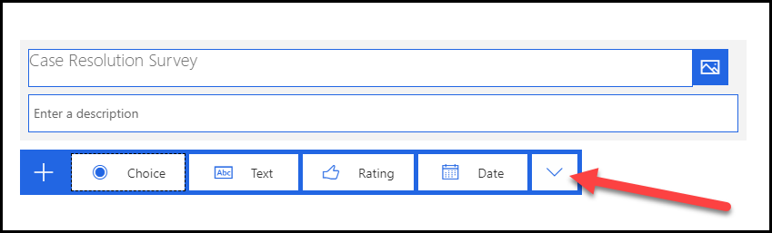
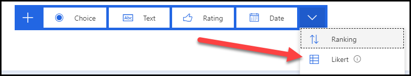
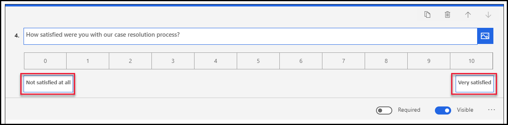
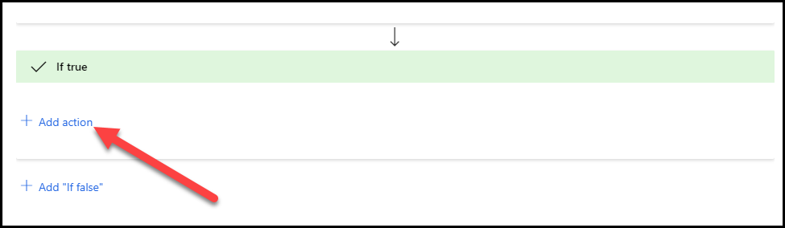

في هذا التمرين، ستعتمد على الممارسة من التعامل مع وحدة مشاريع Dynamics 365 Customer Voice وستضيف استطلاعاً جديد إلى مشروعك. كما ستنشئ استطلاعاً سيتم إرساله إلى العملاء بعد حل الحالة.

> [!NOTE]
> يمكنك إكمال هذا التمرين باستخدام Microsoft Dynamics ‏365 Sales الممكّن في بيئتك أو من دونه. ومع ذلك، إذا كنت ترغب في إكمال التمرين في الوحدة التالية، فسيلزمك استكمال هذه الخطوات في بيئة تم تمكين Dynamics 365 Sales بها أيضاً.

## التمرين 1: إنشاء استطلاع جديد

لإنشاء استطلاع جديد، اتبع الخطوات التالية:

1.  انتقل إلى [Dynamics 365 Customer Voice](https://customervoice.microsoft.com) وسجّل الدخول باستخدام بيانات الاعتماد الخاصة بك.

2.  حدد **كل المشاريع** من قائمة التنقل.

    

3.  من قائمة المشاريع، حدد المشروع من القائمة التي قمت بإنشائها في التعامل مع وحدة مشاريع Dynamics 365 Customer Voice في هذا المسار التعليمي.

    

4.  سيتم فتح المشروع، وسيتم عرض الاستطلاع الافتراضي الموجود لهذا المشروع. قم بتحديد **استطلاع جديد**.

    

5.  بعد إنشاء الاستطلاع، حدد علامة الحذف (**...**) المجاورة للاستطلاع الجديد، ثم حدد **إعادة تسمية**.

    

6.  أدخِل **استطلاع الدعم المميز** على أنه الاسم الجديد، ثم حدد **إعادة تسمية**.

    

7.  حدد العنوان **استطلاع جديد**.

    

8.  أدخل **استطلاع حل الحالة** على أنه **العنوان**.

9.  حدد **+ إضافة جديد**.

    

10. حدد الزر **المزيد**.

    

11. سيتم عرض جميع أنواع أسئلة الاستطلاع المتاحة.
    حدد **تصنيف**.

    

12. أدخل **بشكل عام، ما مدى رضاك عن الطريقة التي تمت بها معالجة حالتك؟** للسؤال، ثم حدد **ابتسامة** لـ **الرمز**.

    

13. حدد **+ إضافة جديد** مرة أخرى.

14. حدد الزر **المزيد** ثم حدد **مقياس Likert**.

    

15. أدخل **هل تتفق مع العبارات الآتية أم لا تتفق معها:** للسؤال، ثم قم بتغيير **الخيار 1** إلى **لا أوافق بشدة**.

    

16. استبدل **الخيار 2** بـ **لا أوافق إلى حد ما**، و **الخيار 3** بـ **لا أوافق ولا أعترض**، و **الخيار 4** بـ **أوافق إلى حد ما**، و **الخيار 5** بـ **أوافق بشدة**. يجب أن تشبه خياراتك الصورة التالية.

    

17. حدد **العبارة 1** وأدخل **كان مندوب الدعم على دراية**.

18. حدد **العبارة 2** وأدخل **تمت الاستجابة للحالة في الوقت المناسب**.

19. حدد **+ إضافة عبارة**.

    

20. أدخل **كان فني الدعم مهذباً ومساعداً**.

21. حدد **+ إضافة عبارة**.

22. أدخل **لم أكن مضطراً إلى الانتظار أكثر من 5 دقائق لتلقي مكالمات الاستجابة**.

23. حدد **+ إضافة عبارة** مرة أخرى.

24. أدخل **تقدم شركة .Contoso Inc خدمة عملاء ممتازة**. يجب أن تشبه عباراتك الآن الصورة التالية.

    

25. حدد **+ إضافة جديد**.

26. حدد **نص**.

27. أدخل **يُرجى إخبارنا عن تجربتك مع فريق الدعم لدينا** للسؤال، ثم حدد **إجابة مطولة**.

    

28. حدد **+ إضافة جديد** مرة أخرى.

29. حدد الزر **المزيد** ثم حدد **Net Promoter Score**.

    

30. أدخل **ما مدى رضاك عن عملية معالجة الحالة التي قمنا بها؟** للسؤال.

31. غيّر أقل تصنيف إلى **غير راضٍ على الإطلاق** وأعلى تصنيف لـ **راضٍ جداً**.

    

32. حدد **إصدار أولي**.

    

33. راجع الاستطلاع الخاص بك، ثم حدد الزر **رجوع**. يمكنك الآن إغلاق محرر النماذج.

## تمرين 2: تحرير استطلاع موجود

في هذا التمرين، ستحسن الاستطلاع عن طريق تغيير السمة وإضافة تفرع وتخصيصه.

### المهمة 1: تغيير السمة

في هذه المهمة، ستغير سمة استطلاعك.

1.  إذا لم يعد الاستطلاع مفتوحاً لديك، فحدد موقع **مشروع تعليقات دعم العملاء** الذي أنشأته، ثم حدد اسمه.

    

2.  حدد **استطلاع الدعم المميز** من القائمة.

    

3.  حدد **تخصيص** من الجانب الأيمن للاستطلاع.

    

4.  حدد **العلامة التجارية** من قائمة **التخصيص**.

    

5.  حدد **لون السمة**.

    

6. حدد اللون **الأزرق**، ثم حدد **البرتقالي الداكن**.

    

7.  أغلق جزء **العلامة التجارية** عن طريق تحديد الرمز **X** في الزاوية العلوية اليمنى من الجزء.

    يجب أن يشبه استطلاعك الآن الصورة التالية.

    

### المهمة 2: إضافة تفرع

في هذه المهمة، ستضيف سؤالاً نصياً جديداً ثم تضيف تفرعاً سيُظهر/سيُخفي السؤال النصي بناءً على Net Promoter Score ‏(NPS).

1.  قم بالتمرير لأسفل الشاشة، ثم حدد **+ إضافة جديد**.

2.  حدد **نص**.

3.  أدخل **ما السبب الأساسي لنقاطك؟** ثم أوقف تشغيل التبديل الخاص بالخيار **مرئي**.

    

4.  حدد قائمة **التخصيص** من الجانب الأيمن من الاستطلاع، ثم حدد **تفرع** من الخيارات.

    

5.  حدِّد **تخصيص**.

    

6.  أدخل **إظهار/إخفاء تعليق النقاط** لـ **اسم القاعدة** ثم حدد **إضافة شرط**.

    

7.  حدد **مدي رضاك عن عملية معالجة الحالة التي قمنا بها؟** للسؤال، ثم حدد **أقل من** للشرط، وادخل **7** للقيمة.

8.  حدد **+ إضافة "إذا كان صحيحاً"**.

    

9.  حدد **إضافة إجراء**.

    

10. قم بتحديد **عرض** لـ **الإجراء**، و **سؤال** لـ **الهدف**، و **ما السبب الأساسي لنقاطك؟** لـ **القيمة**.

    

11. حدد **+ إضافة "إذا كان خاطئاً"**.

12. حدد **إضافة إجراء**.

    

13. قم بتحديد **إخفاء** لـ **الإجراء**، و **سؤال** لـ **الهدف**، و **ما السبب الأساسي لنقاطك؟** لـ **القيمة**.

14. حدد **حفظ**.

    

15. حدد **X** في الزاوية العلوية اليمنى لإغلاق شاشة **قواعد التفرع**.

    

### المهمة 3: تخصيص الاستطلاع

في هذه المهمة، ستضيف الاسم الأول للمستخدم إلى الاستطلاع.

1.  قم بالتمرير إلى أعلى وحدد عنوان الاستطلاع.

    

2.  حدد عمود الوصف.

    

3.  أدخل **مرحباً**، ثم حدد **المتغيرات**.

    

4.  حدد **الاسم الأول**.

    

5.  اضغط على مفتاح **Enter**، ثم اكتب **يُرجى تزويدنا ببعض التعليقات حول تجربة الدعم الأخيرة**.

    يجب أن يشبه وصفك الآن الصورة التالية.

    

### المهمة 4: اختبار الاستطلاع

في هذه المهمة، ستختبر استطلاعك عن طريق إرساله لنفسك في رسالة بريد إلكتروني.

1.  حدد علامة التبويب **إرسال** من الجانب العلوي للاستطلاع.

    

2.  حدد قائمة **التخصيص**، ثم حدد **إعدادات التوزيع**.

    

3.  من شاشة **إعدادات التوزيع**، حدد **إعدادات المستجيب**.

    

4.  تأكد من إيقاف تشغيل الإعداد **‏‫يمكن فقط للأشخاص في مؤسستي الاستجابة** والإعداد **الاستجابات مجهولة الهوية**.

    

5.  حدد **البريد الإلكتروني** من الخيارات الموجودة في علامة التبويب **إرسال**.

    

6.  قدّم **عنوان البريد الإلكتروني** لمؤسستك إلى **المستلمين**، ثم حدد **إرسال**. لن يكون الاسم الأول واسم العائلة للمستخدم متاحَين لاستطلاعك، إلا إذا كانت واحدة على الأقل من العبارات التالية صحيحة بالنسبة إلى البريد الإلكتروني الذي قدمته.

    - إنه جهة اتصال في Outlook.

    - إنه مرتبط بسجل في بيئة Dynamics لديك.

    - إنه شخص ما يشكّل جزءاً من المؤسسة نفسها.

       

    سيتم إرسال الاستطلاع.

    

7.  انتقل إلى بريدك الإلكتروني وابحث عن رسالة البريد الإلكتروني الخاصة بالاستطلاع وافتحها. راجع بريدك غير الهام، إذا لم تجد رسالة البريد الإلكتروني في صندوقك الوارد.

8.  حدد **بدء الاستطلاع**.

    

    يجب تحميل الاستطلاع، ويجب أن يظهر اسمك في الوصف.

    

9.  قدم تصنيفاً، ثم أجب عن أسئلة مقياس Likert.

    

10. قدم تعليقاً، ثم حدد **7** تعبيراً عن الرضا. يجب أن يبقى السؤال الأخير مخفياً.

    

11. غير تصنيف الرضا إلى **6**. يجب أن يظهر السؤال الأخير الآن.

    

12. غيّر التصنيف إلى **8**. يجب أن يختفي السؤال الأخير مرة أخرى.

13. حدد **إرسال**.

    

14. انتظر حتى يكتمل إرسال الاستطلاع.

    
