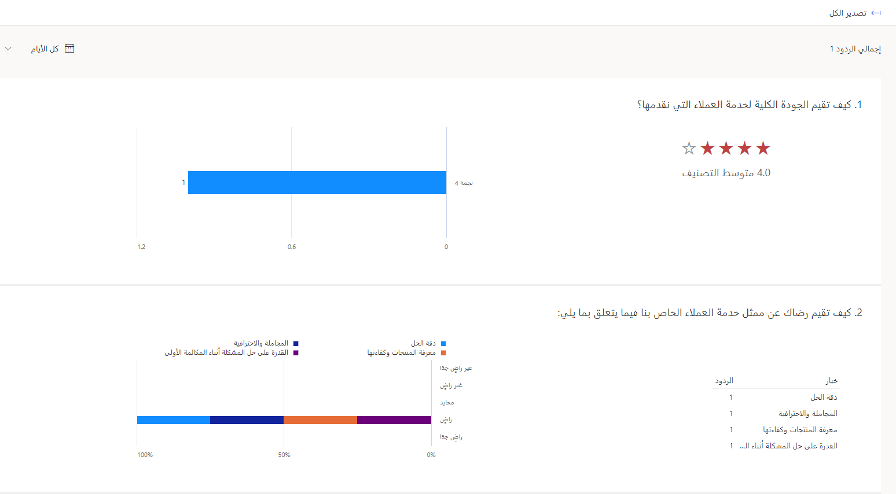

يوفر Microsoft Dynamics 365 Customer Voice أداة مرنة وفعالة لمساعدة المؤسسات على جمع الملاحظات باستخدام النماذج عبر الإنترنت، مما يمنحهم طريقة لطلب استجابات الاستبيان من العملاء وجمعها. في أبسط طريقة، يمكن للمؤسسات أن ترسل إلى العملاء رابطاً مباشراً باستخدام البريد الإلكتروني، وتطلب منهم تقديم آرائهم في لحظة معينة أو تفاعل قد حدث مؤخراً.

إن معرفة شعور العملاء تجاه مؤسسة أو فريق معين داخل الشركة أو منتج أو خدمة معينة استخدموها تعني أنه يمكن للمؤسسات إجراء تحليل بعد جمع هذه الردود.
وبعد ذلك، يمكن للمؤسسة اتخاذ إجراءات لتحسين التفاعلات المستقبلية أو اتخاذ خطوات لضمان الحفاظ على نفس مستويات الخدمة.

تتضمن طرق الحصول على التعليقات المفيدة والغنية بالمعلومات وتحليلها ما يلي:

-   استخدام Microsoft Power Automate لإرسال دعوات الاستطلاع بعد إغلاق حالة الدعم.

-   إضافة استطلاعات ما بعد المحادثة إلى القناة متعددة الاتجاهات لـ Customer Service.

-   مراجعة تقرير رضا العملاء (CSAT) في Microsoft Dynamics 365 Customer Service Insights.

يتم تخزين استجابات Dynamics 365 Customer Voice في Microsoft Dataverse، وهو تخزين قائم على السحابة يتم استخدامه بواسطة العديد من الجوانب الأخرى في Microsoft Dynamics 365.
على سبيل المثال، سيتمكن أي شخص يستخدم Microsoft Dynamics 365 Sales أو Microsoft Dynamics 365 Customer Service من الوصول إلى دعوات الاستطلاع والردود على الاستطلاعات مباشرة من سجلات جهات الاتصال في بيئات Dataverse ذات الصلة. وبعد ذلك، يمكنك مراجعة الردود من Customer Voice أو من خلال أدوات مثل Power Automate أو اللوحة أو التطبيقات المستندة إلى نموذج من Microsoft Power Apps ومن لوحة معلومات أو تقرير Microsoft Power BI إذا لزم الأمر.

> [!div class="mx-imgBorder"]
> 

من المهم معرفة الوقت المناسب لطلب التعليقات الصحيحة. يمكن أن يؤدي الطلب الذي يتم في توقيت سيء إلى قيام العميل بتقديم تعليقات بدافع الإحباط، أو الأسوأ من ذلك، تجاهل الطلب تماماً. على سبيل المثال، طلب الحصول على تعليقات حول حالة لا تزال جارية هو توقيت سيء. إذا كانت مشكلة العميل لا تزال قائمة وتسبب له الانزعاج أو القلق، فاسأله عن كيف أن حدوث ذلك سيؤدي على الأرجح إلى استجابة سلبية. من المحتمل أن يعني الانتظار حتى تتم تسوية الحالة والحصول على حل أنه يمكن للعميل التوقف مؤقتاً والنظر في كل جانب من جوانب تجربة دعم العملاء بموضوعية أكبر.

ستوفر لك هذه الوحدة طرقاً مختلفة لجمع تعليقات العملاء باستخدام طرق مختلفة واستخدام جوانب وأدوات مختلفة من Microsoft Power Platform وDynamics 365.
