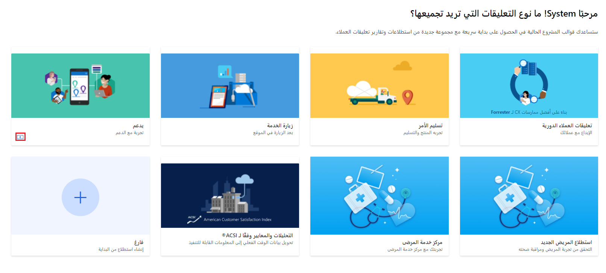
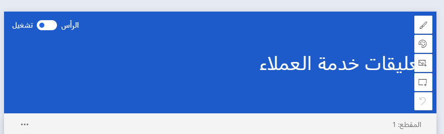
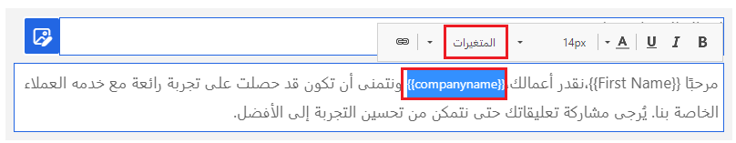

يوفر Dynamics 365 Customer Voice سلسلة من القوالب التي يمكنك استخدامها كنقطة بداية أثناء إنشاء مشروع جديد. ربما تتكون المشروعات من استطلاع واحد أو أكثر وقواعد متفرعة ومتغيرات وقوالب بريد إلكتروني. قدّمت Microsoft قوالب مختلفة لتمنحك بداية سريعة عند جمع التعليقات من العملاء. إن هذه الوحدة تستخدم قالب الدعم لإنشاء مشروع جديد.

يمكنك إضافة مشروع جديد بعدة طرق. إذا قمت بتحديد أزرار **الشروع في العمل** أو **+ مشروع جديد** من الشاشة الرئيسية في Customer Voice، سيُطلب منك تحديد قالب للمتابعة وإضافة مشروع جديد. عندما تقوم بمراجعة جميع المشروعات، يمكنك أيضاً استخدام الزر **مشروع جديد** للاستمرار في إنشاء مشروع جديد.

> [!div class="mx-imgBorder"]
> 

بعد تحديد قالب، سيُطلب منك تحديد الموقع الذي يجب إضافة المشروع والاستطلاعات ذات الصلة إليه. ضع في اعتبارك أن أي تدفقات من Power Automate قد تكون مطلوبة كمشغلات أو مستقبلات للبيانات لأي استطلاع، والتي من المفترض أن تساعد في تحديد الموقع الصحيح لإضافة المشروع إليه. بالنسبة للمؤسسة النموذجية التي تستخدم Dynamics 365، سيكون هناك إنتاج وبيئة آلية واحدة على الأقل. إن البيئة التي تظهر ويتم عرض **(افتراضي)** بجانبها هي بيئة Dataverse الافتراضية وليس لها أي ارتباط أو صلة بأيّ من تطبيقات مشاركة العميل في Dynamics 365.

يتألف قالب الدعم من العناصر التالية:

-   **استطلاع واحد** - استطلاع دقة الحالة

-   **تقرير واحد** - تقرير استطلاع دقة الحالة

-   **متغير جديد واحد** - companyname (بالإضافة إلى First Name وLast Name وlocale)

-   **مقياسان للرضا** - رضا العملاء (CSAT) وتوجه العملاء (التوجه)

-   **قالب بريد إلكتروني واحد** - قالب تعليقات الدعم

يمكنك استخدام جميع الجوانب الموجودة في القالب كما تم توفيرها أو إلحاقها بها، أو يمكنك إزالتها إذا لم تكن تلبي متطلبات المؤسسة.
يوفر النموذج استطلاعاً واحداً، ولكن يمكنك أيضاً إضافة المزيد من الاستطلاعات المتعلقة بخدمات العملاء. بالإضافة إلى إجراء استطلاع يطلب تعليقات خدمة العملاء فيما يتعلق بحل مشكلة ما، يمكنك إضافة استطلاع ثان يطلب تعليقات خدمة العملاء ربع السنوية، مع استطلاع ثالث يمكنك استخدامه لاستطلاع مراجعة تعليقات خدمة العملاء السنوية في نهاية العام.

تأكد دائماً من مراجعة العديد من جوانب المشروع قبل استخدامه لإرساله إلى العملاء. الجانب الأول هو عنوان استطلاع دقة الحالة. باستخدام عناصر التحكم، يمكنك إضافة صورة الرأس وتغيير موضع نص رأس الاستطلاع كما هو مطلوب. تساعد إضافة شعار في جعل الاستطلاع أكثر تماشياً مع المؤسسة. وعلاوة على ذلك، يوفر الشعار تمييزاً للعلامة التجارية للعملاء، مما قد يجعلهم أيضاً أكثر ميلاً لإكمال الاستطلاع. يمكنك استخدام المتغير **companyname** لعرض اسم العميل الذي يستخدم Power Automate والتدفق الذي يملأ البيانات بشكل ديناميكي. ثم، يمكنك إضافة المتغير **companyname** إلى الوصف **القسم 1** مع المتغير **First Name** والذي يضيف الطبيعة المخصصة للاستطلاع.

> [!div class="mx-imgBorder"]
> 

> [!div class="mx-imgBorder"]
> 

إذا كانت هناك حاجة إلى أسئلة إضافية أو قواعد تفريع، فيمكنك إضافتها إلى الاستطلاع مع متغيرات جديدة. بعد قيامك بإعداد جميع العناصر، يمكنك إرسال الاستطلاع. يراجع الدرس التالي كيفية تخصيص قوالب البريد الإلكتروني باستخدام متغيرات الاستطلاع.
