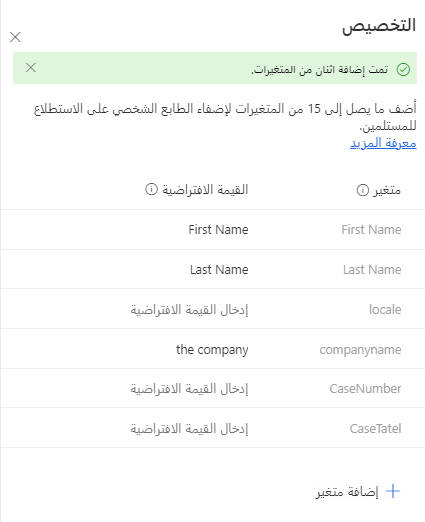
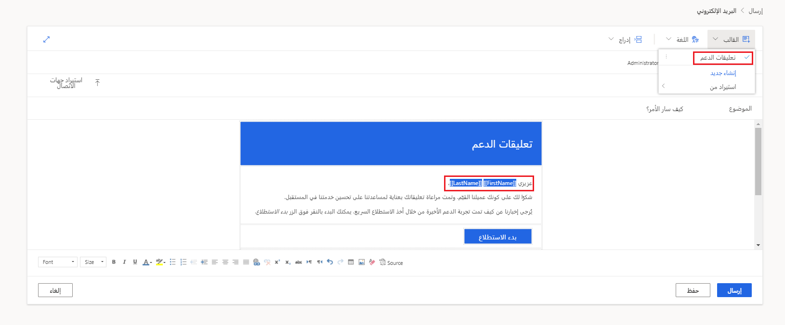
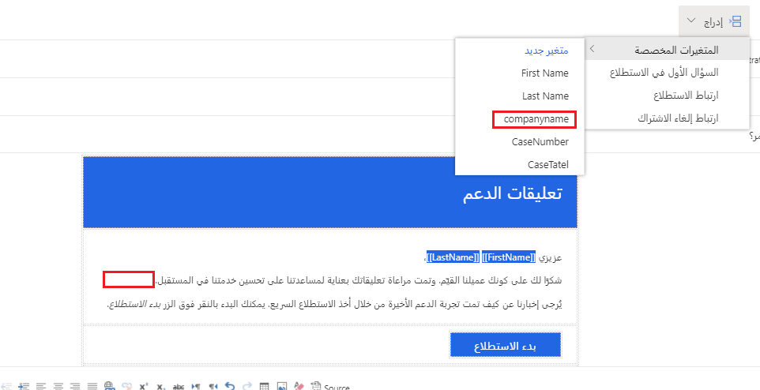
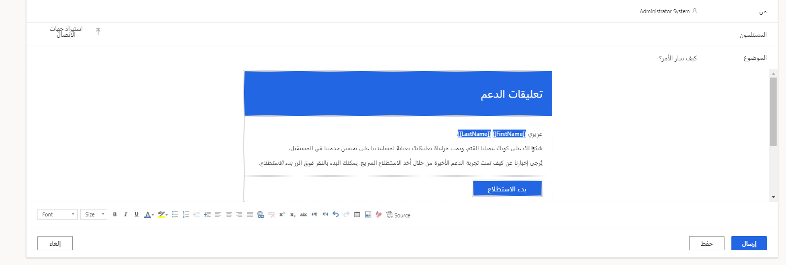

يعد طلب التعليقات من العملاء طريقة مهمة بالنسبة لك لقياس مدى رضاهم عن خدماتك أو منتجاتك، كما أنه يوفر معلومات قيمة لمساعدتك على الاستمرار في النمو وتحسين مستويات الخدمة التي تقدمها. يُعد طلب التعليقات العامة أمراً مقبولاً، لكنه لا ينقل للعملاء أنه يتم الاعتناء بهم. بدلاً من ذلك، قد يؤدي تقديم تجربة شخصية إلى تمييز شركة واحدة عن المؤسسات الأخرى.
علاوة على ذلك، تُظهر التجارب الشخصية للعملاء أن الشركة تعرف وتفهم من هم وما هو التفاعل الذي يتم طلب التعليقات عليه.

باستخدام Dynamics 365 Customer Voice، يمكنك طلب التعليقات وإرسال رسائل بريد إلكتروني مخصصة باستخدام متغيرات الاستطلاع. يمكن أن يتضمن الاستطلاع ما يصل إلى 15 متغيراً، مع تعيين متغيرين تلقائياً لعرض متغيرات **First Name** و **Last Name**. يمكنك إضافة متغير **locale** إلى استطلاع جديد لتوفير طريقة لتحديد اللغة الصحيحة لعرضها (حيث تكون الاستطلاعات متعددة اللغات ضرورية لمؤسسة ما)، ولكن يمكنك حذفها المتغير **locale‏‎** إذا لم يكن مطلوباً.

لكل متغير جديد تضيفه، تأكد من منحهم اسماً بأحرف فقط دون مسافات. يمكنك إضافة قيمة افتراضية، والتي سيتم استخدامها عندما لا يتوفر أي شيء آخر، مما يعني أنه لم يتم تمرير أي قيمة إلى هذا المتغير باستخدام استيراد أو باستخدام Power Automate، على سبيل المثال. بعد إضافة جميع المتغيرات الجديدة، تأكد من حفظها بحيث يمكنك استخدامها خلال الاستطلاع وفي قوالب البريد الإلكتروني.

> [!div class="mx-imgBorder"]
> 

يوفر لك تحديد علامة التبويب **إرسال** الخاصة بالاستطلاع طرقاً متنوعة يمكنك من خلالها توزيع الاستطلاع. من خلال تحديد خيار البريد الإلكتروني، يمكنك ضبط واستخدام القوالب الجديدة والحالية عند إرسال استطلاع. إذا أنشأت نموذجاً فارغاً أو قالباً بدون قوالب بريد إلكتروني مخصصة، فسيكون القالب الوحيد المتاح هو القالب **الافتراضي**. سيكون هذا القالب عادياً بشكل مرئي، بدون متغيرات مستخدمة وموضوع وتخطيط بسيط مع زر لبدء الاستطلاع.

يمكنك إنشاء استطلاع جديد، ويمكن أن يحتوي الاستطلاع على قوالب متعددة كما هو مطلوب. في هذا المثال، يوجد قالب **تعليقات الدعم** للاستطلاع. تمت إضافة متغيرين **First Name** و **Last Name** إلى قالب البريد الإلكتروني. عند إرسال استطلاع باستخدام وظيفة البريد الإلكتروني من Dynamics 365 Customer Voice، سيتم استبدال متغيرات **First Name** و **Last Name** بقيم الأسماء الفعلية من جهة اتصال. 

أيضاً، سيتم ملء التفاصيل التالية بعدة طرق:

-   تحديد **جهات الاتصال** باستخدام حقل المستلم والبحث عنها في تطبيقات Dynamics 365 أو Microsoft Office 365

-   تحميل ملف CSV يتضمن قيم **Email**، و **First Name**، و **Last Name**

-   إنشاء تدفق في Power Automate يقوم بتشغيل وملء القيم من قاعدة بيانات مثل Microsoft Dataverse

> [!div class="mx-imgBorder"]
> 

يمكنك إضافة المزيد من المتغيرات إلى قالب البريد الإلكتروني، بشرط أن تكون البيانات الخاصة بتعبئة هذه القيم قابلة للوصول. على سبيل المثال، إذا كنت تستخدم حقل المستلم، وبحثت عن جهات اتصال وأضفتها إلى البريد الإلكتروني بهذه الطريقة، فسيتم ملء الاسم فقط. في هذا السيناريو، لن يكون لديك طريقة لملء اسم الشركة أو رقم الحالة أو عنوان الحالة، على سبيل المثال. ومع ذلك، إذا كنت تستخدم Power Automate أو ملف استيراد CSV، فسيسمح بتمرير القيم مرة أخرى إلى المتغيرات بحيث يمكن عرضها في قالب البريد الإلكتروني.

يمكنك إضافة المتغيرات عن طريق تحديد الخيار **إدراج** من القائمة الموجودة أعلى قالب البريد الإلكتروني. من هناك، تتوفر جميع المتغيرات الشخصية ويمكنك إضافتها إلى قالب البريد الإلكتروني كما هو مطلوب عن طريق تحديد المتغير. إذا لم تتم إضافة متغير بعد ولكن هناك حاجة إليه الآن، فحدد الخيار **متغير جديد** لإظهار القائمة **إضفاء طابع شخصي**، حيث يمكنك إضافة المتغير الجديد بسرعة دون مغادرة قالب البريد الإلكتروني وفقدان عملك.

> [!div class="mx-imgBorder"]
> 

بالإضافة إلى ذلك، يمكنك تخصيص الموضوع باستخدام المتغيرات. يمكن أن يساعد تضمين الاسم الأول لشخص ما في موضوع البريد الإلكتروني في جذب انتباهه. إذا كان البريد الإلكتروني يتعلق باستطلاع يطلب تعليقات حول إغلاق حالة دعم، فإن إضافة رقم الحالة وعنوان الحالة للموضوع يمكن أن يساعد في توفير مزيد من الاعتراف وزيادة احتمالية فتح البريد الإلكتروني واتخاذ هذا الإجراء. يمكنك إضافة الصور والروابط مع تغييرات اللون والخط حسب الحاجة. بعد أن تقوم بتخصيص القالب بالكامل بكل المتغيرات المضافة، تأكد من حفظه. يجب أن يكون النموذج جاهزاً الآن للاستخدام. بالنسبة لقوالب البريد الإلكتروني التي تحتوي بالفعل علي متغيرات مضمنة، تأكد من تعيين قيمة افتراضية لكل متغير أو الذي تستخدمه دائماً قالب البريد الإلكتروني هذا عند إرسال رسائل البريد الإلكتروني التي يتم استخدامها مع عمليات استيراد CSV في Dynamics 365 Customer Voice أو مع Power Automate.

> [!div class="mx-imgBorder"]
> 

شاهد الفيديو التالي للحصول على عرض توضيحي لكيفية تخصيص رسائل البريد الإلكتروني الخاصة بالاستطلاع. 

> [!VIDEO https://www.microsoft.com/videoplayer/embed/RWMBgM]
