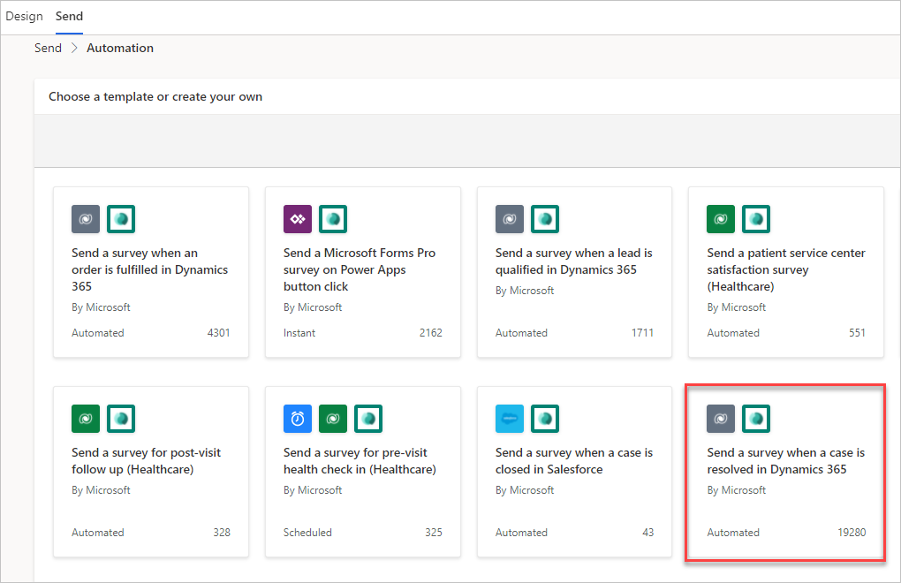
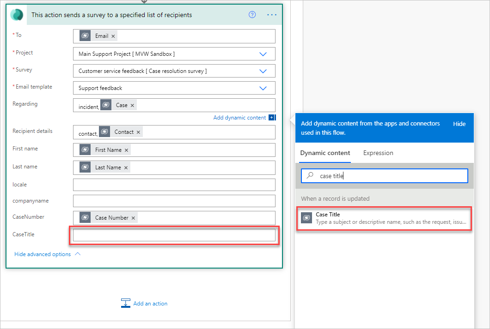
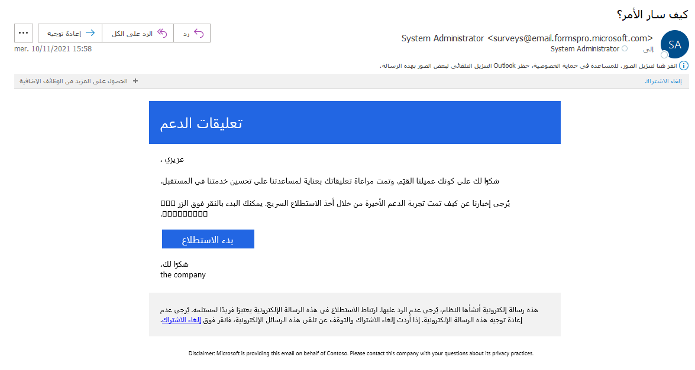

إذا قامت إحدى المؤسسات ببيع منتجات أو تقديم خدمات، فمن المحتمل جداً أنها ستطلب تعليقات بشأن أي نقطة اتصال أو تفاعل مهم لدى العميل دائماً. يمكن طلب هذه التعليقات فوراً بعد شراء العميل لأحد المنتجات أو في حالة توقيع عقد للحصول على نتيجة تحليلات لتجربته من خلال عملية المبيعات. إذا كانت المساعدة مطلوبة أثناء رحلة العميل على أساس مستمر، فقد يكون هناك نظام دعم أو إصدار تذاكر حيث يطلب العملاء المساعدة، ويقدم مندوب الدعم تعليقات لإعطاء حل، ثم يتم إغلاق الحالة. تعد تعليقات العملاء واحدة من أهم نقاط الاتصال في خدمة العملاء، ويمكن أن تحدث عدة مرات طوال علاقة العميل بالمؤسسة.
توفر تعليقات العملاء للشركات فرصة لإرضاء العميل في كل مرة أو إحباطه وتخييب آماله، بناءً على النتيجة.

تستخدم هذه الوحدة Dynamics 365 Customer Service كنقطة انطلاق لإرسال استطلاعات الرأي بعد حل الحالة. ستوفر نقطة التشغيل نقطة البداية للتدفق Power Automate، والذي سيرسل بعد ذلك الاستطلاع الذي يطلب التعليقات. سيتم استخدام قالب البريد الإلكتروني الذي تم إنشاؤه في الوحدة السابقة من هذه الوحدة أثناء عملية الإرسال.

لكل استطلاع تم إنشاؤه في Dynamics 365 Customer Voice، ستتضمن علامة التبويب **إرسال** خيار استخدام الأتمتة. سيؤدي تحديد هذا الخيار إلى تقديم سلسلة من القوالب المتوفرة للسيناريوهات الشائعة. أحد الخيارات هو **إرسال استطلاع عندما يتم حل حالة في Dynamics 365**. بعد تحديد هذا الخيار، يتم عرض موصلات Power Automate التي سيستخدمها التدفق. تأكد من أن لديك التراخيص الصحيحة لـ Power Automate وأنك تفهم الفرق بين الموصلات القياسية والمتميزة مع هذا التطبيق. بعد مراجعة التفاصيل المعروضة، يمكنك الاستمرار في إنشاء التدفق. عند استخدام هذه الطريقة، سيتم إنشاء التدفق ومن ثم يمكنك العثور عليه في Power Automate ضمن القسم **التدفقات الخاصة بي** في القائمة. سيتم إدراجه كتدفق سحابة.

> [!div class="mx-imgBorder"]
> 

سيتم تكوين التدفق وسيعمل بنجاح؛ ومع ذلك، في هذه المرحلة لن يتم تعيين جميع المتغيرات على التعبئة، مما يعني أنه يجب عليك تحريرها قليلاً قبل الاستخدام. انتقل إلى التدفق في Power Automate، حيث يمكنك فتحه وتحريره. يعمل التدفق عند تحديث الحالة، مما يعني أنه تم تغيير شيء ما بخصوصها. يتم بعد ذلك التحقق من سبب حالة الحالة للتأكد من حلها، وإذا كان الأمر كذلك، فسيستمر التدفق. تتوفر طرق أخرى أكثر فاعلية لإكمال هذه المهمة، حيث يمكنك إنجازها بقليل من المعرفة بـ Power Automate، مع التأكد من أن التدفق يعمل فقط عند حل الحالة أو عند تغيير الحالة. سيكون لديك فرصة لإجراء الكثير من التعديلات لتحقيق الكفاءة كما هو مطلوب.

إذا قمت بالتمرير لأسفل خلال التدفق، فسيتم تقسيمه بشكل أكبر بناءً على ما إذا كان العميل في الحالة هو سجل عميل أو سجل جهة اتصال. تتيح لك هذه الميزة تعيين المتغيرات لإظهار اسم جهة الاتصال أو اسم العميل وكذلك لسحب التفاصيل الصحيحة من العميل المرتبط بالحالة. يتضمن كل مسار إجراء **إرسال استطلاع** من موصل Dynamics 365 Customer Voice. في مسار جهة الاتصال، تتم تعبئة معظم القيم بالفعل. ومع ذلك، يمكنك أيضاً تعبئة رقم الحالة وعنوان الحالة حتى يعرف الشخص الذي يتلقى رسالة البريد الإلكتروني بالضبط الغرض من طلب التعليقات. سيظهر كل متغير تمت إضافته إلى الاستطلاع في هذا الإجراء في التدفق، ويمكنك تعبئته بمحتوي ديناميكي.
بعد تحديد حقل المتغير، يمكنك البحث عن اسم الحقل من قاعدة البيانات، وهو **Dynamics 365 Customer Service (Dataverse)** لهذا المثال.
يمكنك الوصول إلى عنوان الحالة من خطوة المشغل الأصلية عند تحديث السجل. سيؤدي تحديد متغير **CaseTitle** إلى إضافته إلى حقل المتغير.

على الرغم من أنه ستتم تعبئة المتغيرات في التدفق من القالب الذي تحدده، إلا أنك تحتاج إلى فهم كيفية عمل الحقل **بخصوص** وحقل **تفاصيل المستلم**. يسمح الحقل **بخصوص** بربط دعوة الاستطلاع والاستجابة اللاحقة بسجل معين. يمكن ربط السجل بجهة الاتصال، أو الحساب المرتبط به، أو في هذه الحالة، ربطه بالحالة التي تم إغلاقها. يعتبر أسلوب الربط فريداً ويجب أن يكون بتنسيق اسم الجدول (الكيان)، وفاصلة، ثم معرف السجل. بالنسبة للحالة، اسم الجدول هو الحدث، وبعد ذلك يمكنك العثور على معرف الحالة في القائمة من المحتوى الديناميكي.
سيكون حقل **تفاصيل المستلم** هو جهة الاتصال، وستتبع نفس تنسيق اسم الجدول، وفاصلة، ثم معرف السجل.

> [!div class="mx-imgBorder"]
> 

بعد إجراء جميع التعديلات على التدفق، يمكنك حفظه، وبعد ذلك سيكون جاهزاً للاستخدام. لاختبار التدفق، أغلق حالة من Dynamics 365 Customer Service (أو أي قاعدة بيانات أو بيانات مصدر استخدمتها). تأكد من إمكانية الوصول إلى صندوق الوارد الخاص بعنوان البريد الإلكتروني حتى تتمكن من الوصول إلى البريد الإلكتروني. يجب أن يأتي البريد الإلكتروني بعد ذلك مع تعبئة جميع المتغيرات، بما في ذلك **First Name** و **Last Name** و **Case Number** و **Case Title**. يمكن الوصول إلى دعوة الاستطلاع في Dynamics 365 Customer Service من الجدول الزمني لنشاط الحالة والجدول الزمني لنشاط جهة الاتصال ذات الصلة.

> [!div class="mx-imgBorder"]
> 

في الفيديو التالي، سيتم إنشاء تدفق من فارغ في Power Automate الذي يمكنك تشغيله عند إغلاق الحالة.

> [!VIDEO https://www.microsoft.com/videoplayer/embed/RWMOaj]
