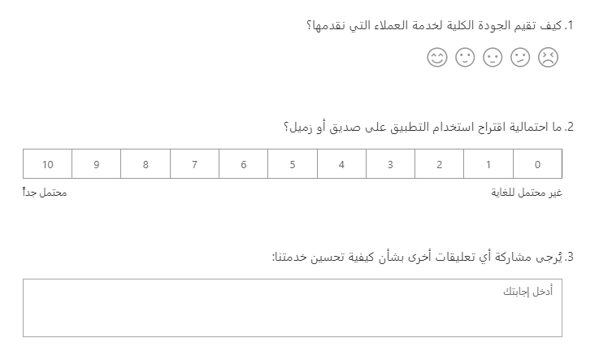
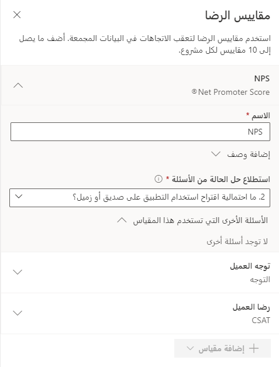

يمكن لفرق خدمة العملاء استخدام العديد من الطرق لمساعدة العملاء وتقديم النصيحة لهم والتفاعل معهم. ستتضمن الطرق النموذجية رسائل البريد الإلكتروني أو المكالمات الهاتفية أو القدرة على التعامل مع الحالات باستخدام مدخل عبر الإنترنت.
تساعد القناة متعددة الاتجاهات لـ Customer Service على زيادة قوة Dynamics 365 Customer Service، مما يسمح للمندوبين بتقديم المساعدة باستخدام قنوات أخرى متنوعة. يتيح استخدام التطبيق للفرق المشاركة في التفاعلات باستخدام المحادثة عبر الويب والمحادثات النصية وWhatsApp ووسائل التواصل الاجتماعي وMicrosoft Teams.

وباستخدام حالة الدعم، يمكنك تشغيل استطلاع وإرساله عبر البريد الإلكتروني إلى جهة الاتصال المرتبطة بعد حل الحالة. إذا تم استخدام القناة متعددة الاتجاهات لـ Customer Service، وكان مندوب خدمة العملاء يقوم بالمساعدة باستخدام قناة، فستكون النتيجة ضرورية لجمع التعليقات من الشخص الذي قام بهذا التفاعل. يتوفر خيار استطلاع ما بعد المحادثة عند إنشاء قناة أو تحريرها في القناة متعددة الاتجاهات لـ Customer Service. على الرغم من أنه يمكنك استخدام أي استطلاع من Dynamics 365 Customer Voice، تأكد من الاحتفاظ بالحد الأدنى من عدد الأسئلة لتجنب إحباط المستجيب، وبالتالي زيادة احتمالية إرسال الاستطلاع.

يجب مراعاة نوع التفاعلات التي قد يحصل عليها الشخص عند استخدام المحادثة على أحد مواقع الشركة على الويب أو مدخل العميل. تحتاج إلى تحديد ما قد يطرحون أسئلة عنه ونوع المساعدة التي قد يحتاجون إليها. بعد اتخاذ هذه القرارات، ستكون أكثر وضوحاً بشأن ما إذا كان ينبغي أن تكون أسئلة الاستطلاع محددة أو ما إذا كان يجب أن تكون أكثر عمومية. تساعد الأسئلة الأقل في إنشاء استطلاع يمكن الرد عليه بسرعة، مما يؤدي إلى مزيد من الاستجابات بشكل مثالي.
تعد التنسيقات البسيطة، مثل سؤال التقييم وصافي نقاط الترويج ومربع النص الذي يطلب تعليقات أخرى، نقطة انطلاق جيدة لجمع التعليقات كاستطلاع رأي ما بعد المحادثة.

> [!div class="mx-imgBorder"]
> 

لتخصيص مناطق أخرى للمساعدة في تقديم الاستطلاع بطريقة أكثر إرضاءً من الناحية الجمالية عند التضمين في موقع ويب، يمكنك استخدام العنوان ورسالة المنشور الخاصة بالاستطلاع. يمكنك إيقاف تشغيل الرأس ما لم يكن هناك حاجة لإظهار صورة أو كتلة كبيرة من الألوان والنص على موقع الويب. يعني إيقاف تشغيل الرأس أنه يتم عرض الأسئلة فقط.
يمكنك استخدام رسالة منشور الاستطلاع لشكر المستخدم ثم إبلاغه بأنه يمكن الآن إغلاق نافذة المحادثة.

بعد إضافة الأسئلة، يمكنك إعداد مقاييس الرضا.
عند إرسال رد، يمكنك مراجعة كافة الردود الموجودة في Dynamics 365 Customer Voice في تقرير الاستطلاع المرتبط. توفر مقاييس مستوى الرضا معلومات أكثر تفصيلاً تركز على ما يصل إلى 10 مقاييس لكل مشروع مع مجموعة من صافي نقاط الترويج أو التوجه أو رضا العملاء (CSAT) أو التسجيل المخصص إذا لزم الأمر. عند إرسال الردود، ستتم إضافة الأسئلة المرتبطة بمقياس الرضا إلى المتوسط ​​المجمع وسيكون الوصول إليها متاحاً في تقرير مقاييس مستوى الرضا. إذا كان المشروع يحتوي على أكثر من استطلاع واحد، يمكنك إجراء عامل التصفية للاطلاع على مقاييس مستوى الرضا لجميع الاستطلاعات مجمعة أو مراجعة مقاييس الرضا لاستطلاع واحد تمت تصفيته.

> [!div class="mx-imgBorder"]
> 

بعد إضافة مقاييس مستوى الرضا، يمكنك إنشاء تنبيهات لإنشاء مهام للمستخدمين لمراجعتها وحلها. على سبيل المثال، معرفة وقت إرسال الرد حيث تتم الإجابة على سؤال صافي نقاط الترويج بستة أو أقل مما يشير إلى وجود منتقد. وعادة ما يكون المنتقدون غير راضين عن منتج أو خدمة ولكن يمكنهم أيضاً مشاركة خيبة الأمل هذه مع الآخرين إما عبر الإنترنت أو عن طريق الكلام الشفهي. من المهم معرفة متى يكون لدى شخص ما تجربة سيئة كما أن تحقيق هذه المعرفة بشكل سريع قد يحدث فرقاً عند محاولة حل المشكلات. وبدلاً من ذلك يمكن أيضاً إعادة تشكيل الموقف ليكون العميل سعيداً.

> [!div class="mx-imgBorder"]
> 

وتقوم الوحدة التالية بمراجعة كيفية استخدام الاستطلاع الذي تم إنشاؤه كاستطلاع بعد المحادثة في القناة متعددة الاتجاهات لخدمة العملاء.
