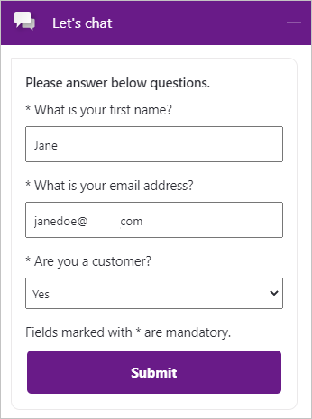
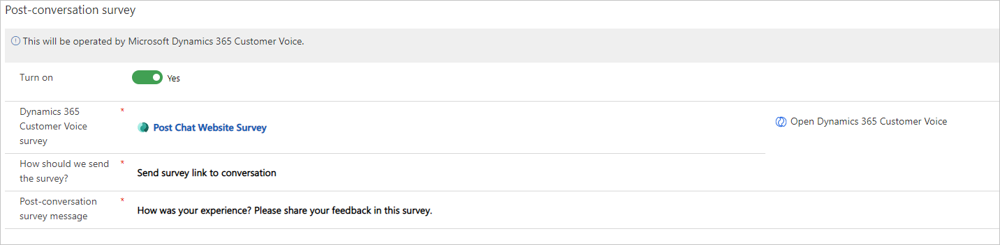
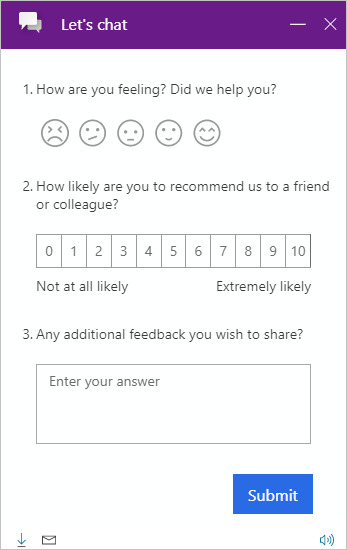

يمكن توسيع Dynamics 365 Customer Service Enterprise باستخدام القناة متعددة الاتجاهات لـ Customer Service. وتوفر القناة متعددة الاتجاهات لـ Customer Service تطبيقاً فريداً لإعطاء مندوبي خدمة العملاء واجهة موحدة للتعامل مع تفاعلات العملاء وإدارتها في مكان واحد. بعد قيام المسؤول بإعداد القناة متعددة الاتجاهات لـ Customer Service وتكوينها، يمكنهم تمكين قنوات متعددة مثل الدردشة والرسائل النصية والوسائط الاجتماعية وMicrosoft Teams.

ويجب على مسؤول النظام التأكد من تعيين القناة متعددة الاتجاهات لـ Customer Service الملائمة إلى المستخدمين. بعد ذلك، يمكنك إضافة مستخدمين إلى قائمة انتظار، مثل قائمة انتظار للشكاوى أو قائمة انتظار للدردشة عبر قنوات الوسائط الاجتماعي أو قائمة انتظار للدردشة على موقع الويب الخاص بالمؤسسة. يمكنك استخدام تدفقات العمل لتوزيع عبء العمل بالتساوي أو كما يسمح النطاق الترددي. وبعد إعداد تدفق العمل، يمكنك إضافة قناة جديدة وربطها وفقاً لذلك.

وبغض النظر عن القناة التي يقرر العميل المتوقع أو العميل استخدامها، فإن طلب التعليقات في نهاية كل تفاعل سيساعدك على فهم المناطق التي تحتاج إلى تحسين أو المكان الذي يبرع فيه عضو محدد في المؤسسة ويستحق التقدير. في قناة المحادثة، يوجد خيار لتكوين استطلاع ما قبل المحادثة. تأكد من عدم خلط هذا الاستطلاع مع استطلاع Dynamics 365 Customer Voice واستخدامه في جمع المعلومات قبل بدء الدردشة. تساعدك معرفة معلومات مثل الاسم الأول للشخص على التعامل مع العميل بشكل أفضل طوال مدة الدردشة. بالإضافة إلى ذلك، إذا طلبت عنوان البريد الإلكتروني الخاص بالعميل، فقد يساعد المندوب في البحث بسرعة عن العميل والعثور عليه إذا كان موجوداً بالفعل كجهة اتصال في Dynamics 365 Customer Service. فكّر في استطلاع ما قبل المحادثة كطريقة لمساعدة المندوبين المتصلين والجاهزين للمساعدة.

> [!div class="mx-imgBorder"]
> 

رغم أن استطلاعات ما قبل المحادثة متوفرة فقط مع قنوات الدردشة، فإنه يمكنك تمكين استطلاع ما بعد المحادثة للقنوات الأخرى مثل الرسائل النصية وFacebook وTwitter وWhatsApp وMicrosoft Teams. سيؤدي تشغيل استطلاع ما بعد المحادثة إلى توفير خيار بحث للبحث عن استطلاع في Dynamics 365 Customer Voice. وإذا لم يتم إنشاء استطلاع، أو كانت هناك حاجة إلى استطلاع جديد، فيمكنك تحديد الارتباط المتوفر لـ Customer Voice، والذي سيؤدي إلى فتح التطبيق في علامة تبويب مستعرض جديدة.

يمكنك الاختيار من بين خيارين لكيفية إرسال الاستطلاع إلى الشخص الذي شارك في الدردشة أو التفاعل على قناة. يتوفر خيار **إرسال ارتباط الاستطلاع إلى المحادثة** لجميع القنوات. كما يوفر تحديد هذا الخيار خياراً لك لتحديد السياق المعروض لرسالة استطلاع ما بعد المحادثة التي توجه الشخص إلى تحديد الارتباط. بالنسبة إلى قناة الدردشة المباشرة، يمكن عرض الأسئلة مباشرةً في مربع الدردشة، ما يجعل التجربة سلسة ومنظمة. نتيجة لذلك، لن يتم إخراج الشخص الذي يكمل الاستطلاع من صفحة الويب التي حدث فيها تفاعل الدردشة، ويمكنه ملء الاستطلاع وإرساله من المنطقة نفسها. كما يمكنك تحديد **إرسال ارتباط الاستطلاع إلى المحادثة** لإرساله مباشرةً إلى شخص معين.

> [!div class="mx-imgBorder"]
> 

بعد تكوين عنصر واجهة المستخدم للدردشة، سيتم توفير قصاصة برمجية لعنصر واجهة المستخدم. يمكنك تضمين هذا الكود على مدخل Power Apps أو على موقع الويب الخاص بالمؤسسة. بعد ذلك، يمكن لمسؤول موقع الويب لصق كود صفحة أو تذييل الموقع (إذا كان يجب عرضه في كل صفحة من صفحات موقع الويب).

وبعد أن يتفاعل المندوب مع شخص ما باستخدام نافذة الدردشة، وبعد انتهاء الدردشة، سيتم تحميل الاستطلاع. بالإضافة إلى ذلك، يمكنك إيقاف تشغيل الرأس بحيث يتم عرض الأسئلة فقط. إذا كان الاستطلاع موجزاً ​​بدرجة كافية، فستظهر الأسئلة والزر **إرسال** فقط، ما يجعل تجربة المستخدم سلسة ونظيفة. يمكن للشخص الذي يتفاعل مع الدردشة ملء الاستطلاع وإرسال استجاباته بسرعة. ستظهر رسالة نشر الاستطلاع التي تمت إضافتها إلى الاستطلاع في Customer Voice، وبعد ذلك، يمكن للعميل إغلاق نافذة الدردشة.

> [!div class="mx-imgBorder"]
> 

يمكنك عرض استجابات الاستطلاع ومقاييس الرضا والتنبيهات من منطقة التقارير الخاصة بالمشروع الذي يُعد الاستطلاع جزءاً منها. يمكن أن تساعد هذه الميزة المؤسسة على تطوير فهم أكبر لرضا العملاء وتمييز كيف يمكن أن تنظر قاعدة العملاء بشكل إيجابي إلى المؤسسة.
