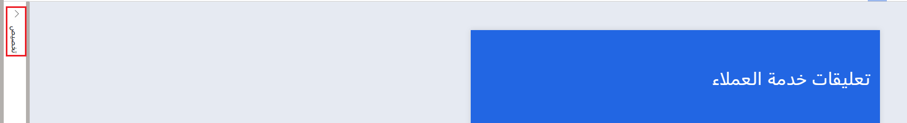
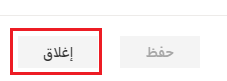

في هذا التمرين، ستقوم بإنشاء قالب بريد إلكتروني وتخصيصه، بما في ذلك متغيرات الاستبيان.

> [!IMPORTANT]
> يُمكنك إكمال هذا التمرين باستخدام Dynamics 365 Customer Service في بيئتك أو دونه. ومع ذلك، إذا كنت ترغب في استكمال المهمة الثانية في التمرين 3، فسيلزمك استكمال هذه الخطوات في بيئة تتضمن Dynamics 365 Customer Service أيضاً. يمكنك استكمال هذه التمارين في إصدار تجريبي أو بيئة الاختبار المعزولة.

## التمرين 1: إنشاء مشروع جديد

في هذا التمرين، ستقوم بإنشاء مشروع جديد.

1. انتقل إلى [Dynamics 365 Customer Voice](https://customervoice.microsoft.com/?azure-portal=true) وسجّل الدخول باستخدام بيانات الاعتماد الخاصة بك.

1. حدّد **الشروع في العمل**.

    > [!div class="mx-imgBorder"]
    > 

1. حدد قالب مشروع **الدعم**.

    > [!div class="mx-imgBorder"]
    > 

1. حدّد **إصدار أولي**، والذي سيوفر نظرة عامة على الاستبيان المرتبط بهذا المشروع.

    > [!div class="mx-imgBorder"]
    > 

1. وعند الانتهاء من مراجعة الاستبيان، حدد **إقفال**.

    > [!div class="mx-imgBorder"]
    > 

1. حدد زر **التالي** للمتابعة.

    > [!div class="mx-imgBorder"]
    > 

1. من نافذة **‏‫أين تريد إنشاء المشروع‬**، يُمكنك تحديد الموقع الذي تود إضافة المشروع إليه. حدد الرابط **راجع جميع البيئات**.

    > [!div class="mx-imgBorder"]
    > 

1. سيتم توجيهك إلى نافذة **‏‫جميع البيئات‬**، والتي توفر قائمة بجميع بيئات Common Data Service التي يحق لك الوصول إليها. حدد البيئة التي تستخدمها لاستكمال هذا التمرين. إذا كان لديك حق الوصول إلى البيئة، فسيتم عرض رسالة توضح أنه تم منح الإذن. حدد زر **تحديد وإغلاق**.

    > [!div class="mx-imgBorder"]
    > 

    > [!NOTE]
    > نظراً إلى استخدامك Customer Voice لفترة من الوقت، سيتم ملء قائمة المواقع الأخيرة بأحدث البيئات التي استخدمتها. وبعد ذلك، يُمكنك تحديد البيئة مباشرة من هذه القائمة بدلاً من ذلك.

    > [!div class="mx-imgBorder"]
    > 

1. حدد زر **إنشاء**. في حالة تعذُّر تحديد الزر، يجب التأكيد باستخدام الخطوة السابقة ثم التأكّد من تحديد موقع واحد.

    > [!div class="mx-imgBorder"]
    > 

## تمرين 2: إضافة متغيرات الاستبيان

في هذا التدريب، ستتعلم كيفية إنشاء المتغيرات وإضافتها إلى الاستبيان.

### المهمة 1: إنشاء متغيرات

في هذه المهمة، ستقوم بإنشاء المتغيرات.

1. حدد لوحة **تخصيص** الموجودة في أعلى الزاوية اليمنى من استبيان "دقة الحالة" في مشروعك.

    > [!div class="mx-imgBorder"]
    > 

1. من القائمة التي تفتح، حدد **تخصيص**.

    > [!div class="mx-imgBorder"]
    > 

1. ستعرض شاشة **تخصيص** جميع المتغيرات الموجودة لاستبيان "دقة الحالة". حدد **‏‫إضافة متغير‬**.

    > [!div class="mx-imgBorder"]
    > 

1. اكتب **CaseNumber‎** في اسم المتغير. تأكد من عدم تضمين مسافة بين الكلمتين. في حالة القيام بذلك، سيتم عرض رسالة توضح "الأحرف القياسية مطلوبة". أزل المسافة لإزالة رسالة الخطأ. حدد **‏‫إضافة متغير‬** مرة أخرى.

    > [!div class="mx-imgBorder"]
    > 

1. اكتب **‎CaseTitle‎** في اسم المتغير. حدد زر **حفظ** لإضافة المتغيرين الجديدين.

    > [!div class="mx-imgBorder"]
    > 

    سيتم عرض رسالة تأكيد في لوحة **تخصيص** للإشارة إلى إضافة المتغيرين.

    > [!div class="mx-imgBorder"]
    > 

1. حدد زر **إغلاق** لإغلاق هذا القسم.

    > [!div class="mx-imgBorder"]
    > 

1. حدد السهم لتصغير لوحة **تخصيص**.

    > [!div class="mx-imgBorder"]
    > 

لقد نجحت في إضافة متغيرين جديدين لاستخدامهما في الاستبيان.

### المهمة 2: إضافة متغيرات إلى الاستبيان

في هذه المهمة، ستقوم بإضافة متغيرات إلى وصف الاستبيان.

1. حدد وصف الاستبيان لتمييز النص ثم احذف النص.

    > [!div class="mx-imgBorder"]
    > 

1. حدد القائمة المنسدلة **المتغيرات** ثم حدد **First Name**.

    > [!div class="mx-imgBorder"]
    > 

1. ستتم إضافة **{{First Name}}** إلى الوصف. أضف فاصلة بعد المتغير ثم أضف النص التالي: **نحن نقدر عملك. لقد أغلقنا مؤخراً بطاقة دعم لك، وسنكون ممتنين لتعليقاتك على هذه التجربة. وكمرجع لك، إليك معلومات حالتك:**

    > [!div class="mx-imgBorder"]
    > 

1. حدد القائمة المنسدلة **المتغيرات**، وهذه المرة حدد **رقم الحالة**. أضف واصلة ثم حدد القائمة المنسدلة **المتغيرات** مرة أخرى لتحديد **عنوان الحالة**.

    > [!div class="mx-imgBorder"]
    > 

يجب أن يشبه وصف الاستبيان المكتمل لقطة الشاشة التالية.

> [!div class="mx-imgBorder"]
> 

لقد نجحت في إضافة متغيرات إلى وصف الاستبيان.

## تمرين 3: تخصيص قالب بريد إلكتروني 

في هذا التدريب، ستتعلم كيفية تخصيص قالب البريد الإلكتروني وإضافة متغيرات الاستبيان إلى الموضوع والنص الأساسي للبريد الإلكتروني.

### المهمة 1: إضافة متغيرات إلى قالب البريد الإلكتروني

في هذه المهمة، ستقوم بإضافة متغيرات إلى قالب البريد الإلكتروني.

1. من استبيان دقة الحالة الرئيسي، حدد علامة تبويب **إرسال** من أعلى الجزء الأيمن من الشاشة.

    > [!div class="mx-imgBorder"]
    > 

1. حدد خيار **البريد الإلكتروني**.

    > [!div class="mx-imgBorder"]
    > 

1. حدد القائمة المنسدلة **قالب**. سيتم تحديد قالب **تعليقات الدعم** بالفعل وهو القالب الذي سيتم عرضه في منطقة **البريد الإلكتروني**. حدد القائمة المنسدلة **القالب** مرة أخرى لإغلاقها.

    > [!div class="mx-imgBorder"]
    > 

1. حدد **الموضوع** ثم حدد النص الموجود في موضعه بالفعل. احذف النص.

    > [!div class="mx-imgBorder"]
    > 

1. حدد القائمة **إدراج** ثم مرّر المؤشر فوق خيار **المتغيرات المخصصة**. سيتم عرض قائمة المتغيرات المتاحة. حدد **First Name** لإضافته إلى الموضوع.

    > [!div class="mx-imgBorder"]
    > 

1. بعد متغير "First Name"، أضف النص التالي: **هل يمكنك مشاركة تعليقات في تجربتك الأخيرة؟**

    > [!div class="mx-imgBorder"]
    > 

1. في النص الأساسي للبريد الإلكتروني، حدد متغير **Last Name** ثم احذفه.

    > [!div class="mx-imgBorder"]
    > 

1. بعد الجملة الثانية التي تنتهي بكلمة *المستقبل*، أضف النص التالي: **قمنا بإغلاقه مؤخراً**.

1. حدد قائمة **إدراج**، ومرّر المؤشر فوق خيار **المتغيرات المخصصة**، ثم حدد **CaseNumber‎**.

    > [!div class="mx-imgBorder"]
    > 

1. أضف واصلة ثم حدد **CaseTitle‎** لإضافته كمتغير أيضاً. يجب أن يكون قالب بريدك الإلكتروني مشابهاً للقطة الشاشة التالية.

    > [!div class="mx-imgBorder"]
    > 

1. حدد زر **حفظ** من الجزء السفلي من قالب البريد الإلكتروني.

    > [!div class="mx-imgBorder"]
    > 

سيظهر إخطار في الجزء العلوي من الشاشة، والذي يشير إلى أن القالب قد تم حفظه بنجاح.

> [!div class="mx-imgBorder"]
> 

### المهمة 2: إرسال بريد إلكتروني يحتوي على متغيرات تم ملؤها

في هذه المهمة، ستقوم بإرسال بريد إلكتروني يحتوي على المتغيرات التي تم ملؤها لأحد المستلمين. لإكمال هذه المهمة، ستحتاج إلى استخدام عنوان بريد إلكتروني يمكنك الوصول إليه.

1. حدد علامة التبويب **إرسال** من استبيان دقة الحالة الرئيسي.

    > [!div class="mx-imgBorder"]
    > 

1. حدد خيار **البريد الإلكتروني**.

    > [!div class="mx-imgBorder"]
    > 

1. حدد الرابط **استيراد جهات الاتصال** في أعلى الجزء الأيمن من قالب البريد الإلكتروني.

    > [!div class="mx-imgBorder"]
    > 

1. حدد **الخيارات المتقدمة**.

    > [!div class="mx-imgBorder"]
    > 

1. في قسم **الخيارات المتقدمة**، يمكنك تنزيل قالب يتضمن جميع المتغيرات من الاستبيان ذي الصلة. حدد تنزيل **القالب المتقدم**.

    > [!div class="mx-imgBorder"]
    > 

1. سيتم تنزيل ملف CustomerVoiceSample.csv. انتقل إلى مجلد التنزيلات الخاص بك وافتح الملف. قم بتعبئة الحقول بعنوان البريد الإلكتروني (الذي تتوفر لديك صلاحية الوصول إليه) والاسم الأول واسم العائلة ورقم الحالة ومعلومات عنوان الحالة.

    > [!div class="mx-imgBorder"]
    > 

1. إذا كانت لديك صلاحية الوصول إلى Dynamics 365 Customer Service مع جدول الحالة، يمكنك أيضاً إكمال العمودين **RegardingID‎** و **RegardingEntityName‎**. إذا قمت بفتح حالة في Dynamics 365، فسوف تشتمل نهاية عنوان URL على المعرف الفريد من الحالة.

    > [!div class="mx-imgBorder"]
    > 

1. أضف معرف الحالة في حقل **RegardingID‎** ثم اكتب كلمة **حدث** في عمود **RegardingEntityName‎**.

    > [!div class="mx-imgBorder"]
    > 

1. احفظ ملف CSV إلى سطح المكتب (أو في أي مجلد يتوفر لديك حق الوصول إليه).

1. حدد زر **تحميل** من شاشة **استيراد جهات الاتصال**.

    > [!div class="mx-imgBorder"]
    > 

1. استعرض حتى تصل إلى المكان الذي قمت فيه بحفظ الملف، وحدده، ثم حدد **فتح** من عنصر تحكم البحث.

    > [!div class="mx-imgBorder"]
    > 

1. سيتم استيراد الملف وسيظهر إخطار يوضح بأنه كان ناجحاً. يجب عرض البريد الإلكتروني والاسم الأول واسم العائلة لجهة الاتصال.

    > [!div class="mx-imgBorder"]
    > 

1. حدد زر **استيراد** من شاشة **استيراد جهات الاتصال**.

    > [!div class="mx-imgBorder"]
    > 

1. من المفترض أن يعرض حقل **المستلمين** مستلماً واحداً. حدد زر **إرسال** من الجزء السفلي للبريد الإلكتروني.

    > [!div class="mx-imgBorder"]
    > 

1. افتح علبة الوارد الخاصة بعنوان البريد الإلكتروني الذي استخدمته. يجب أن تكون قد تلقيت رسالة إلكترونية تتضمن الاسم الأول في "الموضوع". ويجب أيضاً عرض رقم الحالة وعنوان الحالة. حدد زر **بدء الاستبيان**.

    > [!div class="mx-imgBorder"]
    > 

   ومن المفترض كذلك أن يعرض الاستبيان نفس المتغيرات الثلاثة التي تم ملؤها في الوصف.

    > [!div class="mx-imgBorder"]
    > 

1. إذا كان ملف الاستيراد الخاص بك تضمن العمودين **RegardingID‎** و **RegardingEntityName‎**، فيمكنك الانتقال إلى الحالة في Dynamics 365. سيتم عرض دعوة الاستبيان في الخط الزمني في الحالة.

    > [!div class="mx-imgBorder"]
    > 
    
