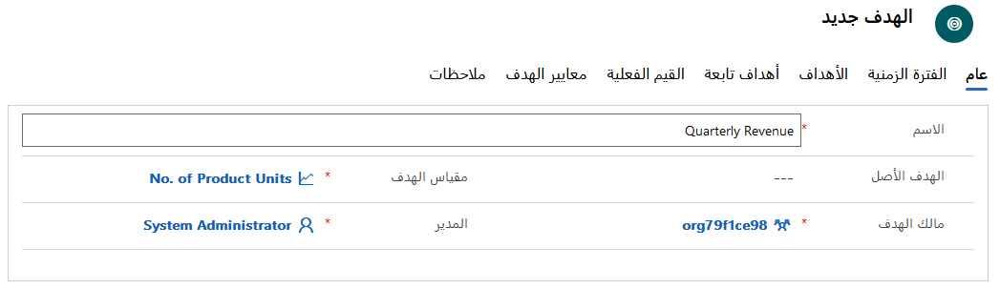
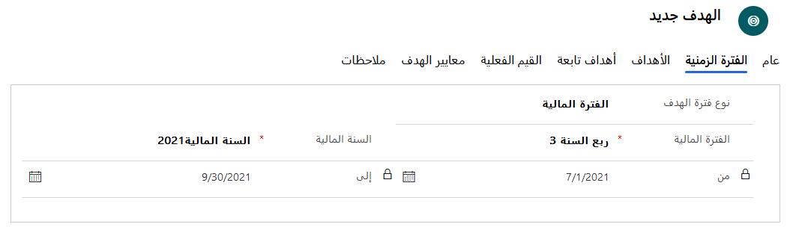
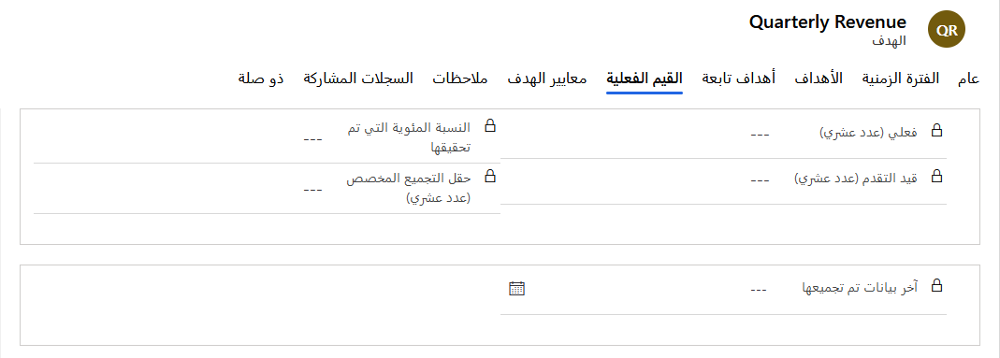
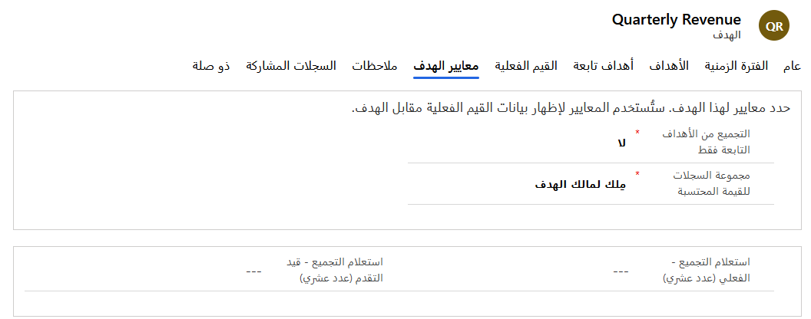

يمثل الهدف في Dynamics 365 السجل الذي يحدد التفاصيل المحددة حول ما سيتم قياسه على وجه التحديد. وعلى وجه الخصوص، يتعلق الأمر بالمسؤول (المستخدم أو الفريق)، والوقت المحدد الذي تتعقب فيه هذا الهدف.

سيعتمد كل هدف تقوم بإنشائه على سجل مقياس هدف أساسي بنوع مقياس إما "مبلغ" أو "عدد". ويحدد اختيار مقياس الهدف كيفية حساب القيم الفعلية والقيم قيد التقدم. تتعقب العديد من الأهداف كلاً من القيمة الفعلية والقيمة قيد التقدم مقابل الهدف.

على سبيل المثال، قد يكون لدى أحد مندوبي المبيعات إيراد شهري مستهدف ويتعقب الفرص المتاحة وفرص الربح مقابل الهدف. ومع ذلك، لا يلزم أن تتضمن سجلات الأهداف كلاً من الأعمدة الفعلية وقيد التقدم المحسوبة.

وتختلف الأهداف عن مقاييس الهدف من حيث أن الأهداف ستكون دائماً محددة بفترة زمنية ذات قيمة مستهدفة. تتكون سجلات الأهداف من ثلاث قيم رقمية يمكن استخدامها معاً لتتبع مدى التقدم مقابل الأهداف:

- **القيم المستهدفة** - يتم إدخالها يدوياً بواسطة المستخدم. وهي تمثل الهدف في الحقيقة.
- **القيم الفعلية** - يتم حسابها وتحديدها بواسطة عمود **القيمة المحتسبة فعلياً** المحدد في مقياس الهدف الأساسي. بمعنى آخر، مستوى ما تحققه مقارنة بالهدف المستهدف.  
- **القيم قيد التقدم** - يتم حسابها وتحديدها بواسطة عمود **القيمة المحتسبة قيد التقدم** المحدد في مقياس الهدف الأساسي أو السجلات المحتملة التي يمكن حسابها ضمن هدفك الفعلي.

يتم دائماً إنشاء الأهداف حول فترة زمنية باستخدام قيمة مستهدفة. على سبيل المثال، حددت Janet هدفاً ألا وهو ربح 50 فرصة هذا الشهر، وبالتالي فإن القيمة المستهدفة هي "50" والفترة الزمنية هي "شهر واحد".

**عمود القيمة المحتسبة** هو عمود يحتوي على أعمدة محسوبة للقيم الفعلية والقيم قيد التقدم. تحدد المعايير المحددة في أعمدة الهدف ومقياس الهدف، جنباً إلى جنب مع مالكي السجلات الأساسية، السجلات التي يتم تضمينها في حساب العمودين **الهدف** و **قيد التقدم** الخاصين بالهدف.

### إنشاء الأهداف

بعد تحديد مقاييس الأهداف المحددة التي تريد تعقبها، يمكنك إنشاء سجلات الأهداف الفعلية الخاصة بك للمستخدمين والفرق. يمكن إنشاء الأهداف من إعدادات التطبيق في تطبيق مركز المبيعات.

عند تحديد هدف، ستحتاج إلى تقديم المعلومات التالية:

- **الاسم** - الاسم الذي يصف الهدف.
- **الهدف الأصلي** - إذا كان هذا الهدف هدفاً تابعاً لهدف آخر، فحدد ذلك الهدف كهدف أصلي.
- **مقياس الهدف** - حدد كيفية تعقب الهدف عن طريق تحديد مقياس للهدف. (إذا حددت هدفاً أصلياً لهذا الهدف، فلا يمكنك تحديد مقياس هدف، حيث يتم ملؤه تلقائياً من الهدف الأصلي.)
- **مالك الهدف** - حدد المستخدم أو الفريق المسؤول عن تحقيق الهدف.

سيكون لكل هدف معلومات عن الفترة الزمنية التي ستحدِّد فيها ما إذا كانت فترة الهدف فترة مالية أم فترة مخصصة.
- إذا كان **نوع فترة الهدف** هو **الفترة المالية**، فحدد الفترة المالية والسنة المالية التي يتم تعقب الهدف خلالها.
- إذا كان **نوع فترة الهدف** هو **الفترة المخصصة**، فحدد تاريخاً في العمودين **من** و **إلى** لتحديد فترة مخصصة يتم تعقب الهدف خلالها.

في علامة التبويب **الأهداف**، حدد القيمة المستهدفة التي يتم على أساسها قياس نتائج القيمة المحتسبة للهدف. يعتمد نوع الهدف على **نوع بيانات المبلغ** المحدد لمقياس الهدف الذي حددته لهذا الهدف.

سترى أحد الأعمدة المطلوبة التالية:

- **الهدف (عشري)** - يتوفر هذا العمود إذا كان **نوع المقياس** الخاص بالهدف هو **مبلغ** وكان **نوع بيانات المبلغ** هو **عشري**.
- **الهدف (أموال)** - يتوفر هذا العمود إذا كان **نوع المقياس** الخاص بالهدف هو **مبلغ** وكان **نوع بيانات المبلغ** هو **أموال**.
- **الهدف (عدد صحيح)** - يتوفر هذا العمود إذا كان **نوع المقياس** الخاص بالهدف هو **مبلغ** وكان **نوع بيانات المبلغ** هو **عدد صحيح** أو إذا كان **نوع المقياس** الخاص بالهدف هو **عدد**.

إذا تم تحديد الخيار **تعقب تمديد الهدف** لمقياس الهدف الذي تستخدمه، فسترى أيضاً أحد الأعمدة المطلوبة التالية:

- **الهدف الممدد (عشري)** - يتوفر هذا العمود إذا كان **نوع المقياس** الخاص بالهدف هو **مبلغ** وكان **نوع بيانات المبلغ** هو **عشري**.
- **الهدف الممدد (أموال)** - يتوفر هذا العمود إذا كان **نوع المقياس** الخاص بالهدف هو **مبلغ** وكان **نوع بيانات المبلغ** هو **أموال**.
- **الهدف الممدد (عدد صحيح)** - يتوفر هذا العمود إذا كان **نوع المقياس** الخاص بالهدف هو **مبلغ** وكان **نوع بيانات المبلغ** هو **عدد صحيح** أو إذا كان **نوع المقياس** الخاص بالهدف هو **عدد**.

تعرض علامة التبويب **القيم الفعلية** القيمة الفعلية التي تم تحقيقها مقابل الهدف اعتباراً من تاريخ أحدث قيمة محتسبة:
- **القيمة الفعلية (أموال)** - إذا كان مقياس الهدف يستخدم **أموال** باعتبارها **نوع بيانات المبلغ**، يعرض هذا العمود المبلغ الإجمالي للأموال التي تم تحقيقها مقابل الهدف اعتباراً من تاريخ أحدث قيمة محتسبة.
- **قيد التقدم (أموال)** - إذا كان مقياس الهدف يستخدم **أموال** باعتبارها **نوع بيانات المبلغ**، يعرض هذا العمود مقدار الأموال التي تم تحقيقها مقابل الهدف منذ آخر مرة تم فيها حساب القيم الفعلية.
- **النسبة المئوية التي تم تحقيقها** - إذا كان مقياس الهدف هو **عشري** أو **عدد صحيح**، يعرض هذا العمود النسبة المئوية للهدف المكتمل اعتباراً من تاريخ أحدث قيمة محتسبة.
- **تاريخ أحدث قيمة محتسبة** - يعرض هذا العمود أحدث تاريخ ووقت تمت فيه إعادة حساب القيم الفعلية.

في علامة التبويب **معايير الهدف**، حدد المعايير التي سيتم استخدامها لحساب بيانات القيم الفعلية مقابل الهدف.

- **الحساب من الأهداف التابعة فقط** - إذا كنت تريد قصر البيانات المستخدمة في القيمة المحتسبة على الأهداف التابعة فقط، فحدد **نعم**. وللسماح باستخدام البيانات الأخرى لعمليات الحساب، حدد **لا**.
- **مجموعة السجلات للقيمة المحتسبة** - إذا كنت تريد قصر السجلات التي يمكن تضمينها في القيمة المحتسبة على تلك السجلات التي يمتلكها مالك الهدف فقط، فحدد **مِلك لمالك الهدف**. للسماح بتضمين جميع السجلات في بيانات القيمة المحتسبة، حدد **الكل**.

