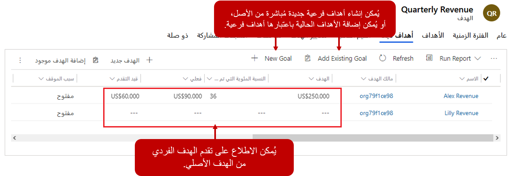

يتيح Microsoft Dynamics 365 الحصول على الأهداف الأصلية والأهداف الفرعية. بشكل أساسي، يمكن أن يكون للأهداف الأصلية هدف واحد أو أكثر من الأهداف الفرعية التابعة أدناه. يمكن أن تصل نتيجة كل الأهداف الفرعية إلى الهدف الأصلي المستهدف الأساسي. يسمح ذلك بتقييم كل مكون من مكونات بنية الهدف بشكل فردي وكفريق كامل. أثناء تجميع الهدف، يتم إدراج إجماليات الأهداف الفرعية في إجماليات الأهداف الأصلية مع إنشاء مجموع تراكمي لجميع إجماليات الأهداف.

إليك مثال على ذلك:

-   تشغل ليندا منصب مديرة مبيعات في إحدى المناطق.

-   وتتولى إدارة ثلاثة أشخاص: سوزان وديفيد وريان.

-   ولدى كل بائع هدف قائم على الإيرادات بقيمة 500,000.00 دولار.

-   هدف ليندا كمديرة هو الوصول إلى مبلغ بقيمة 1,500,000.00 دولار

-   ونظرًا لأن سوزان وديفيد وريان يبيعون خلال فترة ما، يجب تضمين نتائجهم في هدف ليندا.

وباستخدام أهداف الأصلية والفرعية، يمكنك مراقبة مستوى تقدم ليندا العام لتحقيق هدف المبيعات المحدد لها كمديرة. يمكن تكوين هدفها ليشمل كل هدف من أهداف أعضاء فريقها الفردية.

## تحديد الأهداف الفرعية

يمكن تحديد الأهداف الفرعية بطريقتين. تتمثل الطريقة الأولى في إعداد عمود **الهدف الأصلي** على الهدف الذي يجب أن يكون هدفًا فرعيًا. وتحدد الطريقة الأخرى الأهداف الفرعية مباشرة من الهدف الأصلي. يتم ذلك من خلال علامة تبويب **الأهداف الفرعية** الموجودة على الهدف الذي سيكون هو الهدف الأصلي. يمكنك إنشاء أهداف فرعية جديدة مباشرة من علامة التبويب، أو يمكنك إضافة أهداف موجودة.

ضمن علامة تبويب **معايير الهدف**، يمكنك أيضًا تحديد ما إذا كان يجب أن يستند التقدم فقط إلى التقدم في الأهداف الفرعية أو ما إذا كان يجب أيضًا تضمين التقدم الفردي. على سبيل المثال، يمكن لأحد المديرين أيضًا بيع الأصناف. إذا لم يتم احتساب أي مبيعات يقوم بها المدير في إطار هدفه الإداري، فسيتعين عليك تعيين العرض الإجمالي فقط من عمود **الأهداف الفرعية** إلى **نعم**. إذا كان يجب احتساب مبيعاتهم، عندئذ يمكن تعيين العمود إلى **لا**. يتم تعيين العمود إلى **لا** بشكل افتراضي.

إليك بعض النقاط الرئيسية الأخرى عن الأهداف الأصلية: 

-   يمكن أن يحتوي الهدف على أهداف فرعية متعددة ويكون هدفًا فرعيًا لهدف آخر (هدف متفرع).

-   إذا حذفت هدفًا أصليًا، فلن يتم حذف الأهداف الفرعية، بل تتم إزالة الإشارة إلى الهدف الأصلي فقط.

-   يجب أن تستند جميع الأهداف المذكورة في تدرج الهدف الهرمي إلى نفس الفترة المالية أو الفترة المخصصة. إذا قمت بتحديد فترة زمنية مختلفة للهدف الفرعي، فسيتم استخدام الفترة الزمنية للهدف الأصلي.
