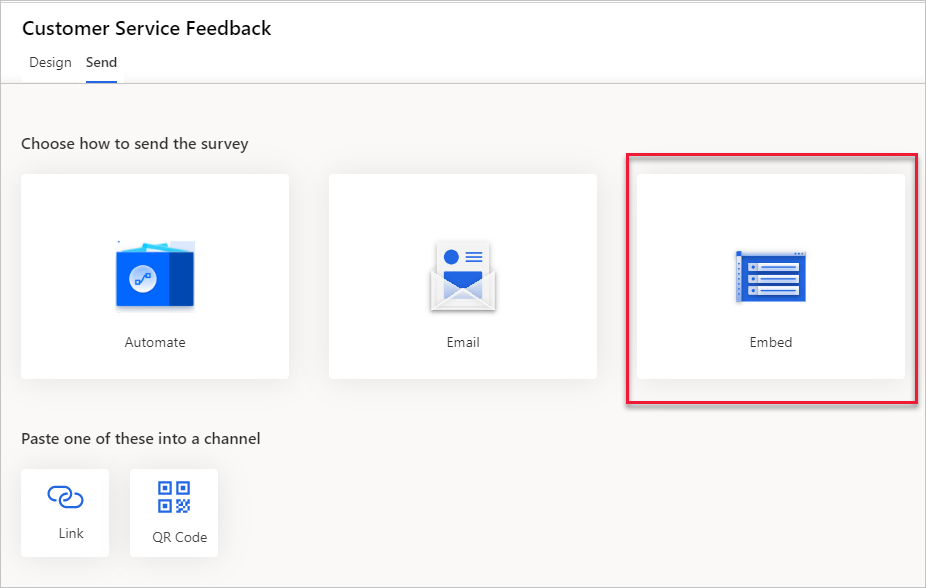
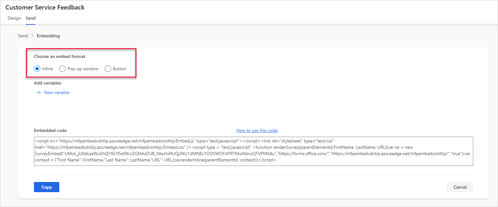

توجد العديد من الطرق لإرسال استطلاع، ولكن خيار التضمين يوفر طريقة لعرض النموذج Dynamics 365 Customer Voice مباشرة على صفحة ويب. يمكنك الوصول إلى خيار **تضمين** من علامة التبويب **إرسال** في استطلاع محدد. من المهم أن نفهم أن أي كود تضمين يتم توفيره يكون فريداً بالنسبة للاستطلاع الذي تتم مراجعته حالياً. 



تحتوي صفحة **التضمين** للاستطلاع على ثلاثة تنسيقات مختلفة يمكنك استخدامها.

|     نمط التضمين    |     التفاصيل                                                                                                                                                                                         |
|--------------------|-----------------------------------------------------------------------------------------------------------------------------------------------------------------------------------------------------|
|     مضمن         |     يشبه هذا النمط استخدام iframe في أن الاستطلاع مضمن مباشرةً داخل صفحة ويب، ويظهره بشكل ثابت. يمكن وضع الاستطلاع في أي مكان على الصفحة باستخدام التعليمات البرمجية المضمنة.    |
|     عنصر منبثق         |     يمكن استخدام نافذة منبثقة لإظهار الاستطلاع في منتصف الصفحة، متراكبة عبر صفحة الويب الموجودة تحتها.                                                                                   |
|     الزر         |     عند استخدام رمز الزر، يتم عرضه في الزاوية اليمنى السفلية من صفحة الويب، وعند تحديده، يتم توسيعه لعرض الاستطلاع لزائر موقع الويب.                      |



بعد تحديد تنسيق التضمين، عند عرض الرمز، سيؤدي تحديد الزر **نسخ** إلى إضافته إلى حافظة المستخدم، مما يوفر القدرة على لصقه في المفكرة (أو أي رمز محرر) للمراجعة. 

سيكون الرمز مشابهاً للعينة التالية: 

```html
<script src="https://mfpembedcdntip.azureedge.net/mfpembedconttip/Embed.js" type="text/javascript"></script><link rel="stylesheet" type="text/css" href="https://mfpembedcdntip.azureedge.net/mfpembedconttip/Embed.css" /><script type = "text/javascript" >function renderSurvey(parentElementId,FirstName, LastName, ProductPage){var se = new SurveyEmbed("UMck_jU0zkqaWu5hQY9ZJfSe99ccZGtMuDUB_NkyHxRUQjJNU1dMNEc1ODVWOFdTRTMwNlowQTVPMS4u","https://forms.office.com/","https://mfpembedcdntip.azureedge.net/mfpembedconttip/","true");var context = {"First Name": FirstName,"Last Name": LastName,"ProductPage": ProductPage,};se.renderInline(parentElementId, context);}</script>
```
ستظهر أي متغيرات تمت إضافتها إلى الاستطلاع في نهاية الكود. يعرض البرنامج النصي السابق **الاسم الأول**، **اسم العائلة**، ومتغيرات **ProductPage**. لا يمكن إزالة المتغيرات **الاسم الأول** و **اسم العائلة** من الاستطلاع، لذلك يجب عليك الاحتفاظ بها في الكود. يمكن بعد ذلك إضافة الكود إلى صفحة ويب بواسطة مسؤول موقع الويب. إذا تمت إضافة هذا الكود فقط، فلن يتم عرض الاستطلاع بعد. هناك حاجة إلى عدد قليل من العناصر لجعلها مرئية. يجب عرض الاستطلاع باستخدام عنصر يُعرف باسم علامة قسم المحتوى (DIV)، والذي يخبر موقع الويب بمكان وضع الاستطلاع على الصفحة. يمكن تعيين ارتفاع وعرض المسح باستخدام بعض عناصر النمط. 

```html
<div id="surveyDiv" style="height: 700px; width:600px; margin-left:auto; margin-right:auto"></div>
```

ستضمن إضافة عنصر DIV مباشرة بعد الرمز المنسوخ من الاستطلاع Dynamics 365 Customer Voice أن الاستطلاع مرئي على موقع الويب. ومع ذلك، يمكنك أيضاً المرور عبر القيم باستخدام متغير في الاستطلاع. ضع في اعتبارك استطلاعاً يُستخدم لالتقاط العملاء المحتملين والذي يمكن لزوار الموقع إكماله عند التواجد على صفحات ويب مختلفة للمنتج. يمكنك استخدام نفس الاستطلاع في كل مرة ولكن تمر عبر اسم المنتج من صفحة الويب. لإنجاز هذه المهمة، تحتاج إلى إضافة البرنامج النصي التالي بين عناصر DIV. 

كما ذكرنا سابقاً، لا يمكن إزالة متغيري **الاسم الأول** و **اسم العائلة** ولكن يمكنك المرور عبر **العميل المتوقع** باعتباره **الاسم الأول** و **التقاط** باعتباره **اسم العائلة**. يمكن استخدام المتغير **ProductPage** لتمرير اسم المنتج، وسيتم تمرير جميع المعلومات الثلاثة مرة أخرى إلى Dynamics 365 Customer Voice مع كل استجابة استطلاع. 


```javascript
<script>
     window.addEventListener('load', function () {
            renderSurvey("surveyDiv","Lead","Capture","Product A");
        }, false);
</script>
```


سيبدو الكود بأكمله مشابهاً للعينة التالية.


```javascript
<script src="https://mfpembedcdntip.azureedge.net/mfpembedconttip/Embed.js" type="text/javascript"></script><link rel="stylesheet" type="text/css" href="https://mfpembedcdntip.azureedge.net/mfpembedconttip/Embed.css" /><script type = "text/javascript" >function renderSurvey(parentElementId,FirstName, LastName, ProductPage){var se = new SurveyEmbed("UMck_jU0zkqaWu5hQY9ZJfSe99ccZGtMuDUB_NkyHxRUQjJNU1dMNEc1ODVWOFdTRTMwNlowQTVPMS4u","https://forms.office.com/","https://mfpembedcdntip.azureedge.net/mfpembedconttip/","true");var context = {"First Name": FirstName,"Last Name": LastName,"ProductPage": ProductPage,};se.renderInline(parentElementId, context);}</script>
<center>
<div id="surveyDiv" style="height: 700px; width:600px; margin-left:auto; margin-right:auto">
<script>
     window.addEventListener('load', function () {
                        renderSurvey("surveyDiv","Lead","Capture","Product A");
        }, false);
</script>
</div>
</center>
```
> 
> 
> [!VIDEO https://www.microsoft.com/videoplayer/embed/RE4AWEG]
