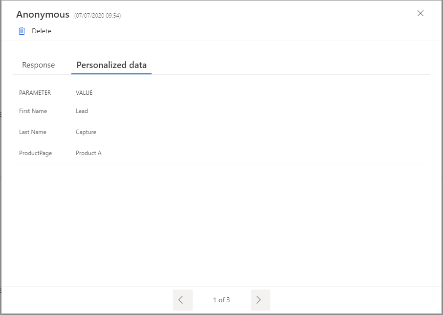

بعد تضمين الاستبيان في أحد مواقع الويب، يمكنك فتح الاستجابة داخل Dynamics 365 Customer Voice. من نفس الاستبيان، يمكنك الوصول إلى قسم "التقارير" وفتح التقرير بنفس الاسم. من اللوحة اليسرى، افتح مقطع "المستجيبون"، حيث سيعرض قائمة بجميع المستجيبين للاستبيان. سيؤدي فتح إحدى الاستجابات الفردية إلى توفير الاستجابات لكل سؤال، وذلك باستخدام علامة التبويب **البيانات الشخصية** التي تعرض المتغيرات من الاستبيان. تُظهر علامة التبويب هذه أيضًا القيم التي تم تمريرها من الاستبيان المضمن على موقع الويب، مما يوفر المزيد من المعلومات حول مصدر الاستجابة. 



تعد هذه الطريقة إحدى طرق مراجعة المتغيرات لكل استجابة، ولكن إذا كنت تريد استخدام هذه المعلومات لإنشاء مشغلات والعمل على البيانات، يمكنك إنشاء تدفق في Power Automate. يجب أن يتم تشغيل التدفق عندما يرسل شخص ما استبيان من موقع الويب. راجعت وحدة نمطية سابقة لمسار التعليم هذا كيفية إنشاء تدفق يتم تشغيله باستخدام موصل Microsoft Dataverse الذي يتم تشغيله لاستجابات استبيان Dynamics 365 Customer Voice عند إنشاء سجل جديد. باستخدام تعبير موجود في إعدادات المشغل، يمكنك تعيين حالة المشغل لتحديد أن التدفق لن يعمل إلا للاستجابات الخاصة بالاستبيان باستخدام معرف محدد. هناك طريقة أخرى تتمثل في تعيين حالة تشغيل تشير إلى أن التدفق لن يعمل إلا إذا احتوت استجابة الاستبيان على متغير **ProductPage‎**. باستخدام هذا النهج، ستؤدي الاستجابات الواردة من الاستبيان المضمّن في موقع الويب فقط إلى تشغيل التدفق. 

```powerappsfl
contains(msfp_embedcontextparameters, '"ProductPage":"true"')
```

بعد اتباع الخطوات الموضحة في الوحدة السابقة، يجب أن يحتوي التدفق على خطوات مشابهة للمثال التالي.

|     الخطوة    |     الموصل              |     تفاصيل الخطوة                                                                                                    |
|-------------|----------------------------|---------------------------------------------------------------------------------------------------------------------|
|     1       |     Microsoft Dataverse    |     عندما يتم إنشاء سجل جديد                                                                                    |
|     2       |     Microsoft Forms        |     الحصول على تفاصيل الاستجابة                                                                                            |
|     3       |     تحليل JSON             |     استخدم بيانات السياق الخاصة بالمحتوى وألصق بيانات السياق من استجابة استبيان الاختبار كمخطط    |

بعد إنشاء الخطوات السابقة، سيتم تحديد باقي المعلمات من خلال متطلبات المؤسسة وأهدافها. في المثال الذي يتم فيه تضمين استبيان في صفحات الويب المرتبطة بمنتجات مختلفة، يمكن استخدامه لتسجيل العملاء المتوقعين الجدد وإنشاء حساب لهم في Dynamics 365. يمكن استخدام استجابات الأسئلة لملء أعمدة **الاسم الأول** و **الاسم الأخير** و **البريد الإلكتروني**، ويمكن استخدام قيمة المعلمة للمتغير **ProductPage‎** لملء **الموضوع** الموجود في **العميل المتوقع**. يزود هذا النهج مدير تطوير الأعمال بالمعلومات المطلوبة للمساعدة في تحديد صفحة المنتج التي كان يتواجد فيها العميل المتوقع عند إكمال الاستبيان. 

