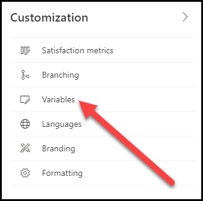

## <a name="exercise-1-embed-a-survey-on-a-webpage"></a>التمرين الأول: تضمين استطلاع على صفحة ويب

في هذا التمرين، عليك إنشاء مشروع باستخدام استطلاع ثم تضمين الاستطلاع في صفحة ويب.

> [!NOTE]
> إذا لم تتوفر لك إمكانية الوصول إلى موقع ويب يمكنك تحريره، فأكمل أكبر عدد ممكن من الخطوات.

### <a name="task-1-create-a-new-project"></a>المهمة رقم 1: إنشاء مشروع جديد

في هذه المهمة، ستُنشئ مشروعاً جديداً باستخدام استطلاع.

1.  انتقل إلى [Microsoft Customer Voice](https://customervoice.microsoft.com) وسجّل الدخول إليه باستخدام بيانات اعتمادك.

2.  حدّد **الشروع في العمل**.

    

3.  حدد خيار المشروع **فارغ**.

    

4.  حدد الزر **التالي** للمتابعة.

5.  من شاشة **‏‫أين تريد إنشاء المشروع؟‬**، حدد الموقع الذي تريد إضافة المشروع إليه. حدد الرابط **راجع جميع البيئات**.

    

6. ستعرض شاشة **‏‫جميع البيئات‬** قائمة بجميع بيئات Microsoft Dataverse التي يتوفر لديك حق الوصول إليها. حدد البيئة التي تستخدمها لإكمال هذا التمرين وحدد الزر **تحديد وإغلاق**.

    

7.  حدد الزر **إنشاء**. في حالة تعذُّر تحديد الزر، يجب التأكيد باستخدام الخطوة السابقة ثم التأكّد من تحديد موقع واحد.

    

8.  من قائمه التنقل، حدد **جميع المشروعات**.

    

9.  ابحث عن المشروع الجديد في القائمة، ثم حدد علامة الحذف (**...**) بجوار اسم المشروع.

    

10. حدد **إعادة تسمية** من القائمة.

    

11. أدخِل **طلب معلومات المنتج** على أنه الاسم الجديد ثم حدد **إعادة تسمية**.

    

12. بعد إعادة تسمية المشروع، انقر نقراً مزدوجاً على المشروع لفتحه من القائمة.

13. حدد علامة الحذف (**...**) بجانب الاستطلاع.

    

14. حدد **إعادة تسمية**.

    

15. أدخِل **طلب منتج على موقع الويب** على أنه الاسم الجديد للاستطلاع، ثم حدد **إعادة تسمية**.

    

16. حدد العنوان **استطلاع جديد**.

    

17. أدخِل **طلب منتج** على أنه **العنوان**.

18. حدد **+ إضافة جديد**.

    

19. حدد سؤالاً نصياً، وأدخِل **الاسم الأول** على أنه السؤال، ثم قم بتمكين الخيار **مطلوب**. حدد **إضافة جديد**.

    

20. حدد سؤالاً نصياً، وأدخِل **اسم العائلة** على أنه السؤال، ثم قم بتمكين الخيار **مطلوب**. حدد **إضافة جديد**.

21. حدد سؤالاً نصياً، وأدخِل **البريد الإلكتروني** على أنه السؤال، ثم قم بتمكين الخيار **مطلوب**. حدد علامة الحذف (**...**) ثم حدد **القيود**.

    

22. حدد القائمة المنسدلة **القيود**، وحدد **البريد الإلكتروني**، ثم حدد **إضافة جديد**.

    

23. حدد سؤالاً نصياً وأدخِل كلمة **تعليقات** على أنها نص السؤال. قم بتشغيل الخيار **‏‫إجابة طويلة‬**، وتأكد من إيقاف تشغيل الخيار **مطلوب**.

    

24. عليك البقاء ضمن مشروعك.

### <a name="task-2-create-variables-for-the-survey"></a>المهمة 2: إنشاء متغيرات للاستطلاع

في هذه المهمة، ستضيف متغيّراً جديداً ليتم استخدامه عند تضمين الاستطلاع في أحد مواقع الويب.

1.  من علامة التبويب **التصميم** في الاستطلاع، حدد **التخصيص**.

    

2.  حدد **المتغيرات**.

    

3.  قم بتمرير الماوس فوق المتغير **‏‫الإعدادات المحلية‬** ثم حدد أيقونة **الحذف** لإزالته.

    

4.  حدد **حذف** مرة أخرى لتأكيد أنك تريد إزالة المتغير.

5.  حدد **‏‫إضافة متغير‬**.

    

6.  أدخِل **صفحة_المنتج** لاسم المتغير ثم حدد **حفظ**.

    

7.  عند ظهور إشارة **‏‫تمت إضافة متغير واحد**، حدد **إغلاق**.

    

8.  عليك البقاء داخل الاستطلاع.

### <a name="task-3-prepare-and-add-the-embedded-code"></a>المهمة 3: تجهيز التعليمة البرمجية المضمنة وإضافتها

في هذه المهمة، ستجهز التعليمة البرمجية اللازمة لتضمين الاستطلاع في موقعك على الويب وبعد ذلك ستضيف التعليمة البرمجية إلى موقع ويب.

1.  من الاستطلاع، حدد علامة التبويب **إرسال** ثم حدد **تضمين**.

    

2.  في قسم **‏‫اختيار تنسيق تضمين‬**، عليك إبقاء الخيار **مضمن** محدداً ثم تحديد **نسخ**.

    

3.  افتح Notepad (أو أي محرر نص آخر على محطة العمل)، ثم انقر بزر الماوس الأيمن ثم حدد **لصق** لإضافة التعليمة البرمجية إلى ملفك. يمكنك حفظ هذا الملف لسجلاتك، إذا كنت تريد.

    

4. أضِف النص التالي إلى الجزء السفلي من الملف الذي أنشأته في الخطوة السابقة. يُستخدم هذا النص لتعيين قيمة **الاسم الأول** على **عميل متوقع**، و **اسم العائلة** على **التقاط**، و **صفحة_المنتج** على **المنتج (أ)**.

   ```javascript
    <script>
    window.addEventListener('load', function () {
    renderSurvey("surveyDiv","Lead","Capture","Product A");
    }, false);
    </script>
   ```

1. فوق البرنامج النصي، أضِف النص التالي:

    ```javascript
    <center>
    <div id="surveyDiv" style="height: 700px; width:600px; margin-left:auto; margin-right:auto">
    ```

1. في أسفل الملف، أضِف النص التالي:

    ```javascript
    </div>
    </center>
    ```

7.  يجب أن يبدو النص البرمجي الكامل الآن مثل الشكل التالي.

    

8.  إذا كان لديك حق الوصول إلى موقع ويب وبإمكانك إضافة هذه التعليمة البرمجية إلى إحدى الصفحات، فسجّل الدخول إلى موقعك على الويب وأضِف النص البرمجي إلى صفحتك على الويب.

    سيتم عرض الاستطلاع على صفحة الويب، كما هو موضّح في الشكل التالي.

    

9. أكمِل الاستطلاع عن طريق إضافة القيمة **John** على أنها **الاسم الأول**، و **Smith** على أنها **اسم العائلة**، و **‪john\@test.com‬** على أنها **البريد الإلكتروني** و **يُرجى إرسال كتيّب تسويقي لهذا المنتج** في العمود **تعليقات**.

10. حدد **إرسال**.

    

### <a name="task-4-review-the-submitted-variable-values"></a>المهمة 4: مراجعة قيم المتغيرات التي تم إرسالها

في هذه المهمة، ستقوم بمراجعة قيم المتغيرات التي تم تمريرها من الاستطلاع المضمّن إلى الرد على الاستطلاع الذي تم إرساله في نهاية المهمة 3.

1.  افتح Dynamics 365 Customer Voice وانتقل إلى الاستطلاع الذي استخدمته للتضمين في موقعك على الويب.

2.  حدد تقرير **طلب منتج على موقع الويب**.

    

3.  من المفترض أن تشاهد الرد الذي أرسلته في المهمة 3. إذا كنت لا تشاهده بعد، فانتظر لبضع لحظات ثم حدّث الشاشة.

    

4.  حدد قائمة **المستجيبون** على يسار الشاشة.

    

5.  انقر نقراً مزدوجاً على الرد **المجهول** في قائمة **‏‫جميع المستجيبين‬**.

    n"}

6.  حدد علامة التبويب **‏‫بيانات مخصصة‬**.

    

    من المفترض أن تشاهد الآن ثلاث قيم تم تمريرها من خلال التعليمة البرمجية المضمنة التي تمت إضافتها إلى صفحة الويب في موقعك على الويب.

    
