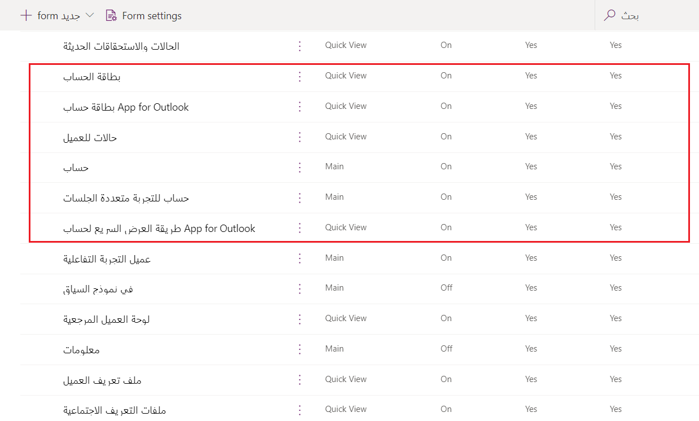
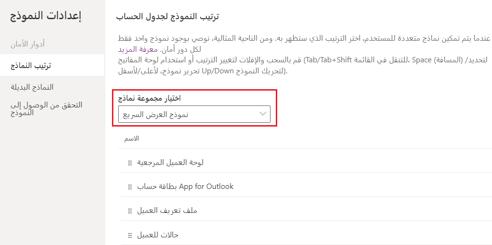
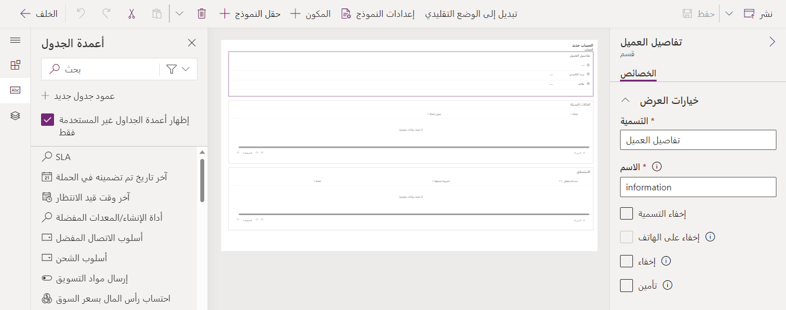
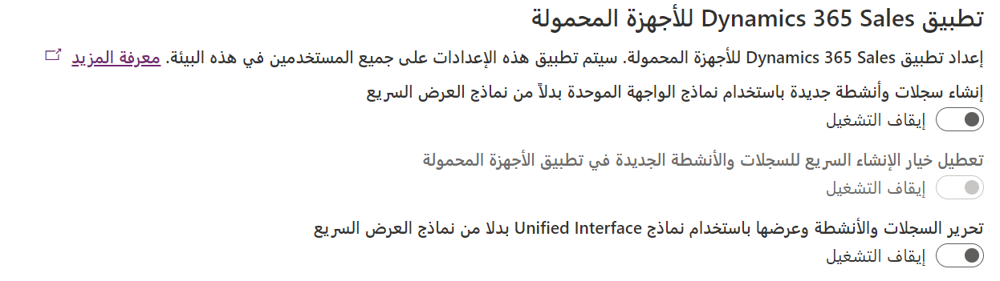

بينما تستعد لنشر تطبيق Dynamics 365 Sales للأجهزة المحمولة لدى المستخدمين، هناك إجراءات كثيرة يمكن أن يقوم بها المسؤولون للمساعدة في مراقبة تجربة المستخدم بالكامل. وبإمكان هذه الإجراءات أن تتراوح من تحديد المعلومات التي يتم عرضها للبائعين الميدانيين في تطبيق الأجهزة المحمولة، إلى تحديد الإعلامات المنبثقة التي يمكنها تنبيه البائعين إلى المعلومات المهمة. لنبدأ أولاً بالتعرف على كيفية التحكم في النماذج التي يتم استخدامها في التطبيق.

تتمثل إحدى الفوائد الرئيسية لتطبيق Dynamics 365 Sales للأجهزة المحمولة في قدرة البائعين الميدانيين على إنشاء السجلات بسرعة، مثل جهات الاتصال والفرص والملاحظات والأنشطة، مباشرة من التطبيق. ينطبق هذا الأمر على إمكانيات الإنشاء السريع المتوفرة في التطبيقات التي تستند إلى النماذج. تتضمن نماذج الإنشاء السريع عدداً صغيراً من الحقول تمثل عادةً البيانات المهمة. على سبيل المثال، قد يتضمن نموذج الإنشاء السريع لجهة اتصال حقول الاسم والعنوان والبريد الإلكتروني ورقم الهاتف فقط. يتيح لك ذلك إنشاء سجل جديد بسرعة بمجرد الحصول على البيانات الأساسية في البداية. وبإمكان المستخدمين العودة إلى السجل فيما بعد لتعبئة معلومات إضافية، حسب الحاجة. عندما ينشئ المستخدم الميداني سجلاً، تظهر له قائمة من السجلات المتاحة القابلة للإنشاء.

بإمكان المسؤولين التحكم في السجلات والأنشطة المتاحة للإنشاء السريع، والحقول المتوفرة في نموذج الإنشاء السريع. يجب أن يتضمن أي جدول أو نشاط تريده أن يكون متوفراً في قائمة الإنشاء السريع الخصائص التالية:

-   **Enabled for quick create:** تم السماح بخاصية Allow quick create في الجدول. للحصول على المزيد من المعلومات، راجع [تكوين الجداول للإنشاء السريع](/dynamics365/sales/sales-mobile/configure-quick-create/?azure-portal=true).

-   **Visible in the mobile app:** الخاصية Enable for Phone Express مسموحة في الجدول. للحصول على المزيد من المعلومات، راجع [تمكين الجداول لتطبيق الأجهزة المحمولة‬](/dynamics365/mobile-app/set-up-dynamics-365-for-phones-and-dynamics-365-for-tablets?azure-portal=true#enable-entities-for-the-mobile-app).

-   **Has a quick view form:** طريقة عرض خفيفة لا تتضمن جميع سمات الجدول. للحصول على المزيد من المعلومات، راجع [إنشاء نموذج عرض سريع](/powerapps/maker/model-driven-apps/create-edit-quick-view-forms/?azure-portal=true).

## إدارة النماذج

كما ورد أعلاه، يستخدم تطبيق Dynamics 365 Sales للأجهزة المحمولة نماذج العرض السريع بشكل افتراضي لعرض الجداول. يمكنك إنشاء نماذج عرض سريع جديدة أو تحرير نماذج عرض سريع موجودة للجداول باستخدام [مدخل منشئ التطبيقات في Power Apps](https://make.powerapps.com/?azure-portal=true). وسّع **Dataverse**، وحدد **الجداول**، ثم حدد الجدول الذي تريد العمل فيه، مثل **الحساب**. تتوفر النماذج ضمن **تجارب البيانات**.

> [!div class="mx-imgBorder"]
> 

## إدارة نماذج العرض السريع

نظراً لاستخدام نماذج العرض السريع لدعم عدد كبير من السيناريوهات المختلفة، فمن المحتمل أن يكون لدى مؤسستك نماذج سريعة متعددة تم تكوينها. الأمر الذي تجدر ملاحظته هو أن تطبيق Sales للأجهزة المحمولة يستخدم النموذج الأول في ترتيب النماذج.

على سبيل المثال، قد يحتوي جدول **جهات الاتصال** على ثلاثة نماذج كما هو مبيّن أدناه. بسبب تعيين ترتيب النماذج إلى الحالة "نعم" للنموذج الذي يسمى "عناوين"، فهذا هو النموذج الذي سيتم تطبيقه في تطبيق Sales للأجهزة المحمولة.

- النموذج 1: عناوين

- النموذج 2: جهات اتصال متنوعة

- النموذج 3: تفاصيل جهات الاتصال

يمكنك عرض ترتيب النماذج وتحريره من قائمة "إعدادات النموذج". في قسم **ترتيب النماذج‬**، عيّن النموذج إلى نموذج **عرض سريع**. انقل النموذج الذي ترغب في استخدامه في تطبيق Sales للأجهزة المحمولة إلى أعلى القائمة.

> [!div class="mx-imgBorder"]
> 

### تعديل المعلومات المعروضة في نموذج

سواءً كنت تستخدم نموذج عرض سريع موجوداً أو تنشئ نموذج عرض سريع جديداً من البداية، فمن المحتمل أن تصادف سيناريو حيث تريد تعديل المعلومات التي تظهر في النموذج. عندما تكون في قائمة النماذج للجدول الذي تريده، حدد النموذج المذكور كأول نموذج في ترتيب النماذج المطلوب تعديله.

تختلف نماذج العرض السريع عن النماذج الرئيسية التي قد تقوم عادةً بتعديلها. لا يوجد لديها الكثير من المكونات المتاحة للإضافة إليها. على سبيل المثال، يقتصر عدد الأعمدة في نموذج العرض السريع على عمود واحد فقط. بينما يمكنك إضافة أقسام متعددة، وبما أنك مقيد بعمود واحد، يجب أن يتم ترتيب الأقسام عمودياً. علاوةً على ذلك، يمكنك أن تضيف فقط أعمدة الجدول والفواصل المباعدة والشبكات الفرعية إلى النموذج. عندما تقوم بتعديل نموذج عرض سريع، قد يستغرق ظهور هذه التغييرات في تطبيق الأجهزة المحمولة ما يصل إلى ست ساعات.

> [!div class="mx-imgBorder"]
> 

يمكنك معرفة المزيد حول تعديل نماذج العرض السريع هنا: [تعديل نموذج عرض سريع](/powerapps/maker/model-driven-apps/create-edit-quick-view-forms/?azure-portal=true).

## استخدام نماذج الواجهة الموحدة

يؤدي استخدام نماذج العرض السريع في تطبيق الأجهزة المحمولة إلى تسهيل تعامل البائعين الميدانيين مع البيانات. لا تتضمن النماذج معلومات كثيرة، مما يسهّل عليهم تحديد موقع البيانات التي يحتاجون إليها. وإذا احتاج البائع لسبب ما إلى المزيد من المعلومات، فيمكنه اختيار فتح السجل في تطبيق مركز المبيعات، الذي سيوفر له الإصدار الأكثر تفصيلاً من السجل، حسب الحاجة.

قد تجد مؤسستك أنك تريد تطبيق نموذج الواجهة الموحدة، بدلاً من استخدام نماذج العرض السريع. لعرض الجداول وإنشائها وتحديثها باستخدام نماذج الواجهة الموحدة بدلاً من نماذج العرض السريع، تحتاج إلى تغيير بعض الإعدادات في [مركز مسؤولي Power Platform](https://admin.powerplatform.microsoft.com/?azure-portal=true). يمكنك أيضاً إيقاف تشغيل وظيفة الإنشاء السريع في تطبيقات الأجهزة المحمولة.

حدد البيئة التي تريد تغييرها، ثم انتقل إلى **الإعدادات > المنتج > الميزات**. في قسم تطبيق Dynamics 365 Sales للأجهزة المحمولة، يمكنك تشغيل الإعدادات التالية، حسب الحاجة:

-   **إنشاء سجلات وأنشطة جديدة باستخدام نماذج الواجهة الموحدة بدلاً من نماذج العرض السريع‬**: يسمح هذا الخيار لتطبيق الأجهزة المحمولة باستخدام نماذج الواجهة الموحدة لإنشاء السجلات والأنشطة.

-   **تعطيل خيار الإنشاء السريع للسجلات والأنشطة الجديدة في تطبيق الأجهزة المحمولة**: يوقف هذا الخيار تشغيل وظيفة الإنشاء السريع في تطبيق الأجهزة المحمولة. يتوفر فقط عندما يكون الخيار **إنشاء سجلات وأنشطة جديدة باستخدام نماذج الواجهة الموحدة بدلاً من نماذج العرض السريع‬** قيد التشغيل.

-   **تحرير السجلات والأنشطة وعرضها باستخدام نماذج الواجهة الموحدة بدلاً من نماذج العرض السريع‬‬**: يسمح هذا الخيار لتطبيق الأجهزة المحمولة باستخدام نماذج الواجهة الموحدة لعرض السجلات والأنشطة وتحريرها.

> [!div class="mx-imgBorder"]
> 
