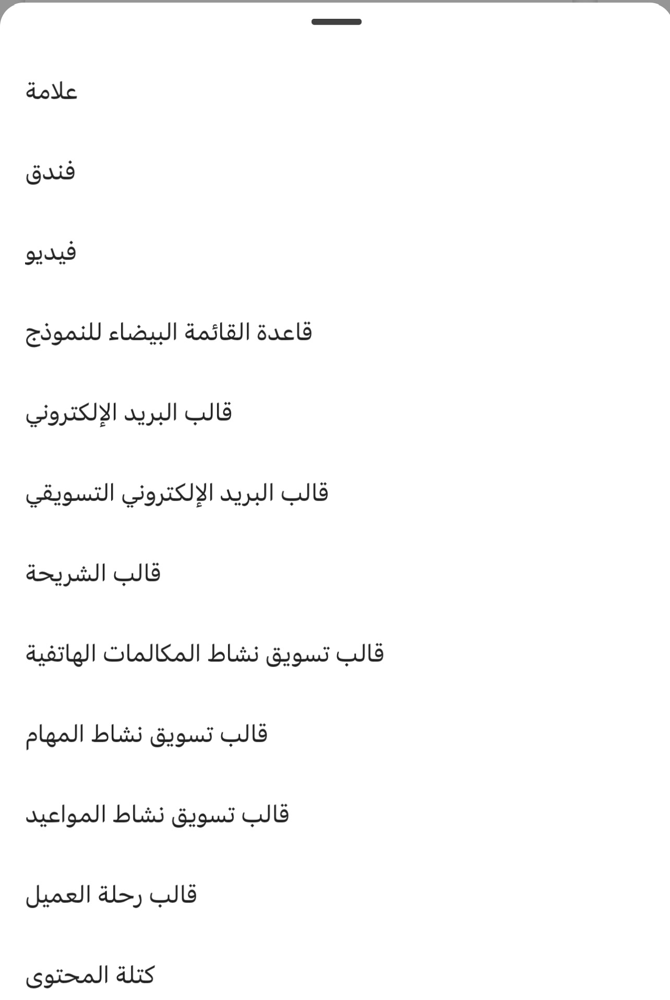

كما ذكرنا في الوحدة السابقة، هناك طريقتان يمكنك من خلالهما التعامل مع السجلات في تطبيق الأجهزة المحمولة. يمكنك عرض تفاصيل السجلات بطريقتين:

-   **في الصفحة الرئيسية:** عند النقر فوق أحد السجلات، يتم عرض تفاصيل السجل جزئياً في النصف السفلي من الشاشة. يوفر هذا النموذج التفاصيل الأساسية، بما في ذلك الملاحظات والتذكيرات ذات الصلة.

-   **في صفحة الاجتماع**: يعرض السجل الخاص بالاجتماع.

## إنشاء سجلات

يمكن إنشاء السجلات بسهولة من خلال النقر على رمز **جديد** الموجود على شريط التنقل أسفل الشاشة. ستعرض القائمة الأنواع المختلفة من السجلات التي يمكنك إنشاؤها.

توضح الصورة أدناه القائمة التي تعرض السجلات المختلفة التي يمكن إنشاؤها.

> [!div class="mx-imgBorder"]
> 

## تحرير السجلات من الصفحة الرئيسية

يمكن تحرير السجلات بسهولة في تطبيق الأجهزة المحمولة Dynamics 365 Sales. أثناء تواجدك في الصفحة الرئيسية، انقر فوق السجل الذي تريد تحريره لعرض تفاصيل السجل. بمجرد فتح السجل، انقر فوق رمز **تحرير** (قلم رصاص) في الزاوية اليمنى العليا من الشاشة. يمكنك أيضاً فتح السجل في تطبيق مركز المبيعات.

> [!div class="mx-imgBorder"]
> 

## تحرير السجلات من اجتماع

عندما تعمل مع سجل اجتماع، يمكنك بسهولة تحرير السجل ذي الصلة من خلال النقر على رمز **تحرير** (القلم الرصاص). يؤدي هذا إلى فتح نموذج التحرير حيث يمكنك إجراء بعض عمليات التحرير الأساسية على السجل. على سبيل المثال، في لقطة الشاشة أدناه، تُظهر الصورة اليسرى شاشة الاجتماع. تظهر الصورة اليمنى شاشة التحرير. سيؤدي تحديد **الفرصة المفتوحة** على شاشة التحرير إلى فتح سجل الفرصة في **مركز المبيعات**.

> [!div class="mx-imgBorder"]
> 

## إدارة جهات الاتصال

يتمتع البائعون الميدانيون بالقدرة على العمل مع جهات الاتصال مباشرةً في تطبيق الأجهزة المحمولة Dynamics 365 Sales. يمكنك تنفيذ الإجراءات التالية على جهة اتصال:

-   **عرض تفاصيل جهة الاتصال:** يسمح لك بعرض تفاصيل محددة حول جهة الاتصال. يمكن الوصول إلى تفاصيل الاتصال من الشاشة الرئيسية لجهات الاتصال التي تم عرضها مؤخراً، أو يمكنك الوصول إلى هذه المعلومات من أحد الاجتماعات. لمعرفة المزيد، راجع [عرض تفاصيل جهة الاتصال](/dynamics365/sales/sales-mobile/create-contact?azure-portal=true#view-details).

-   **تحرير تفاصيل جهة الاتصال:** السماح لك بتحرير سجل جهة اتصال تقوم بالعمل معه. يمكنك تعديل المعلومات مباشرة من تطبيق الأجهزة المحمولة Dynamics 365 Sales، أو يمكنك فتح تطبيق مركز المبيعات وتعديل السجل هناك. لمعرفة المزيد، راجع [تعديل تفاصيل جهة الاتصال](/dynamics365/sales/sales-mobile/create-contact?azure-portal=true#edit-contact-details).

-   **إنشاء جهة اتصال جديدة:** يسمح لك بإنشاء سجل جهة اتصال جديد من التطبيق. لمعرفة المزيد، راجع [إنشاء جهة اتصال](/dynamics365/sales/sales-mobile/create-contact?azure-portal=true#create-contact).

في الصورة أدناه، يمكننا أن نرى أن النقر فوق جهة اتصال من الشاشة الرئيسية سيفتح سجل جهة الاتصال، حيث يمكنك بعد ذلك النقر فوق رمز **تحرير** (قلم رصاص) لإجراء تغييرات.

> [!div class="mx-imgBorder"]
> 

## إدارة الملاحظات

عندما تقابل العملاء، ستسجل في كثير من الأحيان ملاحظات مهمة عنهم. هذه الملاحظات هي شيء يمكنك الرجوع إليه حسب الحاجة. أثناء العمل في تطبيق مبيعات الأجهزة المحمولة، يمكنك الاطلاع على الملاحظات المقترنة بأحد السجلات في قسم 
**الملاحظات** الخاص بتفاصيل السجل.

> [!div class="mx-imgBorder"]
> 

يمكنك تنفيذ الإجراءات التالية في قسم **الملاحظات** :

-   افتح قائمة الملاحظات من خلال النقر فوق **الملاحظات.**

-   راجع الصورة المقترنة بملاحظة من خلال النقر على **اسم الصورة**.

-   قم بفتح ملاحظة أو تحريرها بالنقر على الملاحظة.

-   اتخذ المزيد من الإجراءات، مثل تغيير السجل المرتبط أو حذف ملاحظة، من خلال النقر على **علامات الحذف**.

-   أنشئ ملاحظة من خلال الضغط على **إضافة ملاحظة**.

يمكنك معرفة المزيد حول استخدام الملاحظات باستخدام الارتباطات أدناه:

-   [إضافة ملاحظة](/dynamics365/sales/sales-mobile/view-edit-add-note?azure-portal=true#add-a-note)

-   [فتح ملاحظة أو تحريرها](/dynamics365/sales/sales-mobile/view-edit-add-note?azure-portal=true#open-or-edit-a-note)

-   [حذف ملاحظة](/dynamics365/sales/sales-mobile/view-edit-add-note?azure-portal=true#delete-a-note)

-   [تغيير السجل المتصل](/dynamics365/sales/sales-mobile/view-edit-add-note?azure-portal=true#change-connected-record)

## عرض أنشطة سجل أو جهة اتصال

يتيح لك تطبيق الأجهزة المحمولة للمبيعات العمل مع أنشطة المهام والمكالمات الهاتفية المرتبطة بسجل أو جهة اتصال. يتم عرض هذه العلامات بالشكل الموجود في علامة التبويب **المهام**. عند فتح سجل أو جهة اتصال، يمكنك تحديد علامة التبويب **المهام** في أعلى النموذج لعرض كافة الأنشطة الخاصة بالسجل. سيتم فرز الأنشطة المعروضة بناءً على تاريخ استحقاق الأنشطة.

> [!div class="mx-imgBorder"]
> 

## تحليل النشاط

سيتم عرض كل نشاط كبطاقة في القائمة. سيؤدي ذلك إلى تسهيل تحديد النشاط المحدد الذي ترغب فيه والعمل عليه. توفر الصورة أدناه تفصيلاً لتحليل نشاط ما في تطبيق الأجهزة المحمولة.

> [!div class="mx-imgBorder"]
> 

1.  حدد زر الخيار لوضع علامة النشاط على أنه مكتمل.

2.  اسم النشاط.

3.  مالك النشاط.

4.  تاريخ استحقاق النشاط.

5.  مزيد من الإجراءات للنشاط.

## إضافة نشاط من سجل

أثناء العمل مع قائمة المهام لتسجيل أو جهة اتصال، يمكن إضافة أنشطة جديدة عن طريق النقر على الزر **جديد** في الزاوية اليمنى السفلية من النموذج، ثم انقر إذا كنت ترغب على **إضافة مهمة** أو **إضافة مكالمة هاتفية**.

## إضافة نشاط من الصفحة الرئيسية

أثناء وجودك في الصفحة الرئيسية، يمكنك إضافة نشاط عن طريق تحديد الزر **جديد** في أسفل الشاشة ثم النقر على **مكالمة هاتفية**  أو **مهمة**. عند إنشاء نشاط جديد بهذه الطريقة، ستحتاج إلى تعيين الحقل **بخصوص** لتحديد السجل الذي يرتبط به النشاط.

## أنشطة عامل التصفية

أثناء عملك مع قائمة المهام، يمكنك تصفية قائمة الأنشطة لعرض نوع واحد فقط من الأنشطة في كل مرة. في الزاوية العلوية اليمنى من النموذج، انقر فوق زر التصفية، واختر ما إذا كنت تريد تصفية **المهام** أو **المكالمات الهاتفية**. سيعتمد عامل التصفية على نوع السجل الذي قمت بتحديده.

## وضع علامة على نشاط كمكتمل

بعد الاتصال بشخص ما أو إكمال إحدى المهام، يمكنك وضع علامة اكتمال على النشاط بالنقر فوق زر الخيار الموجود على بطاقة النشاط. وبدلاً من ذلك، انقر فوق علامات الحذف الموجودة على بطاقة النشاط، ثم انقر فوق **إكمال**. بالإضافة إلى القدرة على وضع علامة على المهمة كمكتملة، ستتمكن أيضاً من تحديد **إلغاء الأمر** أو **حذف** أو **تحرير** من القائمة.

> [!div class="mx-imgBorder"]
> 

لمزيد من المعلومات حول استخدام سجلات النشاط، راجع [عرض الأنشطة لأحد السجلات.](/dynamics365/sales/sales-mobile/view-activities-record/?azure-portal=true).
