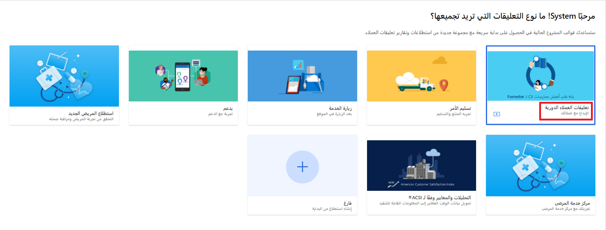
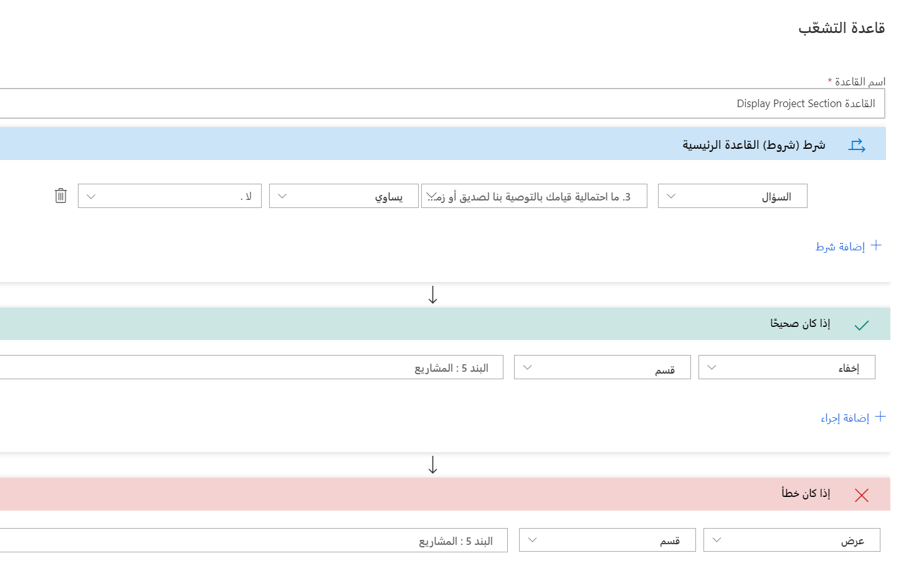

في كثير من الأحيان، سترسل المؤسسات التي تقدم دعم العملاء استطلاعًا يطلب تعليقات العملاء عند معالجة الحالة.
الاستطلاع من الفرص الجيدة لسؤال العملاء عن رأيهم العملية والمساعدة المقدمة والتوجه العام لديهم بعد التفاعل. من ناحية إدارة الحساب الاستباقية، يمكن أن يكون طلب التعليقات المنتظمة من العميل على مدار العام مفيدًا في فهم التحديات أو المخاوف الحالية.
والتعرف على هذه المشكلات مبكرًا يمكن أن يساعد المؤسسات على معالجتها بسرعة.

يوفر Dynamics 365 Customer Voice سلسلة من القوالب التي يمكنك استخدامها كنقطة بداية أثناء إنشاء مشروع جديد. ربما تتكون المشروعات من استطلاع واحد أو أكثر وقواعد متفرعة ومتغيرات وقوالب بريد إلكتروني. وقدّمت Microsoft قوالب مختلفة لتمنحك بداية سريعة عند جمع التعليقات من العملاء. ستركز هذه الوحدة على استخدام قالب **تعليقات العميل الدورية** لإنشاء مشروع جديد.

يمكنك إضافة مشروع جديد بعدة طرق. حدد الزر **الشروع في العمل** أو **+ مشروع جديد** من الشاشة الرئيسية في Customer Voice، والذي سيطلب منك تحديد قالب للمتابعة وإضافة مشروع جديد. وعندما تقوم بمراجعة جميع المشروعات، يمكنك أيضًا استخدام الزر **مشروع جديد** لمتابعة إنشاء مشروع جديد.

> [!div class="mx-imgBorder"]
> 

بعد تحديد قالب، سيُطلب منك تحديد الموقع الذي يجب إضافة المشروع والاستطلاعات ذات الصلة إليه. تأكد من مراعاة مهام سير العمل أو التدفقات من Microsoft Power Automate والتي قد تكون مطلوبة كمشغلات أو مستقبلات لبيانات أي استطلاع. وستساعدك مراعاة ذلك على تحديد الموقع الصحيح لإضافة المشروع إليه. بالنسبة للمؤسسة النموذجية التي تستخدم Microsoft Dynamics365، سيكون هناك بيئة *إنتاج* وبيئة *اختبار معزولة* واحدة على الأقل. إن البيئة التي تُظهر **(افتراضي)** بجانبها هي بيئة ‎Microsoft Dataverse الافتراضية، وليس لها أي ارتباط أو صلة بتطبيق Microsoft Dynamics 365 لتفاعل العملاء.

يتكون قالب **تعليقات العميل الدورية** من العناصر التالية:

- **استطلاع واحد** - استطلاع تعليقات العميل الدورية

- **تقرير واحد** - تقرير استطلاع تعليقات العميل الدورية

- **متغير جديد واحد** - companyname (إضافة إلى First Name وLast Name وlocale)

- **مقياسان للرضا** - رضا العملاء (CSAT) وتوجه العملاء (التوجه)

- **قالب رسالة إلكترونية واحد** - قالب **‏‫الاستطلاع لمدة 5 دقائق: دعنا على اتصال دائم‬**

يمكنك استخدام جميع الأصول الموجودة في القالب كما تم توفيرها أو إلحاقها بها، أو يمكنك إزالتها إذا لم تكن تلبي متطلبات المؤسسة.
يوفر النموذج استطلاعًا واحدًا، ولكن يمكنك أيضًا إضافة المزيد من الاستطلاعات المتعلقة بخدمات العملاء. ويطلب الاستطلاع من المشارك تقييم مدى اتفاقه مع العبارات المختلفة التي تغطي موضوعات محددة، مثل كيفية استجابة الدعم للحالات أو ما إذا كان يشعر بالتقدير من جانب المؤسسة. سيستجيب العميل لهذه العبارات بناءً على التوجه أو التجارب التي مروا بها.

يمكنك ضبط الاستطلاع ليشمل المزيد من الأسئلة أو الأقسام التي تُقسِّم التعليقات حسب القسم. يمكنك استخدام سؤال مقياس Likert لكل منطقه ثم إضافته إلى أقسام مختلفة. علي سبيل المثال ، قد يقوم السؤال بالاستفسار عن مدي موافقه العميل علي العبارات كما تتعلق بفريق الدعم أو فريق العمل المالي. إذا كان لدى العميل مؤخرًا عملية تنفيذ من نوع ما، فقد يكون من المفيد لك إضافة قسم يجمع تعليقات حول فريق المشروع. فكِّر في استخدام المنطق المتقدم لإنشاء قواعد تفرع لتحديد ما إذا كان يجب عرض قسم محدد. أضف سؤالاً يسأل إذا كان لدي العميل مشروعًا، وإذا كانت الإجابة **لا**، فيمكن إخفاء القسم الموجود في المشروعات. إذا كانت الإجابة **نعم**، فعندئذٍ يمكن عرض القسم الموجود في المشروعات. وبشكلٍ أساسي، تُطلع المُشارك على أقسام الاستطلاع ذات الصلة.

> [!div class="mx-imgBorder"]
> 

تأكد من مراجعة العديد من جوانب المشروع قبل استخدامه لإرساله إلى العملاء. العنصر الأول المراد مراجعته هو رأس استطلاع **تعليقات العميل الدورية**. باستخدام عناصر التحكم، يمكنك إضافة صورة الرأس وتغيير موضع نص رأس الاستطلاع حسب الحاجة. تساعد إضافة شعار على توافق الاستطلاع مع المؤسسة. كما يوفر الشعار تمييزًا للعلامة التجارية للعملاء، ما قد يجعلهم أيضًا أكثر ميلاً لإكمال الاستطلاع.

يتم استخدام **companyname‎** المضمن في القالب خلال الاستطلاع في نص السؤال. وهو يعرض اسم شركه المؤسسة التي تقوم بإرسال الاستطلاع.
لتعديل القيمة الافتراضية، انتقل إلى قائمة **تخصيص** ثم حدد خيار **إضفاء الطابع الشخصي**. عند إضافة الاسم الفعلي للشركة بدلاً من استخدام **الشركة** (القالب الافتراضي للشركة)، سيتم تحديثه خلال الاستطلاع، وذلك أينما يتم استخدام الاستطلاع.

بعد إضافة جميع متطلبات مؤسستك إلى الاستطلاع، يمكنك إرساله. في الوحدة التالية، ستتعرف على كيفية إرسال الاستطلاعات مباشرة إلى جهة اتصال باستخدام Dynamics 365.
