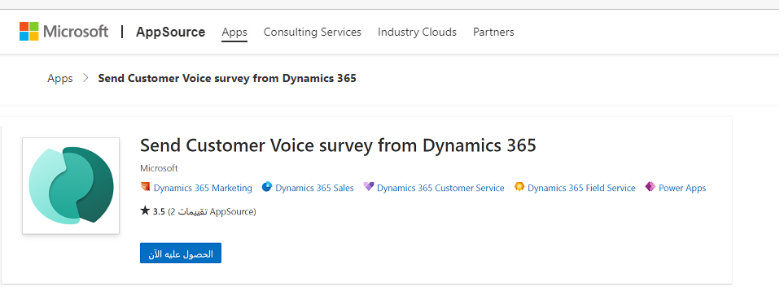
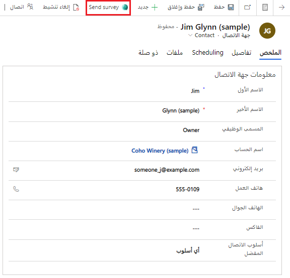
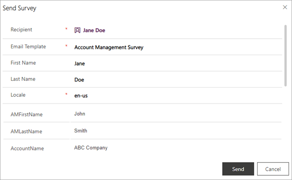

تتعلق مهمة إنشاء المشاريع والاستطلاعات في Dynamics 365 Customer Voice غالباً على فريق تجربة العميل في المؤسسة أو فريق خدمة العملاء. وقد يعترض فريق التسويق أيضاً للتأكد من أن العلامة التجارية والصور متناسقة مع إرشادات الشركة الخاصة بإحدى الشركات. إذا كان Microsoft Power Automate مطلوباً، وإذا كان من الضروري إنشاء تدفقات معقدة، فقد يكون ذلك عضواً في فريق فني يقوم بالتأكد من هذه المتطلبات. على الرغم من أن العديد من جوانب عملية الملاحظات الخاصة بالشركات يمكن أن تكون تلقائية، إلا أنه يمكن لمدير الحساب معرفة الوقت المناسب لطلب ملاحظات سريعة حول الحقيقة.

في هذه الحالات، لا يلزم إجراء عملية تلقائية. وبدلاً من ذلك، فإن القدرة على إرسال استطلاع Customer Voice وربطه بسجل جهة اتصال داخل Microsoft Dynamics 365 Customer Engagement مطلوبة. يمكن للمؤسسات زيادة مديري الحسابات والأدوار الأخرى الخاصة بالعملاء لإنجاز هذه المهمة من خلال إضافة زر **إرسال استطلاع** إلى العملاء المتوقعين وجهات الاتصال والحسابات والفرص والحالات وإلى أي جدول مخصص تم تمكين الفترة الزمنية فيه.

لا توجد أي تكلفة أو تكوين مطلوب لإضافة هذا الزر. للتثبيت، توجه إلى سوق Microsoft التجاري وقم بإضافة [إرسال استطلاع Customer Voice من تطبيق Dynamics 365](https://appsource.microsoft.com/product/dynamics-365/msfp.customervoicedistribution?tab=Overview&azure-portal=true).
عادةً ما تتم عملية التثبيت بواسطة مسؤول النظام لـ Dynamics 365. حدد زر **الحصول عليه الآن** لبدء طلب للموافقة على الشروط المتعلقة بمعلومات الحساب وكيفية تعامل Microsoft مع المستخدم.

> [!div class="mx-imgBorder"]
> 

بعد التأكد من تسجيل الدخول، ستتم إعادة توجيهك إلى مركز إدارة Microsoft Power Platform ويتم مطالبتك بتحديد بيئة لإضافة حل **إرسال الاستطلاع**. باستخدام مثال جهة الاتصال، سيكون زر **إرسال استطلاع** مرئياً بعد اكتمال تثبيت الحل. بعد زيارة العميل في الحال، قد تحدد إدارة الحسابات أنه وقت جيد لطلب الملاحظات من واحد أو أكثر من جهات الاتصال التي التقوا بها. يمكن لعضو في الفريق المسؤول عن اتخاذ هذا الإجراء أن يقوم بإنشاء استطلاع زيارة إدارة الحساب في Dynamics 365 Customer Voice. وبعد ذلك، يمكنهم مشاركة هذا الاستطلاع مع كافة الأعضاء في فريق إدارة الحساب. بعد مشاركه الاستطلاع، يمكن لمدير الحساب الانتقال إلى سجل جهة اتصال وتحديد الزر **إرسال الاستطلاع** من الشريط العلوي.

> [!div class="mx-imgBorder"]
> 

عند تحديد الزر، سيتم فتح شاشة حوار تحتوي على قائمة بكافة الاستطلاعات التي تمتلك حق الوصول اليها. والآن، يمكنك تحديد الاستطلاع الصحيح والانتقال إلى الشاشة التالية.

تأكد من توثيق الاستطلاعات التي تمت مشاركتها مع المستخدمين وسيتم إرسالها بهذه الطريقة لضمان أن الأشخاص واضحون حول المتغيرات التي تمت إضافتها إلى الاستطلاع وقوالب البريد الإلكتروني ذات الصلة. عند قيام شخص ما بتحديد استطلاع ثم الحصول على الشاشة التالية، يجب أن يقوم بملء البيانات التي سيتم استخدامها لإرسال الاستطلاع وملء المتغيرات.

تتم إضافة المتغيرات **First Name** و **Last Name** دائماً ولا يمكن حذفهما من الاستطلاع. سيتم تمرير هاتين القيمتين تلقائياً إذا قمت بإرسال الاستطلاع من سجل جهة اتصال. إذا قمت بالإرسال من أحد الحسابات، سيتم استخدام جهة الاتصال الرئيسية كمستلم.
بالنسبة للفرصة والحالة، سيستخدم التطبيق جهة الاتصال أو العميل (اعتماداً على ما يتم استخدامه بواسطة المؤسسة) على السجل كمستلم الاستطلاع.

ستحتاج إلى ملء المتغيرات الأخرى التي تمت إضافتها إلى الاستطلاع يدوياً قبل إرساله. في حالة عدم إضافة هذه المتغيرات، قد يظهر الاستطلاع والبريد الإلكتروني الذي تم إرساله فردياً وسيعرض اسم المتغير أو القيمة الافتراضية التي ربما قام منشئ الاستطلاع بإضافتها.

> [!div class="mx-imgBorder"]
> 

وعادةً ما يكون مستلم الاستطلاع هو جهة الاتصال (ما لم تقم بالإرسال من حالة أو فرصة مرتبطة فقط بحساب).
يملي المكان الذي تقوم بإرسال الاستطلاع منه السجل الذي سيتم ربطه بدعوة الاستطلاع واستجابة الاستطلاع اللاحقة في الحقل المقابل لهذه الأنشطة. على سبيل المثال، الإرسال من حساب إلى جهة الاتصال الرئيسية يعني أنه ستتم إضافة الأنشطة المتعلقة بالاستطلاع إلى المخطط الزمني لجهة الاتصال وسيتم أيضاً العثور عليها في المخطط الزمني للحساب. يمكنك ملء القيمة المحلية بعد تحديد قالب البريد الإلكتروني للتأكد من تعيين اللغة الصحيحة.

يوفر لك استخدام هذا الحل المجاني من موقع تسوق Microsoft التجاري القدرة على إرسال الاستطلاعات المناسبة لجمع الملاحظات في الوقت الصحيح في رحلة العميل. ستناقش الوحدة التالية كيفية التقاط مقاييس مستوى الرضا المتعلقة بالعميل ومراجعتها داخل Dynamics 365.

قم بمشاهدة الفيديو التالي للاطلاع على عرض توضيحي سريع حول إرسال الاستطلاعات.

> [!VIDEO https://www.microsoft.com/videoplayer/embed/RWR5yX]
