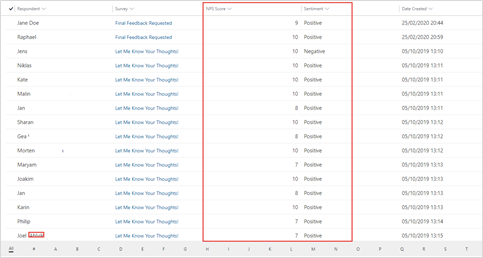
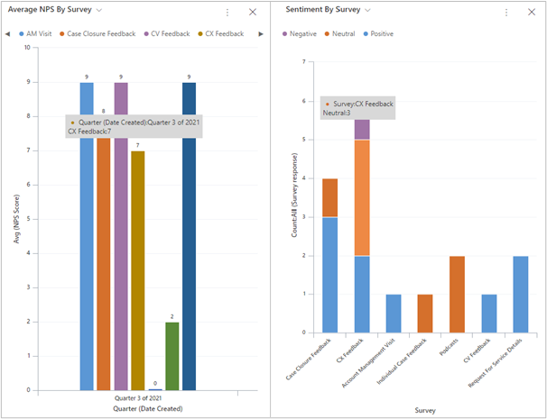

المطالبة بالملاحظات هي الخطوة الأولى بشان استيعاب مستوى رضا العملاء. تعد مراجعة الاستجابات والعمل بها بمثابة الطريقة الوحيدة للحفاظ على رضا العملاء والمساعدة في تحسين المناطق التي تحتاج إليها. يمكنك الوصول إلى استجابات الاستطلاع الفردية مباشرةً من داخل Dynamics 365 Customer Voice، ويمكن للعملاء الوصول إليها باستخدام Dynamics 365.
على الرغم من أن مراجعة تفاصيل كل استجابة هو أمر مفيد، إلا أن وجود طريقة سريعة للحصول على نظرة عامة عالية المستوى لتحليل أسرع هو أمراً هاماً.

وتعد مقاييس الرضا هي القياسات التي يمكنك استخدامها لفهم خبرة العميل والتوجه العام نحو المؤسسة.
تتضمن Dynamics 365 Customer Voice القدرة على إضافة ما يصل إلى عشرة قياسات لكل مشروع. يمكنك تضمين هذه المقاييس للاستطلاعات الفردية وتعقب الاتجاهات في بيانات الاستجابة التي تم تجميعها.

يمكنك إضافة أحد أنواع المقاييس التالية:

-   **Net Promoter Score®** - يقيس ولاء العميل في مجموعات من المروجين وغير المشاركين والمعارضين. يجب أن يكون هذا القياس مرتبطاً بسؤال Net Promoter Score.

-   **التوجه** - يُحدد توجه العميل إن كان إيجابياً أو سلبياً أو محايداً. يجب أن يكون هذا القياس مرتبطاً بسؤال نصي.

-   **مستوى رضا العميل (CSAT)** - يقيس الرضا العام للعميل. يجب أن يكون هذا القياس مرتبطاً بسؤال التصنيف.

-   **النقط المخصصة** - تقيس مدى الرضا العام للعميل عبر أسئلة متعددة.

في بعض قوالب المشروع القياسية في Dynamics 365 Customer Voice، يتم بالفعل إعداد مقاييس مستوى الرضا وربطها بالأسئلة الموجودة في الاستطلاع. على سبيل المثال، يتضمن استطلاع **ملاحظات العملاء الدورية** مقاييس CSAT والتوجه. يمكنك إضافة مقاييس جديدة ثم تعيينها لسؤال من الاستطلاع. للتأكد من أنه يتم تعقب مقاييس الرضا لكل استجابة، يجب عليك جعل الأسئلة ذات الصلة مطلوبة. بعد ذلك، يمكنك إنشاء طرق عرض ومخططات في Dynamics 365 لمراجعة سجلات استجابة استطلاع Customer Voice. تعد نتيجة Net Promoter Score (NPS) والتوجه حقلين يمكنك إضافتهما إلى طريقة عرض، ويمكنك عرضهما دون الحاجة إلى البحث في السجل أو الانتقال إلى سجلات مقاييس الرضا المرتبطة.

> [!div class="mx-imgBorder"]
> 

يمكن لمسؤول النظام إنشاء طرق عرض النظام وجعلها قابلة للوصول لمستخدمي Dynamics 365. على سبيل المثال، يمكن أن تشتمل طريقة عرض استجابات استطلاع Customer Voice على المعلومات التالية:

- **المستجيب** - الشخص الذي أكمل الاستطلاع

- **الاستطلاع** - الاستطلاع الذي تم تعبئته

- **نتيجة صافي نقط الترويج (NPS)** - Net Promoter Score® العامة لاستجابة الاستطلاع

- **التوجه** - التوجه العام لاستجابة الاستطلاع

- **تاريخ الإنشاء** - تاريخ إنشاء استجابة الاستطلاع

تتضمن استجابة الاستطلاع حقل بخصوص، والذي يمكنك ربطه إلى أي نوع سجل تم تمكينه للأنشطة. على سبيل المثال، يمكنك تعيين استطلاع مرتبط بملاحظات الحالة مع الحالة المطابقة كسجل "بخصوص". تتوفر العديد من الخيارات لربط استجابات الاستطلاع بسجلات أخرى لإنشاء مزيد من الفرص لمراجعة البيانات.

يمكنك تعيين استطلاع ملاحظات العميل بإدارة الحساب الدوري باستخدام سجل الحساب المرتبط كسجل "بخصوص". إذا كان يجب ربط استجابات الاستطلاع دائما بإحدى جهات الاتصال، يمكنك إضافة عمود (حقل) جديد إلى جدول استجابة الاستطلاع. قم بإضافة حقل يسمى **الحساب المرتبط** كبحث إلى جدول الحسابات لتوفير آلية لتصفية البيانات وعرضها في سجل حسابات أو لوحه معلومات. يمكن لمسؤول النظام اتباع هذه الخطوات لتحقيق هذه المهمة:

1.  قم بإضافة عمود بحث في جدول استجابة استطلاع Customer Voice تحت اسم الحساب المرتبط. قم بتعيين البحث إلى جدول الحساب.

1.  يستخدم Power Automate لإنشاء تدفق يتم تشغيله في كل مرة يتم فيها إنشاء صف استجابة استطلاع Customer Voice جديد (يتم تلقي استجابة جديدة).

1.  في التدفق، قم بتعيين سجل الحساب المرتبط كسجل حساب مرتبط بجهة الاتصال التي قامت بتقديم الاستجابة.

1.  قم بإنشاء طريقة عرض النظام التي تستخدم العمود الجديد. تسمح لك طريقة العرض هذه بتصفية المخططات والبيانات باستخدام الحساب المرتبط.

يمكن للمستخدمين إنشاء طرق العرض الخاصة بهم للحصول على ما يحتاجونه بالتحديد ومراجعة استجابات الاستطلاع التي تكون ذات أهمية لهم. يمكنك استخدام المخططات لنقل متوسط Net Promoter Score® بواسطة الاستطلاع أو التوجه لكل استطلاع. باستخدام الأعمدة المكدسة أو المخططات الدائرية أو المخططات المختلطة، يمكنك عرض البيانات من Dynamics 365 Customer Voice بطريقة ذات معنى في Dynamics 365 لتزويد المستخدمين بطريقة سريعة لفهم العملاء بشكل أفضل.

> [!div class="mx-imgBorder"]
> 

شاهد الفيديو التالي للحصول على عرض توضيحي حول إنشاء المقاييس واستخدامها.

> [!VIDEO https://www.microsoft.com/videoplayer/embed/RWRaAa]
