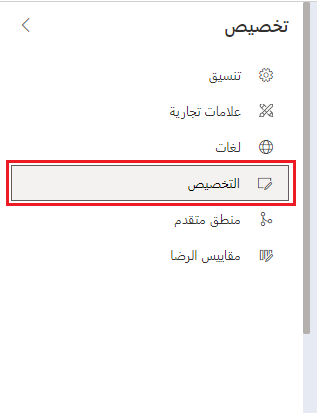
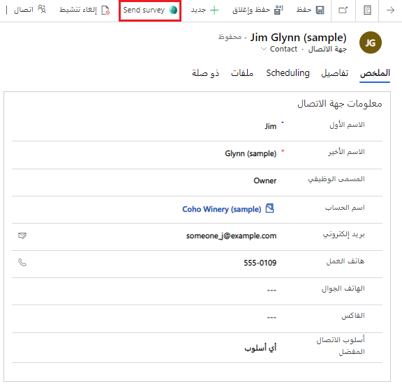
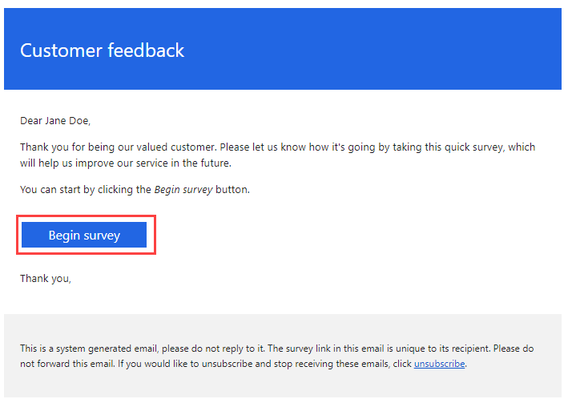

في هذه التمرينات، ستقوم بإنشاء استطلاع ملاحظات حول إدارة الحساب، وتثبيت تطبيق **إرسال الاستطلاع** في Dynamics 365، وإرسال استطلاع من جهة اتصال Dynamics 365.

## التمرين 1: إنشاء استطلاع ملاحظات إدارة الحساب

في هذا التمرين، ستقوم بإنشاء استطلاع لإرساله إلى العملاء الذين يطلبون ملاحظات العملاء الدورية. في التمرين التالي، ستقوم بتثبيت تطبيق Microsoft من السوق التجارية الخاصة بـ Microsoft، وإرسال استطلاع Customer Voice من Dynamics 365، ثم إرسال استطلاع من سجل جهة اتصال في Dynamics 365.

> [!IMPORTANT]
> يمكنك استكمال هذه التمارين في بيئة تجريبية أو بيئة وضع الحماية.
تأكد من أنه يمكنك الوصول إلى Dynamics 365 مع تمكين تطبيقات Sales أو Customer Service.

### المهمة 1: إنشاء مشروع جديد

لإنشاء مشروع جديدة، اتبع هذه الخطوات:

1.  انتقل إلى [Dynamics 365 Customer Voice](https://customervoice.microsoft.com/?azure-portal=true) وسجّل الدخول باستخدام بيانات الاعتماد الخاصة بك.

1.  حدّد **الشروع في العمل**.

    > [!div class="mx-imgBorder"]
    > 

1.  حدد قالب مشروع **ملاحظات العملاء الدورية**.

    > [!div class="mx-imgBorder"]
    > 

1.  حدد الزر **إصدار أولي**.

    > [!div class="mx-imgBorder"]
    > 

1.  ستظهر نظرة عامة على الاستطلاع المرتبط بهذا المشروع. وبعد الانتهاء من مراجعة النظرة العامة، حدد **إغلاق**.

    > [!div class="mx-imgBorder"]
    > 

1.  حدد زر **التالي** للمتابعة.

    > [!div class="mx-imgBorder"]
    > 

1.  حدد الموقع الذي تريد إضافة مشروعك إليه.
    حدد الرابط **الاطلاع على جميع البيئات**.

    > [!div class="mx-imgBorder"]
    > 

1.  ستظهر قائمة تعرض جميع بيئات Microsoft Dataverse التي يمكنك الوصول إليها. حدد البيئة التي تستخدمها لاستكمال هذا التمرين. إذا كان لديك حق الوصول إلى البيئة، فسيتم عرض رسالة تفيد بأنه تم منح الإذن. حدد زر **تحديد وإغلاق**.

    > [!div class="mx-imgBorder"]
    > 

    > [!NOTE]
    > نظراً لاستخدامك Customer Voice لفترة من الوقت، ستتم تعبئة قائمة **المواقع الأخيرة** بالبيئات الأخيرة التي استخدمتها. وبعد تعبئة القائمة، يمكنك تحديد البيئة مباشرة من هذه القائمة بدلاً من ذلك.
    >
    > [!div class="mx-imgBorder"]
    > 

1.  حدد زر **إنشاء**. في حالة تعذُّر تحديد الزر، يجب التأكيد باستخدام الخطوة السابقة ثم التأكّد من تحديد موقع واحد.

    > [!div class="mx-imgBorder"]
    > 

### المهمة 2: إضافة متغيرات جديدة إلى الاستطلاع

لإضافة متغيرات جديدة للاستطلاع، اتبع الخطوات التالية:

1.  في المشروع الذي قمت بإنشائه، سيوجد استطلاع العميل الدوري مع سلسلة من الأسئلة المتعلقة به. إذا لم تكن موجوداً بالفعل في الاستطلاع، فحدد رابط **استطلاع العميل الدوري** من قائمة التنقل.

    > [!div class="mx-imgBorder"]
    > 

1.  حدد القائمة **تخصيص** من الجانب الأيمن للاستطلاع.

    > [!div class="mx-imgBorder"]
    > 

1.  من قائمة **تخصيص**، حدد خيار **إضفاء طابع شخصي**.

    > [!div class="mx-imgBorder"]
    > 

1.  حرك مؤشر الماوس فوق متغير **companyname** ثم حدد رمز سلة المهملات لحذفها.

    > [!div class="mx-imgBorder"]
    > 

1.  سيتم عرض مطالبة تسألك عما إذا كنت متأكداً من رغبتك في حذف المتغير. حدد الزر **حذف** للمتابعة.

    > [!div class="mx-imgBorder"]
    > 

1.  حدد الخيار **إضافة متغير** من أسفل لوحة المتغيرات.

    > [!div class="mx-imgBorder"]
    > 

1.  أدخل **AccountManager** لاسم المتغير ثم حدد **إضافة متغير** مرة أخرى.

    > [!div class="mx-imgBorder"]
    > 

1.  أضف متغيراً جديداً باسم **AccountName**. حدد الزر **حفظ** في الجزء السفلي من الشاشة.

    > [!div class="mx-imgBorder"]
    > 

1.  ستظهر رسالة تأكيد توضح إضافة متغيرين.

    > [!div class="mx-imgBorder"]
    > 

1.  حدد الزر **إغلاق** في الجزء السفلي من الشاشة للخروج من لوحة المتغيرات.

### المهمة 3: إدراج المتغيرات في الاستطلاع

لإدراج المتغيرات في الاستطلاع، اتبع الخطوات التالية:

1.  حدد السؤال الأول في الاستطلاع ثم احذف كلمة **أنت** من نص السؤال.

    > [!div class="mx-imgBorder"]
    > 

1.  بدلاً من الكلمة التي قمت بحذفها، حدد قائمة **المتغيرات** ثم حدد **AccountName**. سيقوم هذا الإجراء بإضافة المتغير إلى نص السؤال كـ **{{AccountName}}**.

    > [!div class="mx-imgBorder"]
    > 

1.  مع استمرار تحديد السؤال الأول، يجب أن يكون زر **إضافة جديد** سهل الوصول إليه أدناه. حدد الزر لإضافة سؤال جديد.

1.  حدد سؤال نمط **التصنيف**.

    > [!div class="mx-imgBorder"]
    > 

1.  قم بإضافة نص السؤال التالي: **ما مدى سعادتك بمدير حسابك** وفي نهاية نص السؤال، حدد قائمة **المتغيرات** ثم حدد المتغير **AccountManager**.

    > [!div class="mx-imgBorder"]
    > 

أصبح الاستطلاع جاهزاً الآن للاستخدام مع سؤال جديد ومتغيرين جديدين.

## تمرين 2: تثبيت تطبيق إرسال استطلاع في Dynamics 365

في هذا التمرين، ستقوم بتثبيت تطبيق **إرسال استطلاع Customer Voice من Dynamics 365** في بيئة Dynamics 365 الخاصة بك.

> [!IMPORTANT]
> لتثبيت التطبيق، تأكد من أن دور المستخدم الخاص بك لديه دور أمان مسؤول النظام في Dynamics 365.

1.  حدد رابط تطبيق **إرسال استطلاع Customer Voice من Dynamics 365** في السوق التجارية الخاصة بـ Microsoft: [https://appsource.microsoft.com/product/dynamics-365/msfp.customervoicedistribution?tab=Overview](https://appsource.microsoft.com/product/dynamics-365/msfp.customervoicedistribution?tab=Overview&azure-portal=true)

1.  حدد زر **الحصول عليه الآن**.

    > [!div class="mx-imgBorder"]
    > 

1.  إذا لم تكن قد قمت بتسجيل الدخول بالفعل إلى الحساب المرتبط بـ Dynamics 365، فستتم مطالبتك بإضافة عنوان بريدك الإلكتروني. قم بإدخال عنوان البريد الإلكتروني الذي تستخدمه أيضاً لتسجيل الدخول إلى نفس البيئة التي استخدمتها لإنشاء مشروعك الجديد في Dynamics 365 Customer Voice. حدد الزر **تسجيل الدخول**.

    > [!div class="mx-imgBorder"]
    > 

1.  ستتم مطالبتك بتوفير مزيد من المعلومات والموافقة على بنود وشروط استخدام التطبيق. حدد زر **متابعة**.

    > [!div class="mx-imgBorder"]
    > 

1.  سيتم توجيهك إلى قسم **الموارد** في [https://admin.powerplatform.microsoft.com](https://admin.powerplatform.microsoft.com/?azure-portal=true).
    حدد البيئة التي تريد إضافة التطبيق إليها. تأكد من أن هذه هي البيئة نفسها التي أضفت فيها مشروع Dynamics 365 Customer Voice في التمرين 1. قم بمراجعة البنود والشروط والموافقة عليها.

    > [!div class="mx-imgBorder"]
    > 

1.  حدد الزر **تثبيت** للمتابعة.

1.  سيظهر إخطار في الجزء العلوي من الشاشة لإظهار بدء التثبيت.

    > [!div class="mx-imgBorder"]
    > 

في الجزء السفلي من قائمة كافة التطبيقات الأخرى في بيئتك، سيظهر التطبيق بالشكل الذي يتم تثبيته به. بعد اكتمال التثبيت، ستكون حالة التطبيق هي **مثبت**.

   > [!div class="mx-imgBorder"]
   > 

## التمرين 3: إرسال استطلاع من جهة اتصال في Dynamics 365

في هذا التمرين، ستقوم بإرسال استطلاع من سجل جهة اتصال في Dynamics 365.

> [!IMPORTANT]
> تأكد من استخدام نفس بيئة Dynamics 365 حيث قمت بتثبيت تطبيق **إرسال الاستطلاع** من التمرين 2.

1.  انتقل إلى سجل جهة اتصال في Dynamics 365. تأكد من أن سجل جهة الاتصال لديه عنوان بريد إلكتروني يمكنك الوصول إليه. تحتاج إلى الوصول لتلقي الرسالة الإلكترونية التي يتم إرسالها عند إرسال الاستطلاع.

1.  حدد الزر **إرسال الاستطلاع** من أعلى سجل جهة الاتصال.

    > [!div class="mx-imgBorder"]
    > 

1.  سيتم فتح نافذة منبثقة تحتوي على قائمة بجميع الاستطلاعات التي يمكنك الوصول إليها من Dynamics 365 Customer Voice. ابحث عن الاستطلاع الذي قمت بإنشائه في التمرين 1. في العمود الأيسر، حدد الاستطلاع ثم حدد زر **التالي**.

    > [!div class="mx-imgBorder"]
    > 

1.  ستتم تعبئة حقل **المستلم** بجهة الاتصال التي قمت ببدء العملية منها. حدد نموذج **قالب الرسالة الإلكترونية** من القائمة (يجب توفر واحدة فقط). ستتم تعبئة حقل **First Name** وحقل **Last Name** من حقول سجل جهة الاتصال. حدد **الإعدادات المحلية** من قائمة (يجب توفر واحدة فقط).

1.  أدخل قيماً للمتغير **AccountManager** وأيضاً **AccountName** حتى تتم تعبئتهما. أضف اسماً لمدير الحساب واسماً للحساب الذي تعمل جهة الاتصال به. حدد زر **إرسال** للمتابعة.

    > [!div class="mx-imgBorder"]
    > 

1.  افتح صندوق البريد الخاص بعنوان البريد الإلكتروني لسجل جهة الاتصال الذي حددته. من المفترض أن تكون قد تلقيت رسالة إلكترونية من Dynamics 365 Customer Voice. افتح الرسالة الإلكترونية وحدد الزر **بدء الاستطلاع** لفتح الاستطلاع.

    > [!div class="mx-imgBorder"]
    > 

يجب أن يعرض الاستطلاع القيم التي أضفتها إلى المتغيرين **AccountName** و **AccountManager** في الاستطلاع.

   > [!div class="mx-imgBorder"]
   > 
