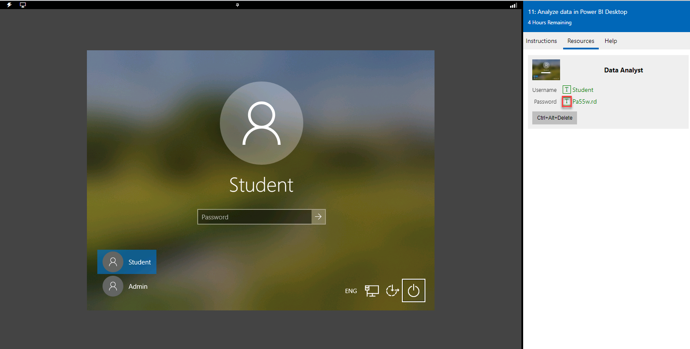

## الوصول إلى بيئتك

قبل أن تبدأ هذا التمرين المعملي، حدد **معمل الإطلاق** أعلاه. 

لتسجيل الدخول إلى بيئة معملك:

1.  انقر فوق أي مكان على سطح مكتب Windows في نافذة المعمل.
2.  في علامة تبويب **الموارد** الموجودة على الشريط الجانبي للمعمل، حدد الرمز **T** الموجود بجوار **كلمة المرور**. يتم إدخال كلمة مرور الجهاز تلقائياً نيابة عنك. يمكنك تسجيل الدخول باستخدام ملف تعريف الطلبة.
3.  اضغط على **إدخال**.

   

يمكنك الآن أن تبدأ عملك في هذا المعمل. 
