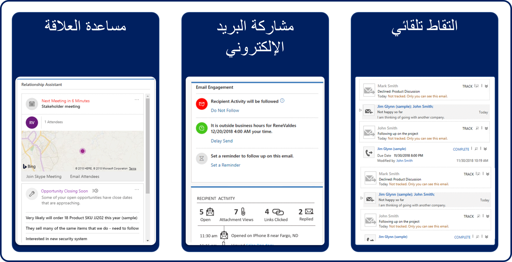
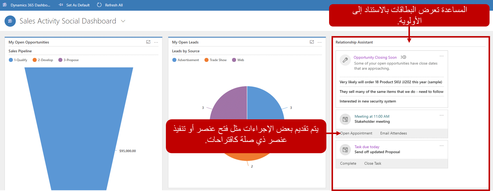

في هذه الأيام، يتعلق البيع للعملاء ببناء العلاقات والحفاظ عليها. ستسمع هذه العملية يُشار إليها باسم *بيع العلاقة*. يعد بيع العلاقة على وشك العثور علي الأشخاص المناسبين للسوق وإنشاء علاقات قوية مع هؤلاء الأشخاص من البداية. يمنح بائعو العلاقات الجيدين الأولوية لاتصالهم بعملائهم عبر جميع جوانب البيع الأخرى. فهم يقومون بتطوير الثقة عن طريق إضافة قيمة وإنفاق الكثير من الوقت مع العملاء المحتملين قبل محاولة إتمام عملية البيع. عندما تحاول تحديد ما إذا كنت تريد التقدم مع العميل المتوقع، ستحتاج إلى مراعاة كافة العوامل المختلفة.

في العادة، تتضمن عملية بيع العلاقة ست خطوات:

1. **إضافة قيمة**- من أجل كسب المصداقية بشكلٍ سريع وإثبات نفسك كمستشار موثوق به، يجب أن تضيف قيمة إلى حياة العميل المتوقع. على سبيل المثال، قد تتوصل إلى اقتراحات مفيدة أو ترسل روابط لمحتوى ذي صلة أو توفر مقدمة قيّمة.
2. **التعرف على موقف خاص بعميل متوقع**- بعد جذب انتباه العميل المتوقع وإثبات القيمة الخاصة بك، ابحث في تحديات أعمال العميل المتوقع وأهدافها ومقاييسها وسماتها المؤهلة وكذلك أهدافه الشخصية والمتخصصة. ستساعدك هذه المعلومات على الإجابة عن سؤالين مهمين: هل يمكن لمنتجك أن يساعد العميل المتوقع؟ هل يتمتع العميل المتوقع بالسلطة والميزانية والمخطط الزمني المناسب وما إلى ذلك، لشراء منتجك؟
3. **توفير توصيات مخصصة**- يجمع بين المعرفة الجديدة الخاصة بالعميل المتوقع والخبير المختص لتنفيذ الاقتراحات. قم بعمل نسخ احتياطية من توصياتك مع أمثله العملاء الذين تعرضوا لمواقف مماثلة.
4. **حل الاعتراضات**- يشتمل الجزء المهم من أي عملية بيع على إبراز النقاط الإشكالية للعميل المتوقع وحلها. امنح العملاء المتوقعين الوقت الكافي للتعبير عن أنفسهم وتحلى بالصبر والأهم من كل شيء هو الإجابة عن أسئلتهم بكل أمانة. إذا كان لدى العميل المحتمل سبب حقيقي للقلق، فلا تتجاهله.
5. **توفير حل مربح للطرفين**- تمسك بعقلية أن ربح عملائك بمثابة مكسب لك. في بعض الحالات، أنت تحاول العثور على أفضل نتيجة ممكنة. حضِّر عدة تنازلات ترغب في تقديمها. من خلال تقديم التنازلات بشكل استباقي، فإنك تُظهر لعملائك المتوقعين أنك في صفهم واجعلهم أكثر استعدادًا لتقديم تنازلات من جانبهم.
6. **الاستمرار في توفير قيمة بمرو الوقت**- لا تختفي من حياة العميل المتوقع بمجرد أن يوقع العقد ويصبح عميلاً. وخلاف ذلك، قد يفترض العملاء أنك مهتمًا بدفتر الشيكات، وليس بنجاحهم. ابحث عن أسباب للتواصل كل بضعة أشهر أو أرباع السنة.

هناك العديد من الطرق التي تمكن محترفي المبيعات من إنشاء علاقات طويلة الأجل، ولكن هناك استراتيجيتان تكونان في المقدمة:

- المحافظة على تعقب المشترين واحتياجاتهم. تعرف على اهتمامات المشترين بالاطلاع على المحتوى الذي يشاركونه على LinkedIn وقنوات وسائل التواصل الاجتماعي الأخرى، وكذلك المناقشات التي يشاركون فيها. احصل على تنبيهات في الوقت الحقيقي عند قيامهم بتغيير الوظائف أو الاتصال بشخص في شبكتك أو المذكور في الأخبار.
- يمكنك اكتشاف فرص العمل وتقييمها مع الشركة، ويمكنك الحصول على رؤى فريدة لتحقيق نمو الشركة وتلبية اتجاهاتها الوظيفية ومقالات الأخبار الحديثة.

## إشراك المشترين خلال المحتوى المخصص

يمكنك الحصول على اقتراحات ذكية للمحتوى ذي الصلة وتخصيص المحتوى للمشتري. يمكنك جمع كافة محتويات المبيعات في طريقة عرض منظمة واحدة للمشترين ومشاركتها خلال دورة حياة العميل. قم بإعداد الإخطارات عندما يتفاعل المشاهدون الجدد مع المحتوى وتتبع أنشطتهم لمعرفة اهتمامات المشترين.

وإحدى الطرق التي يمكن أن يساعد بها Microsoft Dynamics ‏365 على تمكين موظفي المبيعات لبناء العلاقات هي من خلال المعلومات المضمنة. المعلومات المضمنة عبارة عن مجموعة من الميزات التي تستمر في تحليل مجموعة كبيرة من بيانات تفاعل العملاء المخزنة بالفعل في قواعد بيانات Dynamics 365 وMicrosoft Exchange. يساعدك هذا التحليل على فهم علاقات عملك بشكلٍ أفضل وتقييم أنشطتك المتعلقة بنجاحاتك السابقة واختيار أفضل مسار للتقدم.

تشتمل المعلومات المضمنة على الميزات الآتية: تعمل كل هذه الميزات مع بعضها لتوحيد نقاط قوتهم الفردية.

- **مساعد العلاقة** ا- هذه الميزة تحلل كافة البيانات عند التخلص منها وتقوم بإنشاء مجموعة من *بطاقات الإجراء*. و كل بطاقة إجراء تتضمن رسالة تلخص موضوعها ومجموعة من الروابط التي يمكن استخدامها لاتخاذ الإجراء. يتولى مساعد العلاقة فزر بطاقات الإجراء حسب الأولوية وتصفيتها لتناسب سياقك الحالي.
- **مشاركة البريد الإلكتروني**- هذه الميزة تساعدك على إنشاء رسائل بريد إلكتروني أكثر فاعلية ومعرفة كيف تتفاعل جهات الاتصال معها. عندما يتم فتح رسائل البريد الإلكتروني والرد عليها وإعادة توجيهها من جانب العملاء، تتعقب ميزة "مشاركة البريد الإلكتروني" تلك الأنشطة وتُبلغ عن المعلومات. يمكنه أيضًا تذكير موظفي المبيعات بالإجراءات المختلفة التي يجب عليهم اتخاذها إذا قام العملاء بذلك ولم يشاهدوا رسائل البريد الإلكتروني التي يتم إرسالها إليهم.
- **التقاط تلقائي**- هذه الميزة تبحث عن الرسائل الواردة إلى أو من عناوين البريد الإلكتروني ذات الصلة وتعرض لموظفي المبيعات هذه الرسائل داخل Dynamics 365 مباشرةً. بعد ذلك، يستطيع فريق المبيعات اختيار تعق أي من الرسائل المقترحة. تصبح هذه الرسائل المُتعقَّبة متوفرة لأعضاء الفريق الآخرين ويمكن أن تستخدمها ميزات المعلومات المضمنة الأخرى.

## كيف تقدم المعلومات المضمنة المساعدة

عندما يقوم متخصصو المبيعات بتسجيل الدخول إلى Dynamics 365 في بداية يوم العمل، فإن مساعد العلاقة يلفت انتباههم إلى العناصر والمهام الأكثر أهمية. وتأتي هذه العناصر والمهام من كافة مناطق التطبيق وتتضمن الأنشطة والفرص والعملاء المحتملين.

فيما يأتي بعض الطرق التي يمكن أن يساعد بها مساعد العلاقة:

- ويقوم بسرد بطاقات الإجراء حسب الأولوية الخاصة بها. يتم إعادة ترتيب البطاقات مع تغير يوم متخصص المبيعات.
- ويقوم بفحص رسائل البريد الكتروني الواردة واستخراج الكلمات/الجمل التي توافق النماذج التي تم إعدادها في النظام.
- ويساعد على مباشرة متخصص المبيعات لمهامه الوظيفية طوال خلال اليوم.

توضح الصورة الآتية ما يمكن أن يشاهده متخصصو المبيعات عند تسجيل الدخول للمرة الأولى.

- **مكتبه بطاقة الإجراء**- يظهر مساعد العلاقة بطاقات الإجراء الموجودة هنا. تظهر البطاقة الأكثر أهمية على الجانب الأيسر، وقد تكون هناك بطاقات إضافية مرئية، اعتمادًا على دقة الشاشة وطريقه العرض التي تستخدمها. أثناء العمل ورفض البطاقات أو تأجيلها، تتحرك البطاقات الإضافية من اليمين. تعرض الصورة السابقة لوحة معلومات عالية المستوى. لذلك، تُسحب البطاقات من كافة مناطق الموقع. تتوفر كذلك العروض الدوارة في طرق العرض الخاصة بالسجلات الفردية. وفي هذه الحالة، تتم تصفية البطاقات للسياق المحدد لديك.
- **بطاقات الإجراء**- تمثل كل بطاقة مهمة واحده.

وبمجرد قيام متخصصي المبيعات بالتنقل لأسفل في سجلات معينة، مثل فرصة أو جهة اتصال، فإن مساعد العلاقة يعرض فقط البطاقات المرتبطة بالسجل الذي يتعاملون معه.

## استخدام مساعدة العلاقة

> [!VIDEO https://www.microsoft.com/videoplayer/embed/RE2NCXd]
