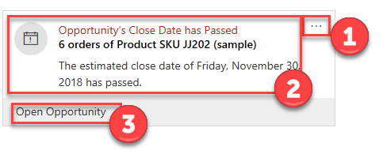
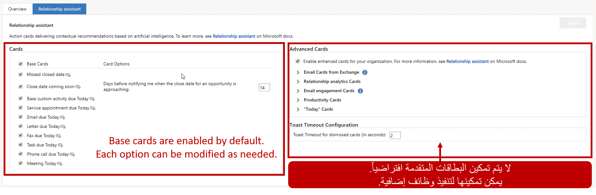
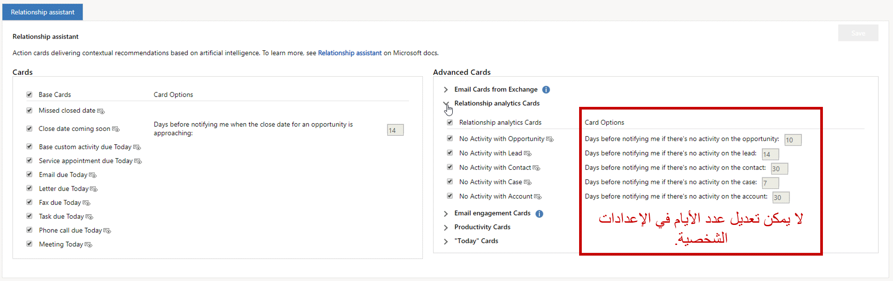

قد يكون من الصعب على مندوبي المبيعات البقاء على اطلاع بكل ما يجري. لا يتعين عليهم التركيز فقط على الصفقات التي يعملون عليها اليوم، ولكن لا يمكنهم أيضاً نسيان العملاء الذين ليس لديهم حالياً أي صفقات معهم. بالطبع، يمكنهم السماح لتطبيقات مثل Microsoft Outlook بمعالجة بعض هذه الأعمال، مثل إعداد التذكيرات. لكن هذه التطبيقات لا يمكنها تذكيرك بمن لم تتواصل معهم من قبل. هنا يأتي دور "مساعد العلاقات".

ينظر "مساعد العلاقة" في إجراءاتك واتصالاتك اليومية، ويُنشئ مجموعة من *بطاقات الإجراء*. تظهر هذه البطاقات بشكل بارز في جميع أنحاء التطبيق وتوفر رؤى مخصصة وقابلة للتنفيذ.

فيما يلي بعض الأشياء التي يمكن أن يقوم بها "مساعد العلاقات" من أجلك:

- يذكرك بالأنشطة القادمة مثل الاجتماعات والمهام.
- قم بتقييم اتصالاتك، واقترح الوقت المناسب للتواصل مع جهة اتصال كانت غير نشطة لفترة من الوقت.
- حدد رسائل البريد الإلكتروني التي قد تنتظر رداً منك.
- تنبيهك عندما تقترب فرصة من تاريخ إغلاقها.

بطاقات الإجراءات هي الآلية الأساسية التي يستخدمها "مساعد العلاقة" للتفاعل مع المستخدمين. أنها توفر معلومات محدثة حول رسائل البريد الإلكتروني والاجتماعات والمزيد. تظهر بطاقات الإجراء في جميع أنحاء Microsoft Dynamics 365 (على سبيل المثال، على الصفحات ولوحات المعلومات) وتوفر المعلومات ذات الصلة للسياق الذي تعمل عليه حالياً. على سبيل المثال، إذا فتحت السجل لحساب عميل، فقد ترى بطاقات الإجراء المتعلقة برسائل البريد الإلكتروني التي تلقيتها من هذا العميل، والتذكيرات بالاجتماعات القادمة مع العميل، والإعلامات التي تفيد بإغلاق فرصة قريباً.

تحتوي بطاقات الإجراء على العناصر الأساسية التالية:

1. **إجراءات عامة:** حدد زر علامة القطع (**...**) لفتح قائمة حيث يمكنك تحديد الإجراءات التالية:

    - **غفوة:** إخفاء البطاقة مؤقتاً. يختلف وقت الغفوة حسب نوع البطاقة. عند انتهاء وقت الغفوة، ستظهر البطاقة مرة أخرى.
    - **استبعاد** - تجاهل البطاقة نهائياً، بغض النظر عما إذا كنت قد أكملت الإجراء أم لا.

2. **منطقة المحتوى الرئيسية:** تعرض هذه المنطقة عنوان السجل الذي تشير إليه البطاقة والملخص ونوع البطاقة والمعلومات الأساسية الأخرى. انقر في أي مكان في هذه المنطقة (باستثناء الأزرار) لفتح العنصر ذي الصلة. قد يكون هذا العنصر المرتبط سجل Dynamics 365 أو رسالة بريد إلكتروني.
3. **منطقة الإجراءات:** توفر هذه المنطقة أزراراً لمساعدتك في إكمال نوع الإجراء الذي توصي به البطاقة. يتم توفير ما يصل إلى زرين، حسب نوع البطاقة. تختلف الأزرار نفسها أيضاً حسب نوع البطاقة.

## التكوين

يعد مساعد العلاقة جزءاً من مجموعة ميزات المعلومات المضمنة في Dynamics 365. يمكن إعداده في منطقة **إعدادات التطبيق** في تطبيق مركز المبيعات. يتم اجراء تكوين مساعد العلاقات علي مستويين:

- **تكوين النظام:** يمكن للمسؤولين تحديد الإعدادات العامة لبطاقات الإجراء في المؤسسة. يقوم هذا التكوين بإعداد الوظيفة الأساسية.
- **التكوين الشخصي:** يمكن للمستخدمين الفرديين إيقاف تشغيل أية بطاقات لا يجدونها مفيدة.

### تكوين النظام

بشكل افتراضي، سيتم إعداد البطاقات الأساسية لكل مؤسسة. فيما يلي بعض الأشياء التي تُستخدم فيها البطاقات الأساسية:

- تذكيرات حول تواريخ الإغلاق الفائتة (على سبيل المثال، تاريخ إغلاق فائت لفرصة ما)
- تذكير حول المواعيد النهائية القادمة
- إخطارات حول الأنشطة المستحقة اليوم (على سبيل المثال، المهام والمكالمات الهاتفية والاجتماعات)

يمكن للمؤسسات التي تريد خيارات إضافية إعداد بطاقات متقدمة. لإعداد بطاقات متقدمة، حدد الزر **تكوين** في علامة التبويب **نظرة عامة** في علامة تبويب **مساعد العلاقات**.

بالإضافة إلى البطاقات الأساسية، يمكن توفير أنواع البطاقات التالية:

- **بطاقات البريد الإلكتروني من Exchange:** يتم إنشاء بطاقات من هذا النوع بناءً على تحليل رسائل البريد الإلكتروني في Microsoft Exchange.
- **بطاقات تحليلات العلاقات:** توفر البطاقات من هذا النوع تذكيرات عندما تحتاج علاقة عمل إلى رعاية بسبب نقص النشاط الأخير.
- **> بطاقات مشاركة البريد الإلكتروني:** يُستخدم نوع البطاقة هذا مع ميزة بطاقات البريد الإلكتروني من Exchange. توفر البطاقات من هذا النوع معلومات حول وقت فتح البريد الإلكتروني. كما أنها توفر تذكيرات، إذا تم إعداد أي تذكيرات.
- **بطاقات الإنتاجية:** توفر البطاقات من هذا النوع معلومات ذات صلة بموقعك وخططك القادمة. على سبيل المثال، يمكنهم الإشارة إلى ما إذا كنت بالقرب من أحد العملاء، أو يمكنهم تقديم الأخبار والمعلومات ذات الصلة حول الرحلات القادمة.
- **"بطاقات "اليوم":** توفر البطاقات من هذا النوع معلومات تتعلق باليوم الحالي وخططك له. على سبيل المثال، يعرض الاجتماعات وأعلى سجلات اليوم.

لكل نوع من أنواع البطاقات هذه، تتوفر عدة بطاقات مختلفة. يمكن تحديد الإعدادات الفردية للعديد منها.

لعرض قائمة بجميع بطاقات الإجراء المتوفرة، راجع [‎مرجع بطاقات الإجراء](/dynamics365/customer-engagement/sales-enterprise/action-cards-reference).

### التكوين الشخصي

يمكن للمستخدمين الفرديين إعداد "مساعد العلاقات" ليلائم احتياجاتهم. تشبه عملية تحديد التكوين الشخصي عملية تحديد تكوين النظام. الاختلاف الرئيسي هو أن الإعدادات من تكوين النظام سيتم تحديدها بالفعل في التكوين الشخصي. الاختلاف الآخر هو أنه لا يمكن تغيير إعدادات اليوم. الاختلاف الآخر هو أنه يمكن تغيير إعدادات اليوم.

### إعداد مساعدة العلاقات

> [!VIDEO https://www.microsoft.com/videoplayer/embed/RE2NxOg]
