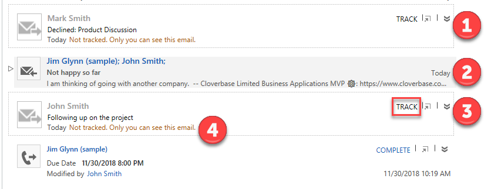

يتلقى موظفو المبيعات رسائل بريد إلكتروني من عدة عملاء أو رسائل بريد إلكتروني مرتبطة بصفقات متعددة. وقد يصعب تعقب كل هذه الرسائل. تتيح ميزة الالتقاط التلقائي في الذكاء المضمن لـ Microsoft Dynamics الوصول إلى البريد الإلكتروني في Microsoft Exchange والعثور على الرسائل المتعلقة بعمل مندوب المبيعات وإظهار تلك الرسائل مباشرة في Dynamics 365. وبالتالي، يستطيع مندوبو المبيعات عرض رسائل البريد الإلكتروني ذات الصلة معًا مع جميع الأنشطة الأخرى المرتبطة بسجل معين في Dynamics 365.

تظل أي رسالة يتم تقديمها إلى المستخدم خاصة ومرئية لهذا المستخدم فقط، ما لم يختر المستخدم تحويلها إلى رسالة متعقبة. بعد تحويل رسالة إلى رسالة متعقبة، تصبح مرئية لبقية فريق المستخدم في Dynamics 365.

يعد الالتقاط التلقائي جزءًا من ذكاء المبيعات. ويمكنك تشغيله أو إيقاف تشغيله عن طريق الانتقال إلى **إعدادات التطبيق** > **تكوين النظام**. ولا يلزم وجود تكوين إضافي.

يتم دمج الرسائل التي تعثر عليها ميزة "الالتقاط التلقائي" مع أنشطة Dynamics 365 الأخرى ذات الصلة بها ويتم عرضها في المخطط الزمني للسجل الذي تنطبق عليه. يمكن عرض الرسائل في جهة الاتصال والفرصة والعميل المتوقع والحساب والحالة والجداول المخصصة. على سبيل المثال، إذا كنت مندوب مبيعات وتبحث في فرصة داخل Dynamics 365، فسيقوم المخطط الزمني بإظهار جميع الأنشطة التي قمت بتسجيلها لهذه الفرصة. كما سيظهر 50 رسالة بريد إلكتروني حديثة كحدٍ أقصى من حساب Exchange التي تم إرسالها أو استلامها من جهة الاتصال الرئيسية للفرصة أو حملة الأسهم.

تعرض الصورة أدناه الرسائل المتعقبة والملتقطة تلقائياً (غير متعقبة) في عمود "الأنشطة"، وتبرز الآتي:  

1. رسائل الالتقاط التلقائي: تم العثور على هذه الرسائل بواسطة ميزة الالتقاط التلقائي. لقد تم تحديدها على أنها من المحتمل أن تكون ذات صلة بالسجل الحالي، لكنها لا تزال خاصة بحيث يمكنك أنت فقط رؤيتها. بالمقارنة مع الرسائل التي تم تعقبها، تظهر هذه الرسائل رمزًا رماديًا وحدًّا منقطًا وتتضمن رابط تعقب وتسمية بريد إلكتروني خاص.  
2. الرسالة المتعقبة: تم تعقب هذه الرسالة بالفعل، لذا تم استيرادها بالفعل إلى Dynamics 365 وتتم مشاركتها مع الفريق. وتعرض رمزًا باللون الأسود ولا تتضمن أي عناصر تحكم أو رسائل للتعقب.  
3. رابط التعقب: حدد الرابط لتحويل رسالة خاصة تم العثور عليها بالالتقاط التلقائي إلى رسالة متعقبة في Dynamics 365. 
4. تسمية رسالة البريد الإلكتروني الخاصة: رسائل خاصة تم العثور عليها عن طريق الالتقاط التلقائي لكن لم يتم تعقبها في Dynamics 365 تتضمن هذه التسمية لإظهار حالتها.

بشكل مبدئي، الرسائل التي يتم العثور عليها عن طريق الالتقاط التلقائي تكون خاصة لك. لذلك، لا يمكن للأعضاء الآخرين في فريق المبيعات رؤيتها في Dynamics 365. لتحويل أي رسالة ملتقطة تلقائياً إلى رسالة متعقبة، حدد **تعقب**، ويتم نسخ الرسالة إلى قاعدة بيانات Dynamics 365 وتصبح مرئية للأعضاء الآخرين في الفريق. يتم بالفعل تعقب الرسائل الملتقطة تلقائياً التي لا تتضمن زر **تعقب**. (قد يستغرق تغيير الرسالة من غير متعقبة إلى متعقبة بضع دقائق). وخلال ذلك الوقت، تشير الرسالة التي تظهر في اللوحة إلى أن عملية التعقب قيد الانتظار.

بالنسبة إلى الأنواع الأخرى من رسائل البريد الإلكتروني التي تظهر كإطارات متجانبة في علامة تبويب **الأنشطة**، يمكنك تحديد الإطار المتجانب لتوسيع محتوى الرسالة أو طيه.

يلخص الجدول التالي كيفية تحديد الالتقاط التلقائي للرسالة ذات الصلة.

<table>
<thead>
<tr>
<th>نوع الجدول</th>
<th>قيم العمود المطابقة لعنوان "إلى" أو "نسخة إلى" أو "من" لكل رسالة بريد إلكتروني</th>
</tr>
</thead>
<tbody>
<tr>
<td>الحساب</td>
<td>
<ul>
<li>اكتب عنوان البريد الإلكتروني الخاص بجهة الاتصال الرئيسية.</li>
<li>عنوان البريد الإلكتروني الخاص بأهم 50 جهة اتصال لديهم حساب كحساب أصلي</li>
<li>جميع عناوين البريد الإلكتروني المحددة لسجل الحساب نفسه</li>
</ul>
</td>
</tr>
<tr>
<td>الفرصة</td>
<td>
<ul>
<li>عنوان البريد الإلكتروني المُدرج لجهة اتصال الفرصة</li>
<li>عناوين البريد الإلكتروني لأي جهة اتصال في قائمة حملة الأسهم</li>
<li>جميع عناوين البريد الإلكتروني المحددة لسجل الفرصة نفسه</li>
</ul>
</td>
</tr>
<tr>
<td>الحالة</td>
<td>
<ul>
<li>عنوان البريد الإلكتروني لجهة الاتصال الرئيسية.</li>
<li>جميع عناوين البريد الإلكتروني المحددة لسجل الحالة نفسه</li>
<li>إذا كان العميل عبارة عن جهة اتصال، فستكون جميع عناوين البريد الإلكتروني لسجل جهة الاتصال</li>
<li>إذا كان العميل عبارة عن حساب، فستكون جميع عناوين البريد الإلكتروني لسجل الحساب</li>
</ul>
</td>
</tr>
<tr>
<td>عميل متوقع</td>
<td>
<ul>
<li>عنوان البريد الإلكتروني المُدرج في قسم جهة الاتصال</li>
<li>جميع عناوين البريد الإلكتروني المحددة لسجل العميل المتوقع نفسه</li>
</ul>
</td>
</tr>
<tr>
<td>جهة الاتصال</td>
<td>جميع عناوين البريد الإلكتروني المحددة لسجل جهة الاتصال نفسه</td>
</tr>
<tr>
<td>جداول مخصصة</td>
<td>
<ul>
<li>بالنسبة إلى أعمدة الحساب، عنوان البريد الإلكتروني لجهة الاتصال الرئيسية الخاصة بالحساب، بالإضافة إلى جميع عناوين البريد الإلكتروني المحددة لسجل الحساب نفسه</li>
<li>بالنسبة إلى أعمدة الحساب، جميع عناوين البريد الإلكتروني المحددة لسجل جهة الاتصال</li>
<li>بالنسبة إلى أعمدة العميل التي تشير إلى جهة الاتصال، جميع عناوين البريد الإلكتروني المحددة لسجل جهة الاتصال نفسه</li>
<li>بالنسبة إلى أعمدة العميل التي تشير إلى الحساب، عنوان البريد الإلكتروني لجهة الاتصال الرئيسية المُدرجة، بالإضافة إلى جميع عناوين البريد الإلكتروني المحددة لسجل الحساب نفسه</li>
</ul>
</td>
</tr>
</tbody>
</table>

لمعرفة المزيد حول الالتقاط التلقائي، راجع [البحث عن الرسائل ذات الصلة وتعقبها من Exchange server باستخدام الالتقاط التلقائي](/dynamics365/customer-engagement/sales-enterprise/embedded-intelligence#find-and-track-relevant-messages-from-your-exchange-server-with-auto-capture).
