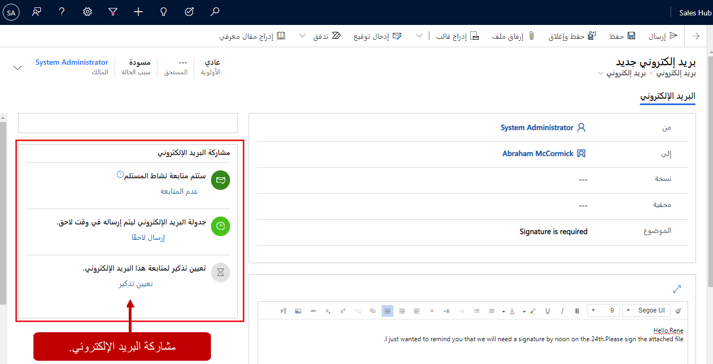
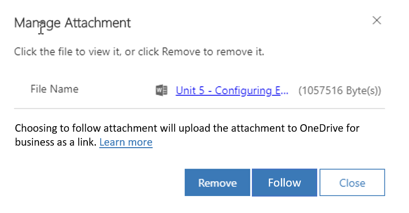
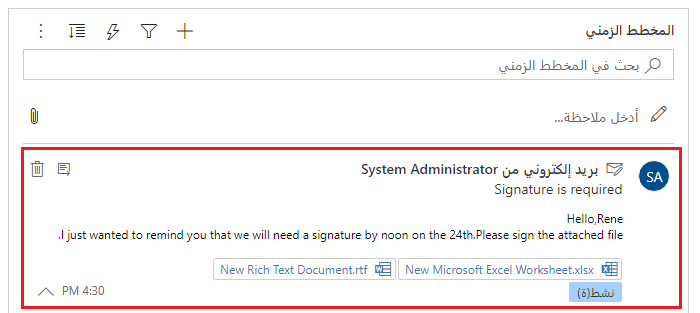
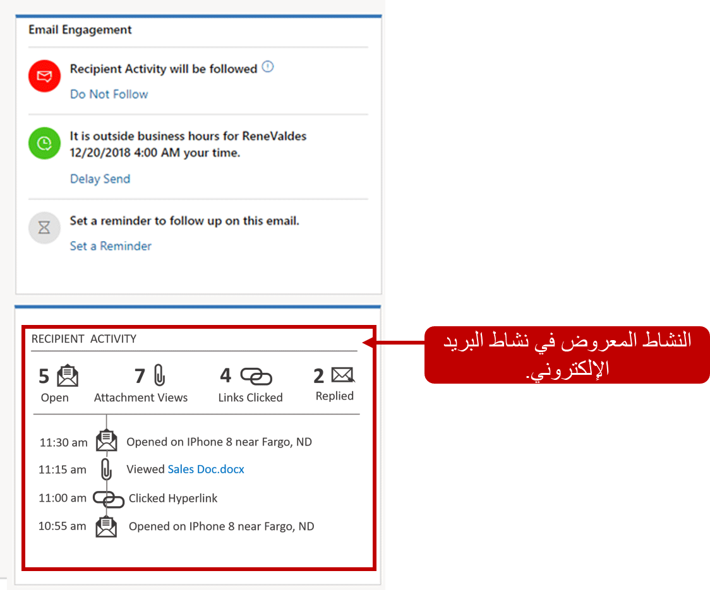

العديد من المؤسسات لديها دورات بيع قصيرة أو قوية. للمساعدة على ضمان تلبية هذه الدورات، من المهم أن تستطيع الحصول على معلومات للعملاء واستلام المعلومات منهم. كما يمكن أن تكون معرفة وقت فتح البريد الإلكتروني مفيدًا لموظفي المبيعات. وبهذه الطريقة، لا يعرفون إذا كان الأشخاص يفتحون رسائل البريد الإلكتروني التي يتلقونها فحسب، لكن يمكنهم أيضًا اتخاذ إجراءات مختلفة، اعتمادًا على ما إذا كان قد تم فتح رسائل البريد الإلكتروني.

على سبيل المثال، يلزم توقيع العميل على مستند بحلول ظهر يوم الجمعة، لكن لم يتم فتح رسالة البريد الإلكتروني التي تتضمن رابطًا إلى المستند بحلول يوم الخميس بعد الظهر. في هذه الحالة، يمكن تشغيل رسالة تذكير بحيث يتمكن مندوب المبيعات من الاتصال بالعميل.

فيما يأتي الاجراء الذي تسمح به ميزه تفاوض البريد الكتروني في المعلومات المضمنة:

- تعرّف على الوقت الذي فتح فيه المستلمون رسالتك أو حددوا رابطًا أو فتحوا مرفقًا أو أرسلوا ردًا.
- استلام تنبيه على الفور، في أول مرة يفتح فيها المستلم رسالتك.
- جدولة وقت التسليم الأكثر فعالية. يمكنك أيضًا تلقي توصيات حول أفضل وقت تسليم، استنادًا إلى المنطقة الزمنية للمستلم.
- تحديد قالب الرسالة الأكثر فعالية من مجموعة التوصيات. تستند التوصيات إلى سجل تفاعل البريد الإلكتروني السابق للمؤسسة.
- يُمكنك تعيين تنبيه لتذكيرك عندما يحين وقت متابعة رسالة بريد إلكتروني.
- مراجعة سجل التفاعل الكامل لرسالة أو مراجعة مؤشرات الأداء الأساسية (KPIs).

## الإعداد والتكوين

عند تشغيل المعلومات المضمنة في مؤسسة، يتم أيضًا تشغيل ميزة ‏‫مشاركة البريد الإلكتروني‬ تلقائياً. لا يلزم إجراء إعداد إضافي لاستخدام مشاركة البريد الإلكتروني لمتابعة رسائل البريد الإلكتروني. ولكن لاستخدامها في تعقب المرفقات، يجب إجراء بعض الإعدادات الإضافية. يتم تخزين المرفقات الخاضعة للمتابعة باستخدام Microsoft OneDrive for Business. لذلك، للتأكد من إمكانية استخدام المرفقات الخاضعة للمتابعة، يجب إعداد Microsoft SharePoint وعمليات تكامل OneDrive ‏for Business.

لمزيد من التفاصيل حول إعداد عمليات التكامل، راجع إعداد [تطبيقات Dynamics 365 Customer Engagement (على الإنترنت) لاستخدام SharePoint على الإنترنت](/dynamics365/customer-engagement/admin/set-up-dynamics-365-online-to-use-sharepoint-online) و[تمكين OneDrive للأعمال (عبر الإنترنت)](/dynamics365/customer-engagement/admin/enable-onedrive-for-business).

## إنشاء رسالة بريد إلكتروني خاضعة للمتابعة وإرسالها

بعد تشغيل ميزة مشاركة البريد الإلكتروني لمؤسسة، ستتوفر عناصر التحكم في مشاركة البريد الإلكتروني في قسم **مشاركة البريد الإلكتروني** لأي نشاط بريد إلكتروني جديد تم إنشاؤه في Microsoft Dynamics ‏365.

فيما يأتي وصف لعناصر التحكم في مشاركة البريد الإلكتروني:

- **عناصر التحكم في المتابعة:** ستخضع جميع الرسائل الجديدة للمتابعة بشكلٍ افتراضي. تتيح لك عناصر التحكم هذه تشغيل المتابعة أو إيقاف تشغيلها لرسالة فردية. إذا كنت لا تريد متابعة بريد إلكتروني معين، فحدد **عدم متابعة**.
- **عناصر التحكم في جدولة التسليم:** عناصر تحكم تمكنك من عرض وقت تسليم الرسالة وتعيينه. ويمكن أيضًا عرض أوقات التسليم الموصى بها. ويمكن للتوصيات مراعاة معلومات مثل المنطقة الزمنية للمستلم. على سبيل المثال يمكن أن توصي ميزة "مشاركة البريد الإلكتروني" بأوقات تسليم مختلفة إذا كان الوقت الحالي خارج ساعات عمل المستلم. لتأجيل إرسال بريد إلكتروني، حدد **تأخير الإرسال**. بعد ذلك، سيقوم النظام باقتراح وقت تسليم جديد، ولكن يمكنك تغيير ذلك الوقت.
- **عناصر التحكم في رسائل التذكير بالمتابعة:** عناصر تحكم تتيح لك إمكانية عرض رسالة تذكير بالمتابعة وتعيينها والتي يمكن تشغيلها في حالة عدم استيفاء شروط معينة.

    تحتوي كل رسالة تذكير على شرط. وفيما يأتي الشروط المتاحة:

    - **في حالة عدم تلقي رد بحلول:** رسالة تذكير ستظهر في مساعد العلاقة إذا لم يتم تلقي ردًا على البريد الإلكتروني في الوقت المحدد.
    - **إذا لم تُفتَح رسالة البريد الإلكتروني بحلول:** رسالة تذكير ستظهر في مساعد العلاقة إذا لم تُفتَح رسالة البريد الإلكتروني في الوقت المحدد.
    - **ذكّرني على أي حال في**: رسالة تذكير ستظهر في مساعد العلاقات في الوقت المحدد.

## تعقب المرفقات

إضافة إلى متابعة رسائل البريد الإلكتروني وتعقبها، يُمكن لميزة "مشاركة البريد الإلكتروني متابعة المرفقات الفردية المضمنة في رسائل البريد الإلكتروني وتعقبها. قبل تعقب المرفقات، ينبغي حفظ البريد الإلكتروني. عندئذٍ، ستظهر الشبكة الفرعية للمرفقات، ومن ثمَّ يمكن إرفاق الملفات.

لإرفاق ملفات في رسالة بريد إلكتروني، حدد زر **مرفق جديد** في شبكة المرفقات الفرعية أو حدد زر **إرفاق ملف** في شريط الأوامر. يتم تخزين المرفقات الخاضعة للمتابعة في مجلد Microsoft OneDrive for Business. لذلك، يجب التأكد من توفر OneDrive for Business.

## عرض سجل مشاركة البريد الإلكتروني

يتوفر الحالة القائمة وإحصائيات التفاعل ومؤشرات الأداء الأساسية لرسائل البريد الإلكتروني الخاضعة للمتابعة خلال Dynamics 365. يتم تجميع هذه المعلومات وعرضها لكل سجل مرتبطة به. تُميز الأقسام الأماكن المختلفة التي يُمكنك مشاهدة هذه المعلومات فيها في Dynamics 365.

بالنسبة إلى الرسائل الخاضعة للمتابعة، تظهر حالة التفاعل الحالية (مثل *مجدولة للإرسال* أو *لم تُفتَح بعد* أو *آخر فتح كان بالأمس*) في الإطار المتجانب لرسالة البريد الإلكتروني في قائمة الأنشطة. استخدم الأزرار الموجودة أعلى الزاوية اليمنى للإطار المتجانب لتوسيع محتويات الرسائل وسجل التفاعل الموجودين في القائمة أو لفتح صفحة الرسالة الكاملة.

## تفاصيل الرسالة

يمكنك فتح صفحة تفاصيل رسالة مستلمة بتحديد الموضوع في قائمة الأنشطة أو رسائل البريد الإلكتروني. تعرض هذه الصفحة طريقة عرض للقراءة فقط للرسالة بالكامل. قسم **مشاركة البريد الإلكتروني** في الجانب الأيمن من الصفحة يعرض سجل تفاعل الرسالة ومؤشرات الأداء الأساسية.

لمعرفة المزيد حول مشاركة البريد الإلكتروني، راجع [الحصول على سجل تفاعل البريد الإلكتروني](/dynamics365/customer-engagement/sales-enterprise/email-engagement#get-interaction-history-for-email).

## مشاركة البريد الإلكتروني

> [!VIDEO https://www.microsoft.com/videoplayer/embed/RE2NIb9]
