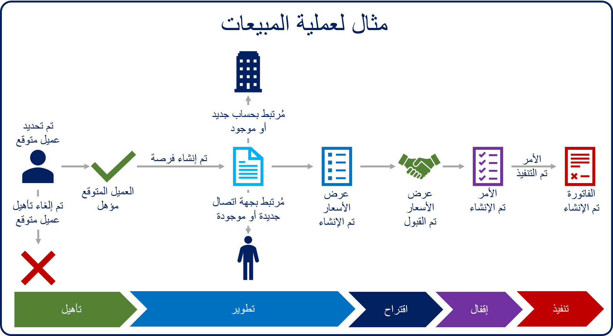

يتيح Dynamics 365 Sales للمؤسسة إدارة عملية دورة حياة المبيعات من البداية إلى النهاية. وتشبه دورة حياة المبيعات النموذجية الصورة الواردة أدناه:

تبدأ معظم عمليات المبيعات بالعملاء المتوقعين، ولذلك ينبغي أن نفحص العميل المتوقع بمزيد من التفاصيل.

*العميل المتوقع* هو شخص يهتم بما تبيعه. قد يكون العميل المتوقع عميلاً حالياً أو شخصاً لم تعمل مع على الإطلاق.

قد تتضمن بعض الأمثلة الشائعة للعملاء المتوقعين ما يأتي:

- شخص عبَّر عن اهتمامه بطلب مزيد من المعلومات على موقع الويب لديك.
- شخص يتابع المنشور الذي تشاركه أنت أو مؤسستك على مواقع التواصل الاجتماعي.
- شخص يستجيب لإعلان أو حملة عبر البريد الإلكتروني.

يعد العملاء المتوقعين سجلات مؤقتة. والهدف من العميل المتوقع هو تحديد إمكانية أن يصبح عميلاً. ويشار إلى هذا على أنه *مؤهل العميل المتوقع*. تقوم العديد من المؤسسات بتنفيذ عملية تأهيل للعملاء المتوقعين. في أثناء التأهيل، يتم الاتصال بالعملاء المتوقعين ويتم جمع المزيد من المعلومات، وفي النهاية يتم اتخاذ قرار حول حالة العميل المتوقع.

على سبيل المثال، في حالة مقابلة بائع لأحد الأشخاص في المعرض التجاري والحصول على بطاقة عمل، فقد لا يعرف ما إذا كان هذا الشخص عميلاً يمكن اكتسابه. وحتى يقوم البائع بالبحث عن الفرد وإشراكه، يمكنهم تحديد ما إذا كانت الاحتياجات الخاصة بهم قد تم توفيقها مع ما يمكن للمؤسسة الخاصة بهم تنفيذها. يستخدم العملاء المتوقعين ليس فقط لتحديد ما إذا كانت إحدى المؤسسات ملائمة للعميل، ولكنهم يساعدون كذلك على تحديد ما إذا كان العميل ملائماً للمؤسسة. إذا تم اعتبار العميل المتوقع عميلاً يمكن اكتسابه، فسيتم تأهيله ونقله إلى المرحلة التالية في عملية المبيعات. وإذا لم يكن عميلاً يمكن اكتسابه، فسيتم إلغاء تأهيل العميل المتوقع.

لا تقوم جميع المؤسسات باستخدام العملاء المتوقعين. تتعامل بعض المؤسسات مع فرص المبيعات أو المبيعات المحتملة المؤهلة فقط. ومن المحتمل أن تقوم المؤسسات التي تعتمد على عمليات إنشاء الطلب الجماعي مثل الإعلانات وعروض الطرق وقوائم العملاء المتوقعين غير المرتب للاتصال بهم. قد تستفيد الأعمال التي لها أساليب إنشاء الطلبات أو تلك التي تشارك في حملات التسويق الجماعي من إدارة العملاء المتوقعين، وتساعد هذه العملية الشركات على التدقيق في البيانات وتساعد قسم المبيعات على تركيز جهودهم في الاتجاه الأفضل.

لتحديد ما إذا كان سيتم استخدام العملاء المتوقعين، ضع في اعتبارك الآتي:

- هل يستثمرون الكثير من الوقت والمال في إنشاء قوائم العملاء المتوقعين مثل المراسلات الجماعية أو المكالمات غير المرتبة؟
- هل يحتفظون بقوائم الأشخاص في التركيبة السكانية الصحيحة، ولكن لديهم معلومات محدودة عنهم مثل معلومات اتصال قليلة جداً؟
- هل لديهم عملية أو فريق مخصص لتصفية هؤلاء العملاء المتوقعين والاتصال بهم لتحديد الآفاق الجيدة؟
- هل يحتاجون إلى إدارة قوائم العملاء المتوقعين التي يجب عدم دمجها مع قوائم العملاء الحالية، مثل الحسابات وجهات الاتصال؟

في حالة تطبيق أي من هذه الاعتبارات، قد ترغب المؤسسة في استخدام العملاء المتوقعين. وحتى إذا لم يكن لدى المؤسسة مبادرات كبيرة لاكتساب عملاء متوقعين، اسأل عما إذا كانت الإدارة تريد تتبع الجهد الذي يبذله قسم المبيعات في تعقب العملاء المتوقعين والتعامل معهم. وإذا كان الأمر كذلك، فعليك استخدام ميزات إدارة العملاء المتوقعين Microsoft Dynamics ‏365.

يُعد العملاء المتوقعون ركيزة رئيسية في عملية Dynamics 365 sales ويمثلون بداية العديد من العمليات. بالإضافة إلى العملاء المتوقعون، يتضمن Dynamics 365 sales العديد من المكونات المستخدمة ليس في البيع للعملاء فحسب، ولكن للمساعدة أيضاً على الحفاظ على العلاقة السليمة طويلة الأجل مع العملاء.

فيما يأتي بعض مكونات المبيعات الأكثر استخداماً:

  | المصطلح                    | التعريف
  |-----------------------  | ------------------------------------------------------------------------------------------------------------------------------------------------------------------------------------------------------------|
  | الحساب                 | حساب يمثل شركة أو مؤسسة. وأحياناً، يمثل عميلاً أو مورداً. في بعض المؤسسات، قد يكون مجموعة مختلفة، مثل أن يكون عائلة. وفي العادة، يكون للحساب سجلات جهات اتصال مرتبطة.|
  | الأنشطة              | النشاط هو نوع من أنواع الجداول يوفر خيارات التعقب والجدولة. بشكلٍ افتراضي، سيتضمن النظام أنشطة مثل البريد الإلكتروني والمواعيد والمكالمات الهاتفية قد تم تكوينها مسبقاً. يستطيع المسؤول إضافة أنشطة مخصصة إضافية لتلبية الاحتياجات الإضافية للأعمال.|
  | سير إجراءات العمل   |سير إجراءات العمل (BPF) هو أحد أنواع التشغيل التلقائي في Microsoft Power Platform. يتم وضع BPF في جدول ويوفر دليل المستخدمين وخطة الإجراءات المتوقعة لتجميع البيانات. يمكن للمسؤولين إضافة عملية تشغيل تلقائي إضافية استناداً إلى المشغلات الخاصة بتفاعل المستخدم مع BPF.|
  | جهة الاتصال                 | جهة اتصال تمثل فرداً واحداً. وفي العادة، ستتضمن جهة الاتصال العديد من السجلات المرتبطة مثل الحساب والأنشطة.
  | العميل                | يمكن أن يكون العميل حساباً أو جهة اتصال. ويكون ذلك، في سيناريو متاجرة عمل-عمل، هو الحساب. ويكون ذلك، في سيناريو متاجرة عمل-مستهلك، جهة اتصال.|
  | الفاتورة                 | أمر أو سجل بيع يتضمن تفاصيل حول المنتجات أو الخدمات التي تم شراؤها والتي تم تحرير فواتير بها للعميل. |
  | الفرصة             | مثل العميل المتوقع، تعد الفرصة حركة مبيعات محتملة. عادةً ما تكون الفرصة احتمالية قابلية للتحقيق أكثر من العميل المتوقع، وستحتوي على مزيد من المعلومات وسيتم تعقبها لفترة زمنية أطول.|
  | الأمر                   | طلب مؤكد لتسليم السلع والخدمات بناء على بنود محددة أو عرض أسعار وافق عليه العميل. |
  | كتالوج المنتجات         | مجموعة من السجلات التي تتفاعل مع الفرص وعروض الأسعار والأوامر والفواتير لتسهيل إدارة المنتجات وقوائم الأسعار والخصومات ومجموعات المنتجات لحركات المبيعات. |
  | عرض أسعار                   | عرض رسمي لمنتجات و/أو خدمات، مقدم بأسعار محددة وشروط سداد ذات صلة، يتم إرساله إلى عميل. |
  
  
تعرض الصورة الآتية مثالاً لعملية المبيعات من البداية للنهاية:

في الصورة أعلاه، يمكننا رؤية عميل متوقع اتصل بمؤسستنا للاستفسار حول المنتجات والخدمات. ويتواصل المسؤول التنفيذي للحساب مع العميل المتوقع لجمع مزيد من المعلومات حوله وتحديد ما إذا كنا مناسبين له وما إذا كان مناسباً لنا.

- إذا تم تحديد أنه ليس ملائماً، فإنه يتم إلغاء تأهيل العميل المتوقع وتنتهي دورة المبيعات.

- إذا تم تحديد أن الجميع ملائمين بشكل جيد، فسيتم تأهيل العميل المتوقع إلى فرصة.
    - إذا كان العميل المتوقع هو عميل حالي، فسيتم إنشاء فرصة جديدة وإقرانها بحساب و/أو سجل جهات اتصال حالي.
    - إذا كان العميل المتوقع عميلاً جديداً، فسيتم إنشاء سجل جديد للحساب وجهة الاتصال والفرصة.

- تتم إضافة تفاصيل مثل المنتجات والخدمات الذي يهتم بها العميل المتوقع والإيرادات المقدّرة والجداول الزمنية إلى الفرصة.
- تتم إضافة عرض أسعار إلى الفرصة التي تمثل الاقتراح الرسمي للعميل.
- عندما يوافق العميل على عرض الأسعار، يتم إنشاء أمر. يتم إقفال عرض الأسعار والفرصة المرتبطين بالأمر.
- بعد استيفاء الأمر، يتم إنشاء فاتورة للعميل.
