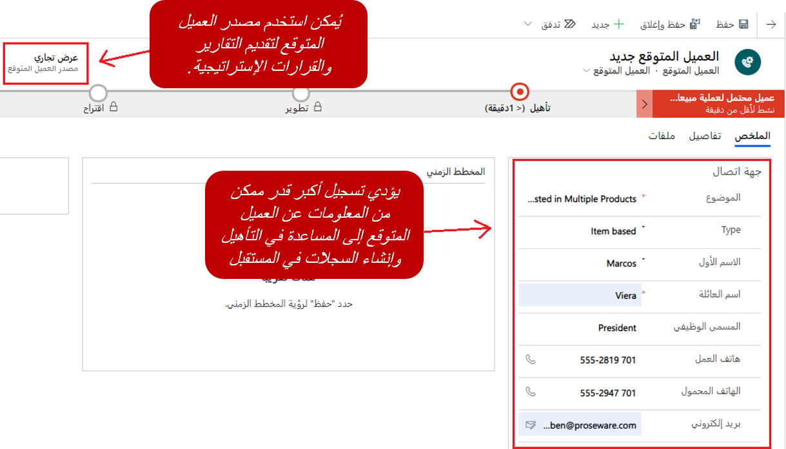
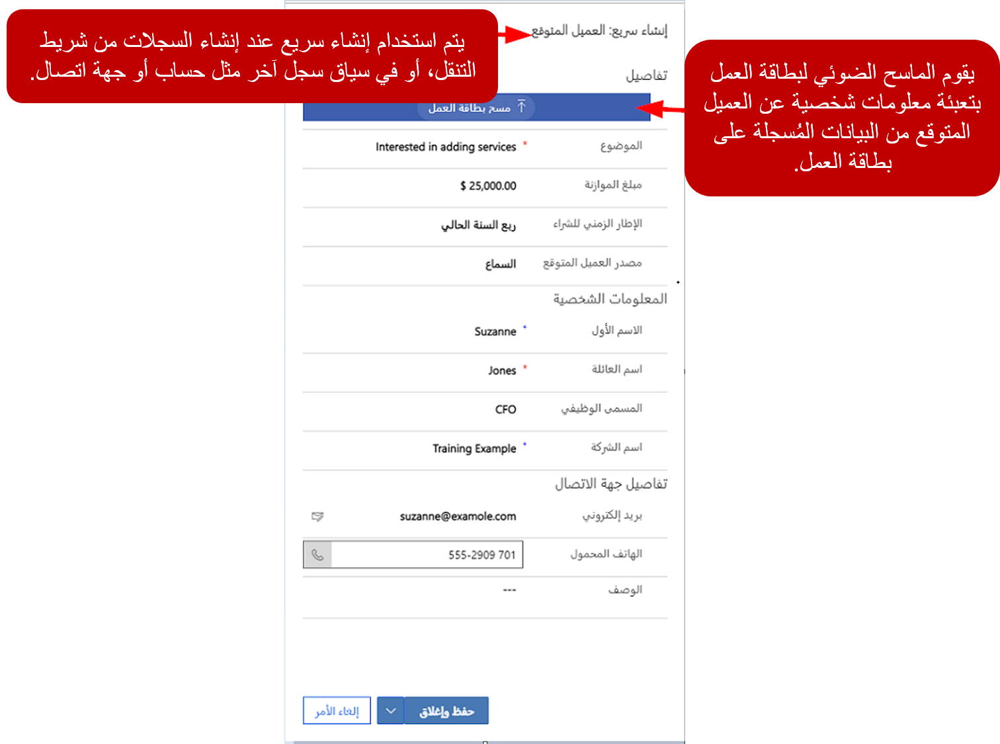
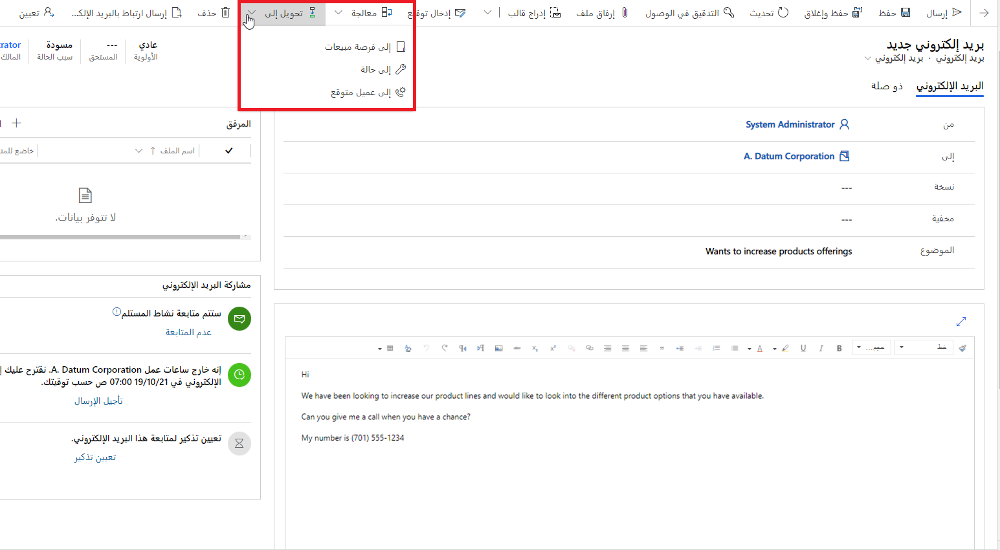
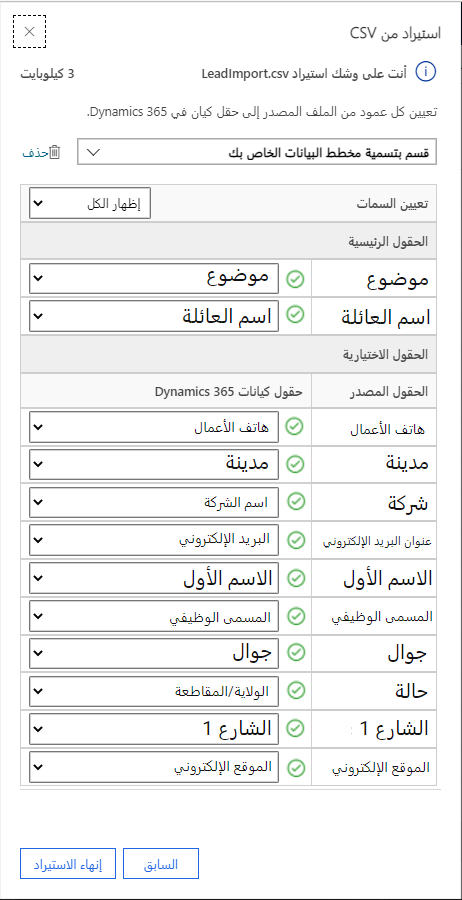

تستطيع المؤسسة تحديد العملاء المتوقعين بطرق عديدة. قد تأتي العميل المتوقع من بريد إلكتروني أو مكالمة هاتفية تلقاها أحد الموظفين في المؤسسة. ويمكن أن يأتي من قائمة العملاء المتوقعين التي اشتراها المُورد. وقد يأتي أيضًا من عميل تم إدراجه في حملة تسويقية وأعرب عن اهتمامه.

ونظرًا إلى أن العميل المتوقع يأتي من مصادر متعددة، يوفر Microsoft Dynamics 365 Salesطرقًا متعددة لإنشاء سجلات العملاء المتوقعين. فيما يأتي بعض الطرق الأكثر شيوعًا:

- إنشاء العملاء المتوقعين يدويًا
- تحويل أنشطة البريد الإلكتروني إلى عملاء متوقعين
- الاستيراد المُجمّع للعملاء المتوقعين

## إنشاء العملاء المتوقعين يدويًا

يمكن إنشاء العملاء المتوقعين يدويًا في Microsoft Dynamics365 باستخدام تطبيق مركز المبيعات. في التطبيق، انتقل إلى **العملاء المتوقعون** ثم حدد **جديد**. ستظهر صفحة **عميل متوقع جديد**، حيث يمكنك إدخال تفاصيل مثل اسم العميل المتوقع ومعلومات الاتصال ومعلومات الشركة. وعندما تقوم بإنشاء عميل متوقع، يلزم توفير العمودين **الموضوع** و **اسم العائلة** فقط. ولكن كلما زادت المعلومات التي يمكنك إدراجها في العميل المتوقع، زادت سهولة البحث عن العميل المتوقع في أثناء عملية التأهيل. بالإضافة إلى ذلك، إذا كان العميل المتوقع مؤهلاً، فيمكن إنشاء حساب مقابل وسجلات جهات اتصال تلقائياً. ومع ذلك، كلما زادت المعلومات التي تقوم بإدخالها عند إنشاء العميل المتوقع ، زادت المعلومات الخاصة بسجلات الحساب وجهة الاتصال.

### مربع حوار الإنشاء السريع

في بعض الأحيان ، يمكنك الحصول على المعلومات الأساسية المتعلقة بعميل متوقع جديد بشكلٍ سريع، بهدف العودة إليه لاحقًا وملء التفاصيل المتبقية. وفي هذه الحالات، يمكنك استخدام مربع حوار **الإنشاء السريع** للعملاء المتوقعين. لفتح مربع حوار **إنشاء سريع: عميل متوقع**، حدد زر **جديد** في شريط التنقل. يمكنك أيضًا استخدام مربع الحوار هذا عند إنشاء عملاء متوقعين جدد من علامة تبويب **ذو صلة** في سجلات الحساب وجهات الاتصال. لا يتضمن مربع حوار **الإنشاء السريع: العميل المتوقع** أعمدة لمعلومات العنوان. فهو يتضمن أعمدة لمعظم التفاصيل الأساسية المتعلقة بالعميل المتوقع، مثل مصدر العميل المتوقع والاسم الأول واسم العائلة والشركة والبريد الكتروني ومعلومات الاتصال الهاتفية الخاصة بالعميل المتوقع.

## تحويل أنشطة البريد الإلكتروني إلى عملاء متوقعين

هناك طريقة أخرى لإنشاء عملاء متوقعين في Dynamics 365 Sales وهي تحويل رسائل البريد الإلكتروني إلى عملاء متوقعين. يمكنك تحويل بريد إلكتروني إلى عميل متوقع مباشرة في تطبيق المبيعات.

## الاستيراد المُجمّع للعملاء المتوقعين

تتلقى العديد من المؤسسات قوائم العملاء المتوقعين للموردين الخارجيين، ثم يقوم فريق المبيعات بالاتصال بالعملاء المتوقعين لتأهيلهم أو استبعادهم. وفي هذه الحالات، يمكن استيراد سجلات العملاء المتوقعين إلى النظام بشكل مجمّع. بعد ذلك، يمكن تعيين سجل العملاء المتوقعين إلى المدير التنفيذي للحساب وهو الأكثر تأهيلاً للعمل عليه. وفي العادة، يقوم مديرو التسويق أو مديرو المبيعات أو مديرو الحساب الفرديين باستيراد العملاء المتوقعين.

عند عرض العملاء المتوقعين، يمكنك استيراد عملاء متوقعين جدد باستخدام شريط الأوامر. يمكن استيراد العملاء المتوقعين بتنسيقين: ملفات Microsoft Excel أو ملفات القيم المفصولة بفواصل (CSV).

عند استيراد ملف يتضمن عملاء متوقعين، يجب التأكد من أنه يمكن تعيين الأعمدة الموجودة في الملف إلى أعمدة محددة في سجلات العملاء المتوقعين في Dynamics 365. بعد تحديد الملف المراد استيراده، سيُطلب منك مراجعة التعيينات. 

يجب التأكد من تعيين كافة الأعمدة المطلوبة في Dynamics 365 إلى أعمدة في ملف الاستيراد. إضافة إلى ذلك، يجب تعيين أي أعمدة أخرى موجودة في ملف الاستيراد إلى الأعمدة المقابلة في Dynamics 365.

في أثناء عملية التعيين، يحاول Dynamics 365 تحديد الأعمدة الأكثر ملائمة للتعيين إليها. ولكن قد يكون هناك بعض الحالات التي لا تتضمن أي مطابقة. على سبيل المثال، إذا كان ملف الاستيراد عمود يسمى **zip**، فقد لا ييتمكن Dynamics 365 من تحديد أن **ZIP/ الرمز البريدي** هو العمود الأكثر ملاءمة للتعيين إليه. وفي هذه الحالات، قد تضطر إلى تعيين الأعمدة يدويًا.

إذا كان يوجد عمود في الملف الذي تقوم باستيراده لا يحتوى على عمود متوافق في Dynamics 365، فيمكنك تركه غير معين أو تحدد أنه يجب تجاهله.

بعد تحديد إعدادات التعيين لكل عمود في ملف الاستيراد، حدد **إنهاء الاستيراد** لإنهاء استيراد الملف.

في بعض الأحيان، يكون من السهل تصدير قالب يحتوي على تسميات أعمدة Dynamics 365 وإضافة البيانات التي تريد استيرادها في القالب الذي تم تصديره، ثم استيراد القالب. ويساعد هذا النهج على مطابقة جميع الأعمدة بشكل صحيح. كما يساعد على توفير الوقت.

للحصول على معلومات إضافية حول كيفية إنشاء عملاء متوقعين في Dynamics 365: 

> [!VIDEO https://www.microsoft.com/videoplayer/embed/RE2NFzw]

[إنشاء أو تعديل عميل متوقع (المبيعات ومركز المبيعات)](/dynamics365/customer-engagement/sales-enterprise/create-edit-lead-sales).
