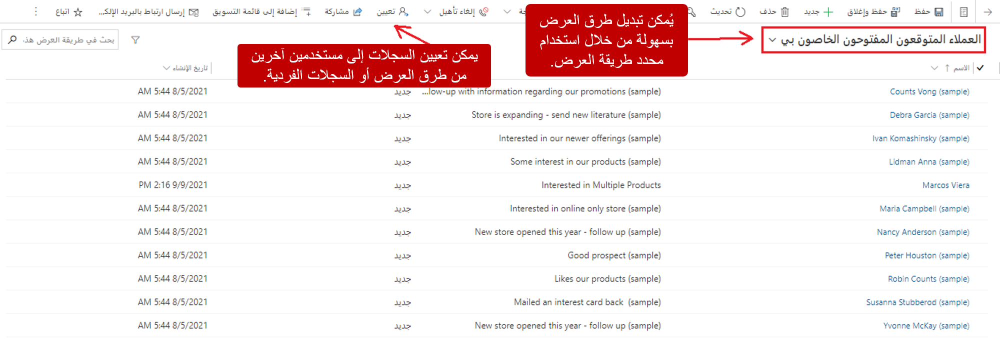
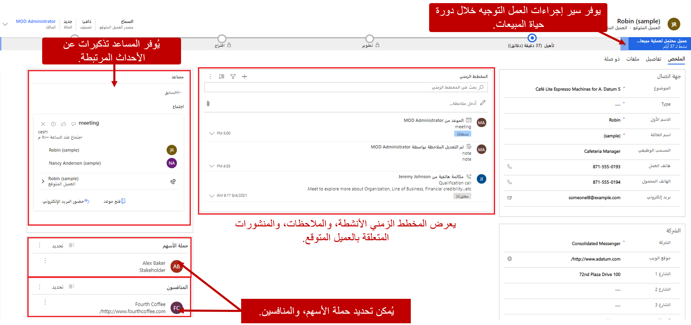
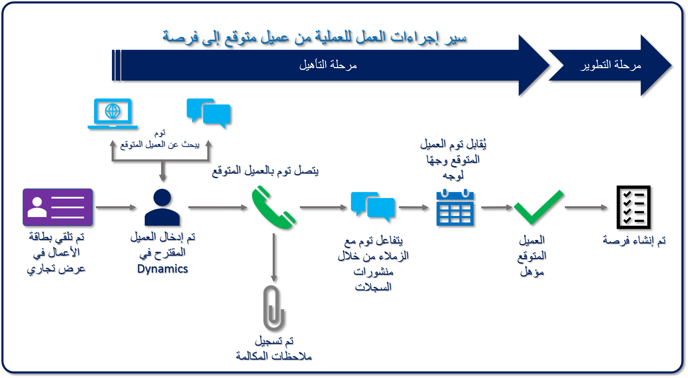

في العادة، أثناء خضوع العميل المتوقع لعملية التأهيل، تحدد المهام أو الإجراءات المختلفة ما إذا كان يجب أن يكون مؤهلاً أم غير مؤهل. إليك بعض الأمثلة:

- قم بتعيين العميل المتوقع إلى مدير الحساب الأكثر ملاءمة، استنادًا إلى المكان الذي أتى منه أو المنطقة التي يوجد فيها.
- حدد حملة الأسهم المحتملين الذين يهتمون بالمشروع.
- حدد المنافسين المحتملين الذين يتحدثون عن العميل المتوقع أو ربما يتحدثون عنه.
- ابحث عن العميل المتوقع لمعرفة المزيد عن مؤسسته أو الإيراد السنوي لمؤسسته أو وضع المؤسسة في المجال الخاص بها.
- قم بإجراء العديد من المكالمات الهاتفية أو الاجتماعات الشخصية لمعرفة المزيد حول موقف العميل المتوقع.

Microsoft Dynamics 365 Sales يوفر أدوات متعددة وعمليات تكامل مع حلول أخرى للمساعدة على هذه العملية. وتتضمن الأدوات سلسلة من لوحات المعلومات والمخططات وطرق العرض والبيانات التي يتم الحصول عليها في مستوى العميل المتوقع. على سبيل المثال، يقوم مدير المبيعات بمراجعة العملاء المتوقعين الذين تم إنشاؤهم حديثًا وتحديد أفضل مديري الحسابات للتعامل مع هؤلاء العملاء المتوقعين. بعد ذلك، يستطيع مدير المبيعات تعيين أحد العملاء المتوقعين أو أكثر مباشرة إلى مدير حساب معين من داخل التطبيق.

بعد أن يتلقى مديرو الحسابات العملاء المتوقعين الذين تم تعيينهم لهم، يمكنهم استخدام أدوات متعددة لإجراء بعض الأبحاث الأساسية حول العملاء المتوقعين قبل الوصول إليهم. وقد تشمل هذه الأدوات وسائل التواصل الاجتماعي والذكاء الاصطناعي. وبعد ذلك، عند الاتصال بالعملاء المتوقعين، يمكن لمديري الحسابات الحصول على التفاصيل من المكالمات الهاتفية أو المواعيد الخاصة بهم للمساعدة على اتخاذ قرار التأهيل النهائي.

## التعامل مع طرق عرض العميل المتوقع

Microsoft Dynamics 365يوفر طرق عرض متعددة تظهر بيانات العملاء المتوقعين. يمكنك استخدام طرق العرض هذه عند تحديد جدول العملاء المتوقعين في تطبيق مركز المبيعات. تتم تصفية كل طريقة عرض مسبقًا لإظهار العملاء المتوقعين بطريقة مختلفة. وبشكلٍ افتراضي، يستطيع الوكلاء رؤية العملاء المتوقعين الذين تم تعيينهم إليهم. ولكن يمكن للوكلاء تحديد طرق عرض مختلفة لعرض مجموعات مختلفة من العملاء المتوقعين.

فيما يأتي بعض طرق العرض المتعلقة بالعميل المتوقع التي يتضمنها Microsoft Dynamics365:

- **عملاء متوقعون مفتوحون** كافة العملاء المتوقعين المفتوحين حاليًا، بغض النظر عن مالك العميل المتوقع.
- **عملاء متوقعون مُقفلون-** جميع العملاء المتوقعين الذين تم إقفالهم. يتم تضمين العملاء المتوقعين المؤهلين وغير المؤهلين.
- **جميع العملاء المتوقعين-** جميع العملاء المتوقعين المفتوحين والمُقفلين.
- **عملائي المتوقعين المفتوحين-** كافة العملاء المتوقعين المفتوحين الذين تم تعيينهم إلى مستخدم قام بتسجيل الدخول.
- **عملاء متوقعون تم فتحهم الأسبوع الماضي-** كافة العملاء المتوقعين الذين تم إنشاؤهم في الأسبوع الماضي.
- **عملاء متوقعون تم فتحهم هذا الأسبوع-** كافة العملاء المتوقعين الجدد الذين تم إنشاؤهم خلال الأسبوع الحالي.

ووفقًا لدورهم، يمكن للأشخاص استخدام طرق العرض المختلفة هذه للمساعدة على استخدام مهام الوظائف الخاصة بهم. على سبيل المثال، قد يستخدم مديرو المبيعات طريقة عرض **العملاء المتوقعين الذين تم فتحهم هذا الأسبوع** الخاصة بهذا الأسبوع لرؤية جميع العملاء المتوقعين الأحدث الذين تمت إضافتهم. بعد التعرف على أحد العملاء المتوقعين أو أكثر ممن يجب تعيينهم إلى مدير حساب معين، يمكنهم تحديد هؤلاء العملاء المتوقعين ثم تحديد **تعيين** في شريط الأوامر لتعيينهم إلى مدير الحساب.

يمكن للمديرين التنفيذيين للحسابات استخدام طريقة العرض **عملائي المتوقعينالمفتوحين** للاطلاع على العملاء المتوقعين الذين تم تعيينهم لهم فقط. ويمكنهم بعد ذلك فتح عميل متوقع محدد لعرض جميع البيانات ذات الصلة حول هذا العميل المتوقع.

يتم تقسيم المعلومات الموجودة في سجلات العملاء المتوقعين الفردية بين عدة أقسام. فيما يأتي وصف لبعض الأقسام الرئيسية وأنواع المعلومات التي تتضمن:

- **المخطط الزمني-** هذا الجزء يعرض أنشطة العميل المتوقع ذات الصلة. تظهر جميع الأنشطة بترتيب زمني. قد تتضمن الأنشطة المكالمات الهاتفية التي تم إنشاؤها أو استلامها من العميل المتوقع أو المواعيد الخاصة بالعميل المتوقع أو عمليات النشر الداخلية التي قام الزملاء بإجرائها حول السجل أو الملاحظات التي تمت إضافتها حول السجل.

على سبيل المثال، قد يسرد المخطط الزمني جميع المواعيد التي قام بها المدير التنفيذي للحساب مع العميل المتوقع. ومن ثمَّ، يمكن للمدير التنفيذي للحساب فتح كل موعد لتجميع معلومات إضافية من هذا الاجتماع.

- **مساعد العلاقة-** هذا الجزء يوفر رسائل تذكير أو إخطارات خاصة بالأصناف المرتبطة بالعميل المتوقع.

على سبيل المثال، قد يوفر مساعد العلاقة رسالة تذكير بموعد قادم مع العميل المتوقع. ومن ثمَّ يمكن للمدير التنفيذي للحساب عرض تفاصيل الموعد عن طريق فتح السجل مباشرة من العميل المتوقع.

- **حملة الأسهم-** هذه الشبكة تحدد الأشخاص الذين ربما يكون لديهم اهتمام راسخ أو يتم إشراكهم في عملية اتخاذ القرار. في العادة، يكون حملة الأسهم سجلات جهات الاتصال التي تتم الإشارة إليها في السجل.

على سبيل المثال، قد يكون حامل الأسهم محاميًا تستخدمه المؤسسة أو قائد مشروع أو أعضاء مجلس إدارة يشاركون في عملية اتخاذ القرار.

- **منافسون-** هذه الشبكة تحدد أي موردين آخرين قد تتنافس معهم مؤسستك على أعمال العميل المتوقع.
- **سير إجراءات العمل-** حالات سير إجراءات العمل (BPFs) تمثل إجراءات العمل الموجهة التي تقود المديرين التنفيذيين للحسابات خلال دورة حياة المبيعات بأكملها.

بناءً على نوع العميل المتوقع أو إجراءات الشركة، قد يكون لدى العميل المتوقع إجراءات عمل متعددة يمكن التبديل إليها، وذلك بناء على تفاصيل معينة في سجل العميل المتوقع. يمكن أن تشتمل هذه التفاصيل على مصدر العميل المتوقع أو الميزانية المقدرة أو إطار الشراء الزمني أو العوامل المرتبطة بالأعمال الأخرى.

لنلقِ نظرة على أحد الأمثلة لمعرفة كيفية استخدام هذه الأنواع المختلفة من المعلومات لتأهيل عميل متوقع جديد تم التعرف عليه أو تم إلغاء تأهيله.

يقوم توم، مدير تنفيذي للحساب، بمقابلة عميل متوقع في أحد العروض التجارية. وقام توم والعميل المتوقع بتبادل بطاقات الأعمال وقام توم بإدخال العميل المتوقع في Dynamics 365. عندئذ، بدأ التطبيق في سير إجراءات العمل **عملية المبيعات من العميل المتوقع إلى الفرصة**.

في أثناء مرحلة **التأهيل** من عملية سير إجراءات العمل، يحدد المدير التنفيذي للحساب صلاحية العميل المتوقع.

1. قام توم بالتحقق مما إذا كان العميل المتوقع عميلاً حاليًا أم عميلاً جديدًا. إذا كان العميل المتوقع عميلاً حاليًا، فسيقوم توم بإقران العميل المتوقع بسجلات جهة الاتصال والحساب الحالية.
2. يستخدم توم عمليات البحث على الإنترنت ومواقع الشبكات الاجتماعية لجمع معلومات عامة حول العميل المتوقع ويدخلها في سجل العميل المتوقع. وتتضمن هذه المعلومات المجال وعدد الموظفين والإيراد السنوي لمؤسسة العميل المتوقع. كما يمكن أن يستخدم توم عمليات تكامل اختياريه مع تطبيقات مثل Microsoft Social Engagement وLinkedIn Sales Navigator للمساعدة في عملية البحث.

3. اتصل توم بالعملاء المتوقعين للتحدث عن حالته الحالية واحتياجاتهم المتوقعة. خلال هذه المحادثة، يُحتمل أن يقدم توم معلومات مثل حملة أسهم المشروع أو منافسين محتملين أو معلومات الموازنة أو عملية اتخاذ القرار.

1. وسيقوم توم بتحديث المعلومات ذات الصلة في سجل العميل المتوقع، استنادًا إلى المكالمة الهاتفية. يتم الحصول على ملاحظات إضافية من المكالمة في نشاط المكالمة الهاتفية المرتبطة بالعميل المتوقع.

5. ويقوم توم بإضافة منشور إلى سجل العميل المتوقع. وفي هذا المنشور، يسأل عما إذا كان أي من زملائه في العمل لديه تجربة مع العميل المتوقع. يتم الحصول على ردود زملاء العمل على هذا المنشور وتظهر في المخطط الزمني للعميل المتوقع.

6. يقوم توم بجدولة اجتماع فعلي مع الأشخاص الأساسيين في مؤسسة العميل المتوقع. يعمل "مساعد العلاقة" على تذكير توم بالاجتماع.

7. وقرر توم تأهيل العميل المتوقع.

    - وتم إقفال سجل العميل المتوقع.
    - وتم إنشاء سجل فرصة جديد.
    - تقدم سير إجراءات العمل **عملية مبيعات من عميل متوقع إلى فرصة** إلى مرحلة **التطوير**.

في أي مرحلة، تتوفر معلومات العملاء المتوقعين عن طريق تحديد مرحلة **التأهيل** في سير إجراءات العمل **عمليات المبيعات من العميل المتوقع إلى الفرصة**.

## إدارة العملاء المتوقعين

> [!VIDEO https://www.microsoft.com/videoplayer/embed/RE2NFzx]
